# 6-axis inertial measurement unit (IMU) and AI sensor with embedded sensor fusion, Qvar for high-end applications

## **Features**

- Triple-channel architecture for UI, EIS, and OIS data processing
- "Always-on" experience with low power consumption for both accelerometer and gyroscope
- Smart FIFO up to 4.5 KB
- Android compliant
- ±2/±4/±8/±16 *g* full scale
- ±125/±250/±500/±1000/±2000/±4000 dps full scale
- SPI / I²C & MIPI I3C® v1.1 serial interface with main processor data synchronization
- Auxiliary SPI for OIS data output for gyroscope and accelerometer
- OIS configurable from aux. SPI, primary interface (SPI / I²C & MIPI I3C® v1.1)
- EIS dedicated channel on primary interface with dedicated filtering
- Advanced pedometer, step detector, and step counter
- Significant motion detection, tilt detection
- Standard interrupts: free-fall, wake-up, 6D/4D orientation, click and double click
- Programmable finite state machine for accelerometer, gyroscope, and external sensor data processing with high rate @ 960 Hz
- Machine learning core with exportable features and filters for AI applications
- Embedded adaptive self-configuration (ASC)
- Embedded Qvar (electrostatic sensor) for user interface functions (tap, double tap, triple tap, long press, L/R – R/L swipe)
- Embedded analog hub for ADC and processing analog input data
- Embedded sensor fusion low-power algorithm
- Embedded temperature sensor
- Analog supply voltage: 1.71 V to 3.6 V
- Independent IO supply (extended range: 1.08 V to 3.6 V)
- Power consumption: 0.65 mA in combo high-performance mode
- Compact footprint: 2.5 mm x 3 mm x 0.83 mm
- [ECOPACK](https://www.st.com/ecopack) and RoHS compliant

# **Applications**

- Motion tracking and gesture detection, [augmented reality \(AR\) / virtual reality](https://www.st.com/en/applications/virtual-augmented-reality.html?ecmp=tt9471_gl_link_feb2019&rt=ds&id=DS13510) [\(VR\) / mixed reality \(MR\) applications](https://www.st.com/en/applications/virtual-augmented-reality.html?ecmp=tt9471_gl_link_feb2019&rt=ds&id=DS13510) & metaverse applications
- [Wearables](https://www.st.com/en/applications/wearable.html?ecmp=tt9471_gl_link_feb2019&rt=ds&id=DS13510)
- Indoor navigation
- [IoT and connected devices](https://www.st.com/en/applications/iot-for-smart-things.html?ecmp=tt9471_gl_link_feb2019&rt=ds&id=DS13510)
- Smartphones and handheld devices
- EIS and OIS for camera applications
- Vibration monitoring and compensation

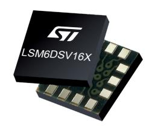

**LGA-14L (2.5 x 3.0 x 0.83 mm) typ.**


#### **Product status link**

[LSM6DSV16X](http://www.st.com/en/product/lsm6dsv16x?ecmp=tt9470_gl_link_feb2019&rt=ds&id=DS13510)

| Product summary     |                                  |  |  |  |  |
|---------------------|----------------------------------|--|--|--|--|
| Order code          | LSM6DSV16X<br>LSM6DSV16XTR       |  |  |  |  |
| Temp. range<br>[°C] | -40 to +85                       |  |  |  |  |
| Package             | LGA-14L<br>(2.5 x 3.0 x 0.83 mm) |  |  |  |  |
| Packing             | Tray<br>Tape and reel            |  |  |  |  |

#### **Product resources**

[AN5763](https://www.st.com/resource/en/application_note/DM00851721.pdf) (device application note) [AN5882](https://www.st.com/resource/en/application_note/DM00921692.pdf) (finite state machine) [AN5804](https://www.st.com/resource/en/application_note/DM00873745.pdf) (machine learning core) [AN5755](https://www.st.com/resource/en/application_note/DM00843587.pdf) (Qvar sensing) [TN0018](https://www.st.com/resource/en/technical_note/CD00134799.pdf) (design and soldering)

#### **Product label**


# **Description**

The [LSM6DSV16X](http://www.st.com/en/product/lsm6dsv16x?ecmp=tt9470_gl_link_feb2019&rt=ds&id=DS13510) is a high-performance, low-power 6-axis small IMU, featuring a 3-axis digital accelerometer and a 3-axis digital gyroscope, that offers the best IMU sensor with a triple-channel architecture for processing acceleration and angular rate data on three separate channels (user interface, OIS, and EIS) with dedicated configuration, processing, and filtering.

The LSM6DSV16X enables processes in edge computing, leveraging embedded advanced dedicated features such as a finite state machine (FSM) for configurable motion tracking and a machine learning core (MLC) for context awareness with exportable AI features for IoT applications.

The LSM6DSV16X supports the adaptive self-configuration (ASC) feature, which allows the FSM to automatically reconfigure the device in real time based on the detection of a specific motion pattern or based on the output of a specific decision tree configured in the MLC, without any intervention from the host processor.

The LSM6DSV16X embeds Qvar (electric charge variation detection) for user interface functions like tap, double tap, triple tap, long press, or L/R – R/L swipe.

The LSM6DSV16X embeds an analog hub able to connect an external analog input and convert it to a digital signal for processing.

**DS13510** - **Rev 4 page 2/198**

<span id="page-2-0"></span>

# **1 Overview**

The LSM6DSV16X is a system-in-package featuring a high-performance 3-axis digital accelerometer and 3-axis digital gyroscope.

The LSM6DSV16X delivers best-in-class motion sensing that can detect orientation and gestures in order to empower application developers and consumers with features and capabilities that are more sophisticated than simply orienting their devices to portrait and landscape mode.

The event-detection interrupts enable efficient and reliable motion tracking and context awareness, implementing hardware recognition of free-fall events, 6D orientation, click and double-click sensing, activity or inactivity, stationary/motion detection and wake-up events. Machine learning and finite state machine processing allow moving some algorithms from the application processor to the LSM6DSV16X sensor, enabling consistent reduction of power consumption.

The LSM6DSV16X supports the main OS requirements, offering real, virtual, and batch mode sensors. In addition, the LSM6DSV16X can efficiently run the sensor-related features specified in Android, saving power and enabling faster reaction time. In particular, the LSM6DSV16X has been designed to implement hardware features such as significant motion detection, stationary/motion detection, tilt, pedometer functions, timestamping and to support the data acquisition of external sensors.

The LSM6DSV16X offers hardware flexibility to connect the pins with different mode connections to external sensors to expand functionalities such as adding a sensor hub, auxiliary SPI, and so forth.

The LSM6DSV16X offers advanced design flexibility for OIS and EIS applications. Both channels have a dedicated processing path with independent filtering and enhanced EIS channel gyroscope data are read over the primary interfaces I²C/ MIPI I3C® v1.1 / SPI.

Channel 1 has been designed for user interface data processing for motion tracking. Data are available on the primary output of I²C / SPI / I3C® for the accelerometer and gyroscope with independent ODR and FS.

Channel 2 has been designed for OIS applications. Data are available on the aux SPI at 7.68 kHz with accelerometer/gyroscope processing with independent FS at ±2 *g* - ±16 *g* (accelerometer) / ±125 dps - ±2000 dps (gyroscope). The accelerometer is also available as standalone with dedicated filtering.

Channel 3 has been design for enhanced EIS. Data are available in freerun mode in the output registers or in FIFO with dedicated tag and timestamp.

Up to 4.5 KB of FIFO with compression and dynamic allocation of significant data (that is, external sensors, timestamp, and so forth) allows overall power saving of the system.

The LSM6DSV16X embeds a sensor fusion low-power (SFLP) algorithm able to provide a 6-axis (accelerometer + gyroscope) game rotation vector represented as a quaternion. The X, Y, Z quaternion components are stored in FIFO.

Like the entire portfolio of MEMS sensor modules, the LSM6DSV16X leverages the robust and mature in-house manufacturing processes already used for the production of micromachined accelerometers and gyroscopes. The various sensing elements are manufactured using specialized micromachining processes, while the IC interfaces are developed using CMOS technology that allows the design of a dedicated circuit, which is trimmed to better match the characteristics of the sensing element.

The LSM6DSV16X embeds an analog hub, which is able to connect an external analog input and convert it to a digital signal for processing as well as advanced dedicated features like a finite state machine and data filtering for OIS, EIS, and motion processing.

The LSM6DSV16X embeds Qvar functionality, which is an electrostatic sensor able to measure the variation of the quasi-electrostatic potential. The Qvar sensing channel can be used for user interface applications like tap, double tap, triple tap, long press, and L/R – R/L swipe.

The LSM6DSV16X is available in a small plastic land grid array (LGA) package of 2.5 x 3.0 x 0.83 mm to address ultracompact solutions.

**DS13510** - **Rev 4 page 3/198**

<span id="page-3-0"></span>

# **2 Embedded low-power features**

The LSM6DSV16X has been designed to be fully compliant with Android, featuring the following on-chip functions:

- 4.5 KB FIFO data buffering, data can be compressed two or three times
  - 100% efficiency with flexible configurations and partitioning
  - Possibility to store timestamp
- Event-detection interrupts (fully configurable)
  - Free-fall
  - Wake-up
  - 6D orientation
  - Click and double-click sensing
  - Activity/inactivity recognition
  - Stationary/motion detection
- Specific IP blocks (called "embedded functions") with negligible power consumption and high performance
  - Pedometer functions: step detector and step counters
  - Tilt
  - Significant motion detection
  - Finite state machine (FSM)
  - Machine learning core (MLC) with exportable features and filters for AI applications
  - Adaptive self-configuration (ASC)
  - Embedded sensor fusion low-power (SFLP) algorithm
- Sensor hub
  - Up to six total sensors: two internal (accelerometer and gyroscope) and four external sensors
- Analog hub for processing external analog input data
- Qvar: electric charge variation detection

## **2.1 Pedometer functions: step detector and step counters**

The LSM6DSV16X embeds an advanced pedometer with an algorithm running in an ultralow-power domain in order to ensure extensive battery life in battery-constrained applications.

Leveraging enhanced configurability, the advanced embedded pedometer is suitable for a large range of applications from mobile to wearable devices.

The algorithm processes and analyzes the accelerometer waveform in order to count the user's steps during walking and running activities.

The pedometer works at 30 Hz and it is not affected by the selected device power mode (ultralow-power, lowpower, high-performance), thus guaranteeing an ultralow-power experience and extreme flexibility in conjunction with other device functionalities.

The pedometer output can be batched in the device's FIFO buffer, in order to decrease overall system current consumption.

ST freely provides the support and the tools for easily configuring the device and tuning the algorithm configuration for a best-in-class user experience.

**DS13510** - **Rev 4 page 4/198**

<span id="page-4-0"></span>

## **2.2 Pedometer algorithm**

The pedometer algorithm is composed of a cascade of four stages:

- 1. Computation of the acceleration magnitude signal in order to detect the signal independently from device orientation;
- 2. FIR filter to extract relevant frequency components and to smooth the signal by cutting off high frequencies;
- 3. Peak detector to find the maximum and minimum of the waveform and compute the peak-to-peak value;
- 4. Step count: if the peak-to-peak value is greater than the settled threshold, a step is counted.

**Figure 1. Four-stage pedometer algorithm**

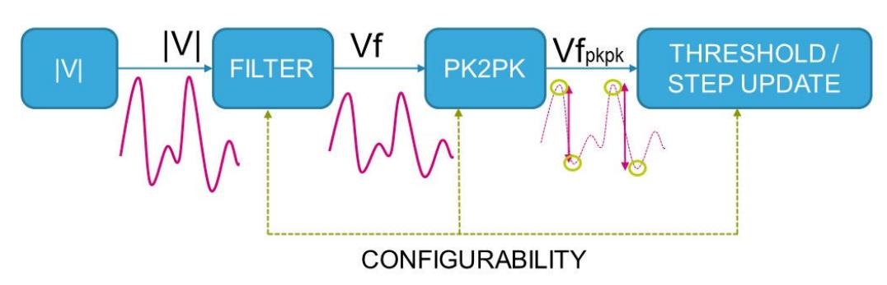

The LSM6DSV16X embeds a dynamic internal threshold for step detection that is updated after each peak-topeak evaluation: the internal threshold is increased with a configurable speed if a step is detected or decreased with a configurable speed if a step is not detected.

This approach ensures high accuracy when the user starts to walk and a false peak rejection when the user is walking or running.

An internal configurable debounce algorithm can be also set to filter false walks: indeed, an accelerometer pattern is recognized as a walk or run only if a minimum number of steps are counted.

The LSM6DSV16X has been designed to reject a false-positive signal inside the algorithm core.

On top of the mechanisms detailed above, the LSM6DSV16X allows enabling and configuring a dedicated false-positive rejection block to further boost pedometer accuracy.

## **2.3 Tilt detection**

The tilt function helps to detect activity change and has been implemented in hardware using only the accelerometer to achieve targets of both ultralow power consumption and robustness during the short duration of dynamic accelerations.

The tilt function is based on a trigger of an event each time the device's tilt changes and can be used with different scenarios, for example:

- Triggers when a phone is in a front pants pocket and the user goes from sitting to standing or standing to sitting;
- Does not trigger when a phone is in a front pants pocket and the user is walking, running, or going upstairs.

## **2.4 Significant motion detection**

The significant motion detection (SMD) function generates an interrupt when a 'significant motion', that could be due to a change in user location, is detected. In the LSM6DSV16X device this function has been implemented in hardware using only the accelerometer.

SMD functionality can be used in location-based applications in order to receive a notification indicating when the user is changing location.

**DS13510** - **Rev 4 page 5/198**

<span id="page-5-0"></span>

# **2.5 Finite state machine**

The LSM6DSV16X can be configured to generate interrupt signals activated by user-defined motion patterns. To do this, up to 8 embedded finite state machines can be programmed independently for motion detection such as glance gestures, absolute wrist tilt, shake and double-shake detection.

#### **Definition of finite state machine**

A state machine is a mathematical abstraction used to design logic connections. It is a behavioral model composed of a finite number of states and transitions between states, similar to a flow chart in which one can inspect the way logic runs when certain conditions are met. The state machine begins with a start state, goes to different states through transitions dependent on the inputs, and can finally end in a specific state (called stop state). The current state is determined by the past states of the system. The following figure shows a generic state machine.

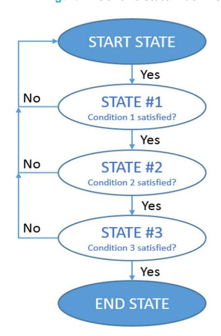

**Figure 2. Generic state machine**

## **Finite state machine in the LSM6DSV16X**

The LSM6DSV16X works as a combo accelerometer-gyroscope sensor, generating acceleration and angular rate output data. It is also possible to connect an external sensor like a magnetometer or pressure sensor by using the sensor hub feature (mode 2). These data can be used as input of up to 8 programs in the embedded finite state machine (Figure 3. State machine in the LSM6DSV16X).

All 8 finite state machines are independent: each one has its dedicated memory area and it is independently executed. An interrupt is generated when the end state is reached or when some specific command is performed.

**Figure 3. State machine in the LSM6DSV16X**

**DS13510** - **Rev 4 page 6/198**

<span id="page-6-0"></span>

# **2.6 Machine learning core**

The LSM6DSV16X embeds a dedicated core for machine learning processing that provides system flexibility, allowing some algorithms run in the application processor to be moved to the MEMS sensor with the advantage of consistent reduction in power consumption.

Machine learning core logic allows identifying if a data pattern (for example motion, pressure, temperature, magnetic data, and so forth) matches a user-defined set of classes. Typical examples of applications could be activity detection like running, walking, driving, and so forth.

The LSM6DSV16X machine learning core works on data patterns coming from the accelerometer and gyro sensors, but it is also possible to connect and process external sensor data (like magnetometer or pressure sensor) by using the sensor hub feature (mode 2).

The input data can be filtered using a dedicated configurable computation block containing filters and features computed in a fixed time window defined by the user. Computed feature values and filtered data values can also be read through the FIFO buffer.

Machine learning processing is based on logical processing composed of a series of configurable nodes characterized by "if-then-else" conditions where the "feature" values are evaluated against defined thresholds.

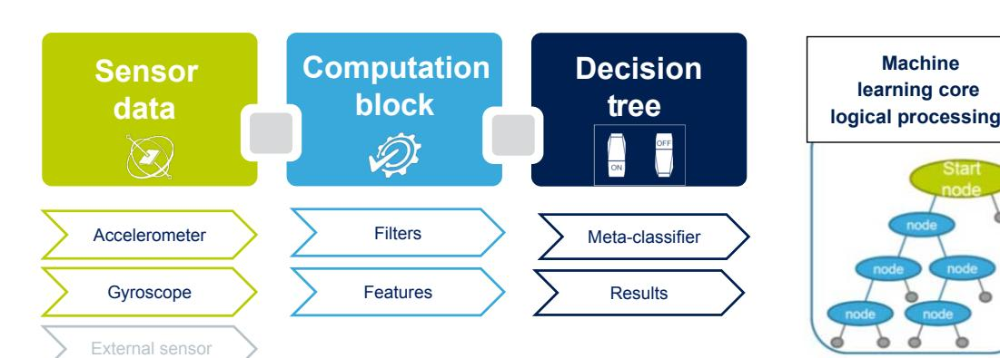

**Figure 4. Machine learning core in the LSM6DSV16X**

The LSM6DSV16X can be configured to run up to 4 decision trees simultaneously and independently and every decision tree can generate up to 16 results. The total number of nodes can be up to 128.

The results of the machine learning processing are available in dedicated output registers readable from the application processor at any time.

The LSM6DSV16X machine learning core can be configured to generate an interrupt when a change in the result occurs.

## **2.7 Adaptive self-configuration (ASC)**

The LSM6DSV16X supports the adaptive self-configuration (ASC) feature, which allows the FSM to automatically reconfigure the device in real time based on the detection of a specific motion pattern or based on the output of a specific decision tree configured in the MLC, without any intervention from the host processor. The FSM can write a subset of the device registers using the SETR command, which allows indicating the register address and the new value to be written in such a register. The access to these device registers is mutually exclusive to the host.

**DS13510** - **Rev 4 page 7/198**

<span id="page-7-0"></span>

## **2.8 Sensor fusion low power**

A sensor fusion low-power (SFLP) block is available in the LSM6DSV16X for generating the following data based on the accelerometer and gyroscope data processing:

- Game rotation vector, which provides a quaternion representing the attitude of the device
- Gravity vector, which provides a three-dimensional vector representing the direction of gravity
- Gyroscope bias, which provides a three-dimensional vector representing the gyroscope bias

The SFLP block is enabled by setting the SFLP\_GAME\_EN bit to 1 of the [EMB\\_FUNC\\_EN\\_A \(04h\)](#page-122-0) embedded functions register.

The SFLP block can be reinitialized by setting the SFLP\_GAME\_INIT bit to 1 of the [EMB\\_FUNC\\_INIT\\_A \(66h\)](#page-141-0) embedded functions register.

**Table 1. Sensor fusion performance**

| Parameter                      | Value         |                      |
|--------------------------------|---------------|----------------------|
|                                | heading / yaw | 0.5 deg. / 5 minutes |
| Static accuracy                | pitch         | 1.5 deg.             |
|                                | roll          | 1.5 deg.             |
|                                | heading / yaw | 0.7 deg. / 5 minutes |
| Low dynamic accuracy           | pitch         | 0.5 deg.             |
|                                | roll          | 0.5 deg.             |
|                                | heading / yaw | 5.9 deg. / 5 minutes |
| High dynamic accuracy          | pitch         | 1.6 deg.             |
|                                | roll          | 1.2 deg.             |
| Calibration time               |               | 0.8 seconds(1)       |
| Orientation stabilization time |               | 0.7 seconds          |

*<sup>1.</sup> Time required to reach steady state*

**DS13510** - **Rev 4 page 8/198**

<span id="page-8-0"></span>

# **3 Pin description**

**Figure 5. Pin connections**

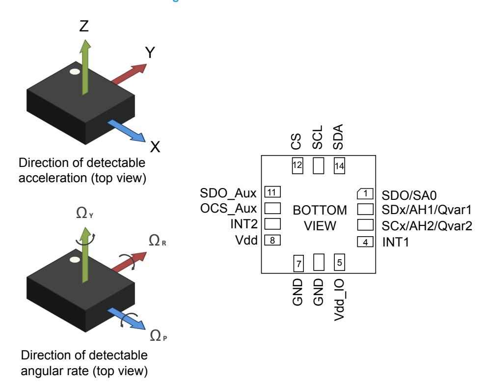

**DS13510** - **Rev 4 page 9/198**

<span id="page-9-0"></span>

## 3.1 Pin connections

The LSM6DSV16X offers flexibility to connect the pins in order to have three different mode connections and functionalities. In detail:

- **Mode 1**: I<sup>2</sup>C / MIPI I3C<sup>®</sup> slave interface or SPI (3- and 4-wire) serial interface is available. The analog hub and Qvar functionalities are available in mode 1 with I<sup>2</sup>C interface only.
- Mode 2: I<sup>2</sup>C / MIPI I3C<sup>®</sup> slave interface or SPI (3- and 4-wire) serial interface and I<sup>2</sup>C interface master for external sensor connections are available.
- **Mode 3:** I<sup>2</sup>C / MIPI I3C<sup>®</sup> slave interface or SPI (3- and 4-wire) serial interface is available for the application processor interface while an auxiliary SPI (3- and 4-wire) serial interface for external sensor connections is available for the accelerometer and gyroscope.

Note: Refer to the product application note for the details regarding operating/power mode configurations, settings, turn-on/off time and on-the-fly changes.

Figure 6. LSM6DSV16X connection modes

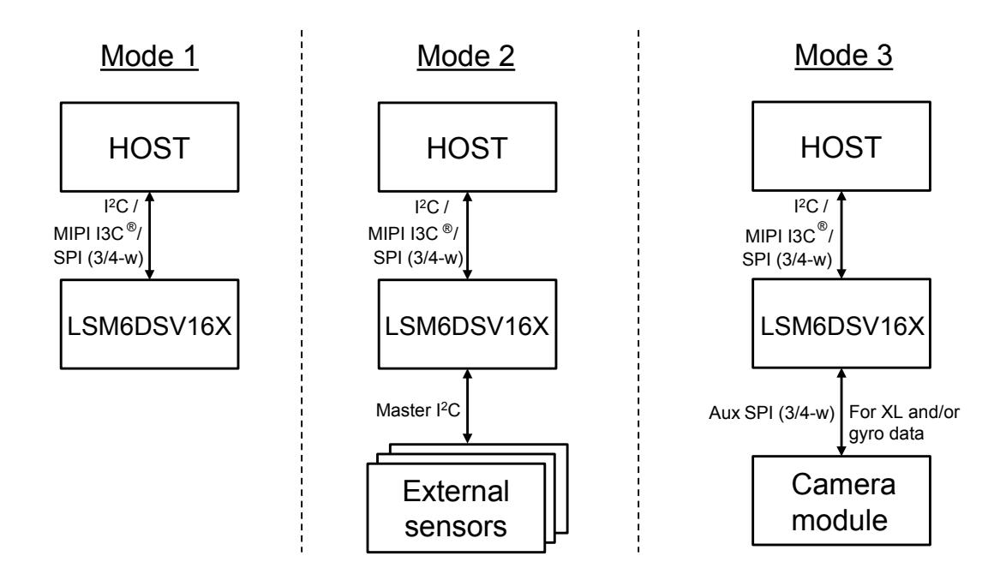

DS13510 - Rev 4 page 10/198

<span id="page-10-0"></span>

In the following table, each mode is described for the pin connections and function.

**Table 2. Pin description**

| Pin# | Name              | Mode 1 function                                                                                           | Mode 2 function                                               | Mode 3 function                                                 |
|------|-------------------|-----------------------------------------------------------------------------------------------------------|---------------------------------------------------------------|-----------------------------------------------------------------|
|      |                   | SPI 4-wire interface serial data output<br>(SDO)                                                          | SPI 4-wire interface serial data<br>output (SDO)              | SPI 4-wire interface serial data output<br>(SDO)                |
| 1    | SDO/SA0(1)        | I²C least significant bit of the device<br>address (SA0)                                                  | I²C least significant bit of the device<br>address (SA0)      | I²C least significant bit of the device<br>address (SA0)        |
| 2    | SDx/AH1/          | Connect to Vdd_IO or GND if the analog<br>hub and Qvar are disabled.                                      |                                                               | Auxiliary SPI 3/4-wire interface serial<br>data input (SDI_Aux) |
|      | Qvar1             | AH input 1 (or Qvar electrode 1) is<br>connected if the analog hub (or Qvar<br>functionality) is enabled. | I²C serial data master (MSDA)                                 | and SPI 3-wire serial data output<br>(SDO_Aux)                  |
|      |                   | Connect to Vdd_IO or GND if the analog<br>hub and Qvar are disabled.                                      |                                                               |                                                                 |
| 3    | SCx/AH2/<br>Qvar2 | AH input 2 (or Qvar electrode 2) is<br>connected if the analog hub (or Qvar<br>functionality) is enabled. | I²C serial clock master (MSCL)                                | Auxiliary SPI 3/4-wire interface serial<br>port clock (SPC_Aux) |
| 4    | INT1              |                                                                                                           | Programmable interrupt in I²C and SPI                         |                                                                 |
| 5    | Vdd_IO(2)         |                                                                                                           | Power supply for I/O pins                                     |                                                                 |
| 6    | GND               |                                                                                                           | 0 V supply                                                    |                                                                 |
| 7    | GND               |                                                                                                           | 0 V supply                                                    |                                                                 |
| 8    | Vdd(2)            |                                                                                                           | Power supply                                                  |                                                                 |
| 9    | INT2              | Programmable interrupt 2                                                                                  | Programmable interrupt 2 (INT2) /<br>Data enable (DEN) /      | Programmable interrupt 2 (INT2) /                               |
|      |                   | (INT2) / Data enable (DEN)                                                                                | I²C master external synchronization<br>signal (MDRDY)         | Data enable (DEN)                                               |
| 10   | OCS_Aux           | Connect to Vdd_IO or<br>leave unconnected(3)                                                              | Connect to Vdd_IO or<br>leave unconnected(3)                  | Enable auxiliary SPI 3/4-wire interface                         |
| 11   | SDO_Aux           | Connect to Vdd_IO or                                                                                      | Connect to Vdd_IO or                                          | Auxiliary SPI 3-wire interface: leave<br>unconnected(3)         |
|      |                   | leave unconnected(3)                                                                                      | leave unconnected(3)                                          | Auxiliary SPI 4-wire interface: serial<br>data output (SDO_Aux) |
|      |                   | I²C / MIPI I3C® / SPI mode selection                                                                      | I²C / MIPI I3C® / SPI mode<br>selection                       | I²C / MIPI I3C® / SPI mode selection                            |
| 12   | CS(1)             | (1: SPI idle mode / I²C / MIPI I3C®<br>communication enabled;                                             | (1: SPI idle mode / I²C / MIPI I3C®<br>communication enabled; | (1: SPI idle mode / I²C / MIPI I3C®<br>communication enabled;   |
|      |                   | 0: SPI communication mode / I²C / MIPI<br>I3C® disabled)                                                  | 0: SPI communication mode / I²C /<br>MIPI I3C® disabled)      | 0: SPI communication mode / I²C /<br>MIPI I3C® disabled)        |
|      |                   | I²C / MIPI I3C® serial clock (SCL)                                                                        | I²C / MIPI I3C® serial clock (SCL)                            | I²C / MIPI I3C® serial clock (SCL)                              |
| 13   | SCL(1)            | SPI serial port clock (SPC)                                                                               | SPI serial port clock (SPC)                                   | SPI serial port clock (SPC)                                     |
|      |                   | I²C / MIPI I3C® serial data (SDA)                                                                         | I²C / MIPI I3C® serial data (SDA)                             | I²C / MIPI I3C® serial data (SDA)                               |
| 14   | SDA(1)            | SPI serial data input (SDI)                                                                               | SPI serial data input (SDI)                                   | SPI serial data input (SDI)                                     |
|      |                   | 3-wire interface serial data output (SDO)                                                                 | 3-wire interface serial data output                           | 3-wire interface serial data                                    |
|      |                   |                                                                                                           | (SDO)                                                         | output (SDO)                                                    |

- *1. SPI 3/4-wire interface not available with the analog hub / Qvar functionality enabled.*
- *2. Recommended 100 nF filter capacitor.*
- *3. Leave pin electrically unconnected and soldered to PCB.*

**DS13510** - **Rev 4 page 11/198**

<span id="page-11-0"></span>

# **4 Module specifications**

# **4.1 Mechanical characteristics**

@ Vdd = 1.8 V, T = 25 °C, unless otherwise noted.

**Table 3. Mechanical characteristics**

| Symbol   | Parameter                                                      | Test conditions    | Min. | Typ.(1) | Max. | Unit     |  |
|----------|----------------------------------------------------------------|--------------------|------|---------|------|----------|--|
|          |                                                                |                    |      | ±2      |      |          |  |
|          |                                                                |                    |      | ±4      |      |          |  |
| LA_FS    | Linear acceleration measurement range                          |                    |      | ±8      |      | g        |  |
|          |                                                                |                    |      | ±16     |      |          |  |
|          |                                                                |                    |      | ±125    |      |          |  |
|          |                                                                |                    |      | ±250    |      |          |  |
| G_FS     | Angular rate measurement range                                 |                    |      | ±500    |      | dps      |  |
|          |                                                                |                    |      | ±1000   |      |          |  |
|          |                                                                |                    |      | ±2000   |      |          |  |
|          |                                                                |                    |      | ±4000   |      |          |  |
|          |                                                                | FS = ±2 g          |      | 0.061   |      |          |  |
| LA_So    | Linear acceleration sensitivity                                | FS = ±4 g          |      | 0.122   |      | mg/LSB   |  |
|          |                                                                | FS = ±8 g          |      | 0.244   |      |          |  |
|          |                                                                | FS = ±16 g         |      | 0.488   |      |          |  |
|          | Angular rate sensitivity(2)                                    | FS = ±125 dps      |      | 4.375   |      |          |  |
|          |                                                                | FS = ±250 dps      |      | 8.75    |      |          |  |
| G_So     |                                                                | FS = ±500 dps      |      | 17.50   |      | mdps/LSB |  |
|          |                                                                | FS = ±1000 dps     |      | 35      |      |          |  |
|          |                                                                | FS = ±2000 dps     |      | 70      |      |          |  |
|          |                                                                | FS = ±4000 dps     |      | 140     |      |          |  |
| G_So%    | Sensitivity tolerance(2)                                       | at component level |      | ±0.3    |      | %        |  |
| LA_SoDr  | Linear acceleration sensitivity change vs. temperature(3)      | from -40° to +85°  |      | ±0.01   |      | %/°C     |  |
| G_SoDr   | Angular rate sensitivity change vs. temperature(3)             | from -40° to +85°  |      | ±0.007  |      | %/°C     |  |
| LA_TyOff | Linear acceleration zero-g level offset accuracy(4)            |                    |      | ±12     |      | mg       |  |
| G_TyOff  | Angular rate zero-rate level(4)                                |                    |      | ±1      |      | dps      |  |
| LA_OffDr | Linear acceleration zero-g level change vs. temperature(3)     |                    |      | ±0.07   |      | mg/°C    |  |
| G_OffDr  | Angular rate typical zero-rate level change vs. temperature(3) |                    |      | ±0.006  |      | dps/°C   |  |
| Rn       | Rate noise density in high-performance mode(5)                 |                    |      | 2.8     |      | mdps/√Hz |  |
| RnRMS    | Gyroscope RMS noise in low-power mode(6)                       |                    |      | 60      |      | mdps RMS |  |
|          | Acceleration noise density in high-performance mode(7)         | FS = ±2 g - ±16 g  |      | 60      |      |          |  |
| An       | Acceleration noise density in normal mode(8)(9)                | FS = ±2 g - ±16 g  |      | 100     |      | µg/√Hz   |  |
|          |                                                                | LPM1               |      | 2.3     |      |          |  |
| RMS      | Accelerometer RMS noise in low-power mode                      | LPM2               |      | 1.8     |      | mg RMS   |  |
|          |                                                                | LPM3               |      | 1.2     |      |          |  |

**DS13510** - **Rev 4 page 12/198**

<span id="page-12-0"></span>

| Symbol | Parameter                                                        | Test conditions | Min. | Typ.(1)   | Max. | Unit |
|--------|------------------------------------------------------------------|-----------------|------|-----------|------|------|
|        |                                                                  |                 |      | 1.875(10) |      |      |
|        |                                                                  |                 |      | 7.5       |      |      |
|        |                                                                  |                 |      | 15        |      |      |
|        |                                                                  |                 |      | 30        |      |      |
|        |                                                                  |                 |      | 60        |      |      |
|        |                                                                  |                 |      | 120       |      |      |
| LA_ODR | Linear acceleration output data rate                             |                 |      | 240       |      |      |
|        |                                                                  |                 |      | 480       |      |      |
|        |                                                                  |                 |      | 960       |      |      |
|        |                                                                  |                 |      | 1.92 k    |      |      |
|        |                                                                  |                 |      | 3.84 k    |      |      |
|        |                                                                  |                 |      | 7.68 k    |      | Hz   |
|        |                                                                  |                 |      | 7.5       |      |      |
|        |                                                                  |                 |      | 15        |      |      |
|        |                                                                  |                 |      | 30        |      |      |
|        |                                                                  |                 |      | 60        |      |      |
|        |                                                                  |                 |      | 120       |      |      |
| G_ODR  | Angular rate output data rate                                    |                 |      | 240       |      |      |
|        |                                                                  |                 |      | 480       |      |      |
|        |                                                                  |                 |      | 960       |      |      |
|        |                                                                  |                 |      | 1.92 k    |      |      |
|        |                                                                  |                 |      | 3.84 k    |      |      |
|        |                                                                  |                 |      | 7.68 k    |      |      |
| HAODR  | ODR variation over temperature and supply range in high-accuracy | Gyro on         |      |           | ±1   | %    |
|        | mode(11)                                                         | Gyro off        |      |           | ±3   |      |
|        | Linear acceleration self-test output change(12)(13)(14)          |                 | 50   |           | 1700 | mg   |
| Vst    |                                                                  | FS = ±250 dps   | 20   |           | 80   | dps  |
|        | Angular rate self-test output change(15)(16)                     | FS = ±2000 dps  | 150  |           | 700  | dps  |
| Top    | Operating temperature range                                      |                 | -40  |           | +85  | °C   |

- *1. Typical specifications are not guaranteed.*
- *2. Sensitivity tolerance for FS up to ±2000 dps.*
- *3. Measurements are performed in a uniform temperature setup and they are based on characterization data in a limited number of samples. Not measured during final test for production.*
- *4. Value after calibration.*
- *5. Gyroscope rate noise density in high-performance mode is independent of the ODR and FS setting up to ±2000 dps.*
- *6. Gyroscope RMS noise in low-power mode is independent of the ODR and FS setting up to ±2000 dps.*
- *7. Accelerometer noise density in high-performance mode is independent of the selected ODR and FS. Valid when XL\_DualC\_EN = 0 in register [CTRL8 \(17h\)](#page-70-0) .*
- *8. Accelerometer noise density in normal mode is independent of the ODR and FS setting. Valid when XL\_DualC\_EN = 0 in register [CTRL8](#page-70-0) [\(17h\)](#page-70-0).*
- *9. Noise RMS related to BW = ODR/2.*
- *10. This ODR is available when the accelerometer is in low-power mode.*
- *11. Values specified by design.*
- *12. The sign of the linear acceleration self-test output change is defined by the ST\_XL\_[1:0] bits in a dedicated register for all axes.*
- *13. The linear acceleration self-test output change is defined with the device in stationary condition as the absolute value of: OUTPUT[LSb] (self-test enabled) - OUTPUT[LSb] (self-test disabled). 1LSb = 0.061 mg at ±2 g full scale.*

*14. Accelerometer self-test limits are full-scale independent.*

**DS13510** - **Rev 4 page 13/198**

<span id="page-13-0"></span>

- *15. The sign of the angular rate self-test output change is defined by the ST\_G\_[1:0] bits in a dedicated register for all axes.*
- *16. The angular rate self-test output change is defined with the device in stationary condition as the absolute value of: OUTPUT[LSb] (self-test enabled) - OUTPUT[LSb] (self-test disabled). 1LSb = 70 mdps at ±2000 dps full scale.*

## **4.2 Electrical characteristics**

@ Vdd = 1.8 V, T = 25 °C, unless otherwise noted.

**Table 4. Electrical characteristics**

| Symbol     | Parameter                                                                   | Test conditions | Min.            | Typ.(1) | Max.            | Unit |
|------------|-----------------------------------------------------------------------------|-----------------|-----------------|---------|-----------------|------|
| Vdd        | Supply voltage                                                              |                 | 1.71            | 1.8     | 3.6             | V    |
| Vdd_IO     | Power supply for I/O                                                        |                 | 1.08            |         | 3.6             | V    |
| IddHP      | Gyroscope and accelerometer current consumption in high-performance<br>mode |                 |                 | 0.65    |                 | mA   |
| LA_IddHP   | Accelerometer current consumption in high-performance mode                  |                 |                 | 190     |                 | µA   |
| LA_IddNM   | Accelerometer current consumption in normal mode                            |                 |                 | 100     |                 | µA   |
|            |                                                                             | ODR = 60 Hz     |                 | 20      |                 |      |
| LA_IddLPM2 | Accelerometer current consumption in low-power mode (LPM2)                  | ODR = 1.875 Hz  |                 | 4.2     |                 | µA   |
|            | Accelerometer current consumption in low-power mode (LPM1)                  | ODR = 60 Hz     |                 | 17      |                 |      |
| LA_IddLPM1 |                                                                             | ODR = 1.875 Hz  |                 | 4.0     |                 | µA   |
| IddPD      | Gyroscope and accelerometer current consumption during power-down           |                 |                 | 2.6     |                 | µA   |
| Ton        | Turn-on time - gyroscope                                                    |                 |                 | 30      |                 | ms   |
| VIH        | Digital high-level input voltage                                            |                 | 0.7 *<br>Vdd_IO |         |                 | V    |
| VIL        | Digital low-level input voltage                                             |                 |                 |         | 0.3 *<br>Vdd_IO | V    |
| VOH        | High-level output voltage                                                   | IOH = 4 mA(2)   | Vdd_IO<br>- 0.2 |         |                 | V    |
| VOL        | Low-level output voltage                                                    | IOL = 4 mA(2)   |                 |         | 0.2             | V    |
| Top        | Operating temperature range                                                 |                 | -40             |         | +85             | °C   |

*<sup>1.</sup> Typical specifications are not guaranteed.*

**Table 5. Electrical parameters of Qvar (@Vdd = 1.8 V, T = 25 °C)**

| Parameter               | Typ.(1)                            | Unit   |
|-------------------------|------------------------------------|--------|
| Power consumption       | 15(2)                              | μA     |
| Offset (shorted inputs) | 3                                  | mV     |
| Noise (shorted inputs)  | 54                                 | μV     |
| Qvar gain               | 78                                 | LSB/mV |
| CMRR                    | 54                                 | dB     |
| Input impedance         | Configurable (from 235 M to 2.4 G) | Ω      |
| Input range             | ±460                               | mV     |

*<sup>1.</sup> Vdd\_IO = 1.8 V, Zin = 235 MOhm. Typical values are based on characterization and are not guaranteed.*

**DS13510** - **Rev 4 page 14/198**

*<sup>2. 4</sup> mA is the maximum driving capability, that is, the maximum DC current that can be sourced/sunk by the digital pin in order to guarantee the correct digital output voltage levels VOH and VOL.*

*<sup>2.</sup> Extra power consumption when only the analog hub / Qvar function is enabled. In this condition the accelerometer must be set to high-performance mode or normal mode.*

<span id="page-14-0"></span>

# **4.3 Temperature sensor characteristics**

@ Vdd = 1.8 V, T = 25 °C unless otherwise noted.

**Table 6. Temperature sensor characteristics**

| Symbol    | Parameter                         | Test condition | Min. | Typ. (1) | Max. | Unit   |
|-----------|-----------------------------------|----------------|------|----------|------|--------|
| TODR(2)   | Temperature refresh rate          |                |      | 60       |      | Hz     |
| Toff      | Temperature offset(3)             |                | -15  |          | +15  | °C     |
| TSen      | Temperature sensitivity           |                |      | 256      |      | LSB/°C |
| TST       | Temperature stabilization time(4) |                |      |          | 500  | µs     |
| T_ADC_res | Temperature ADC resolution        |                |      | 16       |      | bit    |
| Top       | Operating temperature range       |                | -40  |          | +85  | °C     |

- *1. Typical specifications are not guaranteed*
- *2. When the accelerometer is in low-power mode and the gyroscope part is turned off, the TODR value is equal to the accelerometer ODR.*
- *3. The output of the temperature sensor is 0 LSB (typ.) at 25 °C.*
- *4. Time from power ON to valid data based on characterization data.*

**DS13510** - **Rev 4 page 15/198**

<span id="page-15-0"></span>

# **4.4 Communication interface characteristics**

## **4.4.1 SPI - serial peripheral interface**

Subject to general operating conditions for Vdd and Top. @ Vdd\_IO = 1.8 V, T = 25 °C unless otherwise noted.

**Table 7. SPI slave timing values**

|            |                         | Value(1) |     |     |      |
|------------|-------------------------|----------|-----|-----|------|
| Symbol     | Parameter               | Min      | Typ | Max | Unit |
| fc(SPC)    | SPI clock frequency     |          |     | 10  | MHz  |
| tc(SPC)    | SPI clock period        | 100      |     |     |      |
| thigh(SPC) | SPI clock high          | 45       |     |     |      |
| tlow(SPC)  | SPI clock low           | 45       |     |     |      |
|            | CS setup time (mode 3)  | 5        |     |     |      |
| tsu(CS)    | CS setup time (mode 0)  | 20       |     |     |      |
|            | CS hold time (mode 3)   | 20       |     |     | ns   |
| th(CS)     | CS hold time (mode 0)   | 20       |     |     |      |
| tsu(SI)    | SDI input setup time    | 5        |     |     |      |
| th(SI)     | SDI input hold time     | 15       |     |     |      |
| tv(SO)     | SDO valid output time   |          | 15  | 25  |      |
| tdis(SO)   | SDO output disable time |          |     | 50  |      |
| Cload      | Bus capacitance         |          |     | 100 | pF   |

*<sup>1.</sup> Values are evaluated at 10 MHz clock frequency for SPI with both 4 and 3 wires, based on characterization results, not tested in production*

CS SPC SDI SDO MSB OUT MSB IN LSB OUT LSB IN t t t tlow(SPC) v(SO) t su(CS) thigh(SPC) t c(SPC) t su(SI) th(SI) dis(SO)

**Figure 7. SPI slave timing in mode 0**

**DS13510** - **Rev 4 page 16/198**

<span id="page-16-0"></span>

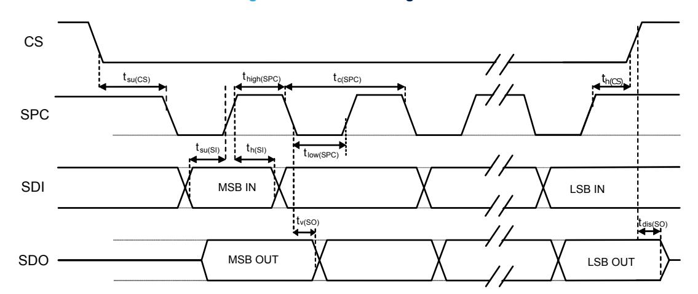

**Figure 8. SPI slave timing in mode 3**

*Note: Measurement points are done at 0.3·Vdd\_IO and 0.7·Vdd\_IO for both input and output ports.*

**DS13510** - **Rev 4 page 17/198**

<span id="page-17-0"></span>

## **4.4.2 I²C - inter-IC control interface**

Subject to general operating conditions for Vdd and Top.

**Table 8. I²C slave timing values**

|           |                                                |     | I²C fast mode(1)(2) |      | I²C fast mode plus(1)(2) |      |
|-----------|------------------------------------------------|-----|---------------------|------|--------------------------|------|
| Symbol    | Parameter                                      | Min | Max                 | Min  | Max                      | Unit |
| f(SCL)    | SCL clock frequency                            | 0   | 400                 | 0    | 1000                     | kHz  |
| tw(SCLL)  | SCL clock low time                             | 1.3 |                     | 0.5  |                          |      |
| tw(SCLH)  | SCL clock high time                            | 0.6 |                     | 0.26 |                          | µs   |
| tsu(SDA)  | SDA setup time                                 | 100 |                     | 50   |                          | ns   |
| th(SDA)   | SDA data hold time                             | 0   | 0.9                 | 0    |                          |      |
| th(ST)    | START/REPEATED START condition hold time       | 0.6 |                     | 0.26 |                          |      |
| tsu(SR)   | REPEATED START condition setup time            | 0.6 |                     | 0.26 |                          |      |
| tsu(SP)   | STOP condition setup time                      | 0.6 |                     | 0.26 |                          | µs   |
| tw(SP:SR) | Bus free time between STOP and START condition | 1.3 |                     | 0.5  |                          |      |
|           | Data valid time                                |     | 0.9                 |      | 0.45                     |      |
|           | Data valid acknowledge time                    |     | 0.9                 |      | 0.45                     |      |
| CB        | Capacitive load for each bus line              |     | 400                 |      | 550                      | pF   |

*<sup>1.</sup> Data based on standard I²C protocol requirement, not tested in production.*

tsu(SP) tw(SCLL) tsu(SDA) tsu(SR) th(ST) tw(SCLH) th(SDA) tw(SP:SR) START REPEATED START START STOP SDA SCL

**Figure 9. I²C slave timing diagram**

*Note: Measurement points are done at 0.3·Vdd\_IO and 0.7·Vdd\_IO for both ports.*

**DS13510** - **Rev 4 page 18/198**

*<sup>2.</sup> Data for I²C fast mode and I²C fast mode plus have been validated by characterization, not tested in production.*

<span id="page-18-0"></span>

# **4.5 Absolute maximum ratings**

Stresses above those listed as "absolute maximum ratings" may cause permanent damage to the device. This is a stress rating only and functional operation of the device under these conditions is not implied. Exposure to maximum rating conditions for extended periods may affect device reliability.

**Table 9. Absolute maximum ratings**

| Symbol | Ratings                                                                           | Maximum value       | Unit |
|--------|-----------------------------------------------------------------------------------|---------------------|------|
| Vdd    | Supply voltage                                                                    | -0.3 to 4.8         | V    |
| TSTG   | Storage temperature range                                                         | -40 to +125         | °C   |
| Sg     | Acceleration g for 0.2 ms                                                         | 20,000              | g    |
| ESD    | Electrostatic discharge protection (HBM)                                          | 2                   | kV   |
| Vin    | Input voltage on any control pin<br>(including CS, SCL/SPC, SDA/SDI/SDO, SDO/SA0) | -0.3 to Vdd_IO +0.3 | V    |

*Note: Supply voltage on any pin should never exceed 4.8 V.*


This device is sensitive to mechanical shock, improper handling can cause permanent damage to the part.


This device is sensitive to electrostatic discharge (ESD), improper handling can cause permanent damage to the part.

**DS13510** - **Rev 4 page 19/198**

<span id="page-19-0"></span>

# **4.6 Terminology**

## **4.6.1 Sensitivity**

Linear acceleration sensitivity can be determined, for example, by applying 1 *g* acceleration to the device. Because the sensor can measure DC accelerations, this can be done easily by pointing the selected axis towards the ground, noting the output value, rotating the sensor 180 degrees (pointing towards the sky) and noting the output value again. By doing so, ±1 *g* acceleration is applied to the sensor. Subtracting the larger output value from the smaller one, and dividing the result by 2, leads to the actual sensitivity of the sensor. This value changes very little over temperature and over time. The sensitivity tolerance describes the range of sensitivities of a large number of sensors (see [Table 3](#page-11-0)).

An angular rate gyroscope is a device that produces a positive-going digital output for counterclockwise rotation around the axis considered. Sensitivity describes the gain of the sensor and can be determined by applying a defined angular velocity to it. This value changes very little over temperature and time (see [Table 3\)](#page-11-0).

## **4.6.2 Zero-***g* **and zero-rate level**

Linear acceleration zero-*g* level offset (TyOff) describes the deviation of an actual output signal from the ideal output signal if no acceleration is present. A sensor in a steady state on a horizontal surface measures 0 *g* on both the X-axis and Y-axis, whereas the Z-axis measures 1 *g*. Ideally, the output is in the middle of the dynamic range of the sensor (content of OUT registers 00h, data expressed as two's complement number). A deviation from the ideal value in this case is called zero-*g* offset.

Offset is to some extent a result of stress to the MEMS sensor and therefore the offset can slightly change after mounting the sensor onto a printed circuit board or exposing it to extensive mechanical stress. Offset changes little over temperature, see "Linear acceleration zero-*g* level change vs. temperature" in [Table 3](#page-11-0). The zero-*g* level tolerance (TyOff) describes the standard deviation of the range of zero-*g* levels of a group of sensors.

Zero-rate level describes the actual output signal if there is no angular rate present. The zero-rate level of precise MEMS sensors is, to some extent, a result of stress to the sensor and therefore the zero-rate level can slightly change after mounting the sensor onto a printed circuit board or after exposing it to extensive mechanical stress. This value changes very little over temperature and time (see [Table 3](#page-11-0)).

**DS13510** - **Rev 4 page 20/198**

<span id="page-20-0"></span>

# **5 Digital interfaces**

# **5.1 I²C/SPI interface**

The registers embedded inside the LSM6DSV16X may be accessed through both the I²C and SPI serial interfaces. The latter may be software configured to operate either in 3-wire or 4-wire interface mode. The device is compatible with SPI modes 0 and 3.

The serial interfaces are mapped to the same pins. To select/exploit the I²C interface, the CS line must be tied high (that is, connected to Vdd\_IO).

| Pin name    | Pin description                                |
|-------------|------------------------------------------------|
|             | Enables SPI                                    |
| CS          | I²C/SPI mode selection                         |
|             | (1: SPI idle mode / I²C communication enabled; |
|             | 0: SPI communication mode / I²C disabled)      |
|             | I²C serial clock (SCL)                         |
| SCL/SPC     | SPI serial port clock (SPC)                    |
|             | I²C serial data (SDA)                          |
| SDA/SDI/SDO | SPI serial data input (SDI)                    |
|             | 3-wire interface serial data output (SDO)      |
|             |                                                |

**Table 10. Serial interface pin description**

## **5.1.1 I²C serial interface**

SDO/SA0

The LSM6DSV16X I²C is a bus slave. The I²C is employed to write the data to the registers, whose content can also be read back.

The relevant I²C terminology is provided in the table below.

**Table 11. I²C terminology**

| Term        | Description                                                                              |  |  |  |
|-------------|------------------------------------------------------------------------------------------|--|--|--|
| Transmitter | The device that sends data to the bus                                                    |  |  |  |
| Receiver    | The device that receives data from the bus                                               |  |  |  |
| Master      | The device that initiates a transfer, generates clock signals, and terminates a transfer |  |  |  |
| Slave       | The device addressed by the master                                                       |  |  |  |

There are two signals associated with the I²C bus: the serial clock line (SCL) and the serial data line (SDA). The latter is a bidirectional line used for sending and receiving the data to/from the interface. Both the lines must be connected to Vdd\_IO through external pull-up resistors. When the bus is free, both the lines are high.

The I²C interface is implemented with fast mode (400 kHz) I²C standards as well as with fast mode plus (1000 kHz).

In order to disable the I²C block, I2C\_I3C\_disable = 1 must be written in [IF\\_CFG \(03h\)](#page-57-0).

SPI serial data output (SDO)

I²C less significant bit of the device address

**DS13510** - **Rev 4 page 21/198**

<span id="page-21-0"></span>

## **5.1.2 I²C operation**

The transaction on the bus is started through a start (ST) signal. A start condition is defined as a high to low transition on the data line while the SCL line is held high. After this has been transmitted by the master, the bus is considered busy. The next byte of data transmitted after the start condition contains the address of the slave in the first 7 bits and the eighth bit tells whether the master is receiving data from the slave or transmitting data to the slave. When an address is sent, each device in the system compares the first seven bits after a start condition with its address. If they match, the device considers itself addressed by the master.

The slave address (SAD) associated to the LSM6DSV16X is 110101xb. The SDO/SA0 pin can be used to modify the less significant bit of the device address. If the SDO/SA0 pin is connected to the supply voltage, LSb is 1 (address 1101011b); else if the SDO/SA0 pin is connected to ground, the LSb value is 0 (address 1101010b). This solution permits to connect and address two different inertial modules to the same I²C bus.

Data transfer with acknowledge is mandatory. The transmitter must release the SDA line during the acknowledge pulse. The receiver must then pull the data line low so that it remains stable low during the high period of the acknowledge clock pulse. A receiver that has been addressed is obliged to generate an acknowledge after each byte of data received.

The I²C embedded inside the LSM6DSV16X behaves like a slave device and the following protocol must be adhered to. After the start condition (ST) a slave address is sent, once a slave acknowledge (SAK) has been returned, an 8-bit subaddress (SUB) is transmitted. The increment of the address is configured by the [CTRL3](#page-66-0) [\(12h\)](#page-66-0) (IF\_INC).

The slave address is completed with a read/write bit. If the bit is 1 (read), a repeated start (SR) condition must be issued after the two subaddress bytes; if the bit is 0 (write) the master transmits to the slave with direction unchanged. Table 12 explains how the SAD+read/write bit pattern is composed, listing all the possible configurations.

**Table 12. SAD+read/write patterns**

| Command | SAD[6:1] | SAD[0] = SA0 | R/W | SAD+R/W        |
|---------|----------|--------------|-----|----------------|
| Read    | 110101   | 0            | 1   | 11010101 (D5h) |
| Write   | 110101   | 0            | 0   | 11010100 (D4h) |
| Read    | 110101   | 1            | 1   | 11010111 (D7h) |
| Write   | 110101   | 1            | 0   | 11010110 (D6h) |

#### **Table 13. Transfer when master is writing one byte to slave**

| Master | ST | SAD + W |     | SUB |     | DATA |     | SP |
|--------|----|---------|-----|-----|-----|------|-----|----|
| Slave  |    |         | SAK |     | SAK |      | SAK |    |

### **Table 14. Transfer when master is writing multiple bytes to slave**

| Master | ST | SAD + W |     | SUB |     | DATA |     | DATA |     | SP |
|--------|----|---------|-----|-----|-----|------|-----|------|-----|----|
| Slave  |    |         | SAK |     | SAK |      | SAK |      | SAK |    |

#### **Table 15. Transfer when master is receiving (reading) one byte of data from slave**

| Master | ST | SAD + W |     | SUB |     | SR | SAD + R |     |      | NMAK | SP |
|--------|----|---------|-----|-----|-----|----|---------|-----|------|------|----|
| Slave  |    |         | SAK |     | SAK |    |         | SAK | DATA |      |    |

#### **Table 16. Transfer when master is receiving (reading) multiple bytes of data from slave**

| Master | ST | SAD+<br>W |     | SUB |     | SR | SAD+<br>R |     |      | MAK |      | MAK |      | NMAK | SP |
|--------|----|-----------|-----|-----|-----|----|-----------|-----|------|-----|------|-----|------|------|----|
| Slave  |    |           | SAK |     | SAK |    |           | SAK | DATA |     | DATA |     | DATA |      |    |

**DS13510** - **Rev 4 page 22/198**


Data are transmitted in byte format (DATA). Each data transfer contains 8 bits. The number of bytes transferred per transfer is unlimited. Data is transferred with the most significant bit (MSb) first. If a slave receiver does not acknowledge the slave address (that is, it is not able to receive because it is performing some real-time function) the data line must be left high by the slave. The master can then abort the transfer. A low to high transition on the SDA line while the SCL line is high is defined as a stop condition. Each data transfer must be terminated by the generation of a stop (SP) condition.

In the presented communication format, MAK is master acknowledge and NMAK is no master acknowledge.

**DS13510** - **Rev 4 page 23/198**

<span id="page-23-0"></span>

## **5.1.3 SPI bus interface**

The SPI on the LSM6DSV16X is a bus slave which allows writing and reading the registers of the device.

**Figure 10. Read and write protocol (in mode 3)**

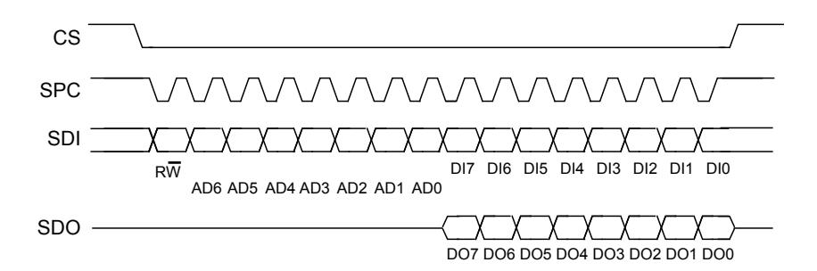

**CS** enables the serial port and it is controlled by the SPI master. It goes low at the start of the transmission and goes back high at the end. **SPC** is the serial port clock and it is controlled by the SPI master. It is stopped high when **CS** is high (no transmission). **SDI** and **SDO** are, respectively, the serial port data input and output. Those lines are driven at the falling edge of **SPC** and should be captured at the rising edge of **SPC**.

Both the read register and write register commands are completed in 16 clock pulses or in multiples of 8 in case of multiple read/write bytes. Bit duration is the time between two falling edges of **SPC**. The first bit (bit 0) starts at the first falling edge of **SPC** after the falling edge of **CS** while the last bit (bit 15, bit 23, ...) starts at the last falling edge of SPC just before the rising edge of **CS**.

**bit 0**: RW bit. When 0, the data DI(7:0) is written into the device. When 1, the data DO(7:0) from the device is read. In latter case, the chip drives **SDO** at the start of bit 8.

**bit 1-7**: address AD(6:0). This is the address field of the indexed register.

**bit 8-15**: data DI(7:0) (write mode). This is the data that is written into the device (MSb first).

**bit 8-15**: data DO(7:0) (read mode). This is the data that is read from the device (MSb first).

In multiple read/write commands further blocks of 8 clock periods are added. When the [CTRL3 \(12h\)](#page-66-0) (IF\_INC) bit is 0, the address used to read/write data remains the same for every block. When the [CTRL3 \(12h\)](#page-66-0) (IF\_INC) bit is 1, the address used to read/write data is increased at every block.

The function and the behavior of **SDI** and **SDO** remain unchanged.

**DS13510** - **Rev 4 page 24/198**

<span id="page-24-0"></span>

### *5.1.3.1 SPI read*

**Figure 11. SPI read protocol (in mode 3)**

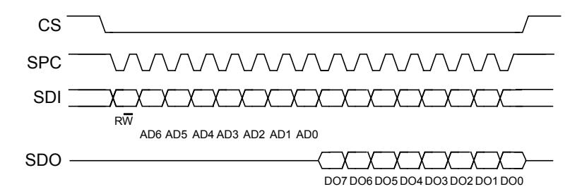

The SPI read command is performed with 16 clock pulses. A multiple byte read command is performed by adding blocks of 8 clock pulses to the previous one.

**bit 0**: READ bit. The value is 1.

**bit 1-7**: address AD(6:0). This is the address field of the indexed register.

**bit 8-15**: data DO(7:0) (read mode). This is the data that is read from the device (MSb first).

**bit 16-...**: data DO(...-8). Further data in multiple byte reads.

**Figure 12. Multiple byte SPI read protocol (2-byte example) (in mode 3)**

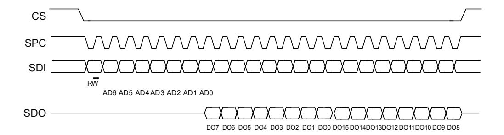

**DS13510** - **Rev 4 page 25/198**

<span id="page-25-0"></span>

### *5.1.3.2 SPI write*

**Figure 13. SPI write protocol (in mode 3)**

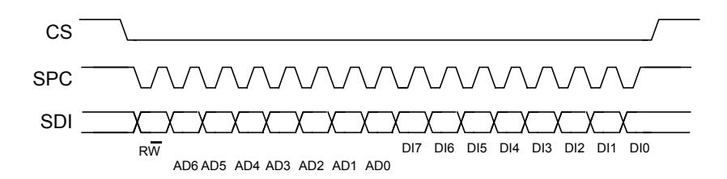

The SPI write command is performed with 16 clock pulses. A multiple byte write command is performed by adding blocks of 8 clock pulses to the previous one.

**bit 0**: WRITE bit. The value is 0.

**bit 1 -7**: address AD(6:0). This is the address field of the indexed register.

**bit 8-15**: data DI(7:0) (write mode). This is the data that is written inside the device (MSb first).

**bit 16-...** : data DI(...-8). Further data in multiple byte writes.

**Figure 14. Multiple byte SPI write protocol (2-byte example) (in mode 3)**

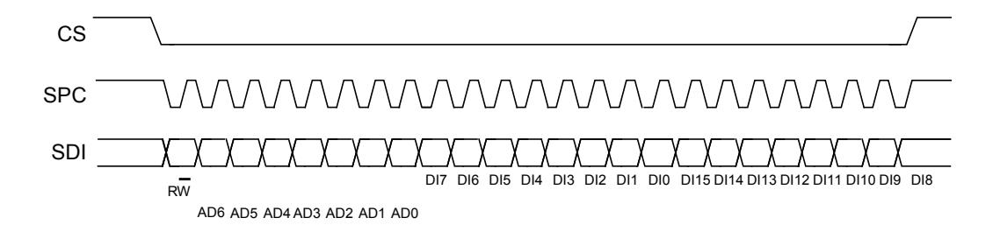

## *5.1.3.3 SPI read in 3-wire mode*

3-wire mode is entered by setting the [IF\\_CFG \(03h\)](#page-57-0) (SIM) bit equal to 1 (SPI serial interface mode selection).

**Figure 15. SPI read protocol in 3-wire mode (in mode 3)**

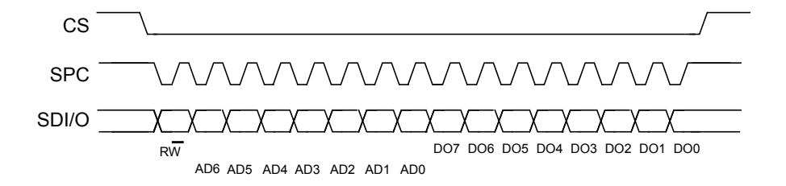

The SPI read command is performed with 16 clock pulses:

**bit 0**: READ bit. The value is 1.

**bit 1-7**: address AD(6:0). This is the address field of the indexed register.

**bit 8-15**: data DO(7:0) (read mode). This is the data that is read from the device (MSb first).

A multiple read command is also available in 3-wire mode.

**DS13510** - **Rev 4 page 26/198**

<span id="page-26-0"></span>

# **5.2 MIPI I3C® interface**

# **5.2.1 MIPI I3C® slave interface**

The LSM6DSV16X interface includes an MIPI I3C® SDR only slave interface (compliant with release 1.1 of the specification) with MIPI I3C® SDR embedded features:

- CCC command
- Direct CCC communication (SET and GET)
- Broadcast CCC communication
- Private communications
- Private read and write for single byte
- Multiple read and write
- In-band interrupt request
- Slave reset pattern
- Group address
- Full range Vdd\_IO support
- Asynchronous modes 0 and 1
- Synchronous mode
- Error detection and recovery methods (S0-S6)

In order to disable the MIPI I3C® block, I2C\_I3C\_disable = 1 must be written in [IF\\_CFG \(03h\)](#page-57-0).

**DS13510** - **Rev 4 page 27/198**

<span id="page-27-0"></span>

## **5.2.2 MIPI I3C® CCC supported commands**

The list of MIPI I3C® CCC commands supported by the device is detailed in the following table.

**Table 17. MIPI I3C® CCC commands**

| Command   | Command code | Default                                      | Description                                                                |
|-----------|--------------|----------------------------------------------|----------------------------------------------------------------------------|
| ENTDAA    | 0x07         |                                              | DAA procedure                                                              |
| SETDASA   | 0x87         |                                              | Assign dynamic address using static address 0x6B/0x6A depending on SDO pin |
| ENEC      | 0x80 / 0x00  |                                              | Slave activity control (direct and broadcast)                              |
| DISEC     | 0x81/ 0x01   |                                              | Slave activity control (direct and broadcast)                              |
| ENTAS0    | 0x82 / 0x02  |                                              | Enter activity state (direct and broadcast)                                |
| SETXTIME  | 0x98 / 0x28  |                                              | Timing information exchange                                                |
| GETXTIME  | 0x99         | 0x07<br>0x00<br>0x05<br>0x92                 | Timing information exchange                                                |
| RSTDAA    | 0x06         |                                              | Reset the assigned dynamic address (broadcast only)                        |
| SETMWL    | 0x89 / 0x08  |                                              | Define maximum write length during private write (direct and broadcast)    |
| SETMRL    | 0x8A / 0x09  |                                              | Define maximum read length during private read (direct and broadcast)      |
| SETNEWDA  | 0x88         |                                              | Change dynamic address                                                     |
| GETMWL    | 0x8B         | 0x00<br>0x08<br>(2 byte)                     | Get maximum write length during private write                              |
| GETMRL    | 0x8C         | 0x00<br>0x10<br>0x09<br>(3 byte)             | Get maximum read length during private read                                |
|           |              | 0x02<br>0x08<br>0x00<br>0x70<br>0x92<br>0x0B | SDO = 1                                                                    |
| GETPID    | 0x8D         | 0x02<br>0x08<br>0x00<br>0x70<br>0x12<br>0x0B | SDO = 0                                                                    |
| GETBCR    | 0x8E         | 0x07<br>(1 byte)                             | Bus characteristics register                                               |
| GETDCR    | 0x8F         | 0x44 default                                 | MIPI I3C® device characteristics register                                  |
| GETSTATUS | 0x90         | 0x00<br>0x00<br>(2 byte)                     | Status register                                                            |

**DS13510** - **Rev 4 page 28/198**

<span id="page-28-0"></span>

| Command | Command code | Default | Description                                                                   |
|---------|--------------|---------|-------------------------------------------------------------------------------|
|         |              | 0x08    |                                                                               |
| GETMXDS | 0x94         | 0x60    | Return max write and read speed                                               |
|         |              | 0x00    |                                                                               |
| GETCAPS |              | 0x11    |                                                                               |
|         | 0x95         | 0x18    | Provide information about device capabilities and supported extended features |
|         |              | 0x00    |                                                                               |
| SETGRPA | 0x9B         |         | Group address assignment command                                              |
| RSTGRPA | 0x2C / 0x9C  |         | Reset the group address                                                       |
| RSTACT  | 0x9A / 0x2A  |         | Configure slave reset action                                                  |

### **5.2.3 Overview of anti-spike filter management**

The device acts as a standard I²C target as long as it has an I²C static address. The device is capable of detecting and disabling the I²C anti-spike filter after detecting the broadcast address (7'h7E/W). In order to guarantee proper behavior of the device, the I3C master must emit the first START, 7'h7E/W at open-drain speed using I²C fast mode plus reference timing.

After detecting the broadcast address, the device can receive the I3C dynamic address following the I3C pushpull timing. If the device is not assigned a dynamic address, then the device continues to operate as an I²C device with no anti-spike filter. For the case in which the host decides to keep the device as I²C with anti-spike filter, there is a configuration required to keep the anti-spike filter active. This configuration is done by writing the ASF\_CTRL bit to 1 in the [IF\\_CFG \(03h\)](#page-57-0) register. This configuration forces the anti-spike filter to always be turned on instead of being managed by the communication on the bus.

**DS13510** - **Rev 4 page 29/198**

<span id="page-29-0"></span>

# **5.3 Master I²C interface**

If the LSM6DSV16X is configured in mode 2, a master I²C line is available. The master serial interface is mapped to the following dedicated pins.

**Table 18. Master I²C pin details**

| Pin name | Pin description                            |
|----------|--------------------------------------------|
| MSCL     | I²C serial clock master                    |
| MSDA     | I²C serial data master                     |
| MDRDY    | I²C master external synchronization signal |

# **5.4 Auxiliary SPI interface**

If the LSM6DSV16X is configured in mode 3, the auxiliary SPI is available. The auxiliary SPI interface is mapped to the following dedicated pins.

**Table 19. Auxiliary SPI pin details**

| Pin name      | Pin description                                                                  |
|---------------|----------------------------------------------------------------------------------|
| OCS_Aux       | Enables auxiliary SPI 3/4-wire                                                   |
| SDx/AH1/Qvar1 | Auxiliary SPI 3/4-wire data input (SDI_Aux) and SPI 3-wire data output (SDO_Aux) |
| SCx/AH2/Qvar2 | Auxiliary SPI 3/4-wire interface serial port clock                               |
| SDO_Aux       | Auxiliary SPI 4-wire data output (SDO_Aux)                                       |

When the LSM6DSV16X is configured in mode 3, the auxiliary SPI can be connected to a camera module for OIS support.

**DS13510** - **Rev 4 page 30/198**

<span id="page-30-0"></span>

# **6 Functionality**

This section describes all the operating modes and power modes of the LSM6DSV16X.

*Note: Refer to the product application note for the details regarding operating/power mode configurations, settings, turn-on/off time and on-the-fly changes.*

# **6.1 Operating modes**

In the LSM6DSV16X, the accelerometer and the gyroscope can be turned on/off independently of each other and are allowed to have different ODRs and power modes.

The LSM6DSV16X has three operating modes available:

- Only accelerometer active and gyroscope in power-down
- Only gyroscope active and accelerometer in power-down
- Both accelerometer and gyroscope sensors active with independent ODR and power mode

The accelerometer is activated from power-down by writing ODR\_XL\_[3:0] in [CTRL1 \(10h\)](#page-64-0) while the gyroscope is activated from power-down by writing ODR\_G\_[3:0] in [CTRL2 \(11h\)](#page-65-0). For combo mode, the ODRs are totally independent.

# **6.2 Accelerometer power modes**

In the LSM6DSV16X, the accelerometer can be configured in five different operating modes: power-down mode, low-power mode (1, 2, 3), normal mode, high-performance mode and high-accuracy ODR mode.

The operating mode selected depends on the value of the OP\_MODE\_XL\_[2:0] bits in [CTRL1 \(10h\).](#page-64-0)

If the value of the OP\_MODE\_XL\_[2:0] bits is 000 (default), high-performance mode is valid for all ODRs (from 7.5 Hz up to 7.68 kHz).

Normal mode is available for ODR values from 7.5 Hz to 1.92 kHz and it is enabled by setting the OP\_MODE\_XL\_[2:0] bits to 111. Normal mode cannot be used in mode 3 connection mode.

In high-performance mode and in normal mode the analog anti-aliasing filter is active.

Low-power mode is available for lower ODRs (1.875 Hz, 15 Hz, 30 Hz, 60 Hz, 120 Hz, 240 Hz). The three low-power modes are enabled by setting OP\_MODE\_XL\_[2:0] to 100 (LPM1), 101 (LPM2), 110 (LPM3).

High-accuracy ODR mode is available for ODR values from 15 Hz up to 7.68 kHz and it is enabled by setting the OP\_MODE\_XL\_[2:0] bits to 001. Refer to [Section 6.5 High-accuracy ODR mode](#page-32-0) for more details.

The embedded functions based on accelerometer data (free-fall, 6D/4D, tap/double-tap, wake-up, activity/ inactivity, stationary/motion, step counter, step detection, significant motion, tilt) and the FIFO batching functionality are supported in all modes.

**DS13510** - **Rev 4 page 31/198**

<span id="page-31-0"></span>

## 6.3 Accelerometer dual-channel mode

The LSM6DSV16X accelerometer block has a dual-channel architecture able to work with two different full scales simultaneously. By default, the device operates in single-channel mode supporting FS scale values from  $\pm 2~g$  through  $\pm 16~g$  and different power modes, as described in Section 6.2 Accelerometer power modes. The block diagrams in the following figures show the configuration of acceleration data processing in the two different modes.

Figure 16. Single-channel mode (XL\_DualC\_EN = 0)

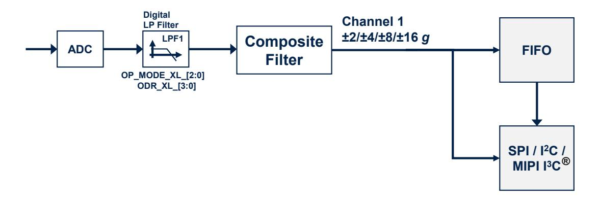

Figure 17. Dual-channel mode (XL\_DualC\_EN = 1)

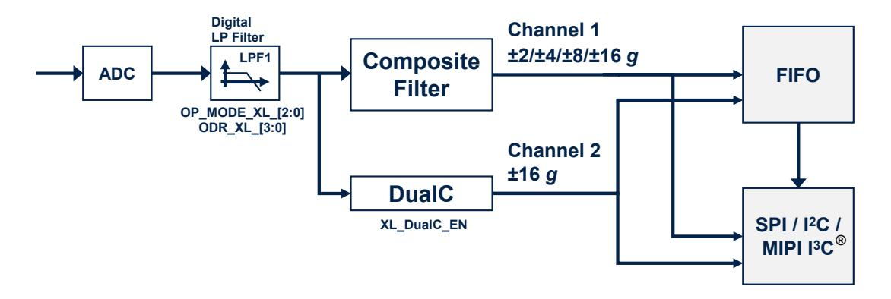

The dual-channel functionality can be enabled/disabled by configuring the bit XL\_DualC\_EN to 1 (enable) or to 0 (disable) in CTRL8 (17h).

Referring to Figure 17. Dual-channel mode (XL\_DualC\_EN = 1), when the dual-channel mode has been activated:

- 1. Channel 1 supports user-selectable full-scale acceleration range of ±2/±4/±8/±16 *g* based on the value of the FS\_XL\_[1:0] bits in the CTRL8 (17h) register.
- 2. Channel 2 full scale is set to ±16 g. Acceleration data are available in the output registers from UI\_OUTX\_L\_A\_OIS\_DualC (34h) and UI\_OUTX\_H\_A\_OIS\_DualC (35h) through UI\_OUTZ\_L\_A\_OIS\_DualC (38h) and UI\_OUTZ\_H\_A\_OIS\_DualC (39h)).

DS13510 - Rev 4 page 32/198

<span id="page-32-0"></span>

# **6.4 Gyroscope power modes**

In the LSM6DSV16X, the gyroscope can be configured in five different operating modes: power-down mode, sleep mode, low-power mode, high-performance mode and high-accuracy ODR mode.

The operating mode selected depends on the value of the OP\_MODE\_G\_[2:0] bits in [CTRL2 \(11h\)](#page-65-0).

If the value of the OP\_MODE\_G\_[2:0] bits is 000 (default), high-performance mode is valid for all ODRs (from 7.5 Hz up to 7.68 kHz).

Low-power mode is available for lower ODRs (7.5 Hz, 15 Hz, 30 Hz, 60 Hz, 120 Hz, 240 Hz) and it is enabled by setting the the OP\_MODE\_G\_[2:0] bits to 101.

High-accuracy ODR mode is available for ODR values from 15 Hz up to 7.68 kHz and it is enabled by setting the OP\_MODE\_G\_[2:0] bits to 001. Refer to Section 6.5 High-accuracy ODR mode for more details.

# **6.5 High-accuracy ODR mode**

High-accuracy ODR (HAODR) mode can be enabled to reduce the part-to-part output data rate variation. It supports accelerometer only, gyroscope only, and combo (accelerometer and gyroscope) modes. When this mode is used for one sensor (accelerometer or gyroscope), the other sensor also has to be configured in high-accuracy ODR (HAODR) mode.

The main high-accuracy ODR features are:

- Noise level is aligned with high-performance mode
- Power consumption increase of 20 μA (typical) vs. the corresponding high-performance mode configuration selected
- The UI channel bandwidth can be selected through the gyroscope LPF1 and accelerometer HPF/LPF2 filters.
- When HAODR mode is enabled, it is applied to the UI accelerometer, UI gyroscope, EIS gyroscope, and temperature. It is not applied to OIS accelerometer/gyroscope channels.

*Note: HAODR mode has to be enabled / disabled when the device is in power-down mode.*

When HAODR mode is enabled, two different sets of ODRs are supported based on the configuration of the HAODR\_SEL\_[1:0] bitfield in the [HAODR\\_CFG \(62h\)](#page-99-0) register, as shown in the table below.

*Note: High-accuracy ODR mode is not compatible with the analog hub / Qvar functionality and the activity/inactivity functionality (motion/stationary can be used).*

**Table 20. Accelerometer and gyroscope ODR selection in high-accuracy ODR mode**

| ODR_XL_[3:0]<br>ODR_G_[3:0] | ODR [Hz]<br>HAODR_SEL_[1:0] = 00 | ODR [Hz]<br>HAODR_SEL_[1:0] = 01 | ODR [Hz]<br>HAODR_SEL_[1:0] = 10 |
|-----------------------------|----------------------------------|----------------------------------|----------------------------------|
| 0000                        | Power-down                       | Power-down                       | Power-down                       |
| 0001                        | Reserved                         | Reserved                         | Reserved                         |
| 0010                        | Reserved                         | Reserved                         | Reserved                         |
| 0011                        | 15                               | 15.625                           | 12.5                             |
| 0100                        | 30                               | 31.25                            | 25                               |
| 0101                        | 60                               | 62.5                             | 50                               |
| 0110                        | 120                              | 125                              | 100                              |
| 0111                        | 240                              | 250                              | 200                              |
| 1000                        | 480                              | 500                              | 400                              |
| 1001                        | 960                              | 1000                             | 800                              |
| 1010                        | 1920                             | 2000                             | 1600                             |
| 1011                        | 3840                             | 4000                             | 3200                             |
| 1100                        | 7680                             | 8000                             | 6400                             |
| Others                      | Reserved                         | Reserved                         | Reserved                         |

**DS13510** - **Rev 4 page 33/198**

<span id="page-33-0"></span>

# **6.6 ODR-triggered mode**

When ODR-triggered mode is enabled, a reference signal must be provided to the INT2 pin, and the device then automatically aligns (in frequency and phase) the data generation to the edges of the reference signal.

It supports accelerometer only, gyroscope only, and combo (accelerometer and gyroscope) modes. When both the accelerometer and gyroscope are enabled, the user must configure the same ODR on both the accelerometer and gyroscope. It is not possible to select different ODRs for the accelerometer and gyroscope; if different output data rate values are set, the ODR configured for the gyroscope data is also applied to the accelerometer data.

The full-scale configurations are totally independent between the accelerometer and gyroscope and they can be set in any combination.

*Note: ODR-triggered mode has to be enabled / disabled when the device is in power-down mode.*

*Note: When ODR-triggered mode is enabled, the 1100 configuration of the ODR\_XL\_[3:0] bits in register [CTRL1 \(10h\)](#page-64-0)*

*and the 1100 configuration of the ODR\_G\_[3:0] bits in register [CTRL2 \(11h\)](#page-65-0) cannot be used.*

*Note: ODR-triggered mode is not compatible with the analog hub / Qvar functionality nor the EIS functionality.*

## **6.7 Analog hub functionality**

The LSM6DSV16X embeds an analog hub sensing functionality which is able to connect an analog input and convert it to a digital signal for embedded processing.

In the LSM6DSV16X, the analog hub has a dedicated channel that can be activated by setting the AH\_QVAR\_EN bit to 1 in the [CTRL7 \(16h\)](#page-69-0) register.

The accelerometer sensor must be set in high-performance mode or in normal mode when the analog hub channel is enabled.

The analog hub data-ready signal is represented by the AH\_QVARDA bit of the [STATUS\\_REG \(1Eh\)](#page-76-0) register. This signal can be driven to the INT2 pin by setting the INT2\_DRDY\_AH\_QVAR bit to 1 in the [CTRL7 \(16h\)](#page-69-0) register.

Analog hub data are available as a 16-bit word in two's complement in the [AH\\_QVAR\\_OUT\\_L \(3Ah\) and](#page-83-0) [AH\\_QVAR\\_OUT\\_H \(3Bh\)](#page-83-0) registers at a fixed rate of 240 Hz (typical).

Analog signal data can be also processed by MLC/FSM logic.

The analog hub functionality is available in mode 1 connection mode for the I²C interface only. The external analog lines have to be connected to pin 2 (SDx/AH1/Qvar1) and/or pin 3 (SCx/AH2/Qvar2), so the I²C-master interface (mode 2) and the auxiliary SPI (mode 3) are not available when the analog hub is used.

The equivalent input impedance of the analog hub buffers can be selected by properly setting the AH\_QVAR\_C\_ZIN\_[1:0] bits in the [CTRL7 \(16h\)](#page-69-0) register.

## **6.8 Qvar functionality**

The LSM6DSV16X embeds a Qvar sensor which is able to detect electric charge variations in the proximity of the external electrodes connected to the device.

In the LSM6DSV16X, Qvar has a dedicated channel that can be activated by setting the AH\_QVAR\_EN bit to 1 in the [CTRL7 \(16h\)](#page-69-0) register.

The accelerometer sensor must be set in high-performance mode or in normal mode when the Qvar channel is enabled.

The Qvar data-ready signal is represented by the AH\_QVARDA bit of the [STATUS\\_REG \(1Eh\)](#page-76-0) register. This signal can be driven to the INT2 pin by setting the INT2\_DRDY\_AH\_QVAR bit to 1 in the [CTRL7 \(16h\)](#page-69-0) register.

Qvar data are available as a 16-bit word in two's complement in the [AH\\_QVAR\\_OUT\\_L \(3Ah\) and](#page-83-0) [AH\\_QVAR\\_OUT\\_H \(3Bh\)](#page-83-0) registers at a fixed rate of 240 Hz (typical).

Qvar data can also be processed by MLC/FSM logic.

The Qvar functionality is available in mode 1 connection mode for the I²C interface only. The external electrodes have to be connected to pin 2 (SDx/AH1/Qvar1) and/or pin 3 (SCx/AH2/Qvar2), so the I²C-master interface (mode 2) and the auxiliary SPI (mode 3) are not available when Qvar is used.

The equivalent input impedance of the Qvar buffers can be selected by properly setting the AH\_QVAR\_C\_ZIN\_[1:0] bits in the [CTRL7 \(16h\)](#page-69-0) register.

**DS13510** - **Rev 4 page 34/198**

<span id="page-34-0"></span>

# **6.9 Block diagram of filters**

**Figure 18. Block diagram of filters**

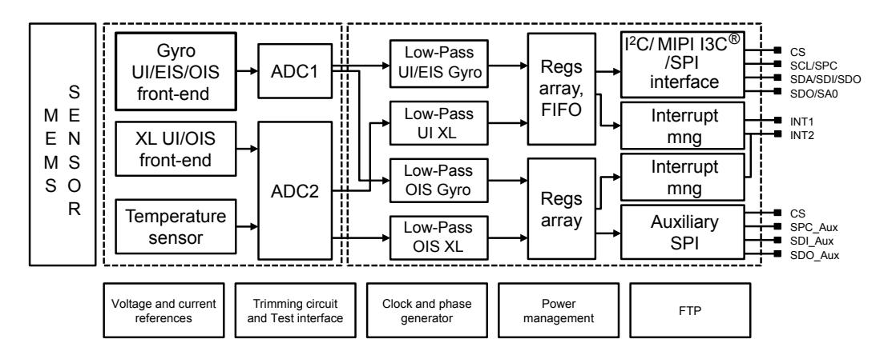

**DS13510** - **Rev 4 page 35/198**

<span id="page-35-0"></span>

## **6.9.1 Block diagrams of the accelerometer filters**

In the LSM6DSV16X, the filtering chain for the accelerometer part is composed of the following:

- Digital filter (LPF1)
- Composite filter

Details of the block diagram appear in the following figure.

**Figure 19. Accelerometer UI chain**

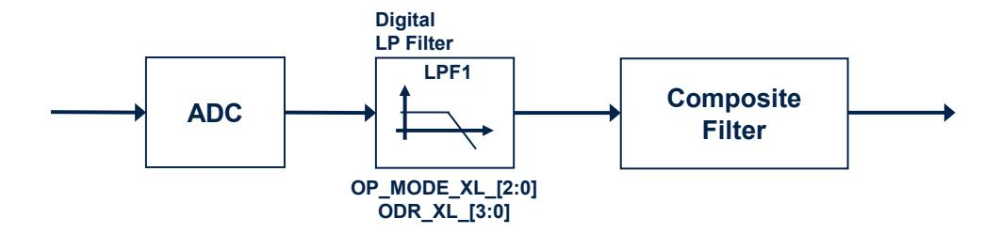

**Figure 20. Accelerometer composite filter**


1. *The cutoff value of the LPF1 output is ODR/2 when the accelerometer is in high-performance mode, high-accuracy ODR mode, or normal mode. This value is equal to 2300 Hz when the accelerometer is in low-power mode 1 (2 mean), 912 Hz in low-power mode 2 (4 mean) or 431 Hz in low-power mode 3 (8 mean).*

*Note: Embedded functions include finite state machine, machine learning core, pedometer, step detector and step counter, significant motion detection, and tilt functions.*

**DS13510** - **Rev 4 page 36/198**

<span id="page-36-0"></span>

The accelerometer filtering chain when mode 3 is enabled is illustrated in the following figure.

**Figure 21. Accelerometer chain with mode 3 enabled**

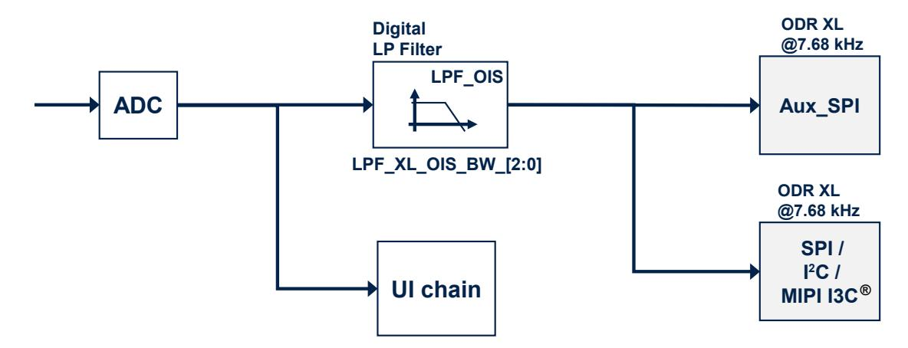

*Note: The accelerometer OIS chain is enabled by setting the OIS\_XL\_EN bit to 1 in the [UI\\_CTRL1\\_OIS \(70h\)](#page-105-0) / [SPI2\\_CTRL1\\_OIS \(70h\)](#page-117-0) register.*

> *The configuration of the accelerometer UI chain is not affected by enabling/disabling the accelerometer OIS chain, with one exception: accelerometer normal operating mode (OP\_MODE\_XL\_[2:0] = 111 in the [CTRL1](#page-64-0) [\(10h\)](#page-64-0) register) cannot be used when the accelerometer OIS chain is enabled.*

Accelerometer output values are available in the following registers with ODR at 7.68 kHz:

- [UI\\_OUTX\\_L\\_A\\_OIS\\_DualC \(34h\) and UI\\_OUTX\\_H\\_A\\_OIS\\_DualC \(35h\)](#page-82-0) through [UI\\_OUTZ\\_L\\_A\\_OIS\\_DualC \(38h\) and UI\\_OUTZ\\_H\\_A\\_OIS\\_DualC \(39h\)](#page-83-0)
- [SPI2\\_OUTX\\_L\\_A\\_OIS \(28h\) and SPI2\\_OUTX\\_H\\_A\\_OIS \(29h\)](#page-114-0) through [SPI2\\_OUTZ\\_L\\_A\\_OIS \(2Ch\) and](#page-115-0) [SPI2\\_OUTZ\\_H\\_A\\_OIS \(2Dh\)](#page-115-0)

*Note: When the accelerometer OIS is used, refer to the product application note for the power mode configuration and settings.*

**DS13510** - **Rev 4 page 37/198**

**FSM / MLC** 

<span id="page-37-0"></span>

### **6.9.2 Block diagrams of the gyroscope filters**

In the LSM6DSV16X, the gyroscope filtering chain depends on the mode configuration:

• Mode 1 (for user interface (UI) and electronic image stabilization (EIS) functionality through the primary interface) and mode 2

**ADC LPF1\_G\_EN Digital LP filter LPF1 0 1 SPI / I <sup>2</sup>C / MIPI I3C Digital FIFO LP filter ODR\_G\_[3:0] LPF2 (1)(2) ®**

**Figure 22. Gyroscope digital chain - mode 1 (UI/EIS) and mode 2**

- 1. *When the gyroscope OIS or EIS chain is enabled, the LPF1 filter is not available in the gyroscope UI chain. It is recommended to avoid using the LPF1 filter in the gyroscope UI chain when the gyroscope OIS or EIS is used.*
- 2. *The LPF1 filter is available in high-performance mode only. If the gyroscope is configured in low-power mode, the LPF1 filter is bypassed.*

**LPF1\_G\_BW\_[2:0]**

In this configuration, the gyroscope ODR is selectable from 7.5 Hz up to 7.68 kHz. A low-pass filter (LPF1) is available, for more details about the filter characteristics see [Table 64. Gyroscope LPF1 + LPF2 bandwidth](#page-69-0) [selection.](#page-69-0)

The digital LPF2 filter's cutoff frequency depends on the selected gyroscope ODR, as indicated in the following table.

| Gyroscope ODR [Hz] | LPF2 cutoff [Hz] |
|--------------------|------------------|
| 7.5                | 3.4              |
| 15                 | 6.6              |
| 30                 | 13.0             |
| 60                 | 24.6             |
| 120                | 49.4             |
| 240                | 96               |
| 480                | 187              |
| 960                | 342              |
| 1.92 kHz           | 491              |
| 3.84 kHz           | 528              |
| 7.68 kHz           | 537              |

**Table 21. Gyroscope LPF2 bandwidth selection**

*Note: Data can be acquired from the output registers and FIFO over the primary I²C/MIPI I3C®/SPI interface.*

**DS13510** - **Rev 4 page 38/198**

<span id="page-38-0"></span>

• Mode 3 (for OIS functionality)

**Figure 23. Gyroscope digital chain - mode 3 (OIS)**

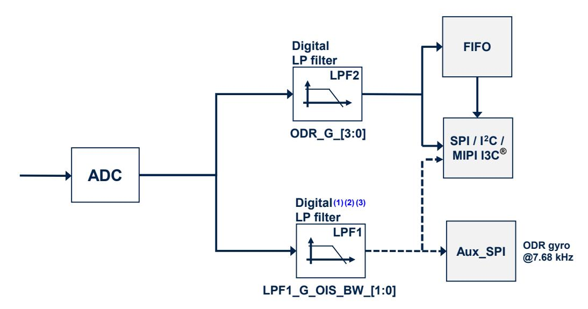

- 1. *When the gyroscope OIS or EIS chain is enabled, the LPF1 filter is not available in the gyroscope UI chain.*
- 2. *It is recommended to avoid using the LPF1 filter in mode1/2 when the gyroscope OIS or EIS chain is used.*
- 3. *When the gyroscope OIS is used, refer to the product application note for the power mode configuration and settings.*

The auxiliary interface needs to be enabled in [UI\\_CTRL1\\_OIS \(70h\)](#page-105-0) / [SPI2\\_CTRL1\\_OIS \(70h\)](#page-117-0). In mode 3 configuration, there are two paths:

- The chain for user interface (UI) where the ODR is selectable from 7.5 Hz up to 7.68 kHz
- The chain for OIS where the ODR is at 7.68 kHz and the LPF1 is available. The LPF1 configuration depends on the setting of the LPF1\_G\_OIS\_BW\_[1:0] bits in register [UI\\_CTRL2\\_OIS \(71h\)](#page-106-0) / [SPI2\\_CTRL2\\_OIS \(71h\);](#page-118-0) for more details about the filter characteristics see [UI\\_CTRL2\\_OIS \(71h\)](#page-106-0). Gyroscope output values are in registers 22h to 27h if read from the Auxi\_SPI or in registers 2Eh to 33h if read from the primary interface with the selected full scale FS\_G\_OIS\_[1:0] bits in [UI\\_CTRL2\\_OIS](#page-106-0) [\(71h\)](#page-106-0) / [SPI2\\_CTRL2\\_OIS \(71h\)](#page-118-0)).

**DS13510** - **Rev 4 page 39/198**

<span id="page-39-0"></span>

## 6.10 Enhanced EIS

The LSM6DSV16X offers advanced design flexibility for EIS applications: enhanced EIS functionality has a dedicated channel and processing with independent filtering.

Enhanced EIS main features:

- Enhanced EIS channel gyroscope data can be read over the primary interfaces through I<sup>2</sup>C / MIPI I3C<sup>®</sup> / SPI.
- EIS data are available in free-run mode in the output registers (UI\_OUTX\_L\_G\_OIS\_EIS (2Eh) and UI\_OUTX\_H\_G\_OIS\_EIS (2Fh) through UI\_OUTZ\_L\_G\_OIS\_EIS (32h) and UI\_OUTZ\_H\_G\_OIS\_EIS (33h)) by setting the G\_EIS\_ON\_G\_OIS\_OUT\_REG bit to 1 in the CTRL\_EIS (6Bh) register or in FIFO (by setting the G\_EIS\_FIFO\_EN bit to 1 in the FIFO\_CTRL4 (0Ah) register) with dedicated TAG and timestamp configurable using FIFO\_CTRL4 (0Ah).
- Enhanced EIS option is compatible with mode 3 selection. When EIS data-out are read from the output registers (setting G\_EIS\_ON\_G\_OIS\_OUT\_REG bit), data from the gyroscope OIS chain can be only read from the auxiliary SPI interface.

Figure 24. LSM6DSV16X supports UI, enhanced EIS, and OIS processing simultaneously

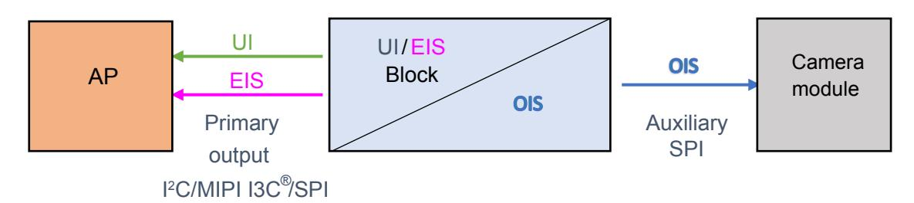

Figure 25. Gyroscope enhanced EIS and UI block diagram

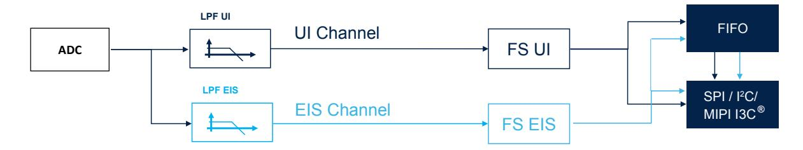

When enhanced EIS mode is activated through the ODR EIS [1:0] bits in the CTRL EIS (6Bh) register:

- Gyroscope UI can be configured only in power-down mode, high-performance mode, or high-accuracy ODR mode.
- Gyroscope EIS full scale can be selected by using the FS\_G\_EIS\_[2:0] bits in the CTRL\_EIS (6Bh) register.
- Gyroscope EIS data rate selectable at 1.92 kHz or 960 Hz configurable through the ODR\_G\_EIS\_[1:0] bits in the CTRL\_EIS (6Bh) register.
- LPF\_EIS low-pass filter (refer to Figure 25) bandwidth selection can be configured through the LPF G EIS BW bit in the CTRL EIS (6Bh) register.

DS13510 - Rev 4 page 40/198

<span id="page-40-0"></span>

## **6.11 OIS**

This section describes OIS functionality. There is a dedicated gyroscope and accelerometer DSP for OIS. The device also supports self-test functionality on the OIS side.

## **6.11.1 Enabling OIS functionality and connection schemes**

There are two different ways in order to enable and configure OIS functionality:

- **Auxiliary SPI full control**: Enabling and configuration done from the auxiliary SPI
- **Primary interface full control**: Enabling and configuration done from the primary interface

The configurations that allow selecting these two different options are done using the OIS\_CTRL\_FROM\_UI bit in the [FUNC\\_CFG\\_ACCESS \(01h\)](#page-55-0) register as described in the following table.

**Table 22. OIS configurations**

| OIS_CTRL_FROM_UI | OIS configuration option       |  |  |  |
|------------------|--------------------------------|--|--|--|
| 0                | Auxiliary SPI full control     |  |  |  |
| 1                | Primary interface full control |  |  |  |

**DS13510** - **Rev 4 page 41/198**

<span id="page-41-0"></span>

#### *6.11.1.1 Auxiliary SPI full control*

This is the default condition of the device. The camera module is completely independent from the application processor as shown in Figure 26.

The auxiliary SPI can configure OIS functionality through [SPI2\\_INT\\_OIS \(6Fh\),](#page-116-0) [SPI2\\_CTRL1\\_OIS \(70h\),](#page-117-0) [SPI2\\_CTRL2\\_OIS \(71h\)](#page-118-0), [SPI2\\_CTRL3\\_OIS \(72h\)](#page-119-0).

Reading from the auxiliary SPI is enabled only when the SPI2\_READ\_EN bit in the [SPI2\\_CTRL1\\_OIS \(70h\)](#page-117-0) register is set to 1.

The primary interface can access the OIS control registers ([UI\\_INT\\_OIS \(6Fh\),](#page-104-0) [UI\\_CTRL1\\_OIS \(70h\)](#page-105-0), [UI\\_CTRL2\\_OIS \(71h\),](#page-106-0) [UI\\_CTRL3\\_OIS \(72h\)](#page-107-0)) in read mode.

**Figure 26. Auxiliary SPI full control**

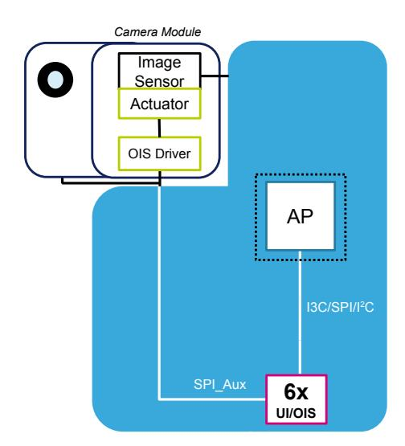

**DS13510** - **Rev 4 page 42/198**

<span id="page-42-0"></span>

#### *6.11.1.2 Primary interface full control*

This option allows the application processor to configure all OIS functionalities from the primary interface. This option allows using embedded OIS data for both the main and front camera, connecting them to the application processor (eventually adding a context hub) as shown in Figure 27: the AP can also do some processing on the data before sending them to the cameras.

In order to place the device in this mode, the OIS\_CTRL\_FROM\_UI bit in the [FUNC\\_CFG\\_ACCESS \(01h\)](#page-55-0) register must be set to 1 from the primary interface.

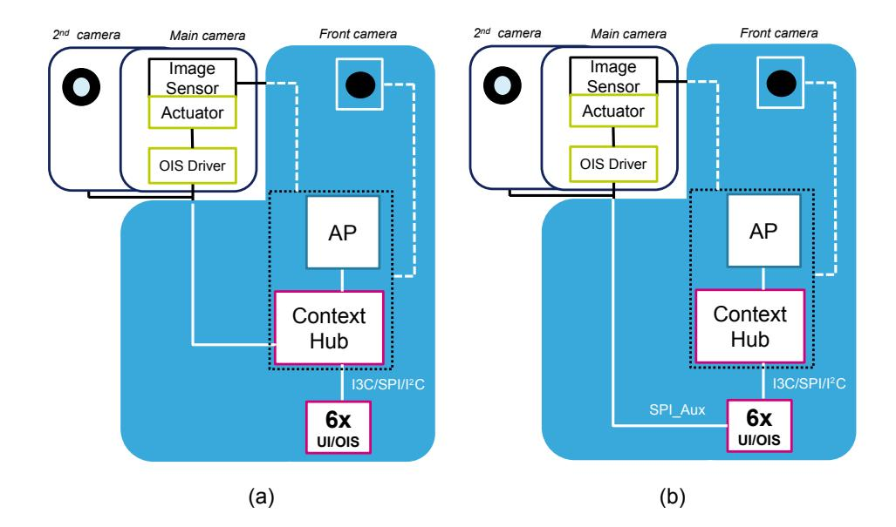

**Figure 27. OIS Primary interface full control**

Then, the AP can configure OIS functionalities through [UI\\_INT\\_OIS \(6Fh\),](#page-104-0) [UI\\_CTRL1\\_OIS \(70h\)](#page-105-0), [UI\\_CTRL2\\_OIS](#page-106-0) [\(71h\)](#page-106-0), [UI\\_CTRL3\\_OIS \(72h\).](#page-107-0)

Reading from the auxiliary SPI can be enabled by setting the SPI2\_ READ\_EN bit in the [UI\\_CTRL1\\_OIS \(70h\)](#page-105-0) register to 1 in order to directly read OIS data (as shown in Figure 27 (b)). The auxiliary SPI can access the [SPI2\\_INT\\_OIS \(6Fh\),](#page-116-0) [SPI2\\_CTRL1\\_OIS \(70h\),](#page-117-0) [SPI2\\_CTRL2\\_OIS \(71h\),](#page-118-0) and [SPI2\\_CTRL3\\_OIS \(72h\)](#page-119-0) registers in read-only mode.

*Note: The OIS\_CTRL\_FROM\_UI bit is reset by the software reset procedure.*

**DS13510** - **Rev 4 page 43/198**

<span id="page-43-0"></span>

## **6.12 FIFO**

The presence of a FIFO allows consistent power saving for the system since the host processor does not need continuously poll data from the sensor, but It can wake up only when needed and burst the significant data out from the FIFO.

The LSM6DSV16X embeds 1.5 KB of data in FIFO (up to 4.5 KB with the compression feature enabled) to store the following data:

- Gyroscope
- Accelerometer
- External sensors (up to 4)
- Step counter
- Timestamp
- Temperature
- MLC features and filters
- SFLP output data (quaternion, gyroscope bias, gravity vector)

Writing data in the FIFO can be configured to be triggered by the:

- Accelerometer / gyroscope data-ready signal
- Sensor hub data-ready signal
- Step detection signal

The applications have maximum flexibility in choosing the rate of batching for physical sensors with FIFOdedicated configurations: accelerometer, gyroscope and temperature sensor batch rates can be selected by the user. External sensor writing in FIFO can be triggered by the accelerometer data-ready signal or by an external sensor interrupt. The step counter can be stored in FIFO with associated timestamp each time a step is detected. It is possible to select decimation for timestamp batching in FIFO with a factor of 1, 8, or 32.

The reconstruction of a FIFO stream is a simple task thanks to the FIFO\_DATA\_OUT\_TAG byte that allows recognizing the meaning of a word in FIFO.

FIFO allows correct reconstruction of the timestamp information for each sensor stored in FIFO. If a change in the ODR or BDR (batch data rate) configuration is performed, the application can correctly reconstruct the timestamp and know exactly when the change was applied without disabling FIFO batching. FIFO stores information of the new configuration and timestamp in which the change was applied in the device.

Finally, FIFO embeds a compression algorithm that the user can enable in order to have up to 4.5 KB data stored in FIFO and take advantage of interface communication length for FIFO flushing and communication power consumption.

The programmable FIFO watermark threshold can be set using the WTM[7:0] bits in the [FIFO\\_CTRL1 \(07h\)](#page-58-0) register. To monitor the FIFO status, dedicated registers ([FIFO\\_STATUS1 \(1Bh\),](#page-74-0) [FIFO\\_STATUS2 \(1Ch\)\)](#page-74-0) can be read to detect FIFO overrun events, FIFO full status, FIFO empty status, FIFO watermark status and the number of unread samples stored in the FIFO. To generate dedicated interrupts on the INT1 and INT2 pins of these status events, the configuration can be set in [INT1\\_CTRL \(0Dh\)](#page-62-0) and [INT2\\_CTRL \(0Eh\).](#page-63-0)

The FIFO buffer can be configured according to seven different modes:

- Bypass mode
- FIFO mode
- Continuous mode
- Continuous-to-FIFO mode
- ContinuousWTM-to-full mode
- Bypass-to-continuous mode
- Bypass-to-FIFO mode

Each mode is selected by the FIFO\_MODE\_[2:0] bits in the [FIFO\\_CTRL4 \(0Ah\)](#page-60-0) register.

## **6.12.1 Bypass mode**

In bypass mode [\(FIFO\\_CTRL4 \(0Ah\)\(](#page-60-0)FIFO\_MODE\_[2:0] = 000), the FIFO is not operational and it remains empty. Bypass mode is also used to reset the FIFO when in FIFO mode.

**DS13510** - **Rev 4 page 44/198**

<span id="page-44-0"></span>

#### **6.12.2 FIFO mode**

In FIFO mode [\(FIFO\\_CTRL4 \(0Ah\)\(](#page-60-0)FIFO\_MODE\_[2:0] = 001) data from the output channels are stored in the FIFO until it is full.

To reset FIFO content, bypass mode should be selected by writing [FIFO\\_CTRL4 \(0Ah\)\(](#page-60-0)FIFO\_MODE\_[2:0]) to 000. After this reset command, it is possible to restart FIFO mode by writing [FIFO\\_CTRL4 \(0Ah\)](#page-60-0) (FIFO\_MODE\_[2:0]) to 001.

The FIFO buffer memorizes up to 4.5 KB of data (with compression enabled) but the depth of the FIFO can be resized by setting the WTM[7:0] bits in [FIFO\\_CTRL1 \(07h\).](#page-58-0) If the STOP\_ON\_WTM bit in [FIFO\\_CTRL2 \(08h\)](#page-58-0) is set to 1, FIFO depth is limited up to the WTM[7:0] bits in the [FIFO\\_CTRL1 \(07h\)](#page-58-0) register.

## **6.12.3 Continuous mode**

Continuous mode [\(FIFO\\_CTRL4 \(0Ah\)\(](#page-60-0)FIFO\_MODE\_[2:0] = 110) provides a continuous FIFO update: as new data arrives, the older data is discarded.

A FIFO threshold flag [FIFO\\_STATUS2 \(1Ch\)\(](#page-74-0)FIFO\_WTM\_IA) is asserted when the number of unread samples in FIFO is greater than or equal to [FIFO\\_CTRL1 \(07h\)](#page-58-0) (WTM[7:0]).

It is possible to route the FIFO\_WTM\_IA flag to the INT1 pin by writing in register [INT1\\_CTRL \(0Dh\)](#page-62-0) (INT1\_FIFO\_TH) = 1 or to the INT2 pin by writing in register [INT2\\_CTRL \(0Eh\)](#page-63-0)(INT2\_FIFO\_TH) = 1.

A full-flag interrupt can be enabled, [INT1\\_CTRL \(0Dh\)](#page-62-0)(INT1\_FIFO\_FULL) = 1 or [INT2\\_CTRL \(0Eh\)](#page-63-0) (INT2\_FIFO\_FULL) = 1, in order to indicate FIFO saturation and eventually read its content all at once.

If an overrun occurs, at least one of the oldest samples in FIFO has been overwritten and the FIFO\_OVR\_IA flag in [FIFO\\_STATUS2 \(1Ch\)](#page-74-0) is asserted.

In order to empty the FIFO before it is full, it is also possible to pull from FIFO the number of unread samples available in [FIFO\\_STATUS1 \(1Bh\)](#page-74-0) and [FIFO\\_STATUS2 \(1Ch\)\(](#page-74-0)DIFF\_FIFO\_[8:0]).

## **6.12.4 Continuous-to-FIFO mode**

In continuous-to-FIFO mode [\(FIFO\\_CTRL4 \(0Ah\)\(](#page-60-0)FIFO\_MODE\_[2:0] = 011), FIFO behavior changes according to the trigger event detected in one of the following interrupt events:

- Single tap
- Double tap
- Wake-up
- Free-fall
- D6D

When the selected trigger bit is equal to 1, FIFO operates in FIFO mode.

When the selected trigger bit is equal to 0, FIFO operates in continuous mode.

## **6.12.5 ContinuousWTM-to-full mode**

In continuousWTM-to-full mode (FIFO\_CTRL4 (0Ah)(FIFO\_MODE\_[2:0] = 010), FIFO behavior changes according to the trigger event detected in one of the following interrupt events:

- Single tap
- Double tap
- Wake-up
- Free-fall
- D6D

When the selected trigger bit is equal to 0, FIFO operates in continuous mode with the FIFO size limited to the FIFO watermark level (defined by the WTM[7:0] bits in the [FIFO\\_CTRL1 \(07h\)](#page-58-0) register).

When the selected trigger bit is equal to 1, FIFO continues to store data until it is full.

**DS13510** - **Rev 4 page 45/198**

<span id="page-45-0"></span>

## **6.12.6 Bypass-to-continuous mode**

In bypass-to-continuous mode [\(FIFO\\_CTRL4 \(0Ah\)\(](#page-60-0)FIFO\_MODE\_[2:0] = 100), data measurement storage inside FIFO operates in Continuous mode when selected triggers are equal to 1, otherwise FIFO content is reset (bypass mode).

FIFO behavior changes according to the trigger event detected in one of the following interrupt events:

- Single tap
- Double tap
- Wake-up
- Free-fall
- D6D

## **6.12.7 Bypass-to-FIFO mode**

In bypass-to-FIFO mode [\(FIFO\\_CTRL4 \(0Ah\)\(](#page-60-0)FIFO\_MODE\_[2:0] = 111), data measurement storage inside FIFO operates in FIFO mode when selected triggers are equal to 1, otherwise FIFO content is reset (bypass mode).

FIFO behavior changes according to the trigger event detected in one of the following interrupt events:

- Single tap
- Double tap
- Wake-up
- Free-fall
- D6D

## **6.12.8 FIFO reading procedure**

The data stored in FIFO are accessible from dedicated registers and each FIFO word is composed of 7 bytes: one tag byte ([FIFO\\_DATA\\_OUT\\_TAG \(78h\)](#page-109-0), in order to identify the sensor, and 6 bytes of fixed data (FIFO\_DATA\_OUT registers from (79h) to (7Eh)).

The DIFF\_FIFO\_[8:0] field in the [FIFO\\_STATUS1 \(1Bh\)](#page-74-0) and [FIFO\\_STATUS2 \(1Ch\)](#page-74-0) registers contains the number of words (1 byte TAG + 6 bytes DATA) collected in FIFO.

In addition, it is possible to configure a counter of the batch events of accelerometer or gyroscope sensors. The flag COUNTER\_BDR\_IA in [FIFO\\_STATUS2 \(1Ch\)](#page-74-0) alerts that the counter reaches a selectable threshold (CNT\_BDR\_TH\_[9:0] field in [COUNTER\\_BDR\\_REG1 \(0Bh\)](#page-61-0) and [COUNTER\\_BDR\\_REG2 \(0Ch\)\)](#page-61-0). This allows triggering the reading of FIFO with the desired latency of one single sensor. The sensor is selectable using the TRIG\_COUNTER\_BDR\_[1:0] bits in [COUNTER\\_BDR\\_REG1 \(0Bh\).](#page-61-0) As for the other FIFO status events, the flag COUNTER\_BDR\_IA can be routed on the INT1 or INT2 pins by asserting the corresponding bits (INT1\_CNT\_BDR of [INT1\\_CTRL \(0Dh\)](#page-62-0) and INT2\_CNT\_BDR of [INT2\\_CTRL \(0Eh\)\)](#page-63-0).

In order to maximize the amount of accelerometer and gyroscope data in FIFO, the user can enable the compression algorithm by setting to 1 both the FIFO\_COMPR\_EN bit in [EMB\\_FUNC\\_EN\\_B \(05h\)](#page-123-0) (embedded functions registers bank) and the FIFO\_COMPR\_RT\_EN bit in [FIFO\\_CTRL2 \(08h\)](#page-58-0). When compression is enabled, it is also possible to force writing noncompressed data at a selectable rate using the UNCOMPR\_RATE\_[1:0] field in [FIFO\\_CTRL2 \(08h\)](#page-58-0).

Meta information about accelerometer and gyroscope sensor configuration changes can be managed by enabling the ODR\_CHG\_EN bit in [FIFO\\_CTRL2 \(08h\)](#page-58-0).

**DS13510** - **Rev 4 page 46/198**

<span id="page-46-0"></span>

# 7 Application hints

## 7.1 LSM6DSV16X electrical connections in mode 1

Figure 28. LSM6DSV16X electrical connections in mode 1

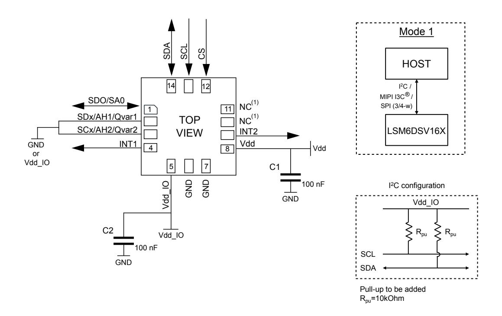

## 1. Leave pin electrically unconnected and soldered to PCB.

The device core is supplied through the Vdd line. Power supply decoupling capacitors (C1, C2 = 100 nF ceramic) should be placed as near as possible to the supply pin of the device (common design practice).

The functionality of the device and the measured acceleration/angular rate data is selectable and accessible through the SPI/I²C/MIPI I3C® interface.

The functions, the threshold, and the timing of the two interrupt pins for each sensor can be completely programmed by the user through the SPI/I²C/MIPI I3C® interface.

Figure 29. Qvar external connections to pin 2, 3 (Qvar input)

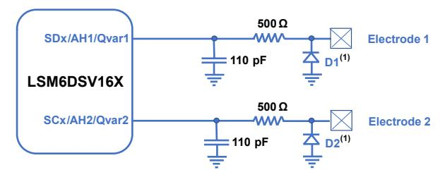

(1) ST ESDALCL5-1BM2 is referenced as an ST catalog product but similar features of other ESD diodes also can be used.

Note: Figure 29 provides an example of a test circuit. For a specific application, refer to the related application note.

DS13510 - Rev 4 page 47/198

<span id="page-47-0"></span>

## 7.2 LSM6DSV16X electrical connections in mode 2

Mode 2 HOST I<sup>2</sup>C / MIPI I3C® SPI (3/4-w) NC<sup>(1)</sup> LSM6DSV16X SDO/SA0 NC<sup>(1)</sup> **MSDA TOP** MDRDY/INT2 MSCL **VIEW** INT1 Vdd 4 8 External sensors 7 GND OI pp/ 100 nF I<sup>2</sup>C configuration GND Vdd IO Vdd\_IO 100 nF SCL GND SDA Pull-up to be added R<sub>pu</sub>=10kOhm

Figure 30. LSM6DSV16X electrical connections in mode 2

#### 1. Leave pin electrically unconnected and soldered to PCB.

The device core is supplied through the Vdd line. Power supply decoupling capacitors (C1, C2 = 100 nF ceramic) should be placed as near as possible to the supply pin of the device (common design practice).

The functionality of the device and the measured acceleration/angular rate data is selectable and accessible through the SPI/I²C/MIPI I3C® primary interface.

The functions, the threshold, and the timing of the two interrupt pins for each sensor can be completely programmed by the user through the SPI/I²C/MIPI I3C® primary interface.

DS13510 - Rev 4 page 48/198

<span id="page-48-0"></span>

## 7.3 LSM6DSV16X electrical connections in mode 3

Mode 3 HOST I<sup>2</sup>C MIDLISC® SPI (3/4-w) SDO/SA0 SDO Aux SM6DSV16X OCS\_Aux SDI Aux TOP SPC Aux INT2 **VIEW** For XL and/o INT1 Vdd gyro data 8 Vdd Camera C1 module 100 nF GND 0 GND pp/ GND I<sup>2</sup>C configuration Vdd IO C2 Vdd\_IO 100 nF GND SCL SDA Pull-up to be added R<sub>pu</sub>=10kOhm

Figure 31, LSM6DSV16X electrical connections in mode 3 (auxiliary 3/4-wire SPI)

Note:

When mode 3 is used, the pull-up on pins 10 and 11 can be enabled or disabled (refer to Table 23. Internal pin status). To avoid leakage current, it is not recommended to leave the SPI lines floating (or when the OIS system is off).

The device core is supplied through the Vdd line. Power supply decoupling capacitors (C1, C2 = 100 nF ceramic) should be placed as near as possible to the supply pin of the device (common design practice).

The functionality of the device is selectable and accessible through the SPI/I²C/MIPI I3C® primary interface.

Measured acceleration/angular rate data is selectable and accessible through the SPI/I²C/MIPI I3C® primary interface and auxiliary SPI.

The functions, the threshold, and the timing of the two interrupt pins for each sensor can be completely programmed by the user through the SPI/I²C/MIPI I3C® interface.

Note:

When mode 3 is used, refer to the product application note for the power mode configuration and settings.

DS13510 - Rev 4 page 49/198


<span id="page-49-0"></span>

| pin# | Name              | Mode 1 function                                                                                                                                                         | Mode 2 function                                                                                                             | Mode 3 function                                                                                                               | Pin status mode 1                                                                                            | Pin status mode 2                                                                                            | Pin status mode 3 (1)                                                                                                                                          |
|------|-------------------|-------------------------------------------------------------------------------------------------------------------------------------------------------------------------|-----------------------------------------------------------------------------------------------------------------------------|-------------------------------------------------------------------------------------------------------------------------------|--------------------------------------------------------------------------------------------------------------|--------------------------------------------------------------------------------------------------------------|----------------------------------------------------------------------------------------------------------------------------------------------------------------|
|      | SDO               | SPI 4-wire interface serial<br>data output (SDO)                                                                                                                        | SPI 4-wire interface serial<br>data output (SDO)                                                                            | SPI 4-wire interface serial<br>data output (SDO)                                                                              |                                                                                                              |                                                                                                              |                                                                                                                                                                |
| 1    |                   | I²C least significant bit of<br>the device address (SA0)                                                                                                                | I²C least significant bit of<br>the device address (SA0)                                                                    | I²C least significant bit of<br>the device address (SA0)                                                                      | Default: input without pull-up<br>Pull-up is enabled if bit                                                  | Default: input without pull-up<br>Pull-up is enabled if bit                                                  | Default: input without pull-up<br>Pull-up is enabled if bit                                                                                                    |
|      | SA0               | ® least significant<br>MIPI I3C<br>bit of the static address<br>(SA0)                                                                                                   | ® least significant<br>MIPI I3C<br>bit of the static address<br>(SA0)                                                       | ® least significant<br>MIPI I3C<br>bit of the static address<br>(SA0)                                                         | SDO_PU_EN = 1 in register<br>PIN_CTRL (02h)                                                                  | SDO_PU_EN = 1 in register<br>PIN_CTRL (02h)                                                                  | SDO_PU_EN = 1 in register<br>PIN_CTRL (02h)                                                                                                                    |
| 2    | SDx/AH1/<br>Qvar1 | Connect to Vdd_IO or GND<br>if the analog hub and/or<br>Qvar are disabled.<br>Connect to the analog input<br>or Qvar electrode 1 if the<br>Qvar function is enabled.(2) | I²C serial data master<br>(MSDA)                                                                                            | Auxiliary SPI 3/4-wire<br>interface serial data input<br>(SDI_Aux) and SPI 3-<br>wire serial data output<br>(SDO_Aux)         | Default: input without pull-up<br>Pull-up is enabled if bit<br>SHUB_PU_EN = 1 in register<br>IF_CFG (03h)    | Default: input without pull-up<br>Pull-up is enabled if bit<br>SHUB_PU_EN = 1 in register<br>IF_CFG (03h)    | Default: input without pull-up<br>Pull-up is enabled if bit<br>SHUB_PU_EN = 1 in register<br>IF_CFG (03h)                                                      |
| 3    | SCx/AH2/<br>Qvar2 | Connect to Vdd_IO or GND<br>if the analog hub and/or<br>Qvar are disabled.<br>Connect to the analog input<br>or Qvar electrode 2 if the<br>Qvar function is enabled.(2) | I²C serial clock master<br>(MSCL)                                                                                           | Auxiliary SPI 3/4-wire<br>interface serial port clock<br>(SPC_Aux)                                                            | Default: input without pull-up<br>Pull-up is enabled if bit<br>SHUB_PU_EN = 1 in register<br>IF_CFG (03h)    | Default: input without pull-up<br>Pull-up is enabled if bit<br>SHUB_PU_EN = 1 in register<br>IF_CFG (03h)    | Default: input without pull-up<br>Pull-up is enabled if bit<br>SHUB_PU_EN = 1 in register<br>IF_CFG (03h)                                                      |
| 4    | INT1              | Programmable interrupt 1                                                                                                                                                | Programmable interrupt 1                                                                                                    | Programmable interrupt 1                                                                                                      | Default: output forced to ground                                                                             | Default: output forced to ground                                                                             | Default: output forced to ground                                                                                                                               |
| 5    | Vdd_IO            | Power supply for I/O pins                                                                                                                                               | Power supply for I/O pins                                                                                                   | Power supply for I/O pins                                                                                                     |                                                                                                              |                                                                                                              |                                                                                                                                                                |
| 6    | GND               | 0 V supply                                                                                                                                                              | 0 V supply                                                                                                                  | 0 V supply                                                                                                                    |                                                                                                              |                                                                                                              |                                                                                                                                                                |
| 7    | GND               | 0 V supply                                                                                                                                                              | 0 V supply                                                                                                                  | 0 V supply                                                                                                                    |                                                                                                              |                                                                                                              |                                                                                                                                                                |
| 8    | Vdd               | Power supply                                                                                                                                                            | Power supply                                                                                                                | Power supply                                                                                                                  |                                                                                                              |                                                                                                              |                                                                                                                                                                |
| 9    | INT2              | Programmable interrupt 2<br>(INT2) / Data enabled<br>(DEN)                                                                                                              | Programmable interrupt 2<br>(INT2) / Data enabled<br>(DEN) / I²C master external<br>synchronization signal<br>(MDRDY)       | Programmable interrupt 2<br>(INT2) / Data enabled<br>(DEN)                                                                    | Default: output forced to ground                                                                             | Default: output forced to ground                                                                             | Default: output forced to ground                                                                                                                               |
| 10   | OCS_Aux           | Connect to Vdd_IO or<br>leave unconnected                                                                                                                               | Connect to Vdd_IO or<br>leave unconnected                                                                                   | Auxiliary SPI 3/4-wire<br>interface enabled                                                                                   | Default: input with pull-up<br>Pull-up is disabled if bit<br>OIS_PU_DIS = 1 in register<br>PIN_CTRL (02h)    | Default: input with pull-up<br>Pull-up is disabled if bit<br>OIS_PU_DIS = 1 in register<br>PIN_CTRL (02h)    | Default: input without pull-up<br>(regardless of the value of bit<br>OIS_PU_DIS in register PIN_CTRL<br>(02h)<br>)                                             |
| 11   | SDO_Aux           | Connect to Vdd_IO or<br>leave unconnected                                                                                                                               | Connect to Vdd_IO or<br>leave unconnected                                                                                   | Auxiliary SPI 3-<br>wire interface: leave<br>unconnected / Auxiliary SPI<br>4-wire interface: serial data<br>output (SDO_Aux) | Default: input with pull-up<br>Pull-up is disabled if bit<br>OIS_PU_DIS = 1 in register<br>PIN_CTRL (02h)    | Default: input with pull-up<br>Pull-up is disabled if bit<br>OIS_PU_DIS = 1 in register<br>PIN_CTRL (02h)    | Default: input without pull-up<br>Pull-up is enabled if bit SIM_OIS = 1<br>(Aux_SPI 3-wire) in reg 70h and<br>bit OIS_PU_DIS = 0 in register<br>PIN_CTRL (02h) |
| 12   | CS                | I²C/SPI mode selection<br>(1: SPI idle mode / I²C<br>communication enabled;<br>0: SPI communication<br>mode / I²C disabled)                                             | I²C/SPI mode selection<br>(1: SPI idle mode / I²C<br>communication enabled;<br>0: SPI communication<br>mode / I²C disabled) | I²C/SPI mode selection<br>(1: SPI idle mode / I²C<br>communication enabled;<br>0: SPI communication<br>mode / I²C disabled)   | Default: input with pull-up<br>Pull-up is disabled if bit<br>I2C_I3C_disable = 1 in register<br>IF_CFG (03h) | Default: input with pull-up<br>Pull-up is disabled if bit<br>I2C_I3C_disable = 1 in register<br>IF_CFG (03h) | Default: input with pull-up<br>Pull-up is disabled if bit<br>I2C_I3C_disable = 1 in register<br>IF_CFG (03h)                                                   |

| LS<br>M                    |                  |
|----------------------------|------------------|
| 6D<br>SV<br>16<br>X        |                  |
| el<br>ec<br>tr<br>ic<br>al |                  |
| c<br>on<br>ne<br>ct<br>io  | L<br>S<br>M      |
| ns<br>in<br>m              | 6<br>D<br>S<br>V |
| od<br>e<br>3               | 1<br>6<br>X      |

<span id="page-50-0"></span>

| pin# | Name | Mode 1 function                                                                                                       | Mode 2 function                                                                                                       | Mode 3 function                                                                                                       | Pin status mode 1                                                                                         | Pin status mode 2                                                                                         | Pin status mode 3 (1)                                                                                     |
|------|------|-----------------------------------------------------------------------------------------------------------------------|-----------------------------------------------------------------------------------------------------------------------|-----------------------------------------------------------------------------------------------------------------------|-----------------------------------------------------------------------------------------------------------|-----------------------------------------------------------------------------------------------------------|-----------------------------------------------------------------------------------------------------------|
| 13   | SCL  | I²C/MIPI I3C® serial clock<br>(SCL) / SPI serial port clock<br>(SPC)                                                  | I²C/MIPI I3C® serial clock<br>(SCL) / SPI serial port clock<br>(SPC)                                                  | I²C/MIPI I3C® serial clock<br>(SCL) / SPI serial port clock<br>(SPC)                                                  | Default: input without pull-up                                                                            | Default: input without pull-up                                                                            | Default: input without pull-up                                                                            |
| 14   | SDA  | I²C/MIPI I3C® serial<br>data (SDA) / SPI serial<br>data input (SDI) / 3-wire<br>interface serial data output<br>(SDO) | I²C/MIPI I3C® serial<br>data (SDA) / SPI serial<br>data input (SDI) / 3-wire<br>interface serial data output<br>(SDO) | I²C/MIPI I3C® serial<br>data (SDA) / SPI serial<br>data input (SDI) / 3-wire<br>interface serial data output<br>(SDO) | Default: input without pull-up<br>Pull-up is enabled if bit<br>SDA_PU_EN = 1 in register IF_CFG<br>(03h). | Default: input without pull-up<br>Pull-up is enabled if bit<br>SDA_PU_EN = 1 in register IF_CFG<br>(03h). | Default: input without pull-up<br>Pull-up is enabled if bit<br>SDA_PU_EN = 1 in register IF_CFG<br>(03h). |

- *1. Mode 3 is enabled when the OIS\_XL\_EN bit or the OIS\_G\_EN bit in the [UI\\_CTRL1\\_OIS \(70h\)](#page-105-0) / [SPI2\\_CTRL1\\_OIS \(70h\)](#page-117-0) registers is set to 1.*
- *2. The analog hub and Qvar functions are enabled by setting the AH\_QVAR\_EN bit to 1 in [CTRL7 \(16h\).](#page-69-0)*

Internal pull-up value is from 30 kΩ to 50 kΩ, depending on Vdd\_IO.


<span id="page-51-0"></span>

# **8 Register mapping**

The table given below provides a list of the 8/16-bit registers embedded in the device and the corresponding addresses.

All these registers are accessible from the primary SPI/I²C/MIPI I3C® interface only.

**Table 24. Registers address map**

|                  |      |       | Register address |          |          |
|------------------|------|-------|------------------|----------|----------|
| Name             | Type | Hex   | Binary           | Default  | Comment  |
| FUNC_CFG_ACCESS  | R/W  | 01    | 00000001         | 00000000 |          |
| PIN_CTRL         | R/W  | 02    | 00000010         | 00100011 |          |
| IF_CFG           | R/W  | 03    | 00000011         | 00000000 |          |
| RESERVED         | -    | 04-05 |                  |          |          |
| ODR_TRIG_CFG     | R/W  | 06    | 00000110         | 00000000 |          |
| FIFO_CTRL1       | R/W  | 07    | 00000111         | 00000000 |          |
| FIFO_CTRL2       | R/W  | 08    | 00001000         | 00000000 |          |
| FIFO_CTRL3       | R/W  | 09    | 00001001         | 00000000 |          |
| FIFO_CTRL4       | R/W  | 0A    | 00001010         | 00000000 |          |
| COUNTER_BDR_REG1 | R/W  | 0B    | 00001011         | 00000000 |          |
| COUNTER_BDR_REG2 | R/W  | 0C    | 00001100         | 00000000 |          |
| INT1_CTRL        | R/W  | 0D    | 00001101         | 00000000 |          |
| INT2_CTRL        | R/W  | 0E    | 00001110         | 00000000 |          |
| WHO_AM_I         | R    | 0F    | 00001111         | 01110000 | R (SPI2) |
| CTRL1            | R/W  | 10    | 00010000         | 00000000 | R (SPI2) |
| CTRL2            | R/W  | 11    | 00010001         | 00000000 | R (SPI2) |
| CTRL3            | R/W  | 12    | 00010010         | 01000100 | R (SPI2) |
| CTRL4            | R/W  | 13    | 00010011         | 00000000 | R (SPI2) |
| CTRL5            | R/W  | 14    | 00010100         | 00000000 | R (SPI2) |
| CTRL6            | R/W  | 15    | 00010101         | 00000000 | R (SPI2) |
| CTRL7            | R/W  | 16    | 00010110         | 00000000 | R (SPI2) |
| CTRL8            | R/W  | 17    | 0001 0111        | 00000000 | R (SPI2) |
| CTRL9            | R/W  | 18    | 00011000         | 00000000 | R (SPI2) |
| CTRL10           | R/W  | 19    | 00011001         | 00000000 | R (SPI2) |
| CTRL_STATUS      | R    | 1A    | 00011010         | output   |          |
| FIFO_STATUS1     | R    | 1B    | 00011011         | output   |          |
| FIFO_STATUS2     | R    | 1C    | 00011100         | output   |          |
| ALL_INT_SRC      | R    | 1D    | 00011101         | output   |          |
| STATUS_REG       | R    | 1E    | 00011110         | output   |          |
| RESERVED         | -    | 1F    |                  |          |          |
| OUT_TEMP_L       | R    | 20    | 00100000         | output   |          |
| OUT_TEMP_H       | R    | 21    | 00100001         | output   |          |
| OUTX_L_G         | R    | 22    | 00100010         | output   |          |
| OUTX_H_G         | R    | 23    | 00100011         | output   |          |

**DS13510** - **Rev 4 page 52/198**


|                              |      |       | Register address |         |          |
|------------------------------|------|-------|------------------|---------|----------|
| Name                         | Type | Hex   | Binary           | Default | Comment  |
| OUTY_L_G                     | R    | 24    | 00100100         | output  |          |
| OUTY_H_G                     | R    | 25    | 00100101         | output  |          |
| OUTZ_L_G                     | R    | 26    | 00100110         | output  |          |
| OUTZ_H_G                     | R    | 27    | 00100111         | output  |          |
| OUTX_L_A                     | R    | 28    | 00101000         | output  |          |
| OUTX_H_A                     | R    | 29    | 00101001         | output  |          |
| OUTY_L_A                     | R    | 2A    | 00101010         | output  |          |
| OUTY_H_A                     | R    | 2B    | 00101011         | output  |          |
| OUTZ_L_A                     | R    | 2C    | 00101100         | output  |          |
| OUTZ_H_A                     | R    | 2D    | 00101101         | output  |          |
| UI_OUTX_L_G_OIS_EIS          | R    | 2E    | 00101110         | output  |          |
| UI_OUTX_H_G_OIS_EIS          | R    | 2F    | 00101111         | output  |          |
| UI_OUTY_L_G_OIS_EIS          | R    | 30    | 00110000         | output  |          |
| UI_OUTY_H_G_OIS_EIS          | R    | 31    | 00110001         | output  |          |
| UI_OUTZ_L_G_OIS_EIS          | R    | 32    | 00110010         | output  |          |
| UI_OUTZ_H_G_OIS_EIS          | R    | 33    | 00110011         | output  |          |
| UI_OUTX_L_A_OIS_DualC        | R    | 34    | 00110100         | output  |          |
| UI_OUTX_H_A_OIS_DualC        | R    | 35    | 00110101         | output  |          |
| UI_OUTY_L_A_OIS_DualC        | R    | 36    | 00110110         | output  |          |
| UI_OUTY_H_A_OIS_DualC        | R    | 37    | 00110111         | output  |          |
| UI_OUTZ_L_A_OIS_DualC        | R    | 38    | 00111000         | output  |          |
| UI_OUTZ_H_A_OIS_DualC        | R    | 39    | 00111001         | output  |          |
| AH_QVAR_OUT_L                | R    | 3A    | 00111010         | output  |          |
| AH_QVAR_OUT_H                | R    | 3B    | 00111011         | output  |          |
| RESERVED                     | -    | 3C-3F |                  |         |          |
| TIMESTAMP0                   | R    | 40    | 01000000         | output  | R (SPI2) |
| TIMESTAMP1                   | R    | 41    | 01000001         | output  | R (SPI2) |
| TIMESTAMP2                   | R    | 42    | 01000010         | output  | R (SPI2) |
| TIMESTAMP3                   | R    | 43    | 01000011         | output  | R (SPI2) |
| UI_STATUS_REG_OIS            | R    | 44    | 01000100         | output  |          |
| WAKE_UP_SRC                  | R    | 45    | 01000101         | output  |          |
| TAP_SRC                      | R    | 46    | 01000110         | output  |          |
| D6D_SRC                      | R    | 47    | 01000111         | output  |          |
| STATUS_MASTER_<br>MAINPAGE   | R    | 48    | 01001000         | output  |          |
| EMB_FUNC_STATUS_<br>MAINPAGE | R    | 49    | 01001001         | output  |          |
| FSM_STATUS_MAINPAGE          | R    | 4A    | 01001010         | output  |          |
| MLC_STATUS_MAINPAGE          | R    | 4B    | 01001011         | output  |          |
| RESERVED                     | -    | 4C-4E |                  |         |          |
| INTERNAL_FREQ_FINE           | R    | 4F    | 01001111         | output  |          |

**DS13510** - **Rev 4 page 53/198**


|                                                                                  |                                                                  |         | Register address |          |         |
|----------------------------------------------------------------------------------|------------------------------------------------------------------|---------|------------------|----------|---------|
| Name                                                                             | Type                                                             | Hex     | Binary           | Default  | Comment |
| FUNCTIONS_ENABLE                                                                 | RW                                                               | 50      | 01010000         | 00000000 |         |
| DEN                                                                              | R/W                                                              | 51      | 01010001         | 00001110 |         |
| INACTIVITY_DUR                                                                   | R/W                                                              | 54      | 01010100         | 00000100 |         |
| INACTIVITY_THS                                                                   | R/W                                                              | 55      | 01010101         | 00000000 |         |
| TAP_CFG0                                                                         | R/W                                                              | 56      | 01010110         | 00000000 |         |
| TAP_CFG1                                                                         | R/W                                                              | 57      | 01010111         | 00000000 |         |
| TAP_CFG2                                                                         | R/W                                                              | 58      | 01011000         | 00000000 |         |
| TAP_THS_6D                                                                       | R/W                                                              | 59      | 01011001         | 00000000 |         |
| TAP_DUR                                                                          | R/W                                                              | 5A      | 01011010         | 00000000 |         |
| WAKE_UP_THS                                                                      | R/W                                                              | 5B      | 01011011         | 00000000 |         |
| WAKE_UP_DUR                                                                      | R/W                                                              | 5C      | 01011100         | 00000000 |         |
| FREE_FALL                                                                        | R/W                                                              | 5D      | 01011101         | 00000000 |         |
| MD1_CFG                                                                          | R/W                                                              | 5E      | 01011110         | 00000000 |         |
| MD2_CFG                                                                          | R/W                                                              | 5F      | 01011111         | 00000000 |         |
| RESERVED                                                                         | -                                                                | 60-61   |                  |          |         |
| HAODR_CFG                                                                        | R/W                                                              | 62      | 01100010         | 00000000 |         |
| EMB_FUNC_CFG                                                                     | R/W                                                              | 63      | 01100011         | 00000000 |         |
| UI_HANDSHAKE_CTRL                                                                | R/W                                                              | 64      | 01100100         | 00000000 |         |
| UI_SPI2_SHARED_0                                                                 | R/W                                                              | 65      | 01100101         | 00000000 |         |
| UI_SPI2_SHARED_1                                                                 | R/W                                                              | 66      | 01100110         | 00000000 |         |
| UI_SPI2_SHARED_2                                                                 | R/W                                                              | 67      | 01100111         | 00000000 |         |
| UI_SPI2_SHARED_3                                                                 | R/W                                                              | 68      | 01101000         | 00000000 |         |
| UI_SPI2_SHARED_4                                                                 | R/W                                                              | 69      | 01101001         | 00000000 |         |
| UI_SPI2_SHARED_5                                                                 | R/W                                                              | 6A      | 01101010         | 00000000 |         |
| CTRL_EIS                                                                         | R/W                                                              | 6B      | 01101011         | 00000000 |         |
| RESERVED                                                                         | -                                                                | 6C - 6E |                  |          |         |
| UI_INT_OIS                                                                       | R (SPI2 full-control mode)<br>R/W (primary IF full-control mode) | 6F      | 01101111         | 00000000 |         |
| UI_CTRL1_OIS                                                                     | R (SPI2 full-control mode)<br>R/W (primary IF full-control mode) | 70      | 01110000         | 00000000 |         |
| UI_CTRL2_OIS                                                                     | R (SPI2 full-control mode)<br>R/W (primary IF full-control mode) | 71      | 01110001         | 00000000 |         |
| R (SPI2 full-control mode)<br>UI_CTRL3_OIS<br>R/W (primary IF full-control mode) |                                                                  | 72      | 01110010         | 00000000 |         |
| X_OFS_USR                                                                        | R/W                                                              | 73      | 01110011         | 00000000 |         |
| Y_OFS_USR                                                                        | R/W                                                              | 74      | 01110100         | 00000000 |         |
| Z_OFS_USR                                                                        | R/W                                                              | 75      | 01110101         | 00000000 |         |
| RESERVED                                                                         | -                                                                | 76-77   |                  |          |         |
| FIFO_DATA_OUT_TAG                                                                | R                                                                | 78      | 01111000         | output   |         |
| FIFO_DATA_OUT_X_L                                                                | R                                                                | 79      | 01111001         | output   |         |

**DS13510** - **Rev 4 page 54/198**


|                   |      | Register address |          |         |         |
|-------------------|------|------------------|----------|---------|---------|
| Name              | Type | Hex              | Binary   | Default | Comment |
| FIFO_DATA_OUT_X_H | R    | 7A               | 01111010 | output  |         |
| FIFO_DATA_OUT_Y_L | R    | 7B               | 01111011 | output  |         |
| FIFO_DATA_OUT_Y_H | R    | 7C               | 01111100 | output  |         |
| FIFO_DATA_OUT_Z_L | R    | 7D               | 01111101 | output  |         |
| FIFO_DATA_OUT_Z_H | R    | 7E               | 01111110 | output  |         |

Reserved registers must not be changed. Writing to those registers may cause permanent damage to the device. The content of the registers that are loaded at boot should not be changed. They contain the factory calibration values. Their content is automatically restored when the device is powered up.

**DS13510** - **Rev 4 page 55/198**

<span id="page-55-0"></span>

# 9 Register description

The device contains a set of registers which are used to control its behavior and to retrieve linear acceleration, angular rate, temperature, analog hub and Qvar data. The register addresses, made up of 7 bits, are used to identify them and to write the data through the serial interface.

# 9.1 FUNC\_CFG\_ACCESS (01h)

Enable embedded functions register (R/W)

## Table 25. FUNC\_CFG\_ACCESS register

| E  | MB_FUNC_ | SHUB_REG | 0(1) | 0(1) | FSM_WR_ | SW POR | SPI2 RESET | OIS_CTRL |
|----|----------|----------|------|------|---------|--------|------------|----------|
| RE | G_ACCESS | _ACCESS  | 0(.) | 0(.7 | CTRL_EN | SW_FOR | SFIZ_RESET | _FROM_UI |

<sup>1.</sup> This bit must be set to 0 for the correct operation of the device.

## Table 26. FUNC\_CFG\_ACCESS register description

| EMB_FUNC_REG_ACCESS | Enables access to the embedded functions configuration registers. (1)  Default value: 0                                                                                                                           |
|---------------------|-------------------------------------------------------------------------------------------------------------------------------------------------------------------------------------------------------------------|
| SHUB_REG_ACCESS     | Enables access to the sensor hub (I²C master) configuration registers. (2) Default value: 0                                                                                                                       |
| FSM_WR_CTRL_EN      | Enables the control of the CTRL registers to FSM (FSM can change some configurations of the device autonomously). Default value: 0 (0: disabled; 1: enabled)                                                      |
| SW_POR              | Global reset of the device. Default value: 0                                                                                                                                                                      |
| SPI2_RESET          | Resets the control registers of SPI2 from the primary interface. This bit must be set to 1 and then back to 0 (this bit is not automatically cleared). Default value: 0                                           |
| OIS_CTRL_FROM_UI    | Enables the full control of OIS configurations from the primary interface. Default value: 0 (0: OIS chain full control from primary interface disabled; 1: OIS chain full control from primary interface enabled) |

<sup>1.</sup> Details concerning the embedded functions configuration registers are available in Section 12 Embedded functions register mapping and Section 13 Embedded functions register description.

DS13510 - Rev 4 page 56/198

<sup>2.</sup> Details concerning the sensor hub registers are available in Section 16 Sensor hub register mapping and Section 17 Sensor hub register description.

**PIN\_CTRL (02h)**

<span id="page-56-0"></span>

# **9.2 PIN\_CTRL (02h)**

SDO, OCS\_Aux, SDO\_Aux pins pull-up register (R/W). This register is not reset during the software reset procedure (see bit 0 of the [CTRL3 \(12h\)](#page-66-0) register).

### **Table 27. PIN\_CTRL register**

| OIS_   | SDO_  | IBHR_  | (1) | (1) | (1) | (2) | (2) |
|--------|-------|--------|-----|-----|-----|-----|-----|
| PU_DIS | PU_EN | POR_EN | 0   | 0   | 0   | 1   | 1   |

*<sup>1.</sup> This bit must be set to 0 for the correct operation of the device.*

#### **Table 28. PIN\_CTRL register description**

|             | Disables pull-up on both OCS_Aux and SDO_Aux pins (for mode 1 and mode 2). For further details about<br>the configuration of the pull-up resistors in mode 3, refer to Table 23. Default value: 0 |
|-------------|---------------------------------------------------------------------------------------------------------------------------------------------------------------------------------------------------|
| OIS_PU_DIS  | (0: OCS_Aux and SDO_Aux pins with pull-up;                                                                                                                                                        |
|             | 1: OCS_Aux and SDO_Aux pins pull-up disconnected)                                                                                                                                                 |
|             | Enables pull-up on SDO pin. For details, refer to Table 23. Default value: 0                                                                                                                      |
| SDO_PU_EN   | (0: SDO pin pull-up disconnected; 1: SDO pin with pull-up)                                                                                                                                        |
|             | Selects the action the device performs after "reset whole chip" I3C pattern. Default value: 1                                                                                                     |
| IBHR_POR_EN | (0: configuration reset (SW reset + dynamic address reset);                                                                                                                                       |
|             | (1: global reset (POR reset))                                                                                                                                                                     |

**DS13510** - **Rev 4 page 57/198**

*<sup>2.</sup> This bit must be set to 1 for the correct operation of the device.*


<span id="page-57-0"></span>

# **9.3 IF\_CFG (03h)**

Interface configuration register (R/W). This register is not reset during the software reset procedure (see bit 0 of the [CTRL3 \(12h\)](#page-66-0) register).

### **Table 29. IF\_CFG register**

| SHUB_<br>SDA_PU_EN<br>PU_EN | ASF_CTRL | H_LACTIVE | PP_OD | SIM | (1)<br>0 | I2C_I3C_<br>disable |
|-----------------------------|----------|-----------|-------|-----|----------|---------------------|
|-----------------------------|----------|-----------|-------|-----|----------|---------------------|

*<sup>1.</sup> This bit must be set to 0 for the correct operation of the device.*

## **Table 30. IF\_CFG register description**

|                 | Enables pull-up on SDA pin. Default value: 0                                                   |
|-----------------|------------------------------------------------------------------------------------------------|
| SDA_PU_EN       | (0: SDA pin pull-up disconnected;                                                              |
|                 | 1: SDA pin with pull-up)                                                                       |
|                 | Enables master I²C pull-up. Default value: 0                                                   |
| SHUB_PU_EN      | (0: internal pull-up on auxiliary I²C line disabled;                                           |
|                 | 1: internal pull-up on auxiliary I²C line enabled)                                             |
|                 | Enables anti-spike filters. Default value: 0                                                   |
| ASF_CTRL        | (0: anti-spike filters are managed by the protocol and turned off after the broadcast address; |
|                 | 1: anti-spike filters on SCL and SDA lines are always enabled)                                 |
|                 | Interrupt activation level. Default value: 0                                                   |
| H_LACTIVE       | (0: interrupt output pins active high;                                                         |
|                 | 1: interrupt output pins active low)                                                           |
|                 | Push-pull/open-drain selection on INT1 and INT2 pins. Default value: 0                         |
| PP_OD           | (0: push-pull mode;                                                                            |
|                 | 1: open-drain mode)                                                                            |
|                 | SPI serial interface mode selection. Default value: 0                                          |
| SIM             | (0: 4-wire interface;                                                                          |
|                 | 1: 3-wire interface)                                                                           |
|                 | Disables I²C and MIPI I3C® interfaces. Default value: 0                                        |
| I2C_I3C_disable | (0: SPI, I²C and MIPI I3C® interfaces enabled;                                                 |
|                 | 1: I²C and MIPI I3C® interfaces disabled)                                                      |
|                 |                                                                                                |

## **9.4 ODR\_TRIG\_CFG (06h)**

ODR-triggered mode configuration register (R/W)

#### **Table 31. ODR\_TRIG\_CFG register**

| ODR_TRIG_ | ODR_TRIG_ | ODR_TRIG_ | ODR_TRIG_ | ODR_TRIG_ | ODR_TRIG_ | ODR_TRIG_ | ODR_TRIG_ |
|-----------|-----------|-----------|-----------|-----------|-----------|-----------|-----------|
| NODR_7    | NODR_6    | NODR_5    | NODR_4    | NODR_3    | NODR_2    | NODR_1    | NODR_0    |

#### **Table 32. ODR\_TRIG\_CFG register description**

| ODR_TRIG_NODR_[7:0] | When ODR-triggered mode is set, these bits are used to define the number of data generated in<br>the reference period. |  |
|---------------------|------------------------------------------------------------------------------------------------------------------------|--|
|                     | Allowed values for ODR_TRIG_NODR_[7:0] are 0 (default) and values in the range from 4 to 255.                          |  |

**DS13510** - **Rev 4 page 58/198**

<span id="page-58-0"></span>

# **9.5 FIFO\_CTRL1 (07h)**

FIFO control register 1 (R/W)

### **Table 33. FIFO\_CTRL1 register**

|  |  | WTM_7 | WTM_6 | WTM_5 | WTM_4 | WTM_3 | WTM_2 | WTM_1 | WTM_0 |
|--|--|-------|-------|-------|-------|-------|-------|-------|-------|
|--|--|-------|-------|-------|-------|-------|-------|-------|-------|

## **Table 34. FIFO\_CTRL1 register description**

|           | FIFO watermark threshold: 1 LSB = TAG (1 byte) + 1 sensor (6 bytes) written in FIFO.                               |
|-----------|--------------------------------------------------------------------------------------------------------------------|
| WTM_[7:0] | Watermark flag rises when the number of bytes written in the FIFO is greater than or equal to the threshold level. |

# **9.6 FIFO\_CTRL2 (08h)**

FIFO control register 2 (R/W)

## **Table 35. FIFO\_CTRL2 register**

| STOP_ON | FIFO_COMPR | (1) | ODR_CHG | (1) | UNCOMPR | UNCOMPR | XL_DualC_BATCH |
|---------|------------|-----|---------|-----|---------|---------|----------------|
| _WTM    | _RT_EN     | 0   | _EN     | 0   | _RATE_1 | _RATE_0 | _FROM_FSM      |

*1. This bit must be set to 0 for the correct operation of the device.*

## **Table 36. FIFO\_CTRL2 register description**

| STOP_ON_WTM             | Sensing chain FIFO stop values memorization at threshold level. Default value: 0<br>(0: FIFO depth is not limited;                                               |
|-------------------------|------------------------------------------------------------------------------------------------------------------------------------------------------------------|
|                         | 1: FIFO depth is limited to threshold level, defined in FIFO_CTRL1 (07h))                                                                                        |
|                         | Enables/disables compression algorithm runtime. Default value: 0                                                                                                 |
| FIFO_COMPR_RT_EN(1)     | (0: FIFO compression algorithm disabled;                                                                                                                         |
|                         | 1: FIFO compression algorithm enabled)                                                                                                                           |
|                         | Enables ODR CHANGE virtual sensor to be batched in FIFO. Default value: 0                                                                                        |
|                         | (0: ODR CHANGE virtual sensor not batched in FIFO;                                                                                                               |
| ODR_CHG_EN              | 1: ODR CHANGE virtual sensor batched in FIFO)                                                                                                                    |
|                         | Note: Refer to the product application note for the details regarding operating/power mode<br>configurations, settings, turn-on/off time and on-the-fly changes. |
|                         | This field configures the compression algorithm to write uncompressed data at each rate.                                                                         |
|                         | (0: uncompressed data writing is not forced (default);                                                                                                           |
| UNCOMPR_RATE_[1:0]      | 1: uncompressed data every 8 batch data rate;                                                                                                                    |
|                         | 2: uncompressed data every 16 batch data rate;                                                                                                                   |
|                         | 3: uncompressed data every 32 batch data rate)                                                                                                                   |
| XL_DualC_BATCH_FROM_FSM | When dual-channel mode is enabled, this bit enables FSM-triggered batching in FIFO of<br>accelerometer channel 2. Default value: 0                               |
|                         | (0: disabled; 1: enabled)                                                                                                                                        |

*1. This bit is activated if the FIFO\_COMPR\_EN bit of [EMB\\_FUNC\\_EN\\_B \(05h\)](#page-123-0) is set to 1.*

**DS13510** - **Rev 4 page 59/198**

<span id="page-59-0"></span>

# **9.7 FIFO\_CTRL3 (09h)**

FIFO control register 3 (R/W)

## **Table 37. FIFO\_CTRL3 register**

**Table 38. FIFO\_CTRL3 register description**

```
BDR_GY_[3:0]
                       Selects batch data rate (write frequency in FIFO) for gyroscope data.
                       (0000: gyroscope not batched in FIFO (default);
                       0001: 1.875 Hz;
                       0010: 7.5 Hz;
                       0011: 15 Hz;
                       0100: 30 Hz;
                       0101: 60 Hz;
                       0110: 120 Hz;
                       0111: 240 Hz;
                       1000: 480 Hz;
                       1001: 960 Hz;
                       1010: 1.92 kHz;
                       1011: 3.84 kHz;
                       1100: 7.68 kHz
                       1101-1111: reserved)
BDR_XL_[3:0]
                       Selects batch data rate (write frequency in FIFO) for accelerometer data.
                       (0000: accelerometer not batched in FIFO (default);
                       0001: 1.875 Hz;
                       0010: 7.5 Hz;
                       0011: 15 Hz;
                       0100: 30 Hz;
                       0101: 60 Hz;
                       0110: 120 Hz;
                       0111: 240 Hz;
                       1000: 480 Hz;
                       1001: 960 Hz;
                       1010: 1.92 kHz;
                       1011: 3.84 kHz;
                       1100: 7.68 kHz
                       1101-1111: reserved)
```

**DS13510** - **Rev 4 page 60/198**

<span id="page-60-0"></span>

# **9.8 FIFO\_CTRL4 (0Ah)**

FIFO control register 4 (R/W)

### **Table 39. FIFO\_CTRL4 register**

| DEC_TS_ | DEC_TS_ | ODR_T_  | ODR_T_  | G_EIS_  | FIFO_  | FIFO_  | FIFO_  |  |
|---------|---------|---------|---------|---------|--------|--------|--------|--|
| BATCH_1 | BATCH_0 | BATCH_1 | BATCH_0 | FIFO_EN | MODE_2 | MODE_1 | MODE_0 |  |

### **Table 40. FIFO\_CTRL4 register description**

| DEC_TS_BATCH_[1:0] | Selects decimation for timestamp batching in FIFO. Write rate is the maximum rate between the<br>accelerometer and gyroscope BDR divided by decimation decoder.<br>(00: timestamp not batched in FIFO (default);<br>01: decimation 1: max(BDR_XL[Hz],BDR_GY[Hz]) [Hz];<br>10: decimation 8: max(BDR_XL[Hz],BDR_GY[Hz])/8 [Hz]; |
|--------------------|--------------------------------------------------------------------------------------------------------------------------------------------------------------------------------------------------------------------------------------------------------------------------------------------------------------------------------|
|                    | 11: decimation 32: max(BDR_XL[Hz],BDR_GY[Hz])/32 [Hz])                                                                                                                                                                                                                                                                         |
|                    | Selects batch data rate (write frequency in FIFO) for temperature data                                                                                                                                                                                                                                                         |
| ODR_T_BATCH_[1:0]  | (00: temperature not batched in FIFO (default);                                                                                                                                                                                                                                                                                |
|                    | 01: 1.875 Hz;                                                                                                                                                                                                                                                                                                                  |
|                    | 10: 15 Hz;                                                                                                                                                                                                                                                                                                                     |
|                    | 11: 60 Hz)                                                                                                                                                                                                                                                                                                                     |
|                    | Enables FIFO batching of enhanced EIS gyroscope output values. Default value: 0                                                                                                                                                                                                                                                |
| G_EIS_FIFO_EN      | (0: disabled; 1: enabled)                                                                                                                                                                                                                                                                                                      |
|                    | FIFO mode selection                                                                                                                                                                                                                                                                                                            |
|                    | (000: bypass mode: FIFO disabled (default);                                                                                                                                                                                                                                                                                    |
|                    | 001: FIFO mode: stops collecting data when FIFO is full;                                                                                                                                                                                                                                                                       |
|                    | 010: continuousWTM-to-full mode: continuous mode with FIFO watermark size until trigger is<br>deasserted, then data are stored in FIFO until the buffer is full;                                                                                                                                                               |
| FIFO_MODE_[2:0]    | 011: continuous-to-FIFO mode: continuous mode until trigger is deasserted, then FIFO mode;                                                                                                                                                                                                                                     |
|                    | 100: bypass-to-continuous mode: bypass mode until trigger is deasserted, then continuous mode;                                                                                                                                                                                                                                 |
|                    | 101: reserved;                                                                                                                                                                                                                                                                                                                 |
|                    | 110: continuous mode: if the FIFO is full, the new sample overwrites the older one;                                                                                                                                                                                                                                            |
|                    | 111: bypass-to-FIFO mode: bypass mode until trigger is deasserted, then FIFO mode.)                                                                                                                                                                                                                                            |

**DS13510** - **Rev 4 page 61/198**

<span id="page-61-0"></span>

# **9.9 COUNTER\_BDR\_REG1 (0Bh)**

Counter batch data rate register 1 (R/W)

### **Table 41. COUNTER\_BDR\_REG1 register**

| (1) | TRIG_COUN | TRIG_COUN | (1) | (1) | (1) | CNT_     | CNT_     |
|-----|-----------|-----------|-----|-----|-----|----------|----------|
| 0   | TER_BDR_1 | TER_BDR_0 | 0   | 0   | 0   | BDR_TH_9 | BDR_TH_8 |

*<sup>1.</sup> This bit must be set to 0 for the correct operation of the device.*

#### **Table 42. COUNTER\_BDR\_REG1 register description**

| TRIG_COUNTER_BDR_[1:0] | Selects the trigger for the internal counter of batch events between the accelerometer,<br>gyroscope and EIS gyroscope.<br>(00: accelerometer batch event;<br>01: gyroscope batch event;<br>10 – 11: gyroscope EIS batch event)                                 |
|------------------------|-----------------------------------------------------------------------------------------------------------------------------------------------------------------------------------------------------------------------------------------------------------------|
| CNT_BDR_TH_[9:8]       | In conjunction with CNT_BDR_TH_[7:0] in COUNTER_BDR_REG2 (0Ch), sets the threshold<br>for the internal counter of batch events. When this counter reaches the threshold, the counter<br>is reset and the COUNTER_BDR_IA flag in FIFO_STATUS2 (1Ch) is set to 1. |

# **9.10 COUNTER\_BDR\_REG2 (0Ch)**

Counter batch data rate register 2 (R/W)

#### **Table 43. COUNTER\_BDR\_REG2 register**

| CNT_     | CNT_     | CNT_     | CNT_     | CNT_     | CNT_     | CNT_     | CNT_     |
|----------|----------|----------|----------|----------|----------|----------|----------|
| BDR_TH_7 | BDR_TH_6 | BDR_TH_5 | BDR_TH_4 | BDR_TH_3 | BDR_TH_2 | BDR_TH_1 | BDR_TH_0 |

#### **Table 44. COUNTER\_BDR\_REG2 register description**

|                  | In conjunction with CNT_BDR_TH_[9:8] in COUNTER_BDR_REG1 (0Bh), sets the threshold for the              |
|------------------|---------------------------------------------------------------------------------------------------------|
| CNT_BDR_TH_[7:0] | internal counter of batch events. When this counter reaches the threshold, the counter is reset and the |
|                  | COUNTER_BDR_IA flag in FIFO_STATUS2 (1Ch) is set to 1.                                                  |

**DS13510** - **Rev 4 page 62/198**

<span id="page-62-0"></span>

# **9.11 INT1\_CTRL (0Dh)**

INT1 pin control register (R/W)

Each bit in this register enables a signal to be carried over INT1 when the MIPI I3C® dynamic address is not assigned (I²C or SPI is used). Some bits can be also used to trigger an IBI (in-band interrupt) when the MIPI I3C® interface is used. The output of the pin is the OR combination of the signals selected here and in [MD1\\_CFG](#page-98-0) [\(5Eh\)](#page-98-0).

#### **Table 45. INT1\_CTRL register**

| (1) | INT1_   | INT1_     | INT1_    | INT1_   | (1) | INT1_  | INT1_   |
|-----|---------|-----------|----------|---------|-----|--------|---------|
| 0   | CNT_BDR | FIFO_FULL | FIFO_OVR | FIFO_TH | 0   | DRDY_G | DRDY_XL |

*<sup>1.</sup> This bit must be set to 0 for the correct operation of the device.*

#### **Table 46. INT1\_CTRL register description**

| INT1_CNT_BDR   | Enables COUNTER_BDR_IA interrupt on INT1 pin. Default value: 0                                                                                          |
|----------------|---------------------------------------------------------------------------------------------------------------------------------------------------------|
| INT1_FIFO_FULL | Enables FIFO full flag interrupt on INT1 pin. It can be also used to trigger an IBI when the MIPI I3C®<br>interface is used. Default value: 0           |
| INT1_FIFO_OVR  | Enables FIFO overrun interrupt on INT1 pin. It can be also used to trigger an IBI when the MIPI<br>I3C® interface is used. Default value: 0             |
| INT1_FIFO_TH   | Enables FIFO threshold interrupt on INT1 pin. It can be also used to trigger an IBI when the MIPI<br>I3C® interface is used. Default value: 0           |
| INT1_DRDY_G    | Enables gyroscope data-ready interrupt on INT1 pin. It can be also used to trigger an IBI when the MIPI<br>I3C® interface is used. Default value: 0     |
| INT1_DRDY_XL   | Enables accelerometer data-ready interrupt on INT1 pin. It can be also used to trigger an IBI when the<br>MIPI I3C® interface is used. Default value: 0 |

**DS13510** - **Rev 4 page 63/198**

<span id="page-63-0"></span>

# **9.12 INT2\_CTRL (0Eh)**

INT2 pin control register (R/W)

Each bit in this register enables a signal to be carried over INT2 when the MIPI I3C® dynamic address is not assigned (I²C or SPI is used). Some bits can be also used to trigger an IBI when the MIPI I3C® interface is used. The output of the pin is the OR combination of the signals selected here and in [MD2\\_CFG \(5Fh\)](#page-99-0).

### **Table 47. INT2\_CTRL register**

| INT2_EMB_  | INT2_   | INT2_     | INT2_    | INT2_   | INT2_      | INT2_  | INT2_   |
|------------|---------|-----------|----------|---------|------------|--------|---------|
| FUNC_ENDOP | CNT_BDR | FIFO_FULL | FIFO_OVR | FIFO_TH | DRDY_G_EIS | DRDY_G | DRDY_XL |

#### **Table 48. INT2\_CTRL register description**

| INT2_EMB_FUNC_ENDOP | Enables routing the embedded functions end of operations signal to the INT2 pin.<br>Default value: 0 |
|---------------------|------------------------------------------------------------------------------------------------------|
| INT2_CNT_BDR        | Enables COUNTER_BDR_IA interrupt on INT2. Default value: 0                                           |
| INT2_FIFO_FULL      | Enables FIFO full flag interrupt on INT2 pin.Default value: 0                                        |
| INT2_FIFO_OVR       | Enables FIFO overrun interrupt on INT2 pin. Default value: 0                                         |
| INT2_FIFO_TH        | Enables FIFO threshold interrupt on INT2 pin. Default value: 0                                       |
| INT2_DRDY_G_EIS     | Enables gyroscope EIS data-ready interrupt on INT2 pin. Default value: 0                             |
| INT2_DRDY_G         | Gyroscope data-ready interrupt on INT2 pin. Default value: 0                                         |
| INT2_DRDY_XL        | Accelerometer data-ready interrupt on INT2 pin. Default value: 0                                     |

# **9.13 WHO\_AM\_I (0Fh)**

WHO\_AM\_I register (R). This is a read-only register. Its value is fixed at 70h.

#### **Table 49. WhoAmI register**

|  |  | 0 | 1 | 1 | 1 | 0 | 0 | 0 | 0 |
|--|--|---|---|---|---|---|---|---|---|
|--|--|---|---|---|---|---|---|---|---|

**DS13510** - **Rev 4 page 64/198**

<span id="page-64-0"></span>

# **9.14 CTRL1 (10h)**

Accelerometer control register 1 (R/W)

### **Table 50. CTRL1 register**

| (1)<br>0 | OP_MODE_<br>XL_2 | OP_MODE_<br>XL_1 | OP_MODE_<br>XL_0 | ODR_XL_3 | ODR_XL_2 | ODR_XL_1 | ODR_XL_0 |
|----------|------------------|------------------|------------------|----------|----------|----------|----------|
|----------|------------------|------------------|------------------|----------|----------|----------|----------|

*<sup>1.</sup> This bit must be set to 0 for the correct operation of the device.*

#### **Table 51. CTRL1 register description**

|                  | Accelerometer operating mode selection.    |
|------------------|--------------------------------------------|
|                  | (000: high-performance mode (default);     |
|                  | 001: high-accuracy ODR mode;               |
|                  | 010: reserved;                             |
| OP_MODE_XL_[2:0] | 011: ODR-triggered mode;                   |
|                  | 100: low-power mode 1 (2 mean);            |
|                  | 101: low-power mode 2 (4 mean);            |
|                  | 110: low-power mode 3 (8 mean);            |
|                  | 111: normal mode)                          |
| ODR_XL_[3:0]     | Accelerometer ODR selection (see Table 52) |

**Table 52. Accelerometer ODR selection**

| ODR_XL_3 | ODR_XL_2 | ODR_XL_1 | ODR_XL_0 | ODR selection [Hz]                                |
|----------|----------|----------|----------|---------------------------------------------------|
| 0        | 0        | 0        | 0        | Power-down (default)                              |
| 0        | 0        | 0        | 1        | 1.875 Hz (low-power mode)                         |
| 0        | 0        | 1        | 0        | 7.5 Hz (high-performance, normal mode)            |
| 0        | 0        | 1        | 1        | 15 Hz (low-power, high-performance, normal mode)  |
| 0        | 1        | 0        | 0        | 30 Hz (low-power, high-performance, normal mode)  |
| 0        | 1        | 0        | 1        | 60 Hz (low-power, high-performance, normal mode)  |
| 0        | 1        | 1        | 0        | 120 Hz (low-power, high-performance, normal mode) |
| 0        | 1        | 1        | 1        | 240 Hz (low-power, high-performance, normal mode) |
| 1        | 0        | 0        | 0        | 480 Hz (high-performance, normal mode)            |
| 1        | 0        | 0        | 1        | 960 Hz (high-performance, normal mode)            |
| 1        | 0        | 1        | 0        | 1.92 kHz (high-performance, normal mode)          |
| 1        | 0        | 1        | 1        | 3.84 kHz (high-performance mode)                  |
| 1        | 1        | 0        | 0        | 7.68 kHz (high-performance mode)                  |
|          |          | Others   |          | Reserved                                          |

**DS13510** - **Rev 4 page 65/198**

<span id="page-65-0"></span>

# **9.15 CTRL2 (11h)**

Gyroscope control register 2 (R/W)

### **Table 53. CTRL2 register**

| (1)<br>0 | OP_MODE_<br>G_2 | OP_MODE_<br>G_1 | OP_MODE_<br>G_0 | ODR_G_3 | ODR_G_2 | ODR_G_1 | ODR_G_0 |  |
|----------|-----------------|-----------------|-----------------|---------|---------|---------|---------|--|
|----------|-----------------|-----------------|-----------------|---------|---------|---------|---------|--|

*<sup>1.</sup> This bit must be set to 0 for the correct operation of the device.*

#### **Table 54. CTRL2 register description**

|                 | Gyroscope operating mode selection.    |
|-----------------|----------------------------------------|
|                 | (000: high-performance mode (default); |
|                 | 001: high-accuracy ODR mode;           |
|                 | 010: reserved;                         |
| OP_MODE_G_[2:0] | 011: ODR-triggered mode;               |
|                 | 100: sleep mode;                       |
|                 | 101: low-power mode;                   |
|                 | 110-111: reserved)                     |
|                 | Gyroscope output data rate selection.  |
| ODR_G_[3:0]     | (See Table 55)                         |

**Table 55. Gyroscope ODR selection**

| ODR_G_3 | ODR_G_2 | ODR_G_1 | ODR_G_0 | ODR [Hz]                                  |
|---------|---------|---------|---------|-------------------------------------------|
| 0       | 0       | 0       | 0       | Power-down (default)                      |
| 0       | 0       | 1       | 0       | 7.5 Hz (low-power, high-performance mode) |
| 0       | 0       | 1       | 1       | 15 Hz (low-power, high-performance mode)  |
| 0       | 1       | 0       | 0       | 30 Hz (low-power, high-performance mode)  |
| 0       | 1       | 0       | 1       | 60 Hz (low-power, high-performance mode)  |
| 0       | 1       | 1       | 0       | 120 Hz (low-power, high-performance mode) |
| 0       | 1       | 1       | 1       | 240 Hz (low-power, high-performance mode) |
| 1       | 0       | 0       | 0       | 480 Hz (high-performance mode)            |
| 1       | 0       | 0       | 1       | 960 Hz (high-performance mode)            |
| 1       | 0       | 1       | 0       | 1.92 kHz (high-performance mode)          |
| 1       | 0       | 1       | 1       | 3.84 kHz (high-performance mode)          |
| 1       | 1       | 0       | 0       | 7.68 kHz (high-performance mode)          |
|         | Others  |         |         | Reserved                                  |

**DS13510** - **Rev 4 page 66/198**

<span id="page-66-0"></span>

# **9.16 CTRL3 (12h)**

Control register 3 (R/W)

### **Table 56. CTRL3 register**

| BOOT | BDU | (1)<br>0 | (1)<br>0 | (1)<br>0 | IF_INC | (1)<br>0 | SW_RESET |
|------|-----|----------|----------|----------|--------|----------|----------|

*<sup>1.</sup> This bit must be set to 0 for the correct operation of the device.*

#### **Table 57. CTRL3 register description**

| BOOT     | Reboots memory content. This bit is automatically cleared. Default value: 0<br>(0: normal mode; 1: reboot memory content)                                                  |
|----------|----------------------------------------------------------------------------------------------------------------------------------------------------------------------------|
| BDU      | Block data update. Default value: 1<br>(0: continuous update;<br>1: output registers are not updated until LSB and MSB have been read)                                     |
| IF_INC   | Register address automatically incremented during a multiple byte access with a serial interface (I²C, MIPI I3C,<br>or SPI). Default value: 1<br>(0: disabled; 1: enabled) |
| SW_RESET | Software reset, resets all control registers to their default value. This bit is automatically cleared. Default<br>value: 0<br>(0: normal mode; 1: reset device)           |

**DS13510** - **Rev 4 page 67/198**

**CTRL4 (13h)**

<span id="page-67-0"></span>

# **9.17 CTRL4 (13h)**

Control register 4 (R/W)

#### **Table 58. CTRL4 register**

| (1) | (1) | (1) | INT2_on | DRDY_ | INT2_     | DRDY_  | INT2_ |
|-----|-----|-----|---------|-------|-----------|--------|-------|
| 0   | 0   | 0   | _INT1   | MASK  | DRDY_TEMP | PULSED | IN_LH |

*<sup>1.</sup> This bit must be set to 0 for the correct operation of the device.*

#### **Table 59. CTRL4 register description**

| INT2_on_INT1   | Enables routing the embedded functions interrupt signals to the INT1 pin. Default value: 0<br>•<br>The corresponding bits in the INT2 control registers need to be enabled.<br>•<br>These interrupts are in OR with those enabled on the INT1 pin.<br>•<br>They are not fed to the INT2 pin.<br>•<br>The movable interrupts are:<br>–<br>INT2_DRDY_G_EIS and INT2_EMB_FUNC_ENDOP, enabled through INT2_CTRL (0Eh)<br>–<br>INT2_TIMESTAMP enabled through MD2_CFG (5Fh)<br>–<br>INT2_DRDY_TEMP enabled through CTRL4 (13h)<br>–<br>INT2_DRDY_AH_QVAR enabled through Section 9.20 |  |  |  |  |
|----------------|----------------------------------------------------------------------------------------------------------------------------------------------------------------------------------------------------------------------------------------------------------------------------------------------------------------------------------------------------------------------------------------------------------------------------------------------------------------------------------------------------------------------------------------------------------------------------------|--|--|--|--|
| DRDY_MASK      | Enables / masks data-ready signal. Default value: 0<br>(0: disabled;<br>1: masks DRDY signals (both accelerometer and gyroscope) until filter settling ends (accelerometer and<br>gyroscope independently masked))<br>Note: Refer to the product application note for the details regarding operating/power mode<br>configurations, settings, turn-on/off time and on-the-fly changes.                                                                                                                                                                                           |  |  |  |  |
| INT2_DRDY_TEMP | Enables temperature sensor data-ready interrupt on the INT2 pin. It can be also used to trigger an IBI<br>when the MIPI I3C® interface is used and INT2_ON_INT1 = 1 in CTRL4_C (13h). Default value: 0<br>(0: disabled; 1: enabled)                                                                                                                                                                                                                                                                                                                                              |  |  |  |  |
| DRDY_PULSED    | Enables pulsed data-ready mode. Default value: 0<br>(0: data-ready latched mode (returns to 0 only after the higher part of the associated output register has<br>been read);<br>1: data-ready pulsed mode (the data-ready pulses are 65 μs long))                                                                                                                                                                                                                                                                                                                               |  |  |  |  |
| INT2_IN_LH     | Set to 1 in order to change the polarity of the INT2 pin input trigger for DEN or embedded functions.<br>Default value: 0<br>(0: trigger for DEN and embedded functions pin is active low;<br>1: trigger for DEN and embedded functions pin is active high)                                                                                                                                                                                                                                                                                                                      |  |  |  |  |

**DS13510** - **Rev 4 page 68/198**

<span id="page-68-0"></span>

# **9.18 CTRL5 (14h)**

Control register 5 (R/W)

### **Table 60. CTRL5 register**

| (1) | (1) | (1) | (1) | (1) | BUS_ACT_ | BUS_ACT_ | INT_EN_I3C |
|-----|-----|-----|-----|-----|----------|----------|------------|
| 0   | 0   | 0   | 0   | 0   | SEL_1    | SEL_0    |            |

*<sup>1.</sup> This bit must be set to 0 for the correct operation of the device.*

#### **Table 61. CTRL5 register description**

|                   | Bus available time selection for IBI (in-band interrupt): |  |  |  |  |
|-------------------|-----------------------------------------------------------|--|--|--|--|
|                   | 00: 2 µs;                                                 |  |  |  |  |
| BUS_ACT_SEL_[1:0] | 01: 50 µs (default);                                      |  |  |  |  |
|                   | 10: 1 ms;                                                 |  |  |  |  |
|                   | 11: 25 ms)                                                |  |  |  |  |
|                   | Enables INT pin when I3C is enabled. Default value: 0     |  |  |  |  |
| INT_EN_I3C        | (0: disabled; 1: enabled)                                 |  |  |  |  |

# **9.19 CTRL6 (15h)**

Control register 6 (R/W)

### **Table 62. CTRL6 register**

| (1)<br>0 | LPF1_G_<br>BW_2 | LPF1_G_<br>BW_1 | LPF1_G_<br>BW_0 | FS_G_3 | FS_G_2 | FS_G_1 | FS_G_0 |
|----------|-----------------|-----------------|-----------------|--------|--------|--------|--------|
|----------|-----------------|-----------------|-----------------|--------|--------|--------|--------|

*<sup>1.</sup> This bit must be set to 0 for the correct operation of the device.*

#### **Table 63. CTRL6 register description**

| LPF1_G_BW_[2:0] | Gyroscope low-pass filter (LPF1) bandwidth selection<br>Table 64 shows the selectable bandwidth values (available if OIS and/or EIS are disabled).                                              |
|-----------------|-------------------------------------------------------------------------------------------------------------------------------------------------------------------------------------------------|
| FS_G_[3:0]      | Gyroscope UI chain full-scale selection:<br>(0000: ±125 dps (default);<br>0001: ±250 dps;<br>0010: ±500 dps;<br>0011: ±1000 dps;<br>0100: ±2000 dps;<br>1100: ±4000 dps(1)<br>Others: reserved) |

*<sup>1.</sup> When FS = ±4000 dps is selected, the gyroscope OIS chain must be disabled (OIS\_G\_EN bit of [UI\\_CTRL1\\_OIS \(70h\)](#page-105-0) / [SPI2\\_CTRL1\\_OIS \(70h\)](#page-117-0) must be set to 0).*

**DS13510** - **Rev 4 page 69/198**

<span id="page-69-0"></span>

|  | Table 64. Gyroscope LPF1 + LPF2 bandwidth selection |  |  |  |
|--|-----------------------------------------------------|--|--|--|
|--|-----------------------------------------------------|--|--|--|

| LPF1_G_<br>BW_[2:0] | 60 Hz | 120 Hz | 240 Hz | 480 Hz | 960 Hz | 1.92 kHz | 3.84 kHz | 7.68 kHz |
|---------------------|-------|--------|--------|--------|--------|----------|----------|----------|
| 000                 | 24.6  | 49.4   | 96     | 175    | 241    | 273      | 280      | 281      |
| 001                 | 24.6  | 49.4   | 96     | 157    | 195    | 210      | 213      | 213      |
| 010                 | 24.6  | 49.4   | 96     | 131    | 149    | 155      | 156      | 156      |
| 011                 | 24.6  | 49.4   | 96     | 188    | 310    | 387      | 403      | 407      |
| 100                 | 24.6  | 49.4   | 78.4   | 94     | 100    | 101      | 102      | 102      |
| 101                 | 24.6  | 42.6   | 53     | 56.7   | 57.9   | 58.2     | 58.3     | 58       |
| 110                 | 18.0  | 24.2   | 27.3   | 28.4   | 28.7   | 28.8     | 28.8     | 28.8     |
| 111                 | 12.1  | 13.6   | 14.2   | 14.3   | 14.4   | 14.4     | 14.4     | 14.4     |

# **9.20 CTRL7 (16h)**

Control register 7 (R/W)

**Table 65. CTRL7 register**

| AH_QVAR_ | INT2_DRDY_ | AH_QVAR_ | AH_QVAR_ | (1) | (1) | (1) |           |  |
|----------|------------|----------|----------|-----|-----|-----|-----------|--|
| EN       | AH_QVAR    | C_ZIN_1  | C_ZIN_0  | 0   | 0   | 0   | LPF1_G_EN |  |

*<sup>1.</sup> This bit must be set to 0 for the correct operation of the device.*

#### **Table 66. CTRL7 register description**

| AH_QVAR_EN          | Enables the analog hub and Qvar chain. When this bit is set to 1, the analog hub and Qvar buffers<br>are connected to the SDx/AH1/Qvar1 and SCx/AH2/Qvar2 pins. Before setting this bit to 1, the<br>accelerometer and gyroscope sensors have to be configured in power-down mode. Default value: 0<br>(0: disabled; 1: enabled) |
|---------------------|----------------------------------------------------------------------------------------------------------------------------------------------------------------------------------------------------------------------------------------------------------------------------------------------------------------------------------|
| INT2_DRDY_AH_QVAR   | Analog hub and Qvar data-ready interrupt on the INT2 pin. Default value: 0<br>(0: disabled; 1: enabled)                                                                                                                                                                                                                          |
| AH_QVAR_C_ZIN_[1:0] | Configures the equivalent input impedance of the analog hub and Qvar buffers.<br>(00: 2.4 GΩ (default);<br>01: 730 MΩ;<br>10: 300 MΩ;<br>11: 235 MΩ)                                                                                                                                                                             |
| LPF1_G_EN           | Enables the gyroscope digital LPF1 filter. If the OIS chain is disabled, the bandwidth can be<br>selected through LPF1_G_BW_[2:0] in CTRL6 (15h)                                                                                                                                                                                 |

**DS13510** - **Rev 4 page 70/198**

<span id="page-70-0"></span>

# **9.21 CTRL8 (17h)**

Control register 8 (R/W)

### **Table 67. CTRL8 register**

| HP_LPF2_<br>HP_LPF2_<br>HP_LPF2_<br>XL_BW_2<br>XL_BW_1<br>XL_BW_0 | (1)<br>0 | XL_DualC_EN | (1)<br>0 | FS_XL_1 | FS_XL_0 |
|-------------------------------------------------------------------|----------|-------------|----------|---------|---------|
|-------------------------------------------------------------------|----------|-------------|----------|---------|---------|

*<sup>1.</sup> This bit must be set to 0 for the correct operation of the device.*

#### **Table 68. CTRL8 register description**

| HP_LPF2_XL_BW_[2:0] | Accelerometer LPF2 and HP filter configuration and cutoff setting. Refer to Table 69.                                                                                                                 |
|---------------------|-------------------------------------------------------------------------------------------------------------------------------------------------------------------------------------------------------|
| XL_DualC_EN         | Enables dual-channel mode. When this bit is set to 1, data with the maximum full scale are sent to the output<br>registers at addresses 34h to 39h. The UI processing chain is used. Default value: 0 |
|                     | (0: disabled; 1: enabled)                                                                                                                                                                             |
|                     | Accelerometer full-scale selection:                                                                                                                                                                   |
|                     | (00: ±2 g;                                                                                                                                                                                            |
| FS_XL_[1:0]         | 01: ±4 g;                                                                                                                                                                                             |
|                     | 10: ±8 g;                                                                                                                                                                                             |
|                     | 11: ±16 g)                                                                                                                                                                                            |

**Table 69. Accelerometer bandwidth configurations**

| Filter type | HP_SLOPE_<br>XL_EN | LPF2_XL_EN | HP_LPF2_XL_BW_[2:0] | Bandwidth     |         |
|-------------|--------------------|------------|---------------------|---------------|---------|
|             |                    | 0          | -                   | ODR/2(1)      |         |
|             |                    |            | 000                 | ODR/4         |         |
|             |                    |            | 001                 | ODR/10        |         |
|             |                    |            | 010                 | ODR/20        |         |
| Low pass    | 0                  |            | 011                 | ODR/45        |         |
|             |                    | 1          | 100                 | ODR/100       |         |
|             |                    |            |                     | 101           | ODR/200 |
|             |                    |            | 110                 | ODR/400       |         |
|             |                    |            | 111                 | ODR/800       |         |
|             |                    |            | 000                 | SLOPE (ODR/4) |         |
|             |                    |            | 001                 | ODR/10        |         |
|             |                    |            | 010                 | ODR/20        |         |
|             |                    |            | 011                 | ODR/45        |         |
| High pass   | 1                  | -          | 100                 | ODR/100       |         |
|             |                    |            | 101                 | ODR/200       |         |
|             |                    |            | 110                 | ODR/400       |         |
|             |                    |            | 111                 | ODR/800       |         |

*<sup>1.</sup> This value is ODR/2 when the accelerometer is in high-performance mode, high-accuracy ODR mode and normal mode. It is equal to 2300 Hz when the accelerometer is in low-power mode 1 (2 mean), 912 Hz in low-power mode 2 (4 mean) and 431 Hz in low-power mode 3 (8 mean).*

**DS13510** - **Rev 4 page 71/198**

<span id="page-71-0"></span>

# **9.22 CTRL9 (18h)**

Control register 9 (R/W)

### **Table 70. CTRL9 register**

| (1)<br>0 | HP_REF_<br>MODE_XL | XL_FASTSET<br>TL_MODE | HP_SLOPE_<br>XL_EN | LPF2_XL_EN | (1)<br>0 | USR_OFF_W | USR_OFF_<br>ON_OUT |  |
|----------|--------------------|-----------------------|--------------------|------------|----------|-----------|--------------------|--|
|----------|--------------------|-----------------------|--------------------|------------|----------|-----------|--------------------|--|

*<sup>1.</sup> This bit must be set to 0 for the correct operation of the device.*

#### **Table 71. CTRL9 register description**

| HP_REF_MODE_XL    | Enables accelerometer high-pass filter reference mode (valid for high-pass path -<br>HP_SLOPE_XL_EN bit must be 1). Default value: 0                                                     |
|-------------------|------------------------------------------------------------------------------------------------------------------------------------------------------------------------------------------|
|                   | (0: disabled, 1: enabled)(1)                                                                                                                                                             |
| XL_FASTSETTL_MODE | Enables accelerometer LPF2 and HPF fast-settling mode. The filter sets the first sample after<br>writing this bit. Active only during device exit from power-down mode. Default value: 0 |
|                   | (0: disabled, 1: enabled)                                                                                                                                                                |
|                   | Accelerometer slope filter / high-pass filter selection. Refer to Figure 32. Default value: 0                                                                                            |
| HP_SLOPE_XL_EN    | (0: low-pass filter path selected;                                                                                                                                                       |
|                   | 1: high-pass filter path selected)                                                                                                                                                       |
|                   | Accelerometer high-resolution selection. Refer to Figure 32. Default value: 0                                                                                                            |
| LPF2_XL_EN        | (0: output from first stage digital filtering selected;                                                                                                                                  |
|                   | 1: output from LPF2 second filtering stage selected)                                                                                                                                     |
|                   | Weight of XL user offset bits of registers X_OFS_USR (73h), Y_OFS_USR (74h), Z_OFS_USR<br>(75h). Default value: 0                                                                        |
| USR_OFF_W         | (0: 2-10 g/LSB;                                                                                                                                                                          |
|                   | 1: 2-6 g/LSB)                                                                                                                                                                            |
|                   | Enables accelerometer user offset correction block; it is valid for the low-pass path. Refer to<br>Figure 32. Default value: 0                                                           |
| USR_OFF_ON_OUT    | (0: accelerometer user offset correction block bypassed;                                                                                                                                 |
|                   | 1: accelerometer user offset correction block enabled)                                                                                                                                   |

*<sup>1.</sup> When enabled, the first output data has to be discarded.*

**DS13510** - **Rev 4 page 72/198**

<span id="page-72-0"></span>

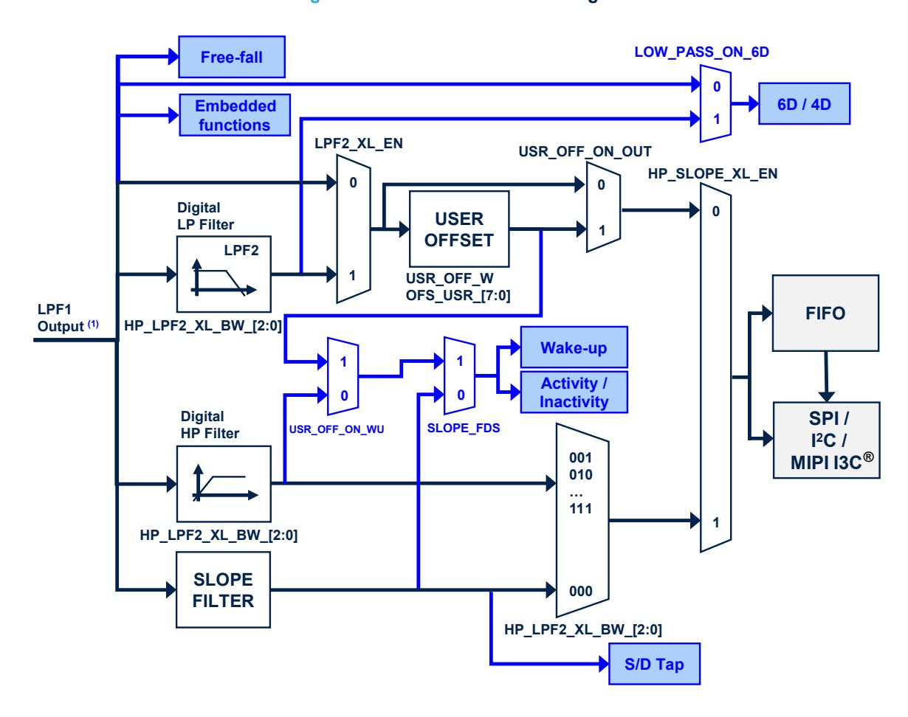

**Figure 32. Accelerometer block diagram**

1. *The cutoff value of the LPF1 output is ODR/2 when the accelerometer is in high-performance mode, high-accuracy ODR mode or normal mode. This value is equal to 2300 Hz when the accelerometer is in low-power mode 1 (2 mean), 912 Hz in low-power mode 2 (4 mean) or 431 Hz in low-power mode 3 (8 mean).*

**DS13510** - **Rev 4 page 73/198**

<span id="page-73-0"></span>

# **9.23 CTRL10 (19h)**

Control register 10 (R/W)

### **Table 72. CTRL10 register**

| EMB_FUNC_<br>(1)<br>(1)<br>0<br>0<br>DEBUG | (1)<br>0 | ST_G_1 | ST_G_0 | ST_XL_1 | ST_XL_0 |  |
|--------------------------------------------|----------|--------|--------|---------|---------|--|
|--------------------------------------------|----------|--------|--------|---------|---------|--|

*<sup>1.</sup> This bit must be set to 0 for the correct operation of the device.*

#### **Table 73. CTRL10 register description**

| EMB_FUNC_DEBUG | Enables debug mode for the embedded functions.<br>(0: disabled; 1: enabled)                                                                       |
|----------------|---------------------------------------------------------------------------------------------------------------------------------------------------|
| ST_G_[1:0]     | Gyroscope self-test selection<br>(00: normal mode (default);<br>01: positive sign self-test;<br>10: negative sign self-test;<br>11: reserved)     |
| ST_XL_[1:0]    | Accelerometer self-test selection<br>(00: normal mode (default);<br>01: positive sign self-test;<br>10: negative sign self-test;<br>11: reserved) |

# **9.24 CTRL\_STATUS (1Ah)**

(R)

#### **Table 74. CTRL\_STATUS register**

| 0 | 0 | 0 | 0 | 0 | FSM_WR_<br>CTRL_STATUS | - | 0 |
|---|---|---|---|---|------------------------|---|---|
|---|---|---|---|---|------------------------|---|---|

## **Table 75. CTRL\_STATUS register description**

|                    | This flag indicates the current controller of the device configuration registers. This flag must<br>be used as an acknowledge flag when the value of the FSM_WR_CTRL_EN bit in the<br>FUNC_CFG_ACCESS (01h) register is changed. Default value: 0 |
|--------------------|---------------------------------------------------------------------------------------------------------------------------------------------------------------------------------------------------------------------------------------------------|
| FSM_WR_CTRL_STATUS | (0: all registers and configurations are writable from the standard interface;                                                                                                                                                                    |
|                    | 1: some registers and configurations are under FSM control and are in read-only mode from the<br>standard interface).                                                                                                                             |

**DS13510** - **Rev 4 page 74/198**

<span id="page-74-0"></span>

# **9.25 FIFO\_STATUS1 (1Bh)**

FIFO status register 1 (R)

### **Table 76. FIFO\_STATUS1 register**

| DIFF_  | DIFF_  | DIFF_  | DIFF_  | DIFF_  | DIFF_  | DIFF_  | DIFF_  |
|--------|--------|--------|--------|--------|--------|--------|--------|
| FIFO_7 | FIFO_6 | FIFO_5 | FIFO_4 | FIFO_3 | FIFO_2 | FIFO_1 | FIFO_0 |

## **Table 77. FIFO\_STATUS1 register description**

| DIFF_FIFO_[7:0] | Number of unread sensor data (TAG + 6 bytes) stored in FIFO |
|-----------------|-------------------------------------------------------------|
|                 | In conjunction with DIFF_FIFO_8 in FIFO_STATUS2 (1Ch).      |

# **9.26 FIFO\_STATUS2 (1Ch)**

FIFO status register 2 (R)

### **Table 78. FIFO\_STATUS2 register**

| FIFO_<br>WTM_IA | FIFO_<br>OVR_IA | FIFO_<br>FULL_IA | COUNTER_<br>BDR_IA | FIFO_OVR_<br>LATCHED | 0 | 0 | DIFF_<br>FIFO_8 |
|-----------------|-----------------|------------------|--------------------|----------------------|---|---|-----------------|
|-----------------|-----------------|------------------|--------------------|----------------------|---|---|-----------------|

### **Table 79. FIFO\_STATUS2 register description**

|                  | FIFO watermark status. Default value: 0                                                                                           |
|------------------|-----------------------------------------------------------------------------------------------------------------------------------|
|                  | (0: FIFO filling is lower than WTM;                                                                                               |
| FIFO_WTM_IA      | 1: FIFO filling is equal to or greater than WTM)                                                                                  |
|                  | Watermark is set through bits WTM[7:0] in FIFO_CTRL2 (08h) and FIFO_CTRL1 (07h).                                                  |
|                  | FIFO overrun status. Default value: 0                                                                                             |
| FIFO_OVR_IA      | (0: FIFO is not completely filled; 1: FIFO is completely filled)                                                                  |
|                  | Smart FIFO full status. Default value: 0                                                                                          |
| FIFO_FULL_IA     | (0: FIFO is not full; 1: FIFO will be full at the next ODR)                                                                       |
| COUNTER_BDR_IA   | Counter BDR reaches the CNT_BDR_TH_[10:0] threshold set in COUNTER_BDR_REG1 (0Bh) and<br>COUNTER_BDR_REG2 (0Ch). Default value: 0 |
|                  | This bit is reset when these registers are read.                                                                                  |
|                  | Latched FIFO overrun status. Default value: 0                                                                                     |
| FIFO_OVR_LATCHED | This bit is reset when this register is read.                                                                                     |
|                  | Number of unread sensor data (TAG + 6 bytes) stored in FIFO. Default value: 00                                                    |
| DIFF_FIFO_8      | In conjunction with DIFF_FIFO[7:0] in FIFO_STATUS1 (1Bh)                                                                          |

**DS13510** - **Rev 4 page 75/198**

<span id="page-75-0"></span>

# 9.27 ALL\_INT\_SRC (1Dh)

Source register for all interrupts (R)

# Table 80. ALL\_INT\_SRC register

|  | MB_<br>NC_IA | SHUB_IA | SLEEP_<br>CHANGE_IA | D6D_IA | 0 | TAP_IA | WU_IA | FF_IA |  |
|--|--------------|---------|---------------------|--------|---|--------|-------|-------|--|
|--|--------------|---------|---------------------|--------|---|--------|-------|-------|--|

# Table 81. ALL\_INT\_SRC register description

|                                        | Embodded functions interrupt status, Default value; 0                                                                                   |
|----------------------------------------|-----------------------------------------------------------------------------------------------------------------------------------------|
|                                        | Embedded functions interrupt status. Default value: 0                                                                                   |
| EMB_FUNC_IA                            | (0: embedded functions event not detected;                                                                                              |
|                                        | 1: embedded functions event detected)                                                                                                   |
|                                        | Sensor hub (I <sup>2</sup> C master) interrupt status. Default value: 0                                                                 |
| SHUB_IA                                | (0: sensor hub interrupt not generated;                                                                                                 |
|                                        | 1: sensor hub interrupt generated)                                                                                                      |
| SLEED CHANCE IA                        | Detects change event in activity/inactivity status. Default value: 0                                                                    |
| SLEEP_CHANGE_IA                        | (0: change status not detected; 1: change status detected)                                                                              |
| Den IA                                 | Interrupt active for change in position of portrait, landscape, face-up, face-down. Default value: 0                                    |
| D6D_IA                                 | (0: change in position not detected; 1: change in position detected)                                                                    |
| TAP IA                                 | Single or double-tap event detection status depending on SINGLE_DOUBLE_TAP_bit value (see WAKE_UP_THS (5Bh) register). Default value: 0 |
| _                                      | (0: tap event not detected; 1: tap event detected)                                                                                      |
| \\\\\\\\\\\\\\\\\\\\\\\\\\\\\\\\\\\\\\ | Wake-up event status. Default value: 0                                                                                                  |
| WU_IA                                  | (0: event not detected, 1: event detected)                                                                                              |
| EE IA                                  | Free-fall event status. Default value: 0                                                                                                |
| FF_IA                                  | (0: event not detected, 1: event detected)                                                                                              |

DS13510 - Rev 4 page 76/198

<span id="page-76-0"></span>

# **9.28 STATUS\_REG (1Eh)**

The STATUS\_REG register is read by the primary interface SPI/I²C & MIPI I3C® (R).

#### **Table 82. STATUS\_REG register**

| TIMESTAMP_<br>0<br>OIS_DRDY<br>ENDCOUNT | GDA_EIS | AH_QVARDA | TDA | GDA | XLDA |
|-----------------------------------------|---------|-----------|-----|-----|------|
|-----------------------------------------|---------|-----------|-----|-----|------|

#### **Table 83. STATUS\_REG register description**

| TIMESTAMP_ENDCOUNT | Alerts timestamp overflow within 5.6 ms                                        |
|--------------------|--------------------------------------------------------------------------------|
|                    | Accelerometer OIS or gyroscope OIS new output data available. Default value: 0 |
| OIS_DRDY           | (0: no set of data (accelerometer or gyroscope) available on OIS chain;        |
|                    | 1: a new set of data (accelerometer or gyroscope) is available on OIS chain)   |
|                    | Enhanced EIS gyroscope new data available. Default value: 0                    |
| GDA_EIS            | (0: no set of data available at gyroscope output;                              |
|                    | 1: a new set of data is available at gyroscope output)                         |
|                    | Analog hub or Qvar new data available. Default value: 0                        |
| AH_QVARDA          | (0: no set of data available at the analog hub or Qvar data output;            |
|                    | 1: a new set of data is available at the analog hub or Qvar data output)       |
|                    | Temperature new data available. Default: 0                                     |
| TDA                | (0: no set of data is available at temperature sensor output;                  |
|                    | 1: a new set of data is available at temperature sensor output)                |
|                    | Gyroscope new data available. Default value: 0                                 |
| GDA                | (0: no set of data available at gyroscope output;                              |
|                    | 1: a new set of data is available at gyroscope output)                         |
|                    | Accelerometer new data available. Default value: 0                             |
| XLDA               | (0: no set of data available at accelerometer output;                          |
|                    | 1: a new set of data is available at accelerometer output)                     |

**DS13510** - **Rev 4 page 77/198**

<span id="page-77-0"></span>

# **9.29 OUT\_TEMP\_L (20h), OUT\_TEMP\_H (21h)**

Temperature data output register (R). L and H registers together express a 16-bit word in two's complement.

### **Table 84. OUT\_TEMP\_L register**

| Temp7                         | Temp6  | Temp5  | Temp4  | Temp3  | Temp2  | Temp1 | Temp0 |  |  |  |
|-------------------------------|--------|--------|--------|--------|--------|-------|-------|--|--|--|
|                               |        |        |        |        |        |       |       |  |  |  |
| Table 85. OUT_TEMP_H register |        |        |        |        |        |       |       |  |  |  |
| Temp15                        | Temp14 | Temp13 | Temp12 | Temp11 | Temp10 | Temp9 | Temp8 |  |  |  |

## **Table 86. OUT\_TEMP register description**

|            | Temperature sensor output data              |
|------------|---------------------------------------------|
| Temp[15:0] | The value is expressed in two's complement. |

# **9.30 OUTX\_L\_G (22h) and OUTX\_H\_G (23h)**

Angular rate sensor pitch axis (X) angular rate output register (R). The value is expressed as a 16-bit word in two's complement.

Data are according to the full-scale ([CTRL6 \(15h\)\)](#page-68-0) and ODR settings ([CTRL2 \(11h\)](#page-65-0)) of the gyroscope user interface.

#### **Table 87. OUTX\_L\_G register**

| D7  | D6                          | D5  | D4  | D3  | D2  | D1 | D0 |  |  |  |  |
|-----|-----------------------------|-----|-----|-----|-----|----|----|--|--|--|--|
|     |                             |     |     |     |     |    |    |  |  |  |  |
|     | Table 88. OUTX_H_G register |     |     |     |     |    |    |  |  |  |  |
| D15 | D14                         | D13 | D12 | D11 | D10 | D9 | D8 |  |  |  |  |

#### **Table 89. OUTX\_G register description**

| D[15:0]<br>Gyroscope UI chain pitch axis (X) angular rate output value |  |
|------------------------------------------------------------------------|--|
|------------------------------------------------------------------------|--|

**DS13510** - **Rev 4 page 78/198**

<span id="page-78-0"></span>

# **9.31 OUTY\_L\_G (24h) and OUTY\_H\_G (25h)**

Angular rate sensor roll axis (Y) angular rate output register (R). The value is expressed as a 16-bit word in two's complement.

Data are according to the full-scale ([CTRL6 \(15h\)\)](#page-68-0) and ODR settings ([CTRL2 \(11h\)](#page-65-0)) of the gyroscope user interface.

#### **Table 90. OUTY\_L\_G register**

| D7                          | D6  | D5  | D4  | D3  | D2  | D1 | D0 |  |  |  |
|-----------------------------|-----|-----|-----|-----|-----|----|----|--|--|--|
|                             |     |     |     |     |     |    |    |  |  |  |
| Table 91. OUTY_H_G register |     |     |     |     |     |    |    |  |  |  |
| D15                         | D14 | D13 | D12 | D11 | D10 | D9 | D8 |  |  |  |

## **Table 92. OUTY\_G register description**

| D[15:0] |
|---------|
|---------|

# **9.32 OUTZ\_L\_G (26h) and OUTZ\_H\_G (27h)**

Angular rate sensor yaw axis (Z) angular rate output register (R). The value is expressed as a 16-bit word in two's complement.

Data are according to the full-scale ([CTRL6 \(15h\)\)](#page-68-0) and ODR settings ([CTRL2 \(11h\)](#page-65-0)) of the gyroscope user interface.

#### **Table 93. OUTZ\_L\_G register**

| D7                          | D6  | D5  | D4  | D3  | D2  | D1 | D0 |  |  |  |
|-----------------------------|-----|-----|-----|-----|-----|----|----|--|--|--|
|                             |     |     |     |     |     |    |    |  |  |  |
| Table 94. OUTZ_H_G register |     |     |     |     |     |    |    |  |  |  |
| D15                         | D14 | D13 | D12 | D11 | D10 | D9 | D8 |  |  |  |

### **Table 95. OUTZ\_H\_G register description**

| D[15:0] | Gyroscope UI chain yaw axis (Z) angular rate output value |
|---------|-----------------------------------------------------------|
|         |                                                           |

**DS13510** - **Rev 4 page 79/198**

<span id="page-79-0"></span>

# **9.33 OUTX\_L\_A (28h) and OUTX\_H\_A (29h)**

Linear acceleration sensor X-axis output register (R). The value is expressed as a 16-bit word in two's complement.

Data are according to the full-scale ([CTRL8 \(17h\)\)](#page-70-0) and ODR settings ([CTRL1 \(10h\)\)](#page-64-0) of the accelerometer user interface.

#### **Table 96. OUTX\_L\_A register**

| D7                          | D6  | D5  | D4  | D3  | D2  | D1 | D0 |  |
|-----------------------------|-----|-----|-----|-----|-----|----|----|--|
|                             |     |     |     |     |     |    |    |  |
| Table 97. OUTX_H_A register |     |     |     |     |     |    |    |  |
| D15                         | D14 | D13 | D12 | D11 | D10 | D9 | D8 |  |

## **Table 98. OUTX\_A register description**

| D[15:0] |
|---------|
|---------|

# **9.34 OUTY\_L\_A (2Ah) and OUTY\_H\_A (2Bh)**

Linear acceleration sensor Y-axis output register (R). The value is expressed as a 16-bit word in two's complement.

Data are according to the full-scale ([CTRL8 \(17h\)\)](#page-70-0) and ODR settings ([CTRL1 \(10h\)\)](#page-64-0) of the accelerometer user interface.

#### **Table 99. OUTY\_L\_A register**

| D7                           | D6  | D5  | D4  | D3  | D2  | D1 | D0 |  |
|------------------------------|-----|-----|-----|-----|-----|----|----|--|
|                              |     |     |     |     |     |    |    |  |
| Table 100. OUTY_H_A register |     |     |     |     |     |    |    |  |
| D15                          | D14 | D13 | D12 | D11 | D10 | D9 | D8 |  |

### **Table 101. OUTY\_A register description**

| D[15:0] | Accelerometer UI chain Y-axis linear acceleration output value |
|---------|----------------------------------------------------------------|
|         |                                                                |

**DS13510** - **Rev 4 page 80/198**

<span id="page-80-0"></span>

# **9.35 OUTZ\_L\_A (2Ch) and OUTZ\_H\_A (2Dh)**

Linear acceleration sensor Z-axis output register (R). The value is expressed as a 16-bit word in two's complement.

Data are according to the full-scale ([CTRL8 \(17h\)\)](#page-70-0) and ODR settings ([CTRL1 \(10h\)\)](#page-64-0) of the accelerometer user interface.

#### **Table 102. OUTZ\_L\_A register**

| D7                           | D6  | D5  | D4  | D3  | D2  | D1 | D0 |  |
|------------------------------|-----|-----|-----|-----|-----|----|----|--|
|                              |     |     |     |     |     |    |    |  |
| Table 103. OUTZ_H_A register |     |     |     |     |     |    |    |  |
| D15                          | D14 | D13 | D12 | D11 | D10 | D9 | D8 |  |

## **Table 104. OUTZ\_A register description**

| Accelerometer UI chain Z-axis linear acceleration output value |
|----------------------------------------------------------------|
|----------------------------------------------------------------|

## **9.36 UI\_OUTX\_L\_G\_OIS\_EIS (2Eh) and UI\_OUTX\_H\_G\_OIS\_EIS (2Fh)**

Angular rate sensor pitch axis (X) angular rate output register (R). The value is expressed as a 16-bit word in two's complement.

Data are according to the gyroscope full-scale and ODR settings of the OIS gyroscope or the EIS gyroscope channel.

#### **Table 105. UI\_OUTX\_L\_G\_OIS\_EIS register**

| D7                                      | D6  | D5  | D4  | D3  | D2  | D1 | D0 |  |
|-----------------------------------------|-----|-----|-----|-----|-----|----|----|--|
|                                         |     |     |     |     |     |    |    |  |
| Table 106. UI_OUTX_H_G_OIS_EIS register |     |     |     |     |     |    |    |  |
| D15                                     | D14 | D13 | D12 | D11 | D10 | D9 | D8 |  |

#### **Table 107. UI\_OUTX\_G\_OIS\_EIS register description**

|--|

**DS13510** - **Rev 4 page 81/198**

<span id="page-81-0"></span>

# **9.37 UI\_OUTY\_L\_G\_OIS\_EIS (30h) and UI\_OUTY\_H\_G\_OIS\_EIS (31h)**

Angular rate sensor roll axis (Y) angular rate output register (R). The value is expressed as a 16-bit word in two's complement.

Data are according to the gyroscope full-scale and ODR settings of the OIS gyroscope or the EIS gyroscope channel.

#### **Table 108. UI\_OUTY\_L\_G\_OIS\_EIS register**

| D7                                      | D6  | D5  | D4  | D3  | D2  | D1 | D0 |  |
|-----------------------------------------|-----|-----|-----|-----|-----|----|----|--|
|                                         |     |     |     |     |     |    |    |  |
| Table 109. UI_OUTY_H_G_OIS_EIS register |     |     |     |     |     |    |    |  |
| D15                                     | D14 | D13 | D12 | D11 | D10 | D9 | D8 |  |

## **Table 110. UI\_OUTY\_G\_OIS\_EIS register description**

| D[15:0] |
|---------|
|---------|

# **9.38 UI\_OUTZ\_L\_G\_OIS\_EIS (32h) and UI\_OUTZ\_H\_G\_OIS\_EIS (33h)**

Angular rate sensor yaw axis (Z) angular rate output register (R). The value is expressed as a 16-bit word in two's complement.

Data are according to the gyroscope full-scale and ODR settings of the OIS gyroscope or the EIS gyroscope channel.

#### **Table 111. UI\_OUTZ\_L\_G\_OIS\_EIS register**

| D7                                      | D6  | D5  | D4  | D3  | D2  | D1 | D0 |  |
|-----------------------------------------|-----|-----|-----|-----|-----|----|----|--|
|                                         |     |     |     |     |     |    |    |  |
| Table 112. UI_OUTZ_H_G_OIS_EIS register |     |     |     |     |     |    |    |  |
| D15                                     | D14 | D13 | D12 | D11 | D10 | D9 | D8 |  |

### **Table 113. UI\_OUTZ\_G\_OIS\_EIS register description**

| D[15:0]<br>Gyroscope yaw axis OIS/EIS output expressed in two's complement |
|----------------------------------------------------------------------------|
|----------------------------------------------------------------------------|

**DS13510** - **Rev 4 page 82/198**

<span id="page-82-0"></span>

# **9.39 UI\_OUTX\_L\_A\_OIS\_DualC (34h) and UI\_OUTX\_H\_A\_OIS\_DualC (35h)**

Linear acceleration sensor X-axis output register (R). The value is expressed as a 16-bit word in two's complement.

Data are according to the accelerometer full-scale and ODR settings of the OIS accelerometer or according to the accelerometer dual-channel mode configuration.

#### **Table 114. UI\_OUTX\_L\_A\_OIS\_DualC register**

| D7                                        | D6  | D5  | D4  | D3  | D2  | D1 | D0 |  |
|-------------------------------------------|-----|-----|-----|-----|-----|----|----|--|
|                                           |     |     |     |     |     |    |    |  |
| Table 115. UI_OUTX_H_A_OIS_DualC register |     |     |     |     |     |    |    |  |
| D15                                       | D14 | D13 | D12 | D11 | D10 | D9 | D8 |  |

## **Table 116. UI\_OUTX\_A\_OIS\_DualC register description**

| D[15:0] |
|---------|
|---------|

# **9.40 UI\_OUTY\_L\_A\_OIS\_DualC (36h) and UI\_OUTY\_H\_A\_OIS\_DualC (37h)**

Linear acceleration sensor Y-axis output register (R). The value is expressed as a 16-bit word in two's complement.

Data are according to the accelerometer full-scale and ODR settings of the OIS accelerometer or according to the accelerometer dual-channel mode configuration.

### **Table 117. UI\_OUTY\_L\_A\_OIS\_DualC register**

| D7  | D6  | D5  | D4  | D3                                        | D2  | D1 | D0 |
|-----|-----|-----|-----|-------------------------------------------|-----|----|----|
|     |     |     |     |                                           |     |    |    |
|     |     |     |     | Table 118. UI_OUTY_H_A_OIS_DualC register |     |    |    |
| D15 | D14 | D13 | D12 | D11                                       | D10 | D9 | D8 |

### **Table 119. UI\_OUTY\_A\_OIS\_DualC register description**

| D[15:0] |
|---------|
|---------|

**DS13510** - **Rev 4 page 83/198**

<span id="page-83-0"></span>

# **9.41 UI\_OUTZ\_L\_A\_OIS\_DualC (38h) and UI\_OUTZ\_H\_A\_OIS\_DualC (39h)**

Linear acceleration sensor Z-axis output register (R). The value is expressed as a 16-bit word in two's complement.

Data are according to the accelerometer full-scale and ODR settings of the OIS accelerometer or according to the accelerometer dual-channel mode configuration.

#### **Table 120. UI\_OUTZ\_L\_A\_OIS\_DualC register**

| D7  | D6  | D5  | D4  | D3                                        | D2  | D1 | D0 |
|-----|-----|-----|-----|-------------------------------------------|-----|----|----|
|     |     |     |     |                                           |     |    |    |
|     |     |     |     | Table 121. UI_OUTZ_H_A_OIS_DualC register |     |    |    |
| D15 | D14 | D13 | D12 | D11                                       | D10 | D9 | D8 |

## **Table 122. UI\_OUTZ\_A\_OIS\_DualC register description**

| Accelerometer Z-axis OIS/DualC output expressed in two's complement | D[15:0] |
|---------------------------------------------------------------------|---------|
|---------------------------------------------------------------------|---------|

# **9.42 AH\_QVAR\_OUT\_L (3Ah) and AH\_QVAR\_OUT\_H (3Bh)**

Analog hub and Qvar data output register (R). L and H registers together express a 16-bit word in two's complement.

#### **Table 123. AH\_QVAR\_OUT\_L register**

| AH_Qvar_7<br>AH_Qvar_6<br>AH_Qvar_5<br>AH_Qvar_4<br>AH_Qvar_3<br>AH_Qvar_2<br>AH_Qvar_1<br>AH_Qvar_0 |
|------------------------------------------------------------------------------------------------------|
|------------------------------------------------------------------------------------------------------|

#### **Table 124. AH\_QVAR\_OUT\_H register**

|  | AH_Qvar_15 | AH_Qvar_14 | AH_Qvar_13 | AH_Qvar_12 | AH_Qvar_11 | AH_Qvar_10 | AH_Qvar_9 | AH_Qvar_8 |
|--|------------|------------|------------|------------|------------|------------|-----------|-----------|
|--|------------|------------|------------|------------|------------|------------|-----------|-----------|

#### **Table 125. AH\_QVAR\_OUT register description**

| AH_Qvar_[15:0] | When the analog hub or Qvar is enabled (by setting the AH_QVAR_EN bit to 1 in CTRL7 (16h)), these<br>registers contain the analog hub or the Qvar sensor ouput data. |  |
|----------------|----------------------------------------------------------------------------------------------------------------------------------------------------------------------|--|
|                | Data are expressed in two's complement.                                                                                                                              |  |

**DS13510** - **Rev 4 page 84/198**

<span id="page-84-0"></span>

# **9.43 TIMESTAMP0 (40h), TIMESTAMP1 (41h), TIMESTAMP2 (42h), and TIMESTAMP3 (43h)**

Timestamp first data output register (R). The value is expressed as a 32-bit word and the bit resolution is 21.75 µs (typical).

#### **Table 126. TIMESTAMP output registers**

| D31 | D30 | D29 | D28 | D27 | D26 | D25 | D24 |
|-----|-----|-----|-----|-----|-----|-----|-----|
|     |     |     |     |     |     |     |     |
| D23 | D22 | D21 | D20 | D19 | D18 | D17 | D16 |
|     |     |     |     |     |     |     |     |
| D15 | D14 | D13 | D12 | D11 | D10 | D9  | D8  |
|     |     |     |     |     |     |     |     |
| D7  | D6  | D5  | D4  | D3  | D2  | D1  | D0  |

#### **Table 127. TIMESTAMP output register description**

| D[31:0] | Timestamp output registers: 1LSB = 21.75 µs (typical) |
|---------|-------------------------------------------------------|
|         |                                                       |

# **9.44 UI\_STATUS\_REG\_OIS (44h)**

## **Table 128. UI\_STATUS\_REG\_OIS register**

#### **Table 129. UI\_STATUS\_REG\_OIS register description**

| GYRO_SETTLING | High when the gyroscope output is in the settling phase                                         |
|---------------|-------------------------------------------------------------------------------------------------|
|               | Gyroscope OIS data available (reset when one of the high parts of the output data is read).     |
| GDA_OIS       | Default value: 0                                                                                |
|               | (0: no set of data available at gyroscope OIS output;                                           |
|               | 1: a new set of data is available at gyroscope output)                                          |
|               | Accelerometer OIS data available (reset when one of the high parts of the output data is read). |
|               | Default value: 0                                                                                |
| XLDA_OIS      | (0: no set of data available at gyroscope OIS output;                                           |
|               | 1: a new set of data is available at gyroscope output)                                          |

**DS13510** - **Rev 4 page 85/198**

<span id="page-85-0"></span>

# 9.45 WAKE\_UP\_SRC (45h)

Wake-up interrupt source register (R)

# Table 130. WAKE\_UP\_SRC register

| 0 | SLEEP_<br>CHANGE_IA | FF_IA | SLEEP_<br>STATE | WU_IA | X_WU | Y_WU | Z_WU |  |
|---|---------------------|-------|-----------------|-------|------|------|------|--|
|---|---------------------|-------|-----------------|-------|------|------|------|--|

# Table 131. WAKE\_UP\_SRC register description

|                 | Detects change event in activity/inactivity status. Default value: 0           |
|-----------------|--------------------------------------------------------------------------------|
| SLEEP_CHANGE_IA |                                                                                |
|                 | (0: change status not detected; 1: change status detected)                     |
| FF IA           | Free-fall event detection status. Default: 0                                   |
| T _IA           | (0: free-fall event not detected; 1: free-fall event detected)                 |
| CLEED STATE     | Sleep status bit. Default value: 0                                             |
| SLEEP_STATE     | (0: Activity status; 1: Inactivity status)                                     |
| WU IA           | Wake-up event detection status. Default value: 0                               |
| WO_IA           | (0: wake-up event not detected; 1: wake-up event detected.)                    |
| X WU            | Wake-up event detection status on X-axis. Default value: 0                     |
| X_VV0           | (0: wake-up event on X-axis not detected; 1: wake-up event on X-axis detected) |
| Y WU            | Wake-up event detection status on Y-axis. Default value: 0                     |
| 1_000           | (0: wake-up event on Y-axis not detected; 1: wake-up event on Y-axis detected) |
| Z WU            | Wake-up event detection status on Z-axis. Default value: 0                     |
| 2_****          | (0: wake-up event on Z-axis not detected; 1: wake-up event on Z-axis detected) |

DS13510 - Rev 4 page 86/198

<span id="page-86-0"></span>

# **9.46 TAP\_SRC (46h)**

Tap source register (R)

### **Table 132. TAP\_SRC register**

| 0 | TAP_IA | SINGLE_<br>TAP | DOUBLE_<br>TAP | TAP_SIGN | X_TAP | Y_TAP | Z_TAP |
|---|--------|----------------|----------------|----------|-------|-------|-------|
|---|--------|----------------|----------------|----------|-------|-------|-------|

## **Table 133. TAP\_SRC register description**

| TAP_IA     | Tap event detection status. Default: 0<br>(0: tap event not detected; 1: tap event detected)                                                                                  |
|------------|-------------------------------------------------------------------------------------------------------------------------------------------------------------------------------|
| SINGLE_TAP | Single-tap event status. Default value: 0<br>(0: single tap event not detected; 1: single tap event detected)                                                                 |
| DOUBLE_TAP | Double-tap event detection status. Default value: 0<br>(0: double-tap event not detected; 1: double-tap event detected.)                                                      |
| TAP_SIGN   | Sign of acceleration detected by tap event. Default: 0<br>(0: positive sign of acceleration detected by tap event;<br>1: negative sign of acceleration detected by tap event) |
| X_TAP      | Tap event detection status on X-axis. Default value: 0<br>(0: tap event on X-axis not detected; 1: tap event on X-axis detected)                                              |
| Y_TAP      | Tap event detection status on Y-axis. Default value: 0<br>(0: tap event on Y-axis not detected; 1: tap event on Y-axis detected)                                              |
| Z_TAP      | Tap event detection status on Z-axis. Default value: 0<br>(0: tap event on Z-axis not detected; 1: tap event on Z-axis detected)                                              |

**DS13510** - **Rev 4 page 87/198**

**D6D\_SRC (47h)**

<span id="page-87-0"></span>

# **9.47 D6D\_SRC (47h)**

Portrait, landscape, face-up and face-down source register (R)

### **Table 134. D6D\_SRC register**

|  |  | 0 | D6D_IA | ZH | ZL | YH | YL | XH | XL |
|--|--|---|--------|----|----|----|----|----|----|
|--|--|---|--------|----|----|----|----|----|----|

## **Table 135. D6D\_SRC register description**

| D6D_IA | Interrupt active for change position portrait, landscape, face-up, face-down. Default value: 0 |
|--------|------------------------------------------------------------------------------------------------|
|        | (0: change position not detected; 1: change position detected)                                 |
|        | Z-axis high event (over threshold). Default value: 0                                           |
| ZH     | (0: event not detected; 1: event (over threshold) detected)                                    |
|        | Z-axis low event (under threshold). Default value: 0                                           |
| ZL     | (0: event not detected; 1: event (under threshold) detected)                                   |
|        | Y-axis high event (over threshold). Default value: 0                                           |
| YH     | (0: event not detected; 1: event (over-threshold) detected)                                    |
|        | Y-axis low event (under threshold). Default value: 0                                           |
| YL     | (0: event not detected; 1: event (under threshold) detected)                                   |
|        | X-axis high event (over threshold). Default value: 0                                           |
| XH     | (0: event not detected; 1: event (over threshold) detected)                                    |
|        | X-axis low event (under threshold). Default value: 0                                           |
| XL     | (0: event not detected; 1: event (under threshold) detected)                                   |

# **9.48 STATUS\_MASTER\_MAINPAGE (48h)**

Sensor hub source register (R)

#### **Table 136. STATUS\_MASTER\_MAINPAGE register**

| WR_ONCE_ | SLAVE3_ | SLAVE2_ | SLAVE1_ | SLAVE0_ |   |   | SENS_HUB |  |
|----------|---------|---------|---------|---------|---|---|----------|--|
| DONE     | NACK    | NACK    | NACK    | NACK    | 0 | 0 | _ENDOP   |  |

#### **Table 137. STATUS\_MASTER\_MAINPAGE register description**

| WR_ONCE_DONE   | When the bit WRITE_ONCE in MASTER_CONFIG (14h) is configured as 1, this bit is set to 1 when the<br>write operation on slave 0 has been performed and completed. Default value: 0 |
|----------------|-----------------------------------------------------------------------------------------------------------------------------------------------------------------------------------|
| SLAVE3_NACK    | This bit is set to 1 if Not acknowledge occurs on slave 3 communication. Default value: 0                                                                                         |
| SLAVE2_NACK    | This bit is set to 1 if Not acknowledge occurs on slave 2 communication. Default value: 0                                                                                         |
| SLAVE1_NACK    | This bit is set to 1 if Not acknowledge occurs on slave 1 communication. Default value: 0                                                                                         |
| SLAVE0_NACK    | This bit is set to 1 if Not acknowledge occurs on slave 0 communication. Default value: 0                                                                                         |
|                | Sensor hub communication status. Default value: 0                                                                                                                                 |
| SENS_HUB_ENDOP | (0: sensor hub communication not concluded;                                                                                                                                       |
|                | 1: sensor hub communication concluded)                                                                                                                                            |

**DS13510** - **Rev 4 page 88/198**

<span id="page-88-0"></span>

# 9.49 EMB\_FUNC\_STATUS\_MAINPAGE (49h)

Embedded function status register (R)

# Table 138. EMB\_FUNC\_STATUS\_MAINPAGE register

| IS_FSM_LC | 0 | IS_<br>SIGMOT | IS_TILT | IS_<br>STEP_DET | 0 | 0 | 0 |
|-----------|---|---------------|---------|-----------------|---|---|---|
|-----------|---|---------------|---------|-----------------|---|---|---|

## Table 139. EMB\_FUNC\_STATUS\_MAINPAGE register description

| IS_FSM_LC   | Interrupt status bit for FSM long counter timeout interrupt event. (1: interrupt detected; 0: no interrupt) |
|-------------|-------------------------------------------------------------------------------------------------------------|
| IS_SIGMOT   | Interrupt status bit for significant motion detection (1: interrupt detected; 0: no interrupt)              |
| IS_TILT     | Interrupt status bit for tilt detection (1: interrupt detected; 0: no interrupt)                            |
| IS_STEP_DET | Interrupt status bit for step detection (1: interrupt detected; 0: no interrupt)                            |

# 9.50 FSM\_STATUS\_MAINPAGE (4Ah)

Finite state machine status register (R)

## Table 140. FSM\_STATUS\_MAINPAGE register

| IS_FSM8 | IS_FSM7 | IS_FSM6 | IS_FSM5 | IS_FSM4 | IS_FSM3 | IS_FSM2 | IS_FSM1 |
|---------|---------|---------|---------|---------|---------|---------|---------|
|         |         |         |         |         |         |         |         |

## Table 141. FSM\_STATUS\_MAINPAGE register description

| IS_FSM8 | Interrupt status bit for FSM8 interrupt event. (1: interrupt detected; 0: no interrupt) |
|---------|-----------------------------------------------------------------------------------------|
| IS_FSM7 | Interrupt status bit for FSM7 interrupt event. (1: interrupt detected; 0: no interrupt) |
| IS_FSM6 | Interrupt status bit for FSM6 interrupt event. (1: interrupt detected; 0: no interrupt) |
| IS_FSM5 | Interrupt status bit for FSM5 interrupt event. (1: interrupt detected; 0: no interrupt) |
| IS_FSM4 | Interrupt status bit for FSM4 interrupt event. (1: interrupt detected; 0: no interrupt) |
| IS_FSM3 | Interrupt status bit for FSM3 interrupt event. (1: interrupt detected; 0: no interrupt) |
| IS_FSM2 | Interrupt status bit for FSM2 interrupt event. (1: interrupt detected; 0: no interrupt) |
| IS_FSM1 | Interrupt status bit for FSM1 interrupt event. (1: interrupt detected; 0: no interrupt) |

DS13510 - Rev 4 page 89/198

<span id="page-89-0"></span>

# **9.51 MLC\_STATUS\_MAINPAGE (4Bh)**

Machine learning core status register (R)

#### **Table 142. MLC\_STATUS \_MAINPAGE register**

| 0<br>0<br>0<br>0 | IS_MLC4<br>IS_MLC3 | IS_MLC2<br>IS_MLC1 |
|------------------|--------------------|--------------------|
|------------------|--------------------|--------------------|

### **Table 143. MLC\_STATUS\_MAINPAGE register description**

| IS_MLC4 | Interrupt status bit for MLC4 interrupt event. (1: interrupt detected; 0: no interrupt) |
|---------|-----------------------------------------------------------------------------------------|
| IS_MLC3 | Interrupt status bit for MLC3 interrupt event. (1: interrupt detected; 0: no interrupt) |
| IS_MLC2 | Interrupt status bit for MLC2 interrupt event. (1: interrupt detected; 0: no interrupt) |
| IS_MLC1 | Interrupt status bit for MLC1 interrupt event. (1: interrupt detected; 0: no interrupt) |

# **9.52 INTERNAL\_FREQ\_FINE (4Fh)**

Internal frequency register (R)

#### **Table 144. INTERNAL\_FREQ\_FINE register**

| FREQ_  | FREQ_  | FREQ_  | FREQ_  | FREQ_  | FREQ_  | FREQ_  | FREQ_  |
|--------|--------|--------|--------|--------|--------|--------|--------|
| FINE_7 | FINE_6 | FINE_5 | FINE_4 | FINE_3 | FINE_2 | FINE_1 | FINE_0 |

## **Table 145. INTERNAL\_FREQ\_FINE register description**

FREQ\_FINE\_[7:0] Difference in percentage of the effective ODR (and timestamp rate) with respect to the typical. Step: 0.13%. 8-bit format, two's complement.

The actual timestamp resolution and the actual output data rate can be calculated using the following formulas:

$$t_{actual}[s] = \frac{1}{46080 \cdot (1 + 0.0013 \cdot FREQ\_FINE)}$$

$$ODR_{actual}[Hz] = \frac{7680 \cdot (1 + 0.0013 \cdot FREQ\_FINE)}{ODR_{coeff}}$$

## **Table 146. ODRcoeff values**

| Selected ODR [Hz] | ODRcoeff |
|-------------------|----------|
| 7.5               | 1024     |
| 15                | 512      |
| 30                | 256      |
| 60                | 128      |
| 120               | 64       |
| 240               | 32       |
| 480               | 16       |
| 960               | 8        |
| 1.92 kHz          | 4        |
| 3.84 kHz          | 2        |
| 7.68 kHz          | 1        |

**DS13510** - **Rev 4 page 90/198**

<span id="page-90-0"></span>

# **9.53 FUNCTIONS\_ENABLE (50h)**

Enable interrupt functions register (R/W)

### **Table 147. FUNCTIONS\_ENABLE register**

| INTERRUPTS<br>_ENABLE | TIMESTAMP<br>(1)<br>0<br>_EN | (1)<br>0 | DIS_RST_LIR<br>_ALL_INT | (1)<br>0 | INACT_EN_1 | INACT_EN_0 |
|-----------------------|------------------------------|----------|-------------------------|----------|------------|------------|
|-----------------------|------------------------------|----------|-------------------------|----------|------------|------------|

*<sup>1.</sup> This bit must be set to 0 for the correct operation of the device.*

#### **Table 148. FUNCTIONS\_ENABLE register description**

| INTERRUPTS_ENABLE   | Enables basic interrupts (6D/4D, free-fall, wake-up, tap, activity/inactivity). Default value: 0                                                                                                                                                    |
|---------------------|-----------------------------------------------------------------------------------------------------------------------------------------------------------------------------------------------------------------------------------------------------|
|                     | (0: interrupt disabled; 1: interrupt enabled)                                                                                                                                                                                                       |
| TIMESTAMP_EN        | Enables timestamp counter. The counter is readable in TIMESTAMP0 (40h), TIMESTAMP1 (41h),<br>TIMESTAMP2 (42h), and TIMESTAMP3 (43h). Default value: 0                                                                                               |
|                     | (0: disabled; 1: enabled)                                                                                                                                                                                                                           |
| DIS_RST_LIR_ALL_INT | When this bit is set to 1, reading the ALL_INT_SRC (1Dh) register does not reset the latched<br>interrupt signals. This can be useful in order to not reset some status flags before reading the<br>corresponding status register. Default value: 0 |
|                     | (0: disabled; 1: enabled)                                                                                                                                                                                                                           |
|                     | Enables activity/inactivity (sleep) function. Default value: 00                                                                                                                                                                                     |
|                     | (00: stationary/motion-only interrupts generated, accelerometer and gyroscope configuration do not<br>change;                                                                                                                                       |
| INACT_EN_[1:0]      | 01: sets accelerometer to low-power mode 1 with accelerometer ODR selected through the<br>XL_INACT_ODR_[1:0] bits of the INACTIVITY_DUR (54h) register, gyroscope configuration does<br>not change;                                                 |
|                     | 10: sets accelerometer to low-power mode 1 with accelerometer ODR selected through the<br>XL_INACT_ODR_[1:0] bits of the INACTIVITY_DUR (54h) register, gyroscope in sleep mode;                                                                    |
|                     | 11: sets accelerometer to low-power mode 1 with accelerometer ODR selected through the<br>XL_INACT_ODR_[1:0] bits of the INACTIVITY_DUR (54h) register, gyroscope in power-down<br>mode)                                                            |

**DS13510** - **Rev 4 page 91/198**

<span id="page-91-0"></span>

# **9.54 DEN (51h)**

DEN configuration register (R/W)

### **Table 149. DEN register**

| (1)<br>0 | LVL1_EN | LVL2_EN | DEN_XL_EN | DEN_X | DEN_Y | DEN_Z | DEN_XL_G |
|----------|---------|---------|-----------|-------|-------|-------|----------|
|----------|---------|---------|-----------|-------|-------|-------|----------|

*<sup>1.</sup> This bit must be set to 0 for the correct operation of the device.*

#### **Table 150. DEN register description**

| LVL1_EN   | Enables DEN data level-sensitive trigger. Refer to Table 151.                           |
|-----------|-----------------------------------------------------------------------------------------|
| LVL2_EN   | Enables DEN level-sensitive latched. Refer to Table 151.                                |
|           | Extends DEN functionality to accelerometer sensor. Default value: 0                     |
| DEN_XL_EN | (0: disabled; 1: enabled)                                                               |
| DEN_X     | DEN value stored in LSB of X-axis. Default value: 1                                     |
|           | (0: DEN not stored in X-axis LSB; 1: DEN stored in X-axis LSB)                          |
| DEN_Y     | DEN value stored in LSB of Y-axis. Default value: 1                                     |
|           | (0: DEN not stored in Y-axis LSB; 1: DEN stored in Y-axis LSB)                          |
| DEN_Z     | DEN value stored in LSB of Z-axis. Default value: 1                                     |
|           | (0: DEN not stored in Z-axis LSB; 1: DEN stored in Z-axis LSB)                          |
|           | DEN stamping sensor selection. Default value: 0                                         |
| DEN_XL_G  | (0: DEN pin info stamped in the gyroscope axis selected by bits DEN_X, DEN_Y, DEN_Z;    |
|           | 1: DEN pin info stamped in the accelerometer axis selected by bits DEN_X, DEN_Y, DEN_Z) |

#### **Table 151. Trigger mode selection**

| LVL1_EN, LVL2_EN | Trigger mode                             |
|------------------|------------------------------------------|
| 10               | Level-sensitive trigger mode is selected |
| 11               | Level-sensitive latched mode is selected |

**DS13510** - **Rev 4 page 92/198**

<span id="page-92-0"></span>

# **9.55 INACTIVITY\_DUR (54h)**

Activity/inactivity configuration register (R/W)

#### **Table 152. INACTIVITY\_DUR register**

| SLEEP_STATUS | WU_INACT_ | WU_INACT_ | WU_INACT_ | XL_INACT | XL_INACT | INACT  | INACT  |
|--------------|-----------|-----------|-----------|----------|----------|--------|--------|
| _ON_INT      | THS_W_2   | THS_W_1   | THS_W_0   | _ODR_1   | _ODR_0   | _DUR_1 | _DUR_0 |

#### **Table 153. INACTIVITY\_DUR register description**

|                      | Activity/inactivity interrupt mode configuration.                                                                                         |
|----------------------|-------------------------------------------------------------------------------------------------------------------------------------------|
| SLEEP_STATUS_ON_INT  | If the INT1_SLEEP_CHANGE or INT2_SLEEP_CHANGE bit is enabled, drives the sleep status<br>or sleep change on the INT pin. Default value: 0 |
|                      | (0: sleep change notification on INT pin;                                                                                                 |
|                      | 1: sleep status reported on INT pin)                                                                                                      |
|                      | Weight of 1 LSB of wake-up (WU_THS) and activity/inactivity (INACT_THS) threshold.                                                        |
|                      | (000: 7.8125 mg/LSB (default);                                                                                                            |
|                      | 001: 15.625 mg/LSB;                                                                                                                       |
| WU_INACT_THS_W_[2:0] | 010: 31.25 mg/LSB;                                                                                                                        |
|                      | 011: 62.5 mg/LSB;                                                                                                                         |
|                      | 100: 125 mg/LSB;                                                                                                                          |
|                      | 101 - 110 - 111: 250 mg/LSB)                                                                                                              |
|                      | Selects the ODR_XL target during inactivity.                                                                                              |
|                      | (00: 1.875 Hz;                                                                                                                            |
| XL_INACT_ODR_[1:0]   | 01: 15 Hz (default);                                                                                                                      |
|                      | 10: 30 Hz;                                                                                                                                |
|                      | 11: 60 Hz)                                                                                                                                |
|                      | Duration in the transition from stationary to motion (from inactivity to activity).                                                       |
|                      | (00: transition to motion (activity) immediately at first overthreshold event (default);                                                  |
| INACT_DUR_[1:0]      | 01: transition to motion (activity) after two consecutive overthreshold events;                                                           |
|                      | 10: transition to motion (activity) after three consecutive overthreshold events;                                                         |
|                      | 11: transition to motion (activity) after four consecutive overthreshold events)                                                          |
|                      |                                                                                                                                           |

## **9.56 INACTIVITY\_THS (55h)**

Activity/inactivity threshold setting register (R/W)

## **Table 154. INACTIVITY\_THS register**

| (1) | (1) | INACT_ | INACT_ | INACT_ | INACT_ | INACT_ | INACT_ |
|-----|-----|--------|--------|--------|--------|--------|--------|
| 0   | 0   | THS_5  | THS_4  | THS_3  | THS_2  | THS_1  | THS_0  |
|     |     |        |        |        |        |        |        |

*<sup>1.</sup> This bit must be set to 0 for the correct operation of the device.*

### **Table 155. INACTIVITY\_THS register description**

| INACT_THS_[5:0] | Activity/inactivity threshold. The resolution of the threshold depends on the value of<br>WU_INACT_THS_W_[2:0] in the INACTIVITY_DUR (54h) register. Default value: 000000 |
|-----------------|----------------------------------------------------------------------------------------------------------------------------------------------------------------------------|

**DS13510** - **Rev 4 page 93/198**

<span id="page-93-0"></span>

# **9.57 TAP\_CFG0 (56h)**

Tap configuration register 0 (R/W)

### **Table 156. TAP\_CFG0 register**

| (1)<br>0 | LOW_PASS_<br>ON_6D | HW_FUNC_MASK<br>_XL_SETTL | SLOPE_<br>FDS | TAP_X_EN | TAP_Y_EN | TAP_Z_EN | LIR |
|----------|--------------------|---------------------------|---------------|----------|----------|----------|-----|
|----------|--------------------|---------------------------|---------------|----------|----------|----------|-----|

*<sup>1.</sup> This bit must be set to 0 for the correct operation of the device.*

#### **Table 157. TAP\_CFG0 register description**

|                       | LPF2 filter on 6D function selection. Refer to Figure 32. Default value: 0                                                                                                             |  |  |  |  |  |
|-----------------------|----------------------------------------------------------------------------------------------------------------------------------------------------------------------------------------|--|--|--|--|--|
| LOW_PASS_ON_6D        | (0: ODR/2 low-pass filtered data sent to 6D interrupt function;                                                                                                                        |  |  |  |  |  |
|                       | 1: LPF2 output data sent to 6D interrupt function)                                                                                                                                     |  |  |  |  |  |
|                       | Enables masking the execution trigger of the basic interrupt functions (6D/4D, free-fall, wake<br>up, tap, activity/inactivity) when accelerometer data are settling. Default value: 0 |  |  |  |  |  |
| HW_FUNC_MASK_XL_SETTL | (0: disabled; 1: enabled)                                                                                                                                                              |  |  |  |  |  |
|                       | Note: Refer to the product application note for the details regarding operating/power mode<br>configurations, settings, turn-on/off time and on-the-fly changes.                       |  |  |  |  |  |
| SLOPE_FDS             | HPF or slope filter selection on wake-up and activity/inactivity functions. Refer to Figure 32.<br>Default value: 0                                                                    |  |  |  |  |  |
|                       | (0: slope filter applied; 1: HPF applied)                                                                                                                                              |  |  |  |  |  |
|                       | Enables X direction in tap recognition. Default value: 0                                                                                                                               |  |  |  |  |  |
| TAP_X_EN              | (0: X direction disabled; 1: X direction enabled)                                                                                                                                      |  |  |  |  |  |
|                       | Enables Y direction in tap recognition. Default value: 0                                                                                                                               |  |  |  |  |  |
| TAP_Y_EN              | (0: Y direction disabled; 1: Y direction enabled)                                                                                                                                      |  |  |  |  |  |
|                       | Enables Z direction in tap recognition. Default value: 0                                                                                                                               |  |  |  |  |  |
| TAP_Z_EN              | (0: Z direction disabled; 1: Z direction enabled)                                                                                                                                      |  |  |  |  |  |
|                       | Latched interrupt. Default value: 0                                                                                                                                                    |  |  |  |  |  |
| LIR                   | (0: interrupt request not latched; 1: interrupt request latched)                                                                                                                       |  |  |  |  |  |
|                       |                                                                                                                                                                                        |  |  |  |  |  |

**DS13510** - **Rev 4 page 94/198**

<span id="page-94-0"></span>

# **9.58 TAP\_CFG1 (57h)**

Tap configuration register 1 (R/W)

### **Table 158. TAP\_CFG1 register**

| TAP_       | TAP_       | TAP_       | TAP_    | TAP_    | TAP_    | TAP_    | TAP_    |
|------------|------------|------------|---------|---------|---------|---------|---------|
| PRIORITY_2 | PRIORITY_1 | PRIORITY_0 | THS_X_4 | THS_X_3 | THS_X_2 | THS_X_1 | THS_X_0 |

#### **Table 159. TAP\_CFG1 register description**

| TAP_PRIORITY_[2:0] | Selection of axis priority for tap detection (see Table 160)               |
|--------------------|----------------------------------------------------------------------------|
| TAP_THS_X_[4:0]    | X-axis tap recognition threshold. Default value: 0<br>1 LSB = FS_XL / (25) |

#### **Table 160. TAP priority decoding**

| TAP_PRIORITY_[2:0] | Max. priority | Mid. priority | Min. priority |
|--------------------|---------------|---------------|---------------|
| 000                | X             | Y             | Z             |
| 001                | Y             | X             | Z             |
| 010                | X             | Z             | Y             |
| 011                | Z             | Y             | X             |
| 100                | X             | Y             | Z             |
| 101                | Y             | Z             | X             |
| 110                | Z             | X             | Y             |
| 111                | Z             | Y             | X             |

# **9.59 TAP\_CFG2 (58h)**

Tap configuration register 2 (R/W)

#### **Table 161. TAP\_CFG2 register**

| (1)<br>(1)<br>0<br>0 | (1)<br>0 | TAP_<br>THS_Y_4 | TAP_<br>THS_Y_3 | TAP_<br>THS_Y_2 | TAP_<br>THS_Y_1 | TAP_<br>THS_Y_0 |
|----------------------|----------|-----------------|-----------------|-----------------|-----------------|-----------------|
|----------------------|----------|-----------------|-----------------|-----------------|-----------------|-----------------|

*<sup>1.</sup> This bit must be set to 0 for the correct operation of the device.*

## **Table 162. TAP\_CFG2 register description**

| TAP_THS_Y_[4:0] | Y-axis tap recognition threshold. Default value: 0 |
|-----------------|----------------------------------------------------|
|                 | 1 LSB = FS_XL / (25)                               |

**DS13510** - **Rev 4 page 95/198**

<span id="page-95-0"></span>

# **9.60 TAP\_THS\_6D (59h)**

Portrait/landscape position and tap function threshold register (R/W)

### **Table 163. TAP\_THS\_6D register**

| D4D_EN<br>SIXD_THS_1<br>SIXD_THS_0 | TAP_<br>THS_Z_4 | TAP_<br>THS_Z_3 | TAP_<br>THS_Z_2 | TAP_<br>THS_Z_1 | TAP_<br>THS_Z_0 |
|------------------------------------|-----------------|-----------------|-----------------|-----------------|-----------------|
|------------------------------------|-----------------|-----------------|-----------------|-----------------|-----------------|

#### **Table 164. TAP\_THS\_6D register description**

| D4D_EN          | Enables 4D orientation detection. Z-axis position detection is disabled. Default value: 0<br>(0: disabled; 1: enabled) |
|-----------------|------------------------------------------------------------------------------------------------------------------------|
| SIXD_THS_[1:0]  | Threshold for 4D/6D function. Default value: 00<br>For details, refer to Table 165.                                    |
| TAP_THS_Z_[4:0] | Z-axis recognition threshold. Default value: 0<br>1 LSB = FS_XL / (25)                                                 |

#### **Table 165. Threshold for D4D/D6D function**

| SIXD_THS_[1:0] | Threshold value |
|----------------|-----------------|
| 00             | 80 degrees      |
| 01             | 70 degrees      |
| 10             | 60 degrees      |
| 11             | 50 degrees      |

**DS13510** - **Rev 4 page 96/198**


<span id="page-96-0"></span>

# **9.61 TAP\_DUR (5Ah)**

Tap recognition function setting register (R/W)

### **Table 166. TAP\_DUR register**

| DUR_3 | DUR_2 | DUR_1 | DUR_0 | QUIET_1 | QUIET_0 | SHOCK_1 | SHOCK_0 |
|-------|-------|-------|-------|---------|---------|---------|---------|
|       |       |       |       |         |         |         |         |

## **Table 167. TAP\_DUR register description**

|             | Duration of maximum time gap for double-tap recognition. Default: 0000                                                                                                                                                                                                                                                              |
|-------------|-------------------------------------------------------------------------------------------------------------------------------------------------------------------------------------------------------------------------------------------------------------------------------------------------------------------------------------|
| DUR_[3:0]   | When double-tap recognition is enabled, this register expresses the maximum time between two consecutive<br>detected taps to determine a double-tap event. The default value of these bits is 0000b which corresponds to<br>16/ODR_XL time. If the DUR_[3:0] bits are set to a different value, 1LSB corresponds to 32/ODR_XL time. |
|             | Expected quiet time after a tap detection. Default value: 00                                                                                                                                                                                                                                                                        |
| QUIET_[1:0] | Quiet time is the time after the first detected tap in which there must not be any overthreshold event. The<br>default value of these bits is 00b which corresponds to 2/ODR_XL time. If the QUIET_[1:0] bits are set to a<br>different value, 1LSB corresponds to 4/ODR_XL time.                                                   |
|             | Maximum duration of overthreshold event. Default value: 00                                                                                                                                                                                                                                                                          |
| SHOCK_[1:0] | Maximum duration is the maximum time of an overthreshold signal detection to be recognized as a tap event.<br>The default value of these bits is 00b which corresponds to 4/ODR_XL time. If the SHOCK_[1:0] bits are set to<br>a different value, 1LSB corresponds to 8/ODR_XL time.                                                |

# **9.62 WAKE\_UP\_THS (5Bh)**

Single/double-tap selection and wake-up configuration (R/W)

#### **Table 168. WAKE\_UP\_THS register**

| SINGLE_<br>DOUBLE_TAP | USR_OFF<br>_ON_WU | WK_THS_5 | WK_THS_4 | WK_THS_3 | WK_THS_2 | WK_THS_1 | WK_THS_0 |  |
|-----------------------|-------------------|----------|----------|----------|----------|----------|----------|--|
|-----------------------|-------------------|----------|----------|----------|----------|----------|----------|--|

### **Table 169. WAKE\_UP\_THS register description**

|                   | Enables single/double-tap event. Default value: 0                                                                                                                                                |
|-------------------|--------------------------------------------------------------------------------------------------------------------------------------------------------------------------------------------------|
| SINGLE_DOUBLE_TAP | (0: only single-tap event enabled;                                                                                                                                                               |
|                   | 1: both single and double-tap events enabled)                                                                                                                                                    |
| USR_OFF_ON_WU     | Drives the low-pass filtered data with user offset correction (instead of high-pass filtered data) to the<br>wake-up and the activity/inactivity functions. Refer to Figure 32. Default value: 0 |
| WK_THS_[5:0]      | Wake-up threshold. The resolution of the threshold depends on the value of<br>WU_INACT_THS_W_[2:0] in the INACTIVITY_DUR (54h) register. Default value: 000000                                   |

**DS13510** - **Rev 4 page 97/198**

<span id="page-97-0"></span>

# **9.63 WAKE\_UP\_DUR (5Ch)**

Free-fall, wake-up, and sleep mode functions duration setting register (R/W)

### **Table 170. WAKE\_UP\_DUR register**

| (1)<br>FF_DUR_5<br>WAKE_DUR_1<br>WAKE_DUR_0<br>0 | SLEEP_DUR_3 | SLEEP_DUR_2 | SLEEP_DUR_1 | SLEEP_DUR_0 |
|--------------------------------------------------|-------------|-------------|-------------|-------------|
|--------------------------------------------------|-------------|-------------|-------------|-------------|

*<sup>1.</sup> This bit must be set to 0 for the correct operation of the device.*

#### **Table 171. WAKE\_UP\_DUR register description**

|                 | Free-fall duration event. Default: 0                                                                                     |
|-----------------|--------------------------------------------------------------------------------------------------------------------------|
| FF_DUR_5        | For the complete configuration of the free-fall duration, refer to FF_DUR_[4:0] in the FREE_FALL (5Dh)<br>configuration. |
|                 | 1 LSB = 1/ODR_XL time                                                                                                    |
|                 | Wake-up duration event. Default: 00                                                                                      |
| WAKE_DUR_[1:0]  | 1 LSB = 1/ODR_XL time                                                                                                    |
|                 | Duration to go in sleep mode. Default value: 0000 (this corresponds to 16 ODR)                                           |
| SLEEP_DUR_[3:0] | 1 LSB = 512/ODR_XL time                                                                                                  |

# **9.64 FREE\_FALL (5Dh)**

Free-fall function duration setting register (R/W)

## **Table 172. FREE\_FALL register**

| FF_THS_1 |  | FF_THS_2 | FF_DUR_0 | FF_DUR_1 | FF_DUR_2 | FF_DUR_3 | FF_DUR_4 |
|----------|--|----------|----------|----------|----------|----------|----------|
|----------|--|----------|----------|----------|----------|----------|----------|

#### **Table 173. FREE\_FALL register description**

|              | Free-fall duration event. Default: 00000                                                                               |
|--------------|------------------------------------------------------------------------------------------------------------------------|
| FF_DUR_[4:0] | For the complete configuration of the free-fall duration, refer to FF_DUR_5 in the WAKE_UP_DUR (5Ch)<br>configuration. |
| FF_THS_[2:0] | Free-fall threshold setting. Default: 000                                                                              |
|              | For details refer to Table 174.                                                                                        |

## **Table 174. Threshold for free-fall function**

| FF_THS_[2:0] | Threshold value |
|--------------|-----------------|
| 000          | 156 mg          |
| 001          | 219 mg          |
| 010          | 250 mg          |
| 011          | 312 mg          |
| 100          | 344 mg          |
| 101          | 406 mg          |
| 110          | 469 mg          |
| 111          | 500 mg          |

**DS13510** - **Rev 4 page 98/198**

<span id="page-98-0"></span>

# 9.65 MD1 CFG (5Eh)

Functions routing to INT1 pin register (R/W). Each bit in this register enables a signal to be carried over the INT1 pin. The output of the pin is the OR combination of the signals selected here and in the INT1\_CTRL (0Dh) register.

## Table 175. MD1\_CFG register

| INT1_SLEEP_ | INT1_      | INT1 WU | INT1 FF | INT1_      | INT1 CD | INT1_    | INT1 SHUB |  |
|-------------|------------|---------|---------|------------|---------|----------|-----------|--|
| CHANGE      | SINGLE_TAP | INT1_WU | INTI_FF | DOUBLE_TAP | INT1_6D | EMB_FUNC | INT1_SHUB |  |

## Table 176. MD1\_CFG register description

|                      | Routing activity/inactivity recognition event to INT1. Default: 0          |  |  |  |  |  |
|----------------------|----------------------------------------------------------------------------|--|--|--|--|--|
| INT1_SLEEP_CHANGE(1) | (0: routing activity/inactivity event to INT1 disabled;                    |  |  |  |  |  |
|                      | 1: routing activity/inactivity event to INT1 enabled)                      |  |  |  |  |  |
|                      | Routing single-tap recognition event to INT1. Default: 0                   |  |  |  |  |  |
| INT1_SINGLE_TAP      | (0: routing single-tap event to INT1 disabled;                             |  |  |  |  |  |
|                      | 1: routing single-tap event to INT1 enabled)                               |  |  |  |  |  |
|                      | Routing wake-up event to INT1. Default value: 0                            |  |  |  |  |  |
| INT1_WU              | (0: routing wake-up event to INT1 disabled;                                |  |  |  |  |  |
|                      | 1: routing wake-up event to INT1 enabled)                                  |  |  |  |  |  |
|                      | Routing free-fall event to INT1. Default value: 0                          |  |  |  |  |  |
| INT1_FF              | (0: routing free-fall event to INT1 disabled;                              |  |  |  |  |  |
|                      | 1: routing free-fall event to INT1 enabled)                                |  |  |  |  |  |
|                      | Routing tap event to INT1. Default value: 0                                |  |  |  |  |  |
| INT1_DOUBLE_TAP      | (0: routing double-tap event to INT1 disabled;                             |  |  |  |  |  |
|                      | 1: routing double-tap event to INT1 enabled)                               |  |  |  |  |  |
|                      | Routing 6D event to INT1. Default value: 0                                 |  |  |  |  |  |
| INT1_6D              | (0: routing 6D event to INT1 disabled;                                     |  |  |  |  |  |
|                      | 1: routing 6D event to INT1 enabled)                                       |  |  |  |  |  |
|                      | Routing embedded functions event to INT1. Default value: 0                 |  |  |  |  |  |
| INT1_EMB_FUNC        | (0: routing embedded functions event to INT1 disabled;                     |  |  |  |  |  |
|                      | 1: routing embedded functions event to INT1 enabled)                       |  |  |  |  |  |
|                      | Routing sensor hub communication concluded event to INT1. Default value: 0 |  |  |  |  |  |
| INT1_SHUB            | (0: routing sensor hub communication concluded event to INT1 disabled;     |  |  |  |  |  |
|                      | 1: routing sensor hub communication concluded event to INT1 enabled)       |  |  |  |  |  |
|                      |                                                                            |  |  |  |  |  |

Activity/inactivity interrupt mode (sleep change or sleep status) depends on the SLEEP\_STATUS\_ON\_INT bit in the INACTIVITY\_DUR (54h) register.

DS13510 - Rev 4 page 99/198

<span id="page-99-0"></span>

## 9.66 MD2 CFG (5Fh)

Functions routing to INT2 pin register (R/W). Each bit in this register enables a signal to be carried over the INT2 pin. The output of the pin is the OR combination of the signals selected here and in the INT2\_CTRL (0Eh) register.

## Table 177. MD2\_CFG register

## Table 178. MD2\_CFG register description

|                      | Routing activity/inactivity recognition event to INT2. Default: 0               |
|----------------------|---------------------------------------------------------------------------------|
| INT2_SLEEP_CHANGE(1) | (0: routing activity/inactivity event to INT2 disabled;                         |
|                      | 1: routing activity/inactivity event to INT2 enabled)                           |
|                      | Single-tap recognition routing to INT2. Default: 0                              |
| INT2_SINGLE_TAP      | (0: routing single-tap event to INT2 disabled;                                  |
|                      | 1: routing single-tap event to INT2 enabled)                                    |
|                      | Routing wake-up event to INT2. Default value: 0                                 |
| INT2_WU              | (0: routing wake-up event to INT2 disabled;                                     |
|                      | 1: routing wake-up event to INT2 enabled)                                       |
|                      | Routing free-fall event to INT2. Default value: 0                               |
| INT2_FF              | (0: routing free-fall event to INT2 disabled;                                   |
|                      | 1: routing free-fall event to INT2 enabled)                                     |
|                      | Routing tap event to INT2. Default value: 0                                     |
| INT2_DOUBLE_TAP      | (0: routing double-tap event to INT2 disabled;                                  |
|                      | 1: routing double-tap event to INT2 enabled)                                    |
|                      | Routing 6D event to INT2. Default value: 0                                      |
| INT2_6D              | (0: routing 6D event to INT2 disabled;                                          |
|                      | 1: routing 6D event to INT2 enabled)                                            |
|                      | Routing embedded functions event to INT2. Default value: 0                      |
| INT2_EMB_FUNC        | (0: routing embedded functions event to INT2 disabled;                          |
|                      | 1: routing embedded functions event to INT2 enabled)                            |
| INT2_TIMESTAMP       | Enables routing the alert for timestamp overflow within 5.6 ms to the INT2 pin. |
|                      |                                                                                 |

Activity/inactivity interrupt mode (sleep change or sleep status) depends on the SLEEP\_STATUS\_ON\_INT bit in the INACTIVITY\_DUR (54h) register.

## 9.67 **HAODR\_CFG** (62h)

HAODR data rate configuration register (R/W)

## Table 179. HAODR CFG register

| 0 <sup>(1)</sup> | 0 <sup>(1)</sup> | 0 <sup>(1)</sup> | 0 <sup>(1)</sup> | 0 <sup>(1)</sup> | 0 <sup>(1)</sup> | HAODR_<br>SEL_1 | HAODR_<br>SEL _0 |
|------------------|------------------|------------------|------------------|------------------|------------------|-----------------|------------------|
|------------------|------------------|------------------|------------------|------------------|------------------|-----------------|------------------|

<sup>1.</sup> This bit must be set to 0 for the correct operation of the device.

## Table 180. HAODR\_CFG register description

| HAODR_SEL_[1:0] | Selects the ODR set supported when high-accuracy ODR (HAODR) mode is enabled (see Table 20). Default: 00 |
|-----------------|----------------------------------------------------------------------------------------------------------|
|-----------------|----------------------------------------------------------------------------------------------------------|

DS13510 - Rev 4 page 100/198

<span id="page-100-0"></span>

# **9.68 EMB\_FUNC\_CFG (63h)**

Embedded functions configuration register (R/W)

### **Table 181. EMB\_FUNC\_CFG register**

| XL_DualC_BATCH | (1) | EMB_FUNC_IRQ_ | EMB_FUNC_IRQ_ | EMB_FUNC_ | (1) | (1) | (1) |
|----------------|-----|---------------|---------------|-----------|-----|-----|-----|
| _FROM_IF       | 0   | MASK_G_SETTL  | MASK_XL_SETTL | DISABLE   | 0   | 0   | 0   |

*<sup>1.</sup> This bit must be set to 0 for the correct operation of the device.*

### **Table 182. EMB\_FUNC\_CFG register description**

| XL_DualC_BATCH_FROM_IF     | When dual-channel mode is enabled, this bit enables batching the accelerometer<br>channel 2 in FIFO. Default value: 0<br>(0: disabled; 1: enabled)               |
|----------------------------|------------------------------------------------------------------------------------------------------------------------------------------------------------------|
|                            | Enables / masks execution trigger of the embedded functions when gyroscope data<br>are settling. Default value: 0                                                |
|                            | (0: disabled;                                                                                                                                                    |
| EMB_FUNC_IRQ_MASK_G_SETTL  | 1: masks execution trigger of the embedded functions until gyroscope filter settling<br>ends)                                                                    |
|                            | Note: Refer to the product application note for the details regarding operating/power<br>mode configurations, settings, turn-on/off time and on-the-fly changes. |
|                            | Enables / masks execution trigger of the embedded functions when accelerometer<br>data are settling. Default value: 0                                            |
| EMB_FUNC_IRQ_MASK_XL_SETTL | (0: disabled;                                                                                                                                                    |
|                            | 1: masks execution trigger of the embedded functions until accelerometer filter settling<br>ends)                                                                |
|                            | Note: Refer to the product application note for the details regarding operating/power<br>mode configurations, settings, turn-on/off time and on-the-fly changes. |
|                            | Disables execution of the embedded functions. Default value: 0                                                                                                   |
| EMB_FUNC_DISABLE           | (0: disabled;                                                                                                                                                    |
|                            | 1: embedded functions execution trigger is not generated anymore and all initialization<br>procedures are forced when this bit is set back to 0).                |

## **9.69 UI\_HANDSHAKE\_CTRL (64h)**

Control register (UI side) for UI / SPI2 shared registers (R/W)

## **Table 183. UI\_HANDSHAKE\_CTRL register**

| (1) | (1) | (1) | (1) | (1) | (1) | UI_SHARED | UI_SHARED |
|-----|-----|-----|-----|-----|-----|-----------|-----------|
| 0   | 0   | 0   | 0   | 0   | 0   | _ACK      | _REQ      |

*<sup>1.</sup> This bit must be set to 0 for the correct operation of the device.*

#### **Table 184. UI\_HANDSHAKE\_CTRL register description**

| UI_SHARED_ACK | Primary interface side. This bit acknowledges the handshake. If the secondary interface is not accessing<br>the shared registers, this bit is set to 1 by the device and the R/W operation on the UI_SPI2_SHARED_0<br>(65h) through UI_SPI2_SHARED_5 (6Ah) registers is allowed on the primary interface. |
|---------------|-----------------------------------------------------------------------------------------------------------------------------------------------------------------------------------------------------------------------------------------------------------------------------------------------------------|
| UI_SHARED_REQ | This bit is used by the primary interface master to request access to the UI_SPI2_SHARED_0 (65h)<br>through UI_SPI2_SHARED_5 (6Ah) registers. When the R/W operation is finished, the master must reset<br>this bit.                                                                                      |

**DS13510** - **Rev 4 page 101/198**

<span id="page-101-0"></span>

# **9.70 UI\_SPI2\_SHARED\_0 (65h)**

UI / SPI2 shared register 0 (R/W)

### **Table 185. UI\_SPI2\_SHARED\_0 register**

|  |  | D7 | D6 | D5 | D4 | D3 | D2 | D1 | D0 |
|--|--|----|----|----|----|----|----|----|----|
|--|--|----|----|----|----|----|----|----|----|

#### **Table 186. UI\_SPI2\_SHARED\_0 register description**

D[7:0] Volatile byte is used as a contact point between the primary and secondary interface host. These shared registers are accessible only by one interface at a time and access is managed through the UI\_SHARED\_ACK and UI\_SHARED\_REQ bits of register [UI\\_HANDSHAKE\\_CTRL \(64h\)](#page-100-0) and the SPI2\_SHARED\_ACK and SPI2\_SHARED\_REQ bits of register [SPI2\\_HANDSHAKE\\_CTRL \(6Eh\)](#page-115-0).

# **9.71 UI\_SPI2\_SHARED\_1 (66h)**

UI / SPI2 shared register 1 (R/W)

#### **Table 187. UI\_SPI2\_SHARED\_1 register**

| D7 | D6 | D5 | D4 | D3 | D2 | D1 | D0 |
|----|----|----|----|----|----|----|----|
|    |    |    |    |    |    |    |    |

## **Table 188. UI\_SPI2\_SHARED\_1 register description**

D[7:0] Volatile byte is used as a contact point between the primary and secondary interface host. These shared registers are accessible only by one interface at a time and access is managed through the UI\_SHARED\_ACK and UI\_SHARED\_REQ bits of register [UI\\_HANDSHAKE\\_CTRL \(64h\)](#page-100-0) and the SPI2\_SHARED\_ACK and SPI2\_SHARED\_REQ bits of register [SPI2\\_HANDSHAKE\\_CTRL \(6Eh\)](#page-115-0).

## **9.72 UI\_SPI2\_SHARED\_2 (67h)**

UI / SPI2 shared register 2 (R/W)

#### **Table 189. UI\_SPI2\_SHARED\_2 register**

| D7 | D6 | D5 | D4 | D3 | D2 | D1 | D0 |
|----|----|----|----|----|----|----|----|
|    |    |    |    |    |    |    |    |

### **Table 190. UI\_SPI2\_SHARED\_2 register description**

D[7:0] Volatile byte is used as a contact point between the primary and secondary interface host. These shared registers are accessible only by one interface at a time and access is managed through the UI\_SHARED\_ACK and UI\_SHARED\_REQ bits of register [UI\\_HANDSHAKE\\_CTRL \(64h\)](#page-100-0) and the SPI2\_SHARED\_ACK and SPI2\_SHARED\_REQ bits of register [SPI2\\_HANDSHAKE\\_CTRL \(6Eh\)](#page-115-0).

**DS13510** - **Rev 4 page 102/198**

<span id="page-102-0"></span>

# **9.73 UI\_SPI2\_SHARED\_3 (68h)**

UI / SPI2 shared register 3 (R/W)

#### **Table 191. UI\_SPI2\_SHARED\_3 register**

|  |  | D7 | D6 | D5 | D4 | D3 | D2 | D1 | D0 |
|--|--|----|----|----|----|----|----|----|----|
|--|--|----|----|----|----|----|----|----|----|

#### **Table 192. UI\_SPI2\_SHARED\_3 register description**

D[7:0] Volatile byte is used as a contact point between the primary and secondary interface host. These shared registers are accessible only by one interface at a time and access is managed through the UI\_SHARED\_ACK and UI\_SHARED\_REQ bits of register [UI\\_HANDSHAKE\\_CTRL \(64h\)](#page-100-0) and the SPI2\_SHARED\_ACK and SPI2\_SHARED\_REQ bits of register [SPI2\\_HANDSHAKE\\_CTRL \(6Eh\)](#page-115-0).

# **9.74 UI\_SPI2\_SHARED\_4 (69h)**

UI / SPI2 shared register 4 (R/W)

#### **Table 193. UI\_SPI2\_SHARED\_4 register**

| D7 | D6 | D5 | D4 | D3 | D2 | D1 | D0 |
|----|----|----|----|----|----|----|----|
|    |    |    |    |    |    |    |    |

## **Table 194. UI\_SPI2\_SHARED\_4 register description**

D[7:0] Volatile byte is used as a contact point between the primary and secondary interface host. These shared registers are accessible only by one interface at a time and access is managed through the UI\_SHARED\_ACK and UI\_SHARED\_REQ bits of register [UI\\_HANDSHAKE\\_CTRL \(64h\)](#page-100-0) and the SPI2\_SHARED\_ACK and SPI2\_SHARED\_REQ bits of register [SPI2\\_HANDSHAKE\\_CTRL \(6Eh\)](#page-115-0).

## **9.75 UI\_SPI2\_SHARED\_5 (6Ah)**

UI / SPI2 shared register 5 (R/W)

#### **Table 195. UI\_SPI2\_SHARED\_5 register**

|  | D7 | D6 | D5 | D4 | D3 | D2 | D1 | D0 |
|--|----|----|----|----|----|----|----|----|
|--|----|----|----|----|----|----|----|----|

### **Table 196. UI\_SPI2\_SHARED\_5 register description**

D[7:0] Volatile byte is used as a contact point between the primary and secondary interface host. These shared registers are accessible only by one interface at a time and access is managed through the UI\_SHARED\_ACK and UI\_SHARED\_REQ bits of register [UI\\_HANDSHAKE\\_CTRL \(64h\)](#page-100-0) and the SPI2\_SHARED\_ACK and SPI2\_SHARED\_REQ bits of register [SPI2\\_HANDSHAKE\\_CTRL \(6Eh\)](#page-115-0).

**DS13510** - **Rev 4 page 103/198**

<span id="page-103-0"></span>

# **9.76 CTRL\_EIS (6Bh)**

Gyroscope EIS channel control register (R/W)

### **Table 197. CTRL\_EIS register**

| ODR_G_EIS_1<br>ODR_G_EIS_0 | (1)<br>0 | LPF_G_EIS_BW | G_EIS_ON_G_<br>OIS_OUT_REG | FS_G_EIS_2 | FS_G_EIS_1 | FS_G_EIS_0 |
|----------------------------|----------|--------------|----------------------------|------------|------------|------------|
|----------------------------|----------|--------------|----------------------------|------------|------------|------------|

*<sup>1.</sup> This bit must be set to 0 for the correct operation of the device.*

#### **Table 198. CTRL\_EIS register description**

|                        | Enables and selects the ODR of the gyroscope EIS channel.                                                                                                                                                                                                                                                                                            |
|------------------------|------------------------------------------------------------------------------------------------------------------------------------------------------------------------------------------------------------------------------------------------------------------------------------------------------------------------------------------------------|
|                        | (00: EIS channel is off (default);                                                                                                                                                                                                                                                                                                                   |
| ODR_G_EIS_[1:0]        | 01: 1.92 kHz;                                                                                                                                                                                                                                                                                                                                        |
|                        | 10: 960 Hz;                                                                                                                                                                                                                                                                                                                                          |
|                        | 11: reserved)                                                                                                                                                                                                                                                                                                                                        |
| LPF_G_EIS_BW           | Gyroscope digital LPF_EIS filter bandwidth selection. Refer to Table 199.                                                                                                                                                                                                                                                                            |
|                        |                                                                                                                                                                                                                                                                                                                                                      |
| G_EIS_ON_G_OIS_OUT_REG | Enables routing gyroscope EIS output to OIS from UI output addresses (2Eh – 33h). When<br>this bit is set to 1, the gyroscope OIS data cannot be read from primary interface. Default<br>value: 0                                                                                                                                                    |
|                        | (0: disabled; 1: enabled)                                                                                                                                                                                                                                                                                                                            |
|                        | Gyroscope full-scale selection for EIS channel. If the FS_G_[3:0] bits in CTRL6 (15h) are<br>equal to 1100 (±4000 dps), FS_G_EIS_[2:0] must be set to "100" in order to have ±4000 dps<br>full scale on both UI and EIS channels. If the FS_G_3 bit in register CTRL6 (15h) is equal to<br>0, the EIS channel full scale can be selected as follows: |
|                        | (000: ±125 dps (default);                                                                                                                                                                                                                                                                                                                            |
|                        | 001: ±250 dps;                                                                                                                                                                                                                                                                                                                                       |
| FS_G_EIS_[2:0]         | 010: ±500 dps;                                                                                                                                                                                                                                                                                                                                       |
|                        | 011: ±1000 dps;                                                                                                                                                                                                                                                                                                                                      |
|                        | 100: ±2000 dps;                                                                                                                                                                                                                                                                                                                                      |
|                        | 101: reserved;                                                                                                                                                                                                                                                                                                                                       |
|                        | 110: reserved;                                                                                                                                                                                                                                                                                                                                       |
|                        | 111: reserved)                                                                                                                                                                                                                                                                                                                                       |

**Table 199. Gyroscope EIS chain digital LPF\_EIS filter bandwidth selection**

| ODR_G_EIS_[1:0] | Gyroscope EIS ODR [Hz] | LPF_G_EIS_BW | Cutoff [Hz] | Phase @ 20 Hz [°] |
|-----------------|------------------------|--------------|-------------|-------------------|
|                 |                        | 0            | 153 Hz      | -13.5°            |
| 01              | 1.92 kHz               | 1            | 203 Hz      | -10.8°            |
|                 |                        | 0            | 148 Hz      | -15.4°            |
| 10              | 960                    | 1            | 193 Hz      | -12.7°            |

**DS13510** - **Rev 4 page 104/198**


<span id="page-104-0"></span>

# **9.77 UI\_INT\_OIS (6Fh)**

OIS interrupt configuration register

The primary interface can write to this register when the OIS\_CTRL\_FROM\_UI bit in the [FUNC\\_CFG\\_ACCESS](#page-55-0) [\(01h\)](#page-55-0) register is equal to 1 (primary IF full-control mode); this register is read-only when the OIS\_CTRL\_FROM\_UI bit is equal to 0 (SPI2 full-control mode) and shows the content of the [SPI2\\_INT\\_OIS](#page-116-0) [\(6Fh\)](#page-116-0) register.

#### **Table 200. UI\_INT\_OIS register**

| INT2_    | DRDY_    | (1) | ST_OIS_  | (1) | (1) | (1) | (1) |
|----------|----------|-----|----------|-----|-----|-----|-----|
| DRDY_OIS | MASK_OIS | 0   | CLAMPDIS | 0   | 0   | 0   | 0   |

*<sup>1.</sup> This bit must be set to 0 for the correct operation of the device.*

### **Table 201. UI\_INT\_OIS register description**

| INT2_DRDY_OIS   | Enables OIS chain DRDY on INT2 pin from the UI interface. This setting has priority over all other INT2<br>settings.                           |
|-----------------|------------------------------------------------------------------------------------------------------------------------------------------------|
|                 | Enables / masks OIS data available. Default value: 0                                                                                           |
| DRDY_MASK_OIS   | (0: disabled;                                                                                                                                  |
|                 | 1: masks OIS DRDY signals (both accelerometer and gyroscope) until filter settling ends<br>(accelerometer and gyroscope independently masked)) |
|                 | Disables OIS chain clamp during self-test. Default value: 0                                                                                    |
| ST_OIS_CLAMPDIS | (0: All OIS chain outputs = 8000h during self-test;                                                                                            |
|                 | 1: OIS chain self-test outputs)                                                                                                                |

**DS13510** - **Rev 4 page 105/198**

<span id="page-105-0"></span>

# **9.78 UI\_CTRL1\_OIS (70h)**

OIS configuration register

The primary interface can write this register when the OIS\_CTRL\_FROM\_UI bit in the [FUNC\\_CFG\\_ACCESS](#page-55-0) [\(01h\)](#page-55-0) register is equal to 1 (primary IF full-control mode); this register is read-only when the OIS\_CTRL\_FROM\_UI bit is equal to 0 (SPI2 full-control mode) and shows the content of the [SPI2\\_CTRL1\\_OIS](#page-117-0) [\(70h\)](#page-117-0) register.

#### **Table 202. UI\_CTRL1\_OIS register**

| (1) | (1) | SIM_OIS | (1) | (1) | OIS_  | OIS_ | SPI2_READ |
|-----|-----|---------|-----|-----|-------|------|-----------|
| 0   | 0   |         | 0   | 0   | XL_EN | G_EN | _EN       |

*<sup>1.</sup> This bit must be set to 0 for the correct operation of the device.*

## **Table 203. UI\_CTRL1\_OIS register description**

|              | SPI2 3- or 4-wire interface. Default value: 0                                                                                                                                                                                                 |
|--------------|-----------------------------------------------------------------------------------------------------------------------------------------------------------------------------------------------------------------------------------------------|
| SIM_OIS      | (0: 4-wire SPI2;                                                                                                                                                                                                                              |
|              | 1: 3-wire SPI2)                                                                                                                                                                                                                               |
|              | Enables accelerometer OIS chain. Default value: 0                                                                                                                                                                                             |
| OIS_XL_EN    | (0: accelerometer OIS chain disabled;                                                                                                                                                                                                         |
|              | 1: accelerometer OIS chain enabled)                                                                                                                                                                                                           |
|              | Enables gyroscope OIS chain. Default value: 0                                                                                                                                                                                                 |
| OIS_G_EN     | (0: gyroscope OIS chain disabled;                                                                                                                                                                                                             |
|              | 1: gyroscope OIS chain enabled)                                                                                                                                                                                                               |
| SPI2_READ_EN | In primary IF full-control mode, enables auxiliary SPI for reading OIS data<br>in registers SPI2_OUTX_L_G_OIS (22h) and SPI2_OUTX_H_G_OIS (23h) through<br>Section 11.9 SPI2_OUTZ_L_A_OIS (2Ch) and SPI2_OUTZ_H_A_OIS (2Dh). Default value: 0 |
|              | (0: OIS data read from auxiliary SPI disabled;                                                                                                                                                                                                |
|              | 1: OIS data read from auxiliary SPI enabled)                                                                                                                                                                                                  |

**DS13510** - **Rev 4 page 106/198**

<span id="page-106-0"></span>

# **9.79 UI\_CTRL2\_OIS (71h)**

OIS configuration register

The primary interface can write this register when the OIS\_CTRL\_FROM\_UI bit in the [FUNC\\_CFG\\_ACCESS](#page-55-0) [\(01h\)](#page-55-0) register is equal to 1 (primary IF full-control mode); this register is read-only when the OIS\_CTRL\_FROM\_UI bit is equal to 0 (SPI2 full-control mode) and shows the content of the [SPI2\\_CTRL2\\_OIS](#page-118-0) [\(71h\)](#page-118-0) register.

#### **Table 204. UI\_CTRL2\_OIS register**

| (1)<br>(1)<br>0<br>0 | (1)<br>0 | LPF1_G_<br>OIS_BW_1 | LPF1_G_<br>OIS_BW_0 | FS_G<br>_OIS_2 | FS_G<br>_OIS_1 | FS_G<br>_OIS_0 |
|----------------------|----------|---------------------|---------------------|----------------|----------------|----------------|
|----------------------|----------|---------------------|---------------------|----------------|----------------|----------------|

*<sup>1.</sup> This bit must be set to 0 for the correct operation of the device.*

## **Table 205. UI\_CTRL2\_OIS register description**

| LPF1_G_OIS_BW_[1:0] | Gyroscope OIS digital LPF1 filter bandwidth selection. Refer to Table 206. |
|---------------------|----------------------------------------------------------------------------|
|                     | Gyroscope OIS full-scale selection:                                        |
|                     | (000: ±125 dps;                                                            |
|                     | 001: ±250 dps;                                                             |
|                     | 010: ±500 dps;                                                             |
| FS_G_OIS_[2:0]      | 011: ±1000 dps;                                                            |
|                     | 100: ±2000 dps;                                                            |
|                     | 101: reserved;                                                             |
|                     | 110: reserved;                                                             |
|                     | 111: reserved)                                                             |

**Table 206. Gyroscope OIS chain digital LPF1 filter bandwidth selection**

| LPF1_G_OIS_BW_[1:0] | Cutoff [Hz] | Phase @ 20 Hz [°] |
|---------------------|-------------|-------------------|
| 00                  | 293 Hz      | -7.1°             |
| 01                  | 217 Hz      | -9.1°             |
| 10                  | 158 Hz      | -11.9°            |
| 11                  | 476 Hz      | -5.1°             |

**DS13510** - **Rev 4 page 107/198**

<span id="page-107-0"></span>

# **9.80 UI\_CTRL3\_OIS (72h)**

OIS configuration register

The primary interface can write this register when the OIS\_CTRL\_FROM\_UI bit in the [FUNC\\_CFG\\_ACCESS](#page-55-0) [\(01h\)](#page-55-0) register is equal to 1 (primary IF full-control mode); this register is read-only when the OIS\_CTRL\_FROM\_UI bit is equal to 0 (SPI2 full-control mode) and shows the content of the [SPI2\\_CTRL3\\_OIS](#page-119-0) [\(72h\)](#page-119-0) register.

#### **Table 207. UI\_CTRL3\_OIS register**

| (1)<br>(1)<br>0<br>0 | LPF_XL_<br>OIS_BW_2 | LPF_XL_<br>OIS_BW_1 | LPF_XL_<br>OIS_BW_0 | (1)<br>0 | FS_XL<br>_OIS_1 | FS_XL<br>_OIS_0 |
|----------------------|---------------------|---------------------|---------------------|----------|-----------------|-----------------|
|----------------------|---------------------|---------------------|---------------------|----------|-----------------|-----------------|

*<sup>1.</sup> This bit must be set to 0 for the correct operation of the device.*

## **Table 208. UI\_CTRL3\_OIS register description**

| LPF_XL_OIS_BW_[2:0] | Selects accelerometer OIS channel bandwidth, see Table 209. Default value: 0 |
|---------------------|------------------------------------------------------------------------------|
|                     | Selects accelerometer OIS channel full-scale:                                |
|                     | (00: ±2 g (default);                                                         |
| FS_XL_OIS_[1:0]     | 01: ±4 g;                                                                    |
|                     | 10: ±8 g;                                                                    |
|                     | 11: ±16 g)                                                                   |

*Note: When the accelerometer full-scale value is selected only from the UI side it is readable also from the OIS side.*

**Table 209. Accelerometer OIS channel bandwidth and phase**

| LPF_XL_OIS_BW_[2:0] | Typ. overall bandwidth [Hz] | Typ. overall phase [°] |
|---------------------|-----------------------------|------------------------|
| 000                 | 749 Hz                      | -3.41 deg @ 20 Hz      |
| 001                 | 539 Hz                      | -4.04 deg@ 20 Hz       |
| 010                 | 342 Hz                      | -5.31 deg@ 20 Hz       |
| 011                 | 162 Hz                      | -9.08 deg@ 20 Hz       |
| 100                 | 78.5 Hz                     | -16.4 deg @ 20 Hz      |
| 101                 | 38.6 Hz                     | -29.6 deg@ 20 Hz       |
| 110                 | 19.3 Hz                     | -28.8 deg @ 10 Hz      |
| 111                 | 9.8 Hz                      | -29.1 deg @ 5 Hz       |

**DS13510** - **Rev 4 page 108/198**

<span id="page-108-0"></span>

# **9.81 X\_OFS\_USR (73h)**

Accelerometer X-axis user offset correction (R/W). The offset value set in the X\_OFS\_USR offset register is internally subtracted from the acceleration value measured on the X-axis.

### **Table 210. X\_OFS\_USR register**

| X_OFS_ | X_OFS_ | X_OFS_ | X_OFS_ | X_OFS_ | X_OFS_ | X_OFS_ | X_OFS_ |
|--------|--------|--------|--------|--------|--------|--------|--------|
| USR_7  | USR_6  | USR_5  | USR_4  | USR_3  | USR_2  | USR_1  | USR_0  |

### **Table 211. X\_OFS\_USR register description**

| X_OFS_USR_[7:0] | Accelerometer X-axis user offset correction expressed in two's complement, weight depends<br>on USR_OFF_W in CTRL9 (18h). The offset can be applied to the output registers (see<br>USR_OFF_ON_OUT bit in the CTRL9 (18h) register) or to the wake-up function input data (see<br>USR_OFF_ON_WU bit in the WAKE_UP_THS (5Bh) register).<br>The value must be in the range [-127 127]. |
|-----------------|---------------------------------------------------------------------------------------------------------------------------------------------------------------------------------------------------------------------------------------------------------------------------------------------------------------------------------------------------------------------------------------|
|-----------------|---------------------------------------------------------------------------------------------------------------------------------------------------------------------------------------------------------------------------------------------------------------------------------------------------------------------------------------------------------------------------------------|

# **9.82 Y\_OFS\_USR (74h)**

Accelerometer Y-axis user offset correction (R/W). The offset value set in the Y\_OFS\_USR offset register is internally subtracted from the acceleration value measured on the Y-axis.

## **Table 212. Y\_OFS\_USR register**

| Y_OFS_ | Y_OFS_ | Y_OFS_ | Y_OFS_ | Y_OFS_ | Y_OFS_ | Y_OFS_ | Y_OFS_ |
|--------|--------|--------|--------|--------|--------|--------|--------|
| USR_7  | USR_6  | USR_5  | USR_4  | USR_3  | USR_2  | USR_1  | USR_0  |

## **Table 213. Y\_OFS\_USR register description**

| Y_OFS_USR_[7:0] | Accelerometer Y-axis user offset correction expressed in two's complement, weight depends<br>on USR_OFF_W in CTRL9 (18h). The offset can be applied to the output registers (see<br>USR_OFF_ON_OUT bit in the CTRL9 (18h) register) or to the wake-up function input data (see<br>USR_OFF_ON_WU bit in the WAKE_UP_THS (5Bh) register).<br>The value must be in the range [-127 127]. |
|-----------------|---------------------------------------------------------------------------------------------------------------------------------------------------------------------------------------------------------------------------------------------------------------------------------------------------------------------------------------------------------------------------------------|
|-----------------|---------------------------------------------------------------------------------------------------------------------------------------------------------------------------------------------------------------------------------------------------------------------------------------------------------------------------------------------------------------------------------------|

# **9.83 Z\_OFS\_USR (75h)**

Accelerometer Z-axis user offset correction (R/W). The offset value set in the Z\_OFS\_USR offset register is internally subtracted from the acceleration value measured on the Z-axis.

#### **Table 214. Z\_OFS\_USR register**

| Z_OFS_ | Z_OFS_ | Z_OFS_ | Z_OFS_ | Z_OFS_ | Z_OFS_ | Z_OFS_ | Z_OFS_ |
|--------|--------|--------|--------|--------|--------|--------|--------|
| USR_7  | USR_6  | USR_5  | USR_4  | USR_3  | USR_2  | USR_1  | USR_0  |

## **Table 215. Z\_OFS\_USR register description**

| Z_OFS_USR_[7:0] | Accelerometer Z-axis user offset correction expressed in two's complement, weight depends<br>on USR_OFF_W in CTRL9 (18h). The offset can be applied to the output registers (see<br>USR_OFF_ON_OUT bit in the CTRL9 (18h) register) or to the wake-up function input data (see<br>USR_OFF_ON_WU bit in the WAKE_UP_THS (5Bh) register).<br>The value must be in the range [-127 127]. |
|-----------------|---------------------------------------------------------------------------------------------------------------------------------------------------------------------------------------------------------------------------------------------------------------------------------------------------------------------------------------------------------------------------------------|
|-----------------|---------------------------------------------------------------------------------------------------------------------------------------------------------------------------------------------------------------------------------------------------------------------------------------------------------------------------------------------------------------------------------------|

**DS13510** - **Rev 4 page 109/198**

<span id="page-109-0"></span>

# **9.84 FIFO\_DATA\_OUT\_TAG (78h)**

FIFO tag register (R)

### **Table 216. FIFO\_DATA\_OUT\_TAG register**

|  | TAG_<br>SENSOR_4 | TAG_<br>SENSOR_3 | TAG_<br>SENSOR_2 | TAG_<br>SENSOR_1 | TAG_<br>SENSOR_0 | TAG_CNT_1 | TAG_CNT_0 | - |  |
|--|------------------|------------------|------------------|------------------|------------------|-----------|-----------|---|--|
|--|------------------|------------------|------------------|------------------|------------------|-----------|-----------|---|--|

### **Table 217. FIFO\_DATA\_OUT\_TAG register description**

|                  | FIFO tag. Identifies the sensor in:                                                                                                                                  |
|------------------|----------------------------------------------------------------------------------------------------------------------------------------------------------------------|
| TAG_SENSOR_[4:0] | FIFO_DATA_OUT_X_L (79h) and FIFO_DATA_OUT_X_H (7Ah), FIFO_DATA_OUT_Y_L (7Bh) and<br>FIFO_DATA_OUT_Y_H (7Ch), and FIFO_DATA_OUT_Z_L (7Dh) and FIFO_DATA_OUT_Z_H (7Eh) |
|                  | For details, refer to Table 218.                                                                                                                                     |
| TAG_CNT_[1:0]    | 2-bit counter which identifies sensor time slot                                                                                                                      |

### **Table 218. FIFO tag**

| TAG_SENSOR_[4:0] | Sensor name               |
|------------------|---------------------------|
| 0x00             | FIFO empty                |
| 0x01             | Gyroscope NC              |
| 0x02             | Accelerometer NC          |
| 0x03             | Temperature               |
| 0x04             | Timestamp                 |
| 0x05             | CFG_Change                |
| 0x06             | Accelerometer NC_T_2      |
| 0x07             | Accelerometer NC_T_1      |
| 0x08             | Accelerometer 2xC         |
| 0x09             | Accelerometer 3xC         |
| 0x0A             | Gyroscope NC_T_2          |
| 0x0B             | Gyroscope NC_T_1          |
| 0x0C             | Gyroscope 2xC             |
| 0x0D             | Gyroscope 3xC             |
| 0x0E             | Sensor hub slave 0        |
| 0x0F             | Sensor hub slave 1        |
| 0x10             | Sensor hub slave 2        |
| 0x11             | Sensor hub slave 3        |
| 0x12             | Step counter              |
| 0x13             | SFLP game rotation vector |
| 0x16             | SFLP gyroscope bias       |
| 0x17             | SFLP gravity vector       |
| 0x19             | Sensor hub nack           |
| 0x1A             | MLC result                |
| 0x1B             | MLC filter                |
| 0x1C             | MLC feature               |
| 0x1D             | Accelerometer dualC       |
| 0x1E             | Enhanced EIS gyroscope    |

**DS13510** - **Rev 4 page 110/198**

<span id="page-110-0"></span>

# **9.85 FIFO\_DATA\_OUT\_X\_L (79h) and FIFO\_DATA\_OUT\_X\_H (7Ah)**

FIFO data output X (R)

#### **Table 219. FIFO\_DATA\_OUT\_X\_H and FIFO\_DATA\_OUT\_X\_L registers**

| D15 | D14 | D13 | D12 | D11 | D10 | D9 | D8 |
|-----|-----|-----|-----|-----|-----|----|----|
|     |     |     |     |     |     |    |    |
|     |     |     |     |     |     |    |    |

### **Table 220. FIFO\_DATA\_OUT\_X\_H and FIFO\_DATA\_OUT\_X\_L register description**

| D[15:0] | FIFO X-axis output |  |
|---------|--------------------|--|
|---------|--------------------|--|

# **9.86 FIFO\_DATA\_OUT\_Y\_L (7Bh) and FIFO\_DATA\_OUT\_Y\_H (7Ch)**

FIFO data output Y (R)

## **Table 221. FIFO\_DATA\_OUT\_Y\_H and FIFO\_DATA\_OUT\_Y\_L registers**

| D15 | D14 | D13 | D12 | D11 | D10 | D9 | D8 |
|-----|-----|-----|-----|-----|-----|----|----|
|     |     |     |     |     |     |    |    |
| D7  | D6  | D5  | D4  | D3  | D2  | D1 | D0 |

## **Table 222. FIFO\_DATA\_OUT\_Y\_H and FIFO\_DATA\_OUT\_Y\_L register description**

| D[15:0] | FIFO Y-axis output |
|---------|--------------------|
|         |                    |

## **9.87 FIFO\_DATA\_OUT\_Z\_L (7Dh) and FIFO\_DATA\_OUT\_Z\_H (7Eh)**

FIFO data output Z (R)

#### **Table 223. FIFO\_DATA\_OUT\_Z\_H and FIFO\_DATA\_OUT\_Z\_L registers**

| D15 | D14 | D13 | D12 | D11 | D10 | D9 | D8 |
|-----|-----|-----|-----|-----|-----|----|----|
|     |     |     |     |     |     |    |    |
| D7  | D6  | D5  | D4  | D3  | D2  | D1 | D0 |

## **Table 224. FIFO\_DATA\_OUT\_Z\_H and FIFO\_DATA\_OUT\_Z\_L register description**

| D[15:0] | FIFO Z-axis output |  |
|---------|--------------------|--|

**DS13510** - **Rev 4 page 111/198**

<span id="page-111-0"></span>

# **10 SPI2 register mapping**

The table given below provides a list of the 8/16-bit registers embedded in the device and the corresponding addresses.

All these registers are accessible from auxiliary SPI interface only.

**Table 225. SPI2 register address map**

|                     |                                                                  |     | Register address |          |         |
|---------------------|------------------------------------------------------------------|-----|------------------|----------|---------|
| Name                | Type                                                             | Hex | Binary           | Default  | Comment |
| SPI2_WHO_AM_I       | R                                                                | 0F  | 00001111         | 01110000 |         |
| SPI2_STATUS_REG_OIS | R                                                                | 1E  | 00011110         | output   |         |
| SPI2_OUT_TEMP_L     | R                                                                | 20  | 00100000         | output   |         |
| SPI2_OUT_TEMP_H     | R                                                                | 21  | 00100001         | output   |         |
| SPI2_OUTX_L_G_OIS   | R                                                                | 22  | 00100010         | output   |         |
| SPI2_OUTX_H_G_OIS   | R                                                                | 23  | 00100011         | output   |         |
| SPI2_OUTY_L_G_OIS   | R                                                                | 24  | 00100100         | output   |         |
| SPI2_OUTY_H_G_OIS   | R                                                                | 25  | 00100101         | output   |         |
| SPI2_OUTZ_L_G_OIS   | R                                                                | 26  | 00100110         | output   |         |
| SPI2_OUTZ_H_G_OIS   | R                                                                | 27  | 00100111         | output   |         |
| SPI2_OUTX_L_A_OIS   | R                                                                | 28  | 00101000         | output   |         |
| SPI2_OUTX_H_A_OIS   | R                                                                | 29  | 00101001         | output   |         |
| SPI2_OUTY_L_A_OIS   | R                                                                | 2A  | 00101010         | output   |         |
| SPI2_OUTY_H_A_OIS   | R                                                                | 2B  | 00101011         | output   |         |
| SPI2_OUTZ_L_A_OIS   | R                                                                | 2C  | 00101100         | output   |         |
| SPI2_OUTZ_H_A_OIS   | R                                                                | 2D  | 00101101         | output   |         |
| SPI2_HANDSHAKE_CTRL | R/W                                                              | 6E  | 01101110         | 00000000 |         |
| SPI2_INT_OIS        | R/W (SPI2 full-control mode)<br>R (primary IF full-control mode) | 6F  | 01101111         | 00000000 |         |
| SPI2_CTRL1_OIS      | R/W (SPI2 full-control mode)<br>R (primary IF full-control mode) | 70  | 01110000         | 00000000 |         |
| SPI2_CTRL2_OIS      | R/W (SPI2 full-control mode)<br>R (primary IF full-control mode) | 71  | 01110001         | 00000000 |         |
| SPI2_CTRL3_OIS      | R/W (SPI2 full-control mode)<br>R (primary IF full-control mode) | 72  | 01110010         | 00000000 |         |

Reserved registers must not be changed. Writing to those registers may cause permanent damage to the device. The content of the registers that are loaded at boot should not be changed. They contain the factory calibration values. Their content is automatically restored when the device is powered up.

**DS13510** - **Rev 4 page 112/198**

<span id="page-112-0"></span>

# **11 SPI2 register description**

# **11.1 SPI2\_WHO\_AM\_I (0Fh)**

WHO\_AM\_I register (R). This is a read-only register. Its value is fixed at 70h.

#### **Table 226. SPI2\_WhoAmI register**

| 0 | 1 | 1 | 1 | 0 | 0 | 0 | 0 |
|---|---|---|---|---|---|---|---|
|   |   |   |   |   |   |   |   |

# **11.2 SPI2\_STATUS\_REG\_OIS (1Eh)**

The SPI2\_STATUS\_REG\_OIS register is read by the auxiliary SPI (R).

## **Table 227. SPI2\_STATUS\_REG\_OIS register**

| 0<br>0 | 0 | 0 | 0 | GYRO_<br>SETTLING | GDA | XLDA |
|--------|---|---|---|-------------------|-----|------|
|--------|---|---|---|-------------------|-----|------|

## **Table 228. SPI2\_STATUS\_REG\_OIS description**

| GYRO_SETTLING | High when the gyroscope output is in the settling phase                                    |
|---------------|--------------------------------------------------------------------------------------------|
| GDA           | Gyroscope data available (reset when one of the high parts of the output data is read)     |
| XLDA          | Accelerometer data available (reset when one of the high parts of the output data is read) |

# **11.3 SPI2\_OUT\_TEMP\_L (20h) and SPI2\_OUT\_TEMP\_H (21h)**

Temperature data output register (R). L and H registers together express a 16-bit word in two's complement.

#### **Table 229. SPI2\_OUT\_TEMP\_L register**

|  |  | Temp7 | Temp6 | Temp5 | Temp4 | Temp3 | Temp2 | Temp1 | Temp0 |
|--|--|-------|-------|-------|-------|-------|-------|-------|-------|
|--|--|-------|-------|-------|-------|-------|-------|-------|-------|

#### **Table 230. SPI2\_OUT\_TEMP\_H register**

| Temp15 | Temp14 | Temp13 | Temp12 | Temp11 | Temp10 | Temp9 | Temp8 |
|--------|--------|--------|--------|--------|--------|-------|-------|
|        |        |        |        |        |        |       |       |

## **Table 231. SPI2\_OUT\_TEMP register description**

|            | Temperature sensor output data                                       |  |
|------------|----------------------------------------------------------------------|--|
| Temp[15:0] | The value is expressed as two's complement sign extended on the MSB. |  |

**DS13510** - **Rev 4 page 113/198**

<span id="page-113-0"></span>

# **11.4 SPI2\_OUTX\_L\_G\_OIS (22h) and SPI2\_OUTX\_H\_G\_OIS (23h)**

Angular rate sensor pitch axis (X) angular rate output register (R). The value is expressed as a 16-bit word in two's complement.

Data are according to the gyroscope full-scale and ODR (7.68 kHz) settings of the OIS gyroscope.

#### **Table 232. SPI2\_OUTX\_L\_G\_OIS register**

| D7                                    | D6  | D5  | D4  | D3  | D2  | D1 | D0 |  |  |
|---------------------------------------|-----|-----|-----|-----|-----|----|----|--|--|
|                                       |     |     |     |     |     |    |    |  |  |
| Table 233. SPI2_OUTX_H_G_OIS register |     |     |     |     |     |    |    |  |  |
| D15                                   | D14 | D13 | D12 | D11 | D10 | D9 | D8 |  |  |

#### **Table 234. SPI2\_OUTX\_H\_G\_OIS register description**

D[15:0] Gyroscope OIS chain pitch axis (X) angular rate output value

# **11.5 SPI2\_OUTY\_L\_G\_OIS (24h) and SPI2\_OUTY\_H\_G\_OIS (25h)**

Angular rate sensor roll axis (Y) angular rate output register (R). The value is expressed as a 16-bit word in two's complement.

Data are according to the gyroscope full-scale and ODR (7.68 kHz) settings of the OIS gyroscope.

### **Table 235. SPI2\_OUTY\_L\_G\_OIS register**

| D7                                    | D6  | D5  | D4  | D3  | D2  | D1 | D0 |  |  |  |
|---------------------------------------|-----|-----|-----|-----|-----|----|----|--|--|--|
|                                       |     |     |     |     |     |    |    |  |  |  |
| Table 236. SPI2_OUTY_H_G_OIS register |     |     |     |     |     |    |    |  |  |  |
| D15                                   | D14 | D13 | D12 | D11 | D10 | D9 | D8 |  |  |  |

#### **Table 237. SPI2\_OUTY\_H\_G\_OIS register description**

D[15:0] Gyroscope OIS chain roll axis (Y) angular rate output value

**DS13510** - **Rev 4 page 114/198**

<span id="page-114-0"></span>

# **11.6 SPI2\_OUTZ\_L\_G\_OIS (26h) and SPI2\_OUTZ\_H\_G\_OIS (27h)**

Angular rate sensor yaw axis (Z) angular rate output register (R). The value is expressed as a 16-bit word in two's complement.

Data are according to the gyroscope full-scale and ODR (7.68 kHz) settings of the OIS gyroscope.

#### **Table 238. SPI2\_OUTZ\_L\_G\_OIS register**

| D7                                    | D6  | D5  | D4  | D3  | D2  | D1 | D0 |  |  |
|---------------------------------------|-----|-----|-----|-----|-----|----|----|--|--|
|                                       |     |     |     |     |     |    |    |  |  |
| Table 239. SPI2_OUTZ_H_G_OIS register |     |     |     |     |     |    |    |  |  |
| D15                                   | D14 | D13 | D12 | D11 | D10 | D9 | D8 |  |  |

#### **Table 240. SPI2\_OUTZ\_H\_G\_OIS register description**

D[15:0] Gyroscope OIS chain yaw axis (Z) angular rate output value

# **11.7 SPI2\_OUTX\_L\_A\_OIS (28h) and SPI2\_OUTX\_H\_A\_OIS (29h)**

Linear acceleration sensor X-axis output register (R). The value is expressed as a 16-bit word in two's complement.

Data are according to the accelerometer full scale and ODR (7.68 kHz) settings of the OIS accelerometer.

#### **Table 241. SPI2\_OUTX\_L\_A\_OIS register**

| D7                                    | D6  | D5  | D4  | D3  | D2  | D1 | D0 |  |  |
|---------------------------------------|-----|-----|-----|-----|-----|----|----|--|--|
|                                       |     |     |     |     |     |    |    |  |  |
| Table 242. SPI2_OUTX_H_A_OIS register |     |     |     |     |     |    |    |  |  |
| D15                                   | D14 | D13 | D12 | D11 | D10 | D9 | D8 |  |  |

#### **Table 243. SPI2\_OUTX\_H\_A\_OIS register description**

D[15:0] Accelerometer OIS chain X-axis linear acceleration output value

**DS13510** - **Rev 4 page 115/198**

<span id="page-115-0"></span>

# **11.8 SPI2\_OUTY\_L\_A\_OIS (2Ah) and SPI2\_OUTY\_H\_A\_OIS (2Bh)**

Linear acceleration sensor Y-axis output register (R). The value is expressed as a 16-bit word in two's complement.

Data are according to the accelerometer full scale and ODR (7.68 kHz) settings of the OIS accelerometer.

## **Table 244. SPI2\_OUTY\_L\_A\_OIS register**

| D7                                    | D6  | D5  | D4  | D3  | D2  | D1 | D0 |  |  |
|---------------------------------------|-----|-----|-----|-----|-----|----|----|--|--|
|                                       |     |     |     |     |     |    |    |  |  |
| Table 245. SPI2_OUTY_H_A_OIS register |     |     |     |     |     |    |    |  |  |
| D15                                   | D14 | D13 | D12 | D11 | D10 | D9 | D8 |  |  |

#### **Table 246. SPI2\_OUTY\_H\_A\_OIS register description**

| D[15:0] |
|---------|
|---------|

# **11.9 SPI2\_OUTZ\_L\_A\_OIS (2Ch) and SPI2\_OUTZ\_H\_A\_OIS (2Dh)**

Linear acceleration sensor Z-axis output register (R). The value is expressed as a 16-bit word in two's complement.

Data are according to the accelerometer full scale and ODR (7.68 kHz) settings of the OIS accelerometer.

#### **Table 247. SPI2\_OUTZ\_L\_A\_OIS register**

| D7  | D6  | D5  | D4  | D3                                    | D2  | D1 | D0 |
|-----|-----|-----|-----|---------------------------------------|-----|----|----|
|     |     |     |     |                                       |     |    |    |
|     |     |     |     | Table 248. SPI2_OUTZ_H_A_OIS register |     |    |    |
| D15 | D14 | D13 | D12 | D11                                   | D10 | D9 | D8 |

## **Table 249. SPI2\_OUTZ\_H\_A\_OIS register description**

| Accelerometer OIS chain Z-axis linear acceleration output value |
|-----------------------------------------------------------------|
|-----------------------------------------------------------------|

## **11.10 SPI2\_HANDSHAKE\_CTRL (6Eh)**

Control register (SPI2 side) for UI / SPI2 shared registers (R/W)

#### **Table 250. SPI2\_HANDSHAKE\_CTRL register**

| (1) | (1) | (1) | (1) | (1) | (1) | SPI2_      | SPI2_      |
|-----|-----|-----|-----|-----|-----|------------|------------|
| 0   | 0   | 0   | 0   | 0   | 0   | SHARED_REQ | SHARED_ACK |

*<sup>1.</sup> This bit must be set to 0 for the correct operation of the device.*

#### **Table 251. SPI2\_HANDSHAKE\_CTRL register description**

| SPI2_SHARED_REQ | This bit is used by the auxiliary SPI (SPI2) interface master to request access to the<br>UI_SPI2_SHARED_0 (65h) through UI_SPI2_SHARED_5 (6Ah) registers. When the R/W operation<br>is finished, the master must reset this bit.                                                                                             |
|-----------------|-------------------------------------------------------------------------------------------------------------------------------------------------------------------------------------------------------------------------------------------------------------------------------------------------------------------------------|
| SPI2_SHARED_ACK | Auxiliary SPI (SPI2) interface side. This bit acknowledges the handshake. If the primary interface is<br>not accessing the shared registers, this bit is set to 1 by the device and the R/W operation on the<br>UI_SPI2_SHARED_0 (65h) through UI_SPI2_SHARED_5 (6Ah) registers is allowed on the auxiliary<br>SPI interface. |

**DS13510** - **Rev 4 page 116/198**

<span id="page-116-0"></span>

# **11.11 SPI2\_INT\_OIS (6Fh)**

OIS interrupt configuration register and self-test setting

The auxiliary SPI interface can write this register when the OIS\_CTRL\_FROM\_UI bit in the [FUNC\\_CFG\\_ACCESS \(01h\)](#page-55-0) register is equal to 0 (SPI2 full-control mode); this register is read-only when the OIS\_CTRL\_FROM\_UI bit is equal to 1 (primary IF full-control mode) and shows the content of the [UI\\_INT\\_OIS](#page-104-0) [\(6Fh\)](#page-104-0) register.

#### **Table 252. SPI2\_INT\_OIS register**

| INT2_<br>DRDY_MASK<br>ST_OIS_<br>ST_G_<br>ST_G_<br>(1)<br>0<br>DRDY_OIS<br>_OIS<br>CLAMPDIS<br>OIS_1<br>OIS_0 |
|---------------------------------------------------------------------------------------------------------------|
|---------------------------------------------------------------------------------------------------------------|

*<sup>1.</sup> This bit must be set to 0 for the correct operation of the device.*

### **Table 253. SPI2\_INT\_OIS register description**

| INT2_DRDY_OIS   | Enables OIS chain DRDY on INT2 pin. This setting has priority over all other INT2 settings.                                                   |
|-----------------|-----------------------------------------------------------------------------------------------------------------------------------------------|
|                 | Enables / masks OIS data available. Default value: 0                                                                                          |
| DRDY_MASK_OIS   | (0: disabled;                                                                                                                                 |
|                 | 1: masks OIS DRDY on pin (both accelerometer and gyroscope) until filter settling ends (accelerometer<br>and gyroscope independently masked)) |
|                 | Disables OIS chain clamp during self-test. Default value: 0                                                                                   |
| ST_OIS_CLAMPDIS | (0: All OIS chain outputs = 8000h during self-test;                                                                                           |
|                 | 1: OIS chain self-test outputs)                                                                                                               |
|                 | Gyroscope OIS chain self-test selection when the self-test is enabled and ST_OIS_CLAMPDIS = 0.                                                |
|                 | (00: normal mode (default);                                                                                                                   |
| ST_G_OIS_[1:0]  | 01: positive sign self-test;                                                                                                                  |
|                 | 10: normal mode;                                                                                                                              |
|                 | 11: negative sign self-test)                                                                                                                  |
|                 | Accelerometer OIS chain self-test selection; activated only if the accelerometer OIS chain is enabled.                                        |
|                 | (00: normal mode (default);                                                                                                                   |
| ST_XL_OIS_[1:0] | 01: positive sign self-test;                                                                                                                  |
|                 | 10: negative sign self-test;                                                                                                                  |
|                 | 11: reserved)                                                                                                                                 |
|                 |                                                                                                                                               |

**DS13510** - **Rev 4 page 117/198**

<span id="page-117-0"></span>

# **11.12 SPI2\_CTRL1\_OIS (70h)**

OIS configuration register

The auxiliary SPI interface can write this register when the OIS\_CTRL\_FROM\_UI bit in the [FUNC\\_CFG\\_ACCESS \(01h\)](#page-55-0) register is equal to 0 (SPI2 full-control mode); this register is read-only when the OIS\_CTRL\_FROM\_UI bit is equal to 1 (primary IF full-control mode) and shows the content of the [UI\\_CTRL1\\_OIS \(70h\)](#page-105-0) register.

#### **Table 254. SPI2\_CTRL1\_OIS register**

| (1) | (1) | SIM_OIS | (1) | (1) | OIS_  | OIS_ | SPI2_READ |
|-----|-----|---------|-----|-----|-------|------|-----------|
| 0   | 0   |         | 0   | 0   | XL_EN | G_EN | _EN       |

*<sup>1.</sup> This bit must be set to 0 for the correct operation of the device.*

## **Table 255. SPI2\_CTRL1\_OIS register description**

|              | SPI2 3- or 4-wire interface. Default value: 0                                                                                                                                                                                                    |
|--------------|--------------------------------------------------------------------------------------------------------------------------------------------------------------------------------------------------------------------------------------------------|
| SIM_OIS      | (0: 4-wire SPI2;                                                                                                                                                                                                                                 |
|              | 1: 3-wire SPI2)                                                                                                                                                                                                                                  |
|              | Enables accelerometer OIS chain. Default value: 0                                                                                                                                                                                                |
| OIS_XL_EN    | (0: accelerometer OIS chain disabled;                                                                                                                                                                                                            |
|              | 1: accelerometer OIS chain enabled)                                                                                                                                                                                                              |
|              | Enables gyroscope OIS chain. Default value: 0                                                                                                                                                                                                    |
| OIS_G_EN     | (0: gyroscope OIS chain disabled;                                                                                                                                                                                                                |
|              | 1: gyroscope OIS chain enabled)                                                                                                                                                                                                                  |
| SPI2_READ_EN | In auxiliary SPI full-control mode, enables auxiliary SPI for reading OIS data<br>in registers SPI2_OUTX_L_G_OIS (22h) and SPI2_OUTX_H_G_OIS (23h) through<br>Section 11.9 SPI2_OUTZ_L_A_OIS (2Ch) and SPI2_OUTZ_H_A_OIS (2Dh). Default value: 0 |
|              | (0: OIS data read from auxiliary SPI disabled;                                                                                                                                                                                                   |
|              | 1: OIS data read from auxiliary SPI enabled)                                                                                                                                                                                                     |

**DS13510** - **Rev 4 page 118/198**

<span id="page-118-0"></span>

# **11.13 SPI2\_CTRL2\_OIS (71h)**

OIS configuration register

The auxiliary SPI interface can write this register when the OIS\_CTRL\_FROM\_UI bit in the [FUNC\\_CFG\\_ACCESS \(01h\)](#page-55-0) register is equal to 0 (SPI2 full-control mode); this register is read-only when the OIS\_CTRL\_FROM\_UI bit is equal to 1 (primary IF full-control mode) and shows the content of the [UI\\_CTRL2\\_OIS \(71h\)](#page-106-0) register.

#### **Table 256. SPI2\_CTRL2\_OIS register**

| (1)<br>(1)<br>(1)<br>0<br>0<br>0 | LPF1_G_<br>OIS_BW_1 | LPF1_G_<br>OIS_BW_0 | FS_G<br>_OIS_2 | FS_G<br>_OIS_1 | FS_G<br>_OIS_0 |  |
|----------------------------------|---------------------|---------------------|----------------|----------------|----------------|--|
|----------------------------------|---------------------|---------------------|----------------|----------------|----------------|--|

*<sup>1.</sup> This bit must be set to 0 for the correct operation of the device.*

## **Table 257. SPI2\_CTRL2\_OIS register description**

| LPF1_G_OIS_BW_[1:0] | Gyroscope OIS digital LPF1 filter bandwidth selection. Refer to Table 258. |
|---------------------|----------------------------------------------------------------------------|
|                     | Gyroscope OIS full-scale selection:                                        |
|                     | (000: ±125 dps;                                                            |
|                     | 001: ±250 dps;                                                             |
|                     | 010: ±500 dps;                                                             |
| FS_G_OIS_[2:0]      | 011: ±1000 dps;                                                            |
|                     | 100: ±2000 dps;                                                            |
|                     | 101: reserved;                                                             |
|                     | 110: reserved;                                                             |
|                     | 111: reserved)                                                             |

**Table 258. Gyroscope OIS chain digital LPF1 filter bandwidth selection**

| LPF1_G_OIS_BW_[1:0] | Cutoff [Hz] | Phase @ 20 Hz [°] |
|---------------------|-------------|-------------------|
| 00                  | 293 Hz      | -7.1°             |
| 01                  | 217 Hz      | -9.1°             |
| 10                  | 158 Hz      | -11.9°            |
| 11                  | 476 Hz      | -5.1°             |

**DS13510** - **Rev 4 page 119/198**

<span id="page-119-0"></span>

# **11.14 SPI2\_CTRL3\_OIS (72h)**

OIS configuration register

The auxiliary SPI interface can write this register when the OIS\_CTRL\_FROM\_UI bit in the [FUNC\\_CFG\\_ACCESS \(01h\)](#page-55-0) register is equal to 0 (SPI2 full-control mode); this register is read-only when the OIS\_CTRL\_FROM\_UI bit is equal to 1 (primary IF full-control mode) and shows the content of the [UI\\_CTRL3\\_OIS \(72h\)](#page-107-0) register.

#### **Table 259. SPI2\_CTRL3\_OIS register**

| (1)<br>(1)<br>0<br>0 | LPF_XL_<br>OIS_BW_2 | LPF_XL_<br>OIS_BW_1 | LPF_XL_<br>OIS_BW_0 | (1)<br>0 | FS_XL<br>_OIS_1 | FS_XL<br>_OIS_0 |
|----------------------|---------------------|---------------------|---------------------|----------|-----------------|-----------------|
|----------------------|---------------------|---------------------|---------------------|----------|-----------------|-----------------|

*<sup>1.</sup> This bit must be set to 0 for the correct operation of the device.*

## **Table 260. SPI2\_CTRL3\_OIS register description**

| LPF_XL_OIS_BW_[2:0] | Selects accelerometer OIS channel bandwidth, see Table 261. Default value: 0 |
|---------------------|------------------------------------------------------------------------------|
|                     | Selects accelerometer OIS channel full-scale:                                |
|                     | (00: ±2 g (default);                                                         |
| FS_XL_OIS_[1:0]     | 01: ±4 g;                                                                    |
|                     | 10: ±8 g;                                                                    |
|                     | 11: ±16 g)                                                                   |

*Note: When the accelerometer full-scale value is selected only from the UI side it is readable also from the OIS side.*

**Table 261. Accelerometer OIS channel bandwidth and phase**

| LPF_XL_OIS_BW_[2:0] | Typ. overall bandwidth [Hz] | Typ. overall phase [°] |
|---------------------|-----------------------------|------------------------|
| 000                 | 749 Hz                      | -3.41 deg @ 20 Hz      |
| 001                 | 539 Hz                      | -4.04 deg@ 20 Hz       |
| 010                 | 342 Hz                      | -5.31 deg@ 20 Hz       |
| 011                 | 162 Hz                      | -9.08 deg@ 20 Hz       |
| 100                 | 78.5 Hz                     | -16.4 deg @ 20 Hz      |
| 101                 | 38.6 Hz                     | -29.6 deg@ 20 Hz       |
| 110                 | 19.3 Hz                     | -28.8 deg @ 10 Hz      |
| 111                 | 9.8 Hz                      | -29.1 deg @ 5 Hz       |

**DS13510** - **Rev 4 page 120/198**

<span id="page-120-0"></span>

# **12 Embedded functions register mapping**

The table given below provides a list of the registers for the embedded functions available in the device and the corresponding addresses. Embedded functions registers are accessible when EMB\_FUNC\_REG\_ACCESS is set to 1 in [FUNC\\_CFG\\_ACCESS \(01h\).](#page-55-0)

**Table 262. Register address map - embedded functions**

|                      |      |       | Register address |          |         |
|----------------------|------|-------|------------------|----------|---------|
| Name                 | Type | Hex   | Binary           | Default  | Comment |
| PAGE_SEL             | R/W  | 02    | 00000010         | 00000001 |         |
| EMB_FUNC_EN_A        | R/W  | 04    | 00000100         | 00000000 |         |
| EMB_FUNC_EN_B        | R/W  | 05    | 00000101         | 00000000 |         |
| EMB_FUNC_EXEC_STATUS | R    | 07    | 00000111         | output   |         |
| PAGE_ADDRESS         | R/W  | 08    | 00001000         | 00000000 |         |
| PAGE_VALUE           | R/W  | 09    | 00001001         | 00000000 |         |
| EMB_FUNC_INT1        | R/W  | 0A    | 00001010         | 00000000 |         |
| FSM_INT1             | R/W  | 0B    | 00001011         | 00000000 |         |
| RESERVED             | -    | 0C    |                  |          |         |
| MLC_INT1             | R/W  | 0D    | 00001101         | 00000000 |         |
| EMB_FUNC_INT2        | R/W  | 0E    | 00001110         | 00000000 |         |
| FSM_INT2             | R/W  | 0F    | 00001111         | 00000000 |         |
| RESERVED             | -    | 10    |                  |          |         |
| MLC_INT2             | R/W  | 11    | 00010001         | 00000000 |         |
| EMB_FUNC_STATUS      | R    | 12    | 00010010         | output   |         |
| FSM_STATUS           | R    | 13    | 00010011         | output   |         |
| RESERVED             | -    | 14    |                  |          |         |
| MLC_STATUS           | R    | 15    | 00010101         | output   |         |
| PAGE_RW              | R/W  | 17    | 00010111         | 00000000 |         |
| RESERVED             | -    | 18-43 |                  |          |         |
| EMB_FUNC_FIFO_EN_A   | R/W  | 44    | 01000100         | 00000000 |         |
| EMB_FUNC_FIFO_EN_B   | R/W  | 45    | 01000101         |          |         |
| FSM_ENABLE           | R/W  | 46    | 01000110         | 00000000 |         |
| RESERVED             | -    | 47    |                  |          |         |
| FSM_LONG_COUNTER_L   | R/W  | 48    | 01001000         | 00000000 |         |
| FSM_LONG_COUNTER_H   | R/W  | 49    | 01001001         | 00000000 |         |
| RESERVED             | -    | 4A    |                  |          |         |
| INT_ACK_MASK         | R/W  | 4B    | 01001011         | 00000000 |         |
| FSM_OUTS1            | R    | 4C    | 01001100         | output   |         |
| FSM_OUTS2            | R    | 4D    | 01001101         | output   |         |
| FSM_OUTS3            | R    | 4E    | 01001110         | output   |         |
| FSM_OUTS4            | R    | 4F    | 01001111         | output   |         |
| FSM_OUTS5            | R    | 50    | 01010000         | output   |         |
| FSM_OUTS6            | R    | 51    | 01010001         | output   |         |

**DS13510** - **Rev 4 page 121/198**


|                 |      |        | Register address |          |         |
|-----------------|------|--------|------------------|----------|---------|
| Name            | Type | Hex    | Binary           | Default  | Comment |
| FSM_OUTS7       | R    | 52     | 01010010         | output   |         |
| FSM_OUTS8       | R    | 53     | 01010011         | output   |         |
| RESERVED        | -    | 54- 5D |                  |          |         |
| SFLP_ODR        | R/W  | 5E     | 01011110         | 01011011 |         |
| FSM_ODR         | R/W  | 5F     | 01011111         | 01001011 |         |
| MLC_ODR         | R/W  | 60     | 01100000         | 00010101 |         |
| STEP_COUNTER_L  | R    | 62     | 01100010         | output   |         |
| STEP_COUNTER_H  | R    | 63     | 01100011         | output   |         |
| EMB_FUNC_SRC    | R/W  | 64     | 01100100         | output   |         |
| EMB_FUNC_INIT_A | R/W  | 66     | 01100110         | 00000000 |         |
| EMB_FUNC_INIT_B | R/W  | 67     | 01100111         | 00000000 |         |
| MLC1_SRC        | R    | 70     | 01110000         | output   |         |
| MLC2_SRC        | R    | 71     | 01110001         | output   |         |
| MLC3_SRC        | R    | 72     | 01110010         | output   |         |
| MLC4_SRC        | R    | 73     | 01110011         | output   |         |

Reserved registers must not be changed. Writing to those registers may cause permanent damage to the device. The content of the registers that are loaded at boot should not be changed. They contain the factory calibration values. Their content is automatically restored when the device is powered up.

**DS13510** - **Rev 4 page 122/198**

<span id="page-122-0"></span>

# **13 Embedded functions register description**

# **13.1 PAGE\_SEL (02h)**

Enable advanced features dedicated page (R/W)

#### **Table 263. PAGE\_SEL register**

| PAGE_SEL3 | PAGE_SEL2 | PAGE_SEL1 | PAGE_SEL0 | (1)<br>0 | (1)<br>0 | (1)<br>0 | (2)<br>1 |
|-----------|-----------|-----------|-----------|----------|----------|----------|----------|
|-----------|-----------|-----------|-----------|----------|----------|----------|----------|

- *1. This bit must be set to 0 for the correct operation of the device.*
- *2. This bit must be set to 1 for the correct operation of the device.*

### **Table 264. PAGE\_SEL register description**

| PAGE_SEL[3:0] | Selects the advanced features dedicated page. Default value: 0000 |
|---------------|-------------------------------------------------------------------|
|---------------|-------------------------------------------------------------------|

# **13.2 EMB\_FUNC\_EN\_A (04h)**

Enable embedded functions register (R/W)

#### **Table 265. EMB\_FUNC\_EN\_A register**

*<sup>1.</sup> This bit must be set to 0 for the correct operation of the device.*

#### **Table 266. EMB\_FUNC\_EN\_A register description**

| MLC_BEFORE_FSM_EN(1) | Enables machine learning core function. When the machine learning core is enabled by setting<br>this bit to 1, the MLC algorithms are executed before the FSM programs. Default value: 0<br>(0: machine learning core function disabled;<br>1: machine learning core function enabled and executed before FSM programs) |
|----------------------|-------------------------------------------------------------------------------------------------------------------------------------------------------------------------------------------------------------------------------------------------------------------------------------------------------------------------|
| SIGN_MOTION_EN       | Enables significant motion detection function. Default value: 0<br>(0: significant motion detection function disabled;<br>1: significant motion detection function enabled)                                                                                                                                             |
| TILT_EN              | Enables tilt calculation. Default value: 0<br>(0: tilt algorithm disabled;<br>1: tilt algorithm enabled)                                                                                                                                                                                                                |
| PEDO_EN              | Enables pedometer algorithm. Default value: 0<br>(0: pedometer algorithm disabled;<br>1: pedometer algorithm enabled)                                                                                                                                                                                                   |
| SFLP_GAME_EN         | Enables sensor fusion low-power algorithm for 6-axis (accelerometer + gyroscope) game rotation<br>vector. Default value: 0<br>(0: sensor fusion algorithm for 6-axis accelerometer + gyroscope disabled;<br>1: sensor fusion algorithm for 6-axis accelerometer + gyroscope enabled)                                    |

*<sup>1.</sup> MLC\_EN bit in the [EMB\\_FUNC\\_EN\\_B \(05h\)](#page-123-0) register must be set to 0 when using this bit.*

**DS13510** - **Rev 4 page 123/198**

<span id="page-123-0"></span>

# **13.3 EMB\_FUNC\_EN\_B (05h)**

Enable embedded functions register (R/W)

#### **Table 267. EMB\_FUNC\_EN\_B register**

*<sup>1.</sup> This bit must be set to 0 for the correct operation of the device.*

#### **Table 268. EMB\_FUNC\_EN\_B register description**

|                  | Enables machine learning core function. When the machine learning core is enabled by setting this bit<br>to 1, the MLC algorithms are executed after executing the FSM programs. Default value: 0 |
|------------------|---------------------------------------------------------------------------------------------------------------------------------------------------------------------------------------------------|
| MLC_EN(1)        | (0: machine learning core function disabled;                                                                                                                                                      |
|                  | 1: machine learning core function enabled and executed after FSM programs)                                                                                                                        |
|                  | Enables FIFO compression function. Default value: 0                                                                                                                                               |
| FIFO_COMPR_EN(2) | (0: FIFO compression function disabled;                                                                                                                                                           |
|                  | 1: FIFO compression function enabled)                                                                                                                                                             |
|                  | Enables finite state machine (FSM) function. Default value: 0                                                                                                                                     |
| FSM_EN           | (0: FSM function disabled; 1: FSM function enabled)                                                                                                                                               |

*<sup>1.</sup> MLC\_BEFORE\_FSM\_EN bit in the [EMB\\_FUNC\\_EN\\_A \(04h\)](#page-122-0) register must be set to 0 when using this bit.*

# **13.4 EMB\_FUNC\_EXEC\_STATUS (07h)**

Embedded functions execution status register (R)

#### **Table 269. EMB\_FUNC\_EXEC\_STATUS register**

| 0 | 0 | 0 | 0 | 0 | 0 | EMB_FUNC_<br>EXEC_OVR | EMB_FUNC<br>_ENDOP |
|---|---|---|---|---|---|-----------------------|--------------------|
|---|---|---|---|---|---|-----------------------|--------------------|

#### **Table 270. EMB\_FUNC\_EXEC\_STATUS register description**

| EMB_FUNC_EXEC_OVR | This bit is set to 1 when the execution of the embedded functions program exceeds maximum time<br>(new data are generated before the end of the algorithms). Default value: 0 |
|-------------------|-------------------------------------------------------------------------------------------------------------------------------------------------------------------------------|
| EMB_FUNC_ENDOP    | When this bit is set to 1, no embedded function is running. Default value: 0                                                                                                  |

**DS13510** - **Rev 4 page 124/198**

*<sup>2.</sup> This bit is activated if the FIFO\_COMPR\_RT\_EN bit of [FIFO\\_CTRL2 \(08h\)](#page-58-0) is set to 1.*

<span id="page-124-0"></span>

# 13.5 PAGE ADDRESS (08h)

Page address register (R/W)

## Table 271. PAGE\_ADDRESS register

| PAGE_ | PAGE_ | PAGE_ | PAGE_ | PAGE_ | PAGE_ | PAGE_ | PAGE_ |
|-------|-------|-------|-------|-------|-------|-------|-------|
| ADDR7 | ADDR6 | ADDR5 | ADDR4 | ADDR3 | ADDR2 | ADDR1 | ADDR0 |

## Table 272. PAGE\_ADDRESS register description

|                | After setting the bit PAGE_WRITE / PAGE_READ in register PAGE_RW (17h), this register is used to set   |
|----------------|--------------------------------------------------------------------------------------------------------|
| PAGE_ADDR[7:0] | the address of the register to be written/read in the advanced features page selected through the bits |
|                | PAGE_SEL[3:0] in register PAGE_SEL (02h).                                                              |

# 13.6 PAGE\_VALUE (09h)

Page value register (R/W)

## Table 273. PAGE\_VALUE register

| PAGE_  | PAGE_  | PAGE_  | PAGE_  | PAGE_  | PAGE_  | PAGE_  | PAGE_  |
|--------|--------|--------|--------|--------|--------|--------|--------|
| VALUE7 | VALUE6 | VALUE5 | VALUE4 | VALUE3 | VALUE2 | VALUE1 | VALUE0 |

## Table 274. PAGE\_VALUE register description

|                 | These bits are used to write (if the bit PAGE_WRITE = 1 in register PAGE_RW (17h)) or read (if the bit |
|-----------------|--------------------------------------------------------------------------------------------------------|
| PAGE_VALUE[7:0] | PAGE_READ = 1 in register PAGE_RW (17h)) the data at the address PAGE_ADDR[7:0] of the selected        |
|                 | advanced features page.                                                                                |

# 13.7 EMB\_FUNC\_INT1 (0Ah)

INT1 pin control register (R/W)

Each bit in this register enables a signal to be carried over INT1. The pin's output supplies the OR combination of the selected signals.

## Table 275. EMB\_FUNC\_INT1 register

| INT<br>FSM | -C 0 <sup>(1)</sup> | INT1_<br>SIG_MOT | INT1_TILT | INT1_STEP<br>_DETECTOR | 0 <sup>(1)</sup> | 0 <sup>(1)</sup> | 0 <sup>(1)</sup> |  |
|------------|---------------------|------------------|-----------|------------------------|------------------|------------------|------------------|--|
|------------|---------------------|------------------|-----------|------------------------|------------------|------------------|------------------|--|

<sup>1.</sup> This bit must be set to 0 for the correct operation of the device.

## Table 276. EMB\_FUNC\_INT1 register description

| INT1_FSM_LC <sup>(1)</sup>        | Routing FSM long counter timeout interrupt event to INT1. Default value: 0 (0: routing to INT1 disabled; 1: routing to INT1 enabled) |
|-----------------------------------|--------------------------------------------------------------------------------------------------------------------------------------|
| INT1_SIG_MOT <sup>(1)</sup>       | Routing significant motion event to INT1. Default value: 0 (0: routing to INT1 disabled; 1: routing to INT1 enabled)                 |
| INT1_TILT <sup>(1)</sup>          | Routing tilt event to INT1. Default value: 0 (0: routing to INT1 disabled; 1: routing to INT1 enabled)                               |
| INT1_STEP_DETECTOR <sup>(1)</sup> | Routing pedometer step recognition event to INT1. Default value: 0 (0: routing to INT1 disabled; 1: routing to INT1 enabled)         |

<sup>1.</sup> This bit is activated if the INT1\_EMB\_FUNC bit of MD1\_CFG (5Eh) is set to 1.

DS13510 - Rev 4 page 125/198

<span id="page-125-0"></span>

# **13.8 FSM\_INT1 (0Bh)**

INT1 pin control register (R/W)

Each bit in this register enables a signal to be carried over INT1. The pin's output supplies the OR combination of the selected signals.

## **Table 277. FSM\_INT1 register**

| INT1_FSM8<br>INT1_FSM7<br>INT1_FSM6<br>INT1_FSM5<br>INT1_FSM4<br>INT1_FSM3<br>INT1_FSM2<br>INT1_FSM1 |
|------------------------------------------------------------------------------------------------------|
|------------------------------------------------------------------------------------------------------|

#### **Table 278. FSM\_INT1 register description**

| INT1_FSM8(1) | Routing FSM8 interrupt event to INT1. Default value: 0    |
|--------------|-----------------------------------------------------------|
|              | (0: routing to INT1 disabled; 1: routing to INT1 enabled) |
|              | Routing FSM7 interrupt event to INT1. Default value: 0    |
| INT1_FSM7(1) | (0: routing to INT1 disabled; 1: routing to INT1 enabled) |
|              | Routing FSM6 interrupt event to INT1. Default value: 0    |
| INT1_FSM6(1) | (0: routing to INT1 disabled; 1: routing to INT1 enabled) |
|              | Routing FSM5 interrupt event to INT1. Default value: 0    |
| INT1_FSM5(1) | (0: routing to INT1 disabled; 1: routing to INT1 enabled) |
|              | Routing FSM4 interrupt event to INT1. Default value: 0    |
| INT1_FSM4(1) | (0: routing to INT1 disabled; 1: routing to INT1 enabled) |
|              | Routing FSM3 interrupt event to INT1. Default value: 0    |
| INT1_FSM3(1) | (0: routing to INT1 disabled; 1: routing to INT1 enabled) |
|              | Routing FSM2 interrupt event to INT1. Default value: 0    |
| INT1_FSM2(1) | (0: routing to INT1 disabled; 1: routing to INT1 enabled) |
|              | Routing FSM1 interrupt event to INT1. Default value: 0    |
| INT1_FSM1(1) | (0: routing to INT1 disabled; 1: routing to INT1 enabled) |
|              |                                                           |

*<sup>1.</sup> This bit is activated if the INT1\_EMB\_FUNC bit of [MD1\\_CFG \(5Eh\)](#page-98-0) is set to 1.*

**DS13510** - **Rev 4 page 126/198**

<span id="page-126-0"></span>

# 13.9 MLC INT1 (0Dh)

INT1 pin control register (R/W)

Each bit in this register enables a signal to be carried over INT1. The pin's output supplies the OR combination of the selected signals.

## Table 279. MLC INT1 register

| 0(1) 0(1) 0(1) | 0 <sup>(1)</sup> INT | 1_MLC4 INT1_MLC3 | INT1_MLC2 | INT1_MLC1 |
|----------------|----------------------|------------------|-----------|-----------|
|----------------|----------------------|------------------|-----------|-----------|

<sup>1.</sup> This bit must be set to 0 for the correct operation of the device.

## Table 280. MLC INT1 register description

| INT1_MLC4 | Routing MLC4 interrupt event to INT1. Default value: 0 (0: routing to INT1 disabled; 1: routing to INT1 enabled) |
|-----------|------------------------------------------------------------------------------------------------------------------|
| INT1_MLC3 | Routing MLC3 interrupt event to INT1. Default value: 0 (0: routing to INT1 disabled; 1: routing to INT1 enabled) |
| INT1_MLC2 | Routing MLC2 interrupt event to INT1. Default value: 0 (0: routing to INT1 disabled; 1: routing to INT1 enabled) |
| INT1_MLC1 | Routing MLC1 interrupt event to INT1. Default value: 0 (0: routing to INT1 disabled; 1: routing to INT1 enabled) |

# 13.10 EMB\_FUNC\_INT2 (0Eh)

INT2 pin control register (R/W)

Each bit in this register enables a signal to be carried over INT2. The pin's output supplies the OR combination of the selected signals.

## Table 281. EMB\_FUNC\_INT2 register

|  | INT2_<br>FSM_LC | 0 <sup>(1)</sup> | INT2_<br>SIG_MOT | INT2_TILT | INT2_STEP<br>_DETECTOR | 0 <sup>(1)</sup> | 0 <sup>(1)</sup> | 0 <sup>(1)</sup> |  |
|--|-----------------|------------------|------------------|-----------|------------------------|------------------|------------------|------------------|--|
|--|-----------------|------------------|------------------|-----------|------------------------|------------------|------------------|------------------|--|

<sup>1.</sup> This bit must be set to 0 for the correct operation of the device.

## Table 282. EMB\_FUNC\_INT2 register description

| INT2_FSM_LC <sup>(1)</sup>        | Routing FSM long counter timeout interrupt event to INT2. Default value: 0 (0: routing to INT2 disabled; 1: routing to INT2 enabled) |
|-----------------------------------|--------------------------------------------------------------------------------------------------------------------------------------|
| INT2_SIG_MOT <sup>(1)</sup>       | Routing significant motion event to INT2. Default value: 0 (0: routing to INT2 disabled; 1: routing to INT2 enabled)                 |
| INT2_TILT <sup>(1)</sup>          | Routing tilt event to INT2. Default value: 0 (0: routing to INT2 disabled; 1: routing to INT2 enabled)                               |
| INT2_STEP_DETECTOR <sup>(1)</sup> | Routing pedometer step recognition event to INT2. Default value: 0 (0: routing to INT2 disabled; 1: routing to INT2 enabled)         |

<sup>1.</sup> This bit is activated if the INT2\_EMB\_FUNC bit of MD2\_CFG (5Fh) is set to 1.

DS13510 - Rev 4 page 127/198

<span id="page-127-0"></span>

# **13.11 FSM\_INT2 (0Fh)**

INT2 pin control register (R/W)

Each bit in this register enables a signal to be carried over INT2. The pin's output supplies the OR combination of the selected signals.

#### **Table 283. FSM\_INT2 register**

| INT2_FSM8<br>INT2_FSM7<br>INT2_FSM6<br>INT2_FSM5<br>INT2_FSM4<br>INT2_FSM3<br>INT2_FSM2<br>INT2_FSM1 |
|------------------------------------------------------------------------------------------------------|
|------------------------------------------------------------------------------------------------------|

#### **Table 284. FSM\_INT2 register description**

| INT2_FSM8(1) | Routing FSM8 interrupt event to INT2. Default value: 0    |
|--------------|-----------------------------------------------------------|
|              | (0: routing to INT2 disabled; 1: routing to INT2 enabled) |
|              | Routing FSM7 interrupt event to INT2. Default value: 0    |
| INT2_FSM7(1) | (0: routing to INT2 disabled; 1: routing to INT2 enabled) |
|              | Routing FSM6 interrupt event to INT2. Default value: 0    |
| INT2_FSM6(1) | (0: routing to INT2 disabled; 1: routing to INT2 enabled) |
|              | Routing FSM5 interrupt event to INT2. Default value: 0    |
| INT2_FSM5(1) | (0: routing to INT2 disabled; 1: routing to INT2 enabled) |
|              | Routing FSM4 interrupt event to INT2. Default value: 0    |
| INT2_FSM4(1) | (0: routing to INT2 disabled; 1: routing to INT2 enabled) |
|              | Routing FSM3 interrupt event to INT2. Default value: 0    |
| INT2_FSM3(1) | (0: routing to INT2 disabled; 1: routing to INT2 enabled) |
|              | Routing FSM2 interrupt event to INT2. Default value: 0    |
| INT2_FSM2(1) | (0: routing to INT2 disabled; 1: routing to INT2 enabled) |
|              | Routing FSM1 interrupt event to INT2. Default value: 0    |
| INT2_FSM1(1) | (0: routing to INT2 disabled; 1: routing to INT2 enabled) |
|              |                                                           |

*<sup>1.</sup> This bit is activated if the INT2\_EMB\_FUNC bit of [MD2\\_CFG \(5Fh\)](#page-99-0) is set to 1.*

**DS13510** - **Rev 4 page 128/198**

<span id="page-128-0"></span>

# **13.12 MLC\_INT2 (11h)**

INT2 pin control register (R/W)

Each bit in this register enables a signal to be carried over INT2. The pin's output supplies the OR combination of the selected signals.

## **Table 285. MLC\_INT2 register**

| (1)<br>(1)<br>(1)<br>0<br>0 | (1)<br>0 | INT2_MLC4 | INT2_MLC3 | INT2_MLC2 | INT2_MLC1 |
|-----------------------------|----------|-----------|-----------|-----------|-----------|
|-----------------------------|----------|-----------|-----------|-----------|-----------|

*<sup>1.</sup> This bit must be set to 0 for the correct operation of the device.*

### **Table 286. MLC\_INT2 register description**

| INT2_MLC4 | Routing MLC4 interrupt event to INT2. Default value: 0<br>(0: routing to INT2 disabled; 1: routing to INT2 enabled) |
|-----------|---------------------------------------------------------------------------------------------------------------------|
| INT2_MLC3 | Routing MLC3 interrupt event to INT2. Default value: 0<br>(0: routing to INT2 disabled; 1: routing to INT2 enabled) |
| INT2_MLC2 | Routing MLC2 interrupt event to INT2. Default value: 0<br>(0: routing to INT2 disabled; 1: routing to INT2 enabled) |
| INT2_MLC1 | Routing MLC1 interrupt event to INT2. Default value: 0<br>(0: routing to INT2 disabled; 1: routing to INT2 enabled) |

# **13.13 EMB\_FUNC\_STATUS (12h)**

Embedded function status register (R)

### **Table 287. EMB\_FUNC\_STATUS register**

| IS_FSM_LC | 0 | IS_SIGMOT | IS_TILT | IS_STEP_DET | 0 | 0 | 0 |
|-----------|---|-----------|---------|-------------|---|---|---|
|-----------|---|-----------|---------|-------------|---|---|---|

#### **Table 288. EMB\_FUNC\_STATUS register description**

| IS_FSM_LC   | Interrupt status bit for FSM long counter timeout interrupt event. |
|-------------|--------------------------------------------------------------------|
|             | (1: interrupt detected; 0: no interrupt)                           |
|             | Interrupt status bit for significant motion detection              |
| IS_SIGMOT   | (1: interrupt detected; 0: no interrupt)                           |
|             | Interrupt status bit for tilt detection                            |
| IS_TILT     | (1: interrupt detected; 0: no interrupt)                           |
|             | Interrupt status bit for step detection                            |
| IS_STEP_DET | (1: interrupt detected; 0: no interrupt)                           |

**DS13510** - **Rev 4 page 129/198**

<span id="page-129-0"></span>

# **13.14 FSM\_STATUS (13h)**

Finite state machine status register (R)

### **Table 289. FSM\_STATUS register**

| IS_FSM8 | IS_FSM7 | IS_FSM6 | IS_FSM5 | IS_FSM4 | IS_FSM3 | IS_FSM2 | IS_FSM1 |
|---------|---------|---------|---------|---------|---------|---------|---------|
|         |         |         |         |         |         |         |         |

## **Table 290. FSM\_STATUS register description**

| IS_FSM8 | Interrupt status bit for FSM8 interrupt event. (1: interrupt detected; 0: no interrupt) |
|---------|-----------------------------------------------------------------------------------------|
| IS_FSM7 | Interrupt status bit for FSM7 interrupt event. (1: interrupt detected; 0: no interrupt) |
| IS_FSM6 | Interrupt status bit for FSM6 interrupt event. (1: interrupt detected; 0: no interrupt) |
| IS_FSM5 | Interrupt status bit for FSM5 interrupt event. (1: interrupt detected; 0: no interrupt) |
| IS_FSM4 | Interrupt status bit for FSM4 interrupt event. (1: interrupt detected; 0: no interrupt) |
| IS_FSM3 | Interrupt status bit for FSM3 interrupt event. (1: interrupt detected; 0: no interrupt) |
| IS_FSM2 | Interrupt status bit for FSM2 interrupt event. (1: interrupt detected; 0: no interrupt) |
| IS_FSM1 | Interrupt status bit for FSM1 interrupt event. (1: interrupt detected; 0: no interrupt) |

# **13.15 MLC\_STATUS (15h)**

Machine learning core status register (R)

### **Table 291. MLC\_STATUS register**

| 0 | 0 | 0 | 0 | IS_MLC4 | IS_MLC3 | IS_MLC2 | IS_MLC1 |
|---|---|---|---|---------|---------|---------|---------|
|---|---|---|---|---------|---------|---------|---------|

#### **Table 292. MLC\_STATUS register description**

| IS_MLC4 | Interrupt status bit for MLC4 interrupt event. (1: interrupt detected; 0: no interrupt) |
|---------|-----------------------------------------------------------------------------------------|
| IS_MLC3 | Interrupt status bit for MLC3 interrupt event. (1: interrupt detected; 0: no interrupt) |
| IS_MLC2 | Interrupt status bit for MLC2 interrupt event. (1: interrupt detected; 0: no interrupt) |
| IS_MLC1 | Interrupt status bit for MLC1 interrupt event. (1: interrupt detected; 0: no interrupt) |

**DS13510** - **Rev 4 page 130/198**

<span id="page-130-0"></span>

# **13.16 PAGE\_RW (17h)**

Enable read and write mode of advanced features dedicated page (R/W)

### **Table 293. PAGE\_RW register**

| EMB_     | PAGE_ | PAGE_ | (1) | (1) | (1) | (1) | (1) |
|----------|-------|-------|-----|-----|-----|-----|-----|
| FUNC_LIR | WRITE | READ  | 0   | 0   | 0   | 0   | 0   |

*<sup>1.</sup> This bit must be set to 0 for the correct operation of the device.*

#### **Table 294. PAGE\_RW register description**

| EMB_FUNC_LIR | Latched interrupt mode for embedded functions. Default value: 0<br>(0: embedded functions interrupt request not latched;<br>1: embedded functions interrupt request latched) |
|--------------|------------------------------------------------------------------------------------------------------------------------------------------------------------------------------|
| PAGE_WRITE   | Enables writes to the selected advanced features dedicated page.(1) Default value: 0<br>(1: enable; 0: disable)                                                              |
| PAGE_READ    | Enables reads from the selected advanced features dedicated page.(1) Default value: 0<br>(1: enable; 0: disable)                                                             |

*<sup>1.</sup> Page selected by PAGE\_SEL[3:0] in [PAGE\\_SEL \(02h\)](#page-122-0) register.*

# **13.17 EMB\_FUNC\_FIFO\_EN\_A (44h)**

Embedded functions FIFO configuration register A (R/W)

#### **Table 295. EMB\_FUNC\_FIFO\_EN\_A register**

| MLC_    | STEP_COUNTER | SFLP_GBIAS | SFLP_GRAVITY | (1) | (1) | SFLP_GAME | (1) |
|---------|--------------|------------|--------------|-----|-----|-----------|-----|
| FIFO_EN | _FIFO_EN     | _FIFO_EN   | _FIFO_EN     | 0   | 0   | _FIFO_EN  | 0   |

*<sup>1.</sup> This bit must be set to 0 for the correct operation of the device.*

#### **Table 296. EMB\_FUNC\_FIFO\_EN\_A register description**

| MLC_FIFO_EN          | Enables batching the machine learning core results in the FIFO buffer. Default value: 0<br>(0: disabled; 1: enabled)                                              |
|----------------------|-------------------------------------------------------------------------------------------------------------------------------------------------------------------|
| STEP_COUNTER_FIFO_EN | Enables batching the step counter values in the FIFO buffer. Default value: 0<br>(0: disabled; 1: enabled)                                                        |
| SFLP_GBIAS_FIFO_EN   | Enables batching the gyroscope bias values computed by the SFLP algorithm in the FIFO<br>buffer. Default value: 0<br>(0: disabled; 1: enabled)                    |
| SFLP_GRAVITY_FIFO_EN | Enables batching the gravity values computed by the SFLP algorithm in the FIFO buffer.<br>Default value: 0<br>(0: disabled; 1: enabled)                           |
| SFLP_GAME_FIFO_EN    | Enables batching the game rotation vector (quaternion) values computed by the SFLP<br>algorithm in the FIFO buffer. Default value: 0<br>(0: disabled; 1: enabled) |

**DS13510** - **Rev 4 page 131/198**

<span id="page-131-0"></span>

# **13.18 EMB\_FUNC\_FIFO\_EN\_B (45h)**

Embedded functions FIFO configuration register B (R/W)

### **Table 297. EMB\_FUNC\_FIFO\_EN\_B register**

| (1)<br>(1)<br>(1)<br>0<br>0<br>0 | (1)<br>0 | MLC_FILTER_<br>(1)<br>FEATURE_FIFO_<br>0<br>EN | (1)<br>0 |
|----------------------------------|----------|------------------------------------------------|----------|
|----------------------------------|----------|------------------------------------------------|----------|

*<sup>1.</sup> This bit must be set to 0 for the correct operation of the device.*

#### **Table 298. EMB\_FUNC\_FIFO\_EN\_B register description**

| MLC_FILTER_FEATURE_FIFO_EN | Enables batching the machine learning core filters and features in the FIFO buffer.<br>Default value: 0 |
|----------------------------|---------------------------------------------------------------------------------------------------------|
|                            | (0: disabled; 1: enabled)                                                                               |

# **13.19 FSM\_ENABLE (46h)**

Enable FSM register (R/W)

### **Table 299. FSM\_ENABLE register**

|  | FSM8_EN | FSM7_EN | FSM6_EN | FSM5_EN | FSM4_EN | FSM3_EN | FSM2_EN | FSM1_EN |
|--|---------|---------|---------|---------|---------|---------|---------|---------|
|--|---------|---------|---------|---------|---------|---------|---------|---------|

#### **Table 300. FSM\_ENABLE register description**

| FSM8_EN | Enables FSM8. Default value: 0 (0: FSM8 disabled; 1: FSM8 enabled) |
|---------|--------------------------------------------------------------------|
| FSM7_EN | Enables FSM7. Default value: 0 (0: FSM7 disabled; 1: FSM7 enabled) |
| FSM6_EN | Enables FSM6. Default value: 0 (0: FSM6 disabled; 1: FSM6 enabled) |
| FSM5_EN | Enables FSM5. Default value: 0 (0: FSM5 disabled; 1: FSM5 enabled) |
| FSM4_EN | Enables FSM4. Default value: 0 (0: FSM4 disabled; 1: FSM4 enabled) |
| FSM3_EN | Enables FSM3. Default value: 0 (0: FSM3 disabled; 1: FSM3 enabled) |
| FSM2_EN | Enables FSM2. Default value: 0 (0: FSM2 disabled; 1: FSM2 enabled) |
| FSM1_EN | Enables FSM1. Default value: 0 (0: FSM1 disabled; 1: FSM1 enabled) |

**DS13510** - **Rev 4 page 132/198**

<span id="page-132-0"></span>

# **13.20 FSM\_LONG\_COUNTER\_L (48h) and FSM\_LONG\_COUNTER\_H (49h)**

FSM long counter status register (R/W)

The long counter value is an unsigned integer value (16-bit format).

#### **Table 301. FSM\_LONG\_COUNTER\_L register**

| FSM_LC_7 | FSM_LC_6 | FSM_LC_5 | FSM_LC_4 | FSM_LC_3 | FSM_LC_2 | FSM_LC_1 | FSM_LC_0 |
|----------|----------|----------|----------|----------|----------|----------|----------|
|          |          |          |          |          |          |          |          |

#### **Table 302. FSM\_LONG\_COUNTER\_L register description**

FSM\_LC\_[7:0] Long counter current value (LSbyte). Default value: 00000000

### **Table 303. FSM\_LONG\_COUNTER\_H register**

FSM\_LC\_15 FSM\_LC\_14 FSM\_LC\_13 FSM\_LC\_12 FSM\_LC\_11 FSM\_LC\_10 FSM\_LC\_9 FSM\_LC\_8

#### **Table 304. FSM\_LONG\_COUNTER\_H register description**

FSM\_LC\_[15:8] Long counter current value (MSbyte). Default value: 00000000

**DS13510** - **Rev 4 page 133/198**

<span id="page-133-0"></span>

# **13.21 INT\_ACK\_MASK (4Bh)**

Reset status register (R/W)

#### **Table 305. INT\_ACK\_MASK register**

| IACK_ | IACK_ | IACK_ | IACK_ | IACK_ | IACK_ | IACK_ | IACK_ |  |
|-------|-------|-------|-------|-------|-------|-------|-------|--|
| MASK7 | MASK6 | MASK5 | MASK4 | MASK3 | MASK2 | MASK1 | MASK0 |  |

#### **Table 306. INT\_ACK\_MASK register description**

| IACK_MASK7 | If set to 1, when reading the EMB_FUNC_STATUS (12h) / EMB_FUNC_STATUS_MAINPAGE<br>(49h), FSM_STATUS (13h) / FSM_STATUS_MAINPAGE (4Ah) and MLC_STATUS (15h) /<br>MLC_STATUS_MAINPAGE (4Bh) registers in latched mode (when the EMB_FUNC_LIR bit is set to 1 in<br>the PAGE_RW (17h) register), bit 7 of the status register is not reset. When this bit is set to 0, bit 7 of the<br>status register is reset. Default value: 0 |
|------------|--------------------------------------------------------------------------------------------------------------------------------------------------------------------------------------------------------------------------------------------------------------------------------------------------------------------------------------------------------------------------------------------------------------------------------|
| IACK_MASK6 | If set to 1, when reading the EMB_FUNC_STATUS (12h) / EMB_FUNC_STATUS_MAINPAGE<br>(49h), FSM_STATUS (13h) / FSM_STATUS_MAINPAGE (4Ah) and MLC_STATUS (15h) /<br>MLC_STATUS_MAINPAGE (4Bh) registers in latched mode (when the EMB_FUNC_LIR bit is set to 1 in<br>the PAGE_RW (17h) register), bit 6 of the status register is not reset. When this bit is set to 0, bit 6 of the<br>status register is reset. Default value: 0 |
| IACK_MASK5 | If set to 1, when reading the EMB_FUNC_STATUS (12h) / EMB_FUNC_STATUS_MAINPAGE<br>(49h), FSM_STATUS (13h) / FSM_STATUS_MAINPAGE (4Ah) and MLC_STATUS (15h) /<br>MLC_STATUS_MAINPAGE (4Bh) registers in latched mode (when the EMB_FUNC_LIR bit is set to 1 in<br>the PAGE_RW (17h) register), bit 5 of the status register is not reset. When this bit is set to 0, bit 5 of the<br>status register is reset. Default value: 0 |
| IACK_MASK4 | If set to 1, when reading the EMB_FUNC_STATUS (12h) / EMB_FUNC_STATUS_MAINPAGE<br>(49h), FSM_STATUS (13h) / FSM_STATUS_MAINPAGE (4Ah) and MLC_STATUS (15h) /<br>MLC_STATUS_MAINPAGE (4Bh) registers in latched mode (when the EMB_FUNC_LIR bit is set to 1 in<br>the PAGE_RW (17h) register), bit 4 of the status register is not reset. When this bit is set to 0, bit 4 of the<br>status register is reset. Default value: 0 |
| IACK_MASK3 | If set to 1, when reading the EMB_FUNC_STATUS (12h) / EMB_FUNC_STATUS_MAINPAGE<br>(49h), FSM_STATUS (13h) / FSM_STATUS_MAINPAGE (4Ah) and MLC_STATUS (15h) /<br>MLC_STATUS_MAINPAGE (4Bh) registers in latched mode (when the EMB_FUNC_LIR bit is set to 1 in<br>the PAGE_RW (17h) register), bit 3 of the status register is not reset. When this bit is set to 0, bit 3 of the<br>status register is reset. Default value: 0 |
| IACK_MASK2 | If set to 1, when reading the EMB_FUNC_STATUS (12h) / EMB_FUNC_STATUS_MAINPAGE<br>(49h), FSM_STATUS (13h) / FSM_STATUS_MAINPAGE (4Ah) and MLC_STATUS (15h) /<br>MLC_STATUS_MAINPAGE (4Bh) registers in latched mode (when the EMB_FUNC_LIR bit is set to 1 in<br>the PAGE_RW (17h) register), bit 2 of the status register is not reset. When this bit is set to 0, bit 2 of the<br>status register is reset. Default value: 0 |
| IACK_MASK1 | If set to 1, when reading the EMB_FUNC_STATUS (12h) / EMB_FUNC_STATUS_MAINPAGE<br>(49h), FSM_STATUS (13h) / FSM_STATUS_MAINPAGE (4Ah) and MLC_STATUS (15h) /<br>MLC_STATUS_MAINPAGE (4Bh) registers in latched mode (when the EMB_FUNC_LIR bit is set to 1 in<br>the PAGE_RW (17h) register), bit 1 of the status register is not reset. When this bit is set to 0, bit 1 of the<br>status register is reset. Default value: 0 |
| IACK_MASK0 | If set to 1, when reading the EMB_FUNC_STATUS (12h) / EMB_FUNC_STATUS_MAINPAGE<br>(49h), FSM_STATUS (13h) / FSM_STATUS_MAINPAGE (4Ah) and MLC_STATUS (15h) /<br>MLC_STATUS_MAINPAGE (4Bh) registers in latched mode (when the EMB_FUNC_LIR bit is set to 1 in<br>the PAGE_RW (17h) register), bit 0 of the status register is not reset. When this bit is set to 0, bit 0 of the<br>status register is reset. Default value: 0 |

**DS13510** - **Rev 4 page 134/198**

<span id="page-134-0"></span>

# **13.22 FSM\_OUTS1 (4Ch)**

FSM1 output register (R)

### **Table 307. FSM\_OUTS1 register**

| P_X | N_X | P_Y | N_Y | P_Z | N_Z | P_V | N_V |
|-----|-----|-----|-----|-----|-----|-----|-----|
|     |     |     |     |     |     |     |     |

## **Table 308. FSM\_OUTS1 register description**

| P_X | FSM1 output: positive event detected on the X-axis. (0: event not detected; 1: event detected) |
|-----|------------------------------------------------------------------------------------------------|
| N_X | FSM1 output: negative event detected on the X-axis. (0: event not detected; 1: event detected) |
| P_Y | FSM1 output: positive event detected on the Y-axis. (0: event not detected; 1: event detected) |
| N_Y | FSM1 output: negative event detected on the Y-axis. (0: event not detected; 1: event detected) |
| P_Z | FSM1 output: positive event detected on the Z-axis. (0: event not detected; 1: event detected) |
| N_Z | FSM1 output: negative event detected on the Z-axis. (0: event not detected; 1: event detected) |
| P_V | FSM1 output: positive event detected on the vector. (0: event not detected; 1: event detected) |
| N_V | FSM1 output: negative event detected on the vector. (0: event not detected; 1: event detected) |

# **13.23 FSM\_OUTS2 (4Dh)**

FSM2 output register (R)

### **Table 309. FSM\_OUTS2 register**

| P_X | N_X | P_Y | N_Y | P_Z | N_Z | P_V | N_V |
|-----|-----|-----|-----|-----|-----|-----|-----|
|     |     |     |     |     |     |     |     |

#### **Table 310. FSM\_OUTS2 register description**

| P_X | FSM2 output: positive event detected on the X-axis. (0: event not detected; 1: event detected) |
|-----|------------------------------------------------------------------------------------------------|
| N_X | FSM2 output: negative event detected on the X-axis. (0: event not detected; 1: event detected) |
| P_Y | FSM2 output: positive event detected on the Y-axis. (0: event not detected; 1: event detected) |
| N_Y | FSM2 output: negative event detected on the Y-axis. (0: event not detected; 1: event detected) |
| P_Z | FSM2 output: positive event detected on the Z-axis. (0: event not detected; 1: event detected) |
| N_Z | FSM2 output: negative event detected on the Z-axis. (0: event not detected; 1: event detected) |
| P_V | FSM2 output: positive event detected on the vector. (0: event not detected; 1: event detected) |
| N_V | FSM2 output: negative event detected on the vector. (0: event not detected; 1: event detected) |

**DS13510** - **Rev 4 page 135/198**

<span id="page-135-0"></span>

# **13.24 FSM\_OUTS3 (4Eh)**

FSM3 output register (R)

### **Table 311. FSM\_OUTS3 register**

| P_X | N_X | P_Y | N_Y | P_Z | N_Z | P_V | N_V |
|-----|-----|-----|-----|-----|-----|-----|-----|
|     |     |     |     |     |     |     |     |

## **Table 312. FSM\_OUTS3 register description**

| P_X | FSM3 output: positive event detected on the X-axis. (0: event not detected; 1: event detected) |
|-----|------------------------------------------------------------------------------------------------|
| N_X | FSM3 output: negative event detected on the X-axis. (0: event not detected; 1: event detected) |
| P_Y | FSM3 output: positive event detected on the Y-axis. (0: event not detected; 1: event detected) |
| N_Y | FSM3 output: negative event detected on the Y-axis. (0: event not detected; 1: event detected) |
| P_Z | FSM3 output: positive event detected on the Z-axis. (0: event not detected; 1: event detected) |
| N_Z | FSM3 output: negative event detected on the Z-axis. (0: event not detected; 1: event detected) |
| P_V | FSM3 output: positive event detected on the vector. (0: event not detected; 1: event detected) |
| N_V | FSM3 output: negative event detected on the vector. (0: event not detected; 1: event detected) |

# **13.25 FSM\_OUTS4 (4Fh)**

FSM4 output register (R)

#### **Table 313. FSM\_OUTS4 register**

|  |  | P_X | N_X | P_Y | N_Y | P_Z | N_Z | P_V | N_V |
|--|--|-----|-----|-----|-----|-----|-----|-----|-----|
|--|--|-----|-----|-----|-----|-----|-----|-----|-----|

#### **Table 314. FSM\_OUTS4 register description**

| P_X | FSM4 output: positive event detected on the X-axis. (0: event not detected; 1: event detected) |
|-----|------------------------------------------------------------------------------------------------|
| N_X | FSM4 output: negative event detected on the X-axis. (0: event not detected; 1: event detected) |
| P_Y | FSM4 output: positive event detected on the Y-axis. (0: event not detected; 1: event detected) |
| N_Y | FSM4 output: negative event detected on the Y-axis. (0: event not detected; 1: event detected) |
| P_Z | FSM4 output: positive event detected on the Z-axis. (0: event not detected; 1: event detected) |
| N_Z | FSM4 output: negative event detected on the Z-axis. (0: event not detected; 1: event detected) |
| P_V | FSM4 output: positive event detected on the vector. (0: event not detected; 1: event detected) |
| N_V | FSM4 output: negative event detected on the vector. (0: event not detected; 1: event detected) |

**DS13510** - **Rev 4 page 136/198**

<span id="page-136-0"></span>

# **13.26 FSM\_OUTS5 (50h)**

FSM5 output register (R)

#### **Table 315. FSM\_OUTS5 register**

| P_X | N_X | P_Y | N_Y | P_Z | N_Z | P_V | N_V |
|-----|-----|-----|-----|-----|-----|-----|-----|
|     |     |     |     |     |     |     |     |

## **Table 316. FSM\_OUTS5 register description**

| P_X | FSM5 output: positive event detected on the X-axis. (0: event not detected; 1: event detected) |
|-----|------------------------------------------------------------------------------------------------|
| N_X | FSM5 output: negative event detected on the X-axis. (0: event not detected; 1: event detected) |
| P_Y | FSM5 output: positive event detected on the Y-axis. (0: event not detected; 1: event detected) |
| N_Y | FSM5 output: negative event detected on the Y-axis. (0: event not detected; 1: event detected) |
| P_Z | FSM5 output: positive event detected on the Z-axis. (0: event not detected; 1: event detected) |
| N_Z | FSM5 output: negative event detected on the Z-axis. (0: event not detected; 1: event detected) |
| P_V | FSM5 output: positive event detected on the vector. (0: event not detected; 1: event detected) |
| N_V | FSM5 output: negative event detected on the vector. (0: event not detected; 1: event detected) |

# **13.27 FSM\_OUTS6 (51h)**

FSM6 output register (R)

### **Table 317. FSM\_OUTS6 register**

| P_X | N_X | P_Y | N_Y | P_Z | N_Z | P_V | N_V |
|-----|-----|-----|-----|-----|-----|-----|-----|
|     |     |     |     |     |     |     |     |

#### **Table 318. FSM\_OUTS6 register description**

| P_X | FSM6 output: positive event detected on the X-axis. (0: event not detected; 1: event detected) |
|-----|------------------------------------------------------------------------------------------------|
| N_X | FSM6 output: negative event detected on the X-axis. (0: event not detected; 1: event detected) |
| P_Y | FSM6 output: positive event detected on the Y-axis. (0: event not detected; 1: event detected) |
| N_Y | FSM6 output: negative event detected on the Y-axis. (0: event not detected; 1: event detected) |
| P_Z | FSM6 output: positive event detected on the Z-axis. (0: event not detected; 1: event detected) |
| N_Z | FSM6 output: negative event detected on the Z-axis. (0: event not detected; 1: event detected) |
| P_V | FSM6 output: positive event detected on the vector. (0: event not detected; 1: event detected) |
| N_V | FSM6 output: negative event detected on the vector. (0: event not detected; 1: event detected) |

**DS13510** - **Rev 4 page 137/198**

<span id="page-137-0"></span>

# **13.28 FSM\_OUTS7 (52h)**

FSM7 output register (R)

#### **Table 319. FSM\_OUTS7 register**

| P_X | N_X | P_Y | N_Y | P_Z | N_Z | P_V | N_V |
|-----|-----|-----|-----|-----|-----|-----|-----|
|     |     |     |     |     |     |     |     |

## **Table 320. FSM\_OUTS7 register description**

| P_X | FSM7 output: positive event detected on the X-axis. (0: event not detected; 1: event detected) |
|-----|------------------------------------------------------------------------------------------------|
| N_X | FSM7 output: negative event detected on the X-axis. (0: event not detected; 1: event detected) |
| P_Y | FSM7 output: positive event detected on the Y-axis. (0: event not detected; 1: event detected) |
| N_Y | FSM7 output: negative event detected on the Y-axis. (0: event not detected; 1: event detected) |
| P_Z | FSM7 output: positive event detected on the Z-axis. (0: event not detected; 1: event detected) |
| N_Z | FSM7 output: negative event detected on the Z-axis. (0: event not detected; 1: event detected) |
| P_V | FSM7 output: positive event detected on the vector. (0: event not detected; 1: event detected) |
| N_V | FSM7 output: negative event detected on the vector. (0: event not detected; 1: event detected) |

# **13.29 FSM\_OUTS8 (53h)**

FSM8 output register (R)

### **Table 321. FSM\_OUTS8 register**

| P_X | N_X | P_Y | N_Y | P_Z | N_Z | P_V | N_V |
|-----|-----|-----|-----|-----|-----|-----|-----|
|     |     |     |     |     |     |     |     |

#### **Table 322. FSM\_OUTS8 register description**

| P_X | FSM8 output: positive event detected on the X-axis. (0: event not detected; 1: event detected) |
|-----|------------------------------------------------------------------------------------------------|
| N_X | FSM8 output: negative event detected on the X-axis. (0: event not detected; 1: event detected) |
| P_Y | FSM8 output: positive event detected on the Y-axis. (0: event not detected; 1: event detected) |
| N_Y | FSM8 output: negative event detected on the Y-axis. (0: event not detected; 1: event detected) |
| P_Z | FSM8 output: positive event detected on the Z-axis. (0: event not detected; 1: event detected) |
| N_Z | FSM8 output: negative event detected on the Z-axis. (0: event not detected; 1: event detected) |
| P_V | FSM8 output: positive event detected on the vector. (0: event not detected; 1: event detected) |
| N_V | FSM8 output: negative event detected on the vector. (0: event not detected; 1: event detected) |

**DS13510** - **Rev 4 page 138/198**

<span id="page-138-0"></span>

# **13.30 SFLP\_ODR (5Eh)**

Sensor fusion low-power output data rate configuration register (R/W)

### **Table 323. SFLP\_ODR register**

| (1) | (2) | SFLP_GAME | SFLP_GAME | SFLP_GAME | (1) | (2) | (2) |
|-----|-----|-----------|-----------|-----------|-----|-----|-----|
| 0   | 1   | _ODR_2    | _ODR_1    | _ODR_0    | 0   | 1   | 1   |

*<sup>1.</sup> This bit must be set to 0 for the correct operation of the device.*

## **Table 324. SFLP\_ODR register description**

|                     | ODR configuration of the SFLP game algorithm: |
|---------------------|-----------------------------------------------|
|                     | (000: 15 Hz;                                  |
|                     | 001: 30 Hz;                                   |
| SFLP_GAME_ODR_[2:0] | 010: 60 Hz;                                   |
|                     | 011: 120 Hz (default);                        |
|                     | 100: 240 Hz;                                  |
|                     | 101: 480 Hz)                                  |

# **13.31 FSM\_ODR (5Fh)**

Finite state machine output data rate configuration register (R/W)

### **Table 325. FSM\_ODR register**

| (1)<br>0 | (2)<br>1 | FSM_ODR_2 | FSM_ODR_1 | FSM_ODR_0 | (1)<br>0 | (2)<br>1 | (2)<br>1 |  |
|----------|----------|-----------|-----------|-----------|----------|----------|----------|--|
|----------|----------|-----------|-----------|-----------|----------|----------|----------|--|

*<sup>1.</sup> This bit must be set to 0 for the correct operation of the device.*

#### **Table 326. FSM\_ODR register description**

|               | Finite state machine ODR configuration: |
|---------------|-----------------------------------------|
|               | (000: 15 Hz;                            |
|               | 001: 30 Hz (default);                   |
|               | 010: 60 Hz;                             |
| FSM_ODR_[2:0] | 011: 120 Hz;                            |
|               | 100: 240 Hz;                            |
|               | 101: 480 Hz;                            |
|               | 110: 960 Hz)                            |

**DS13510** - **Rev 4 page 139/198**

*<sup>2.</sup> This bit must be set to 1 for the correct operation of the device.*

*<sup>2.</sup> This bit must be set to 1 for the correct operation of the device.*

<span id="page-139-0"></span>

# **13.32 MLC\_ODR (60h)**

Machine learning core output data rate configuration register (R/W)

### **Table 327. MLC\_ODR register**

|  | (1)<br>MLC_ODR_2<br>0 | MLC_ODR_1 | MLC_ODR_0 | (1)<br>0 | (2)<br>1 | (1)<br>0 | (2)<br>1 |  |
|--|-----------------------|-----------|-----------|----------|----------|----------|----------|--|
|--|-----------------------|-----------|-----------|----------|----------|----------|----------|--|

- *1. This bit must be set to 0 for the correct operation of the device.*
- *2. This bit must be set to 1 for the correct operation of the device.*

#### **Table 328. MLC\_ODR register description**

|               | Machine learning core ODR configuration: |
|---------------|------------------------------------------|
|               | (000: 15 Hz;                             |
|               | 001: 30 Hz (default);                    |
| MLC_ODR_[2:0] | 010: 60 Hz;                              |
|               | 011: 120 Hz;                             |
|               | 100: 240 Hz)                             |

# **13.33 STEP\_COUNTER\_L (62h) and STEP\_COUNTER\_H (63h)**

Step counter output register (R)

## **Table 329. STEP\_COUNTER\_L register**

| STEP_7 | STEP_6 | STEP_5 | STEP_4 | STEP_3 | STEP_2 | STEP_1 | STEP_0 |
|--------|--------|--------|--------|--------|--------|--------|--------|
|--------|--------|--------|--------|--------|--------|--------|--------|

## **Table 330. STEP\_COUNTER\_L register description**

| STEP_[7:0] | Step counter output (LSbyte) |
|------------|------------------------------|
|            |                              |

#### **Table 331. STEP\_COUNTER\_H register**

|  |  | STEP_15 | STEP_14 | STEP_13 | STEP_12 | STEP_11 | STEP_10 | STEP_9 | STEP_8 |
|--|--|---------|---------|---------|---------|---------|---------|--------|--------|
|--|--|---------|---------|---------|---------|---------|---------|--------|--------|

#### **Table 332. STEP\_COUNTER\_H register description**

| STEP_[15:8] | Step counter output (MSbyte) |
|-------------|------------------------------|

**DS13510** - **Rev 4 page 140/198**

<span id="page-140-0"></span>

# **13.34 EMB\_FUNC\_SRC (64h)**

Embedded function source register (R/W)

### **Table 333. EMB\_FUNC\_SRC register**

| PEDO_    | (1) | STEP_    | STEP_COUNT | STEP_    | STEPCOUNTER | (1) | (1) |
|----------|-----|----------|------------|----------|-------------|-----|-----|
| RST_STEP | 0   | DETECTED | _DELTA_IA  | OVERFLOW | _BIT_SET    | 0   | 0   |

*<sup>1.</sup> This bit must be set to 0 for the correct operation of the device.*

#### **Table 334. EMB\_FUNC\_SRC register description**

| PEDO_RST_STEP       | Reset pedometer step counter. Read/write bit.<br>(0: disabled; 1: enabled)                                                                                                                                                                  |
|---------------------|---------------------------------------------------------------------------------------------------------------------------------------------------------------------------------------------------------------------------------------------|
| STEP_DETECTED       | Step detector event detection status. Read-only bit.<br>(0: step detection event not detected; 1: step detection event detected)                                                                                                            |
| STEP_COUNT_DELTA_IA | Pedometer step recognition on delta time status. Read-only bit.<br>(0: no step recognized during delta time;<br>1: at least one step recognized during delta time)                                                                          |
| STEP_OVERFLOW       | Step counter overflow status. Read-only bit.<br>(0: step counter value < 216; 1: step counter value reached 216)                                                                                                                            |
| STEPCOUNTER_BIT_SET | This bit is equal to 1 when the step count is increased. If a timer period is programmed in<br>PEDO_SC_DELTAT_L (D0h) and PEDO_SC_DELTAT_H (D1h) embedded advanced features<br>(page 1) registers, this bit is kept at 0.<br>Read-only bit. |

**DS13510** - **Rev 4 page 141/198**

<span id="page-141-0"></span>

# 13.35 EMB\_FUNC\_INIT\_A (66h)

Embedded functions initialization register (R/W)

## Table 335. EMB\_FUNC\_INIT\_A register

| MLC_BEFORE _FSM_INIT 0(1) | SIG_MOT<br>_INIT | TILT_INIT | STEP_DET<br>_INIT | 0 <sup>(1)</sup> | SFLP_GAME<br>_INIT | 0 <sup>(1)</sup> |
|---------------------------|------------------|-----------|-------------------|------------------|--------------------|------------------|
|---------------------------|------------------|-----------|-------------------|------------------|--------------------|------------------|

<sup>1.</sup> This bit must be set to 0 for the correct operation of the device.

## Table 336. EMB\_FUNC\_INIT\_A register description

| MLC_BEFORE_FSM_INIT | Machine learning core initialization request (MLC executed before FSM). Default value: 0 |
|---------------------|------------------------------------------------------------------------------------------|
| SIG_MOT_INIT        | Significant motion detection algorithm initialization request. Default value: 0          |
| TILT_INIT           | Tilt algorithm initialization request. Default value: 0                                  |
| STEP_DET_INIT       | Pedometer step counter/detector algorithm initialization request. Default value: 0       |
| SFLP_GAME_INIT      | SFLP game algorithm initialization request. Default value: 0                             |

# 13.36 EMB\_FUNC\_INIT\_B (67h)

Embedded functions initialization register (R/W)

## Table 337. EMB\_FUNC\_INIT\_B register

| 0 <sup>(1)</sup> | 0 <sup>(1)</sup> | 0 <sup>(1)</sup> | MLC_INIT | FIFO_<br>COMPR_INIT | 0 <sup>(1)</sup> | 0 <sup>(1)</sup> | FSM_INIT |  |
|------------------|------------------|------------------|----------|---------------------|------------------|------------------|----------|--|
|------------------|------------------|------------------|----------|---------------------|------------------|------------------|----------|--|

<sup>1.</sup> This bit must be set to 0 for the correct operation of the device.

## Table 338. EMB\_FUNC\_INIT\_B register description

| MLC_INIT        | Machine learning core initialization request (MLC executed after FSM). Default value: 0 |
|-----------------|-----------------------------------------------------------------------------------------|
| FIFO_COMPR_INIT | FIFO compression feature initialization request. Default value: 0                       |
| FSM_INIT        | FSM initialization request. Default value: 0                                            |

DS13510 - Rev 4 page 142/198

<span id="page-142-0"></span>

# **13.37 MLC1\_SRC (70h)**

Machine learning core source register (R)

### **Table 339. MLC1\_SRC register**

| MLC1_ | MLC1_ | MLC1_ | MLC1_ | MLC1_ | MLC1_ | MLC1_ | MLC1_ |
|-------|-------|-------|-------|-------|-------|-------|-------|
| SRC_7 | SRC_6 | SRC_5 | SRC_4 | SRC_3 | SRC_2 | SRC_1 | SRC_0 |

#### **Table 340. MLC1\_SRC register description**

# **13.38 MLC2\_SRC (71h)**

Machine learning core source register (R)

## **Table 341. MLC2\_SRC register**

| MLC2_ | MLC2_ | MLC2_ | MLC2_ | MLC2_ | MLCS2_ | MLC2_ | MLC2_ |
|-------|-------|-------|-------|-------|--------|-------|-------|
| SRC_7 | SRC_6 | SRC_5 | SRC_4 | SRC_3 | SRC_2  | SRC_1 | SRC_0 |

## **Table 342. MLC2\_SRC register description**

| MLC2_SRC_[7:0] | Output value of MLC2 decision tree |
|----------------|------------------------------------|
|----------------|------------------------------------|

# **13.39 MLC3\_SRC (72h)**

Machine learning core source register (R)

#### **Table 343. MLC3\_SRC register**

| MLC3_ | MLC3_ | MLC3_ | MLC3_ | MLC3_ | MLC3_ | MLC3_ | MLC3_ |
|-------|-------|-------|-------|-------|-------|-------|-------|
| SRC_7 | SRC_6 | SRC_5 | SRC_4 | SRC_3 | SRC_2 | SRC_1 | SRC_0 |

## **Table 344. MLC3\_SRC register description**

| MLC3_SRC_[7:0]<br>Output value of MLC3 decision tree |  |
|------------------------------------------------------|--|
|------------------------------------------------------|--|

## **13.40 MLC4\_SRC (73h)**

Machine learning core source register (R)

## **Table 345. MLC4\_SRC register**

| MLC4_ | MLC4_ | MLC4_ | MLC4_ | MLC4_ | MLC4_ | MLC4_ | MLC4_ |
|-------|-------|-------|-------|-------|-------|-------|-------|
| SRC_7 | SRC_6 | SRC_5 | SRC_4 | SRC_3 | SRC_2 | SRC_1 | SRC_0 |
|       |       |       |       |       |       |       |       |

## **Table 346. MLC4\_SRC register description**

| MLC4_SRC_[7:0] | Output value of MLC4 decision tree |
|----------------|------------------------------------|
|                |                                    |

**DS13510** - **Rev 4 page 143/198**

<span id="page-143-0"></span>

# **14 Embedded advanced features pages**

The table given below provides a list of the registers for the embedded advanced features page 0. These registers are accessible when PAGE\_SEL[3:0] are set to 0000 in [PAGE\\_SEL \(02h\).](#page-122-0)

*Note: External sensor offset compensation registers and transformation matrix correction registers affect FSM data only. When these registers are set with their default values, no compensation is applied.*

**Table 347. Register address map - embedded advanced features page 0**

|                       |      |     | Register address |          |         |
|-----------------------|------|-----|------------------|----------|---------|
| Name                  | Type | Hex | Binary           | Default  | Comment |
| SFLP_GAME_GBIASX_L    | R/W  | 6E  | 01101110         | 00000000 |         |
| SFLP_GAME_GBIASX_H    | R/W  | 6F  | 01101111         | 00000000 |         |
| SFLP_GAME_GBIASY_L    | R/W  | 70  | 01110000         | 00000000 |         |
| SFLP_GAME_GBIASY_H    | R/W  | 71  | 01110001         | 00000000 |         |
| SFLP_GAME_GBIASZ_L    | R/W  | 72  | 01110010         | 00000000 |         |
| SFLP_GAME_GBIASZ_H    | R/W  | 73  | 01110011         | 00000000 |         |
| FSM_EXT_SENSITIVITY_L | R/W  | BA  | 10111010         | 00100100 |         |
| FSM_EXT_SENSITIVITY_H | R/W  | BB  | 10111011         | 00010110 |         |
| FSM_EXT_OFFX_L        | R/W  | C0  | 11000000         | 00000000 |         |
| FSM_EXT_OFFX_H        | R/W  | C1  | 11000001         | 00000000 |         |
| FSM_EXT_OFFY_L        | R/W  | C2  | 11000010         | 00000000 |         |
| FSM_EXT_OFFY_H        | R/W  | C3  | 11000011         | 00000000 |         |
| FSM_EXT_OFFZ_L        | R/W  | C4  | 11000100         | 00000000 |         |
| FSM_EXT_OFFZ_H        | R/W  | C5  | 11000101         | 00000000 |         |
| FSM_EXT_MATRIX_XX_L   | R/W  | C6  | 11000110         | 00000000 |         |
| FSM_EXT_MATRIX_XX_H   | R/W  | C7  | 11000111         | 00111100 |         |
| FSM_EXT_MATRIX_XY_L   | R/W  | C8  | 11001000         | 00000000 |         |
| FSM_EXT_MATRIX_XY_H   | R/W  | C9  | 11001001         | 00000000 |         |
| FSM_EXT_MATRIX_XZ_L   | R/W  | CA  | 11001010         | 00000000 |         |
| FSM_EXT_MATRIX_XZ_H   | R/W  | CB  | 11001011         | 00000000 |         |
| FSM_EXT_MATRIX_YY_L   | R/W  | CC  | 11001100         | 00000000 |         |
| FSM_EXT_MATRIX_YY_H   | R/W  | CD  | 11001101         | 00111100 |         |
| FSM_EXT_MATRIX_YZ_L   | R/W  | CE  | 11001110         | 00000000 |         |
| FSM_EXT_MATRIX_YZ_H   | R/W  | CF  | 11001111         | 00000000 |         |
| FSM_EXT_MATRIX_ZZ_L   | R/W  | D0  | 11010000         | 00000000 |         |
| FSM_EXT_MATRIX_ZZ_H   | R/W  | D1  | 11010001         | 00111100 |         |
| EXT_CFG_A             | R/W  | D4  | 11010100         | 00000101 |         |
| EXT_CFG_B             | R/W  | D5  | 11010101         | 00000010 |         |

**DS13510** - **Rev 4 page 144/198**

<span id="page-144-0"></span>

The following table provides a list of the registers for the embedded advanced features page 1. These registers are accessible when PAGE\_SEL[3:0] are set to 0001 in [PAGE\\_SEL \(02h\).](#page-122-0)

**Table 348. Register address map - embedded advanced features page 1**

|                       |      |     | Register address |          |         |
|-----------------------|------|-----|------------------|----------|---------|
| Name                  | Type | Hex | Binary           | Default  | Comment |
| FSM_LC_TIMEOUT_L      | R/W  | 7A  | 01111010         | 00000000 |         |
| FSM_LC_TIMEOUT_H      | R/W  | 7B  | 01111011         | 00000000 |         |
| FSM_PROGRAMS          | R/W  | 7C  | 01111100         | 00000000 |         |
| FSM_START_ADD_L       | R/W  | 7E  | 01111110         | 00000000 |         |
| FSM_START_ADD_H       | R/W  | 7F  | 01111111         | 00000000 |         |
| PEDO_CMD_REG          | R/W  | 83  | 10000011         | 00000000 |         |
| PEDO_DEB_STEPS_CONF   | R/W  | 84  | 10000100         | 00001010 |         |
| PEDO_SC_DELTAT_L      | R/W  | D0  | 11010000         | 00000000 |         |
| PEDO_SC_DELTAT_H      | R/W  | D1  | 11010001         | 00000000 |         |
| MLC_EXT_SENSITIVITY_L | R/W  | E8  | 11101000         | 00000000 |         |
| MLC_EXT_SENSITIVITY_H | R/W  | E9  | 11101001         | 00111100 |         |

The following table provides a list of the registers for the embedded advanced features page 2. These registers are accessible when PAGE\_SEL[3:0] are set to 0010 in [PAGE\\_SEL \(02h\).](#page-122-0)

**Table 349. Register address map - embedded advanced features page 2**

|                         | Type |     | Register address | Default  | Comment |
|-------------------------|------|-----|------------------|----------|---------|
| Name                    |      | Hex | Binary           |          |         |
| EXT_FORMAT              | R/W  | 00  | 00000000         | 00000000 |         |
| EXT_3BYTE_SENSITIVITY_L | R/W  | 02  | 00000010         | 00000000 |         |
| EXT_3BYTE_SENSITIVITY_H | R/W  | 03  | 00000011         | 00001100 |         |
| EXT_3BYTE_OFFSET_XL     | R/W  | 06  | 00000110         | 00000000 |         |
| EXT_3BYTE_OFFSET_L      | R/W  | 07  | 00000111         | 01010100 |         |
| EXT_3BYTE_OFFSET_H      | R/W  | 08  | 00001000         | 00111111 |         |

Reserved registers must not be changed. Writing to those registers may cause permanent damage to the device. The content of the registers that are loaded at boot should not be changed. They contain the factory calibration values. Their content is automatically restored when the device is powered up.

**Write procedure example:** write value 06h in register at address 84h (PEDO\_DEB\_STEPS\_CONF) in Page 1

1. Write bit EMB\_FUNC\_REG\_ACCESS = 1 in FUNC\_CFG\_ACCESS (01h) // Enable access to embedded functions registers 2. Write bit PAGE\_WRITE = 1 in PAGE\_RW (17h) register // Select write operation mode 3. Write 0001 in PAGE\_SEL[3:0] field of register PAGE\_SEL (02h) // Select page 1 4. Write 84h in PAGE\_ADDR register (08h) // Set address 5. Write 06h in PAGE\_DATA register (09h) // Set value to be written 6. Write bit PAGE\_WRITE = 0 in PAGE\_RW (17h) register // Write operation disabled 7. Write bit EMB\_FUNC\_REG\_ACCESS = 0 in FUNC\_CFG\_ACCESS (01h) // Disable access to embedded functions registers

**DS13510** - **Rev 4 page 145/198**


**Read procedure example**: read value of register at address 84h (PEDO\_DEB\_STEPS\_CONF) in Page 1

1. Write bit EMB\_FUNC\_REG\_ACCESS = 1 in FUNC\_CFG\_ACCESS (01h) // Enable access to embedded functions registers 2. Write bit PAGE\_READ = 1 in PAGE\_RW (17h) register // Select read operation mode 3. Write 0001 in PAGE\_SEL[3:0] field of register PAGE\_SEL (02h) // Select page 1 4. Write 84h in PAGE\_ADDR register (08h) // Set address 5. Read value of PAGE\_DATA register (09h) // Get register value 6. Write bit PAGE\_READ = 0 in PAGE\_RW (17h) register // Read operation disabled 7. Write bit EMB\_FUNC\_REG\_ACCESS = 0 in FUNC\_CFG\_ACCESS (01h) // Disable access to embedded functions

*Note: Steps 1 and 2 of both procedures are intended to be performed at the beginning of the procedure. Steps 6 and 7 of both procedures are intended to be performed at the end of the procedure. If the procedure involves multiple operations, only steps 3, 4 and 5 must be repeated for each operation. If, in particular, the multiple operations involve consecutive registers, only step 5 can be performed.*

registers

**DS13510** - **Rev 4 page 146/198**

<span id="page-146-0"></span>

# **15 Embedded advanced features register description**

# **15.1 Page 0 - embedded advanced features registers**

## **15.1.1 SFLP\_GAME\_GBIASX\_L (6Eh) and SFLP\_GAME\_GBIASX\_H (6Fh)**

SFLP game algorithm X-axis gyroscope bias register (R/W)

The value is expressed as half-precision floating-point format: SEEEEEFFFFFFFFFF (S: 1 sign bit; E: 5 exponent bits; F: 10 fraction bits).

## **Table 350. SFLP\_GAME\_GBIASX\_L register**

| GAME_    | GAME_    | GAME_    | GAME_    | GAME_    | GAME_    | GAME_    | GAME_    |
|----------|----------|----------|----------|----------|----------|----------|----------|
| GBIASX_7 | GBIASX_6 | GBIASX_5 | GBIASX_4 | GBIASX_3 | GBIASX_2 | GBIASX_1 | GBIASX_0 |

## **Table 351. SFLP\_GAME\_GBIASX\_L register description**

| GAME_GBIASX_[7:0] | SFLP game algorithm X-axis gbias: temporary register for gbias setting procedure (LSbyte).<br>Default value: 00000000 |
|-------------------|-----------------------------------------------------------------------------------------------------------------------|
|-------------------|-----------------------------------------------------------------------------------------------------------------------|

### **Table 352. SFLP\_GAME\_GBIASX\_H register**

| GAME_     | GAME_     | GAME_     | GAME_     | GAME_     | GAME_     | GAME_    | GAME_    |
|-----------|-----------|-----------|-----------|-----------|-----------|----------|----------|
| GBIASX_15 | GBIASX_14 | GBIASX_13 | GBIASX_12 | GBIASX_11 | GBIASX_10 | GBIASX_9 | GBIASX_8 |

## **Table 353. SFLP\_GAME\_GBIASX\_H register description**

| GAME_GBIASX_[15:8] | SFLP game algorithm X-axis gbias: temporary register for gbias setting procedure (MSbyte).<br>Default value: 00000000 |
|--------------------|-----------------------------------------------------------------------------------------------------------------------|
|--------------------|-----------------------------------------------------------------------------------------------------------------------|

## **15.1.2 SFLP\_GAME\_GBIASY\_L (70h) and SFLP\_GAME\_GBIASY\_H (71h)**

SFLP game algorithm Y-axis gyroscope bias register (R/W)

The value is expressed as half-precision floating-point format: SEEEEEFFFFFFFFFF (S: 1 sign bit; E: 5 exponent bits; F: 10 fraction bits).

## **Table 354. SFLP\_GAME\_GBIASY\_L register**

| GAME_    | GAME_    | GAME_    | GAME_    | GAME_    | GAME_    | GAME_    | GAME_    |
|----------|----------|----------|----------|----------|----------|----------|----------|
| GBIASY_7 | GBIASY_6 | GBIASY_5 | GBIASY_4 | GBIASY_3 | GBIASY_2 | GBIASY_1 | GBIASY_0 |

## **Table 355. SFLP\_GAME\_GBIASY\_L register description**

| GAME_GBIASY_[7:0] | SFLP game algorithm Y-axis gbias: temporary register for gbias setting procedure (LSbyte).<br>Default value: 00000000 |
|-------------------|-----------------------------------------------------------------------------------------------------------------------|
|-------------------|-----------------------------------------------------------------------------------------------------------------------|

## **Table 356. SFLP\_GAME\_GBIASY\_H register**

| GAME_     | GAME_     | GAME_     | GAME_     | GAME_     | GAME_     | GAME_    | GAME_    |
|-----------|-----------|-----------|-----------|-----------|-----------|----------|----------|
| GBIASY_15 | GBIASY_14 | GBIASY_13 | GBIASY_12 | GBIASY_11 | GBIASY_10 | GBIASY_9 | GBIASY_8 |

## **Table 357. SFLP\_GAME\_GBIASY\_H register description**

| GAME_GBIASY_[15:8] | SFLP game algorithm Y-axis gbias: temporary register for gbias setting procedure (MSbyte).<br>Default value: 00000000 |
|--------------------|-----------------------------------------------------------------------------------------------------------------------|
|--------------------|-----------------------------------------------------------------------------------------------------------------------|

**DS13510** - **Rev 4 page 147/198**

<span id="page-147-0"></span>

### **15.1.3 SFLP\_GAME\_GBIASZ\_L (72h) and SFLP\_GAME\_GBIASZ\_H (73h)**

SFLP game algorithm Z-axis gyroscope bias register (R/W)

The value is expressed as half-precision floating-point format: SEEEEEFFFFFFFFFF (S: 1 sign bit; E: 5 exponent bits; F: 10 fraction bits).

#### **Table 358. SFLP\_GAME\_GBIASZ\_L register**

| GAME_    | GAME_    | GAME_    | GAME_    | GAME_    | GAME_    | GAME_    | GAME_    |
|----------|----------|----------|----------|----------|----------|----------|----------|
| GBIASZ_7 | GBIASZ_6 | GBIASZ_5 | GBIASZ_4 | GBIASZ_3 | GBIASZ_2 | GBIASZ_1 | GBIASZ_0 |

#### **Table 359. SFLP\_GAME\_GBIASZ\_L register description**

| GAME_GBIASZ_[7:0] | SFLP game algorithm Z-axis gbias: temporary register for gbias setting procedure (LSbyte).<br>Default value: 00000000 |
|-------------------|-----------------------------------------------------------------------------------------------------------------------|
|-------------------|-----------------------------------------------------------------------------------------------------------------------|

#### **Table 360. SFLP\_GAME\_GBIASZ\_H register**

| GAME_     | GAME_     | GAME_     | GAME_     | GAME_     | GAME_     | GAME_    | GAME_    |
|-----------|-----------|-----------|-----------|-----------|-----------|----------|----------|
| GBIASZ_15 | GBIASZ_14 | GBIASZ_13 | GBIASZ_12 | GBIASZ_11 | GBIASZ_10 | GBIASZ_9 | GBIASZ_8 |

#### **Table 361. SFLP\_GAME\_GBIASZ\_H register description**

| GAME_GBIASZ_[15:8] | SFLP game algorithm Z-axis gbias: temporary register for gbias setting procedure (MSbyte).<br>Default value: 00000000 |
|--------------------|-----------------------------------------------------------------------------------------------------------------------|
|--------------------|-----------------------------------------------------------------------------------------------------------------------|

## **15.1.4 FSM\_EXT\_SENSITIVITY\_L (BAh) and FSM\_EXT\_SENSITIVITY\_H (BBh)**

External sensor sensitivity value register for the finite state machine (R/W)

This register corresponds to the conversion value of the external sensor. The register value is expressed as half-precision floating-point format: SEEEEEFFFFFFFFFF (S: 1 sign bit; E: 5 exponent bits; F: 10 fraction bits). Default value of FSM\_EXT\_S\_[15:0] bits is 0x1624 (when using an external magnetometer this value corresponds to 0.0015 gauss/LSB).

#### **Table 362. FSM\_EXT\_SENSITIVITY\_L register**

| FSM_EXT_ | FSM_EXT_ | FSM_EXT_ | FSM_EXT_ | FSM_EXT_ | FSM_EXT_ | FSM_EXT_ | FSM_EXT_ |
|----------|----------|----------|----------|----------|----------|----------|----------|
| S_7      | S_6      | S_5      | S_4      | S_3      | S_2      | S_1      | S_0      |

### **Table 363. FSM\_EXT\_SENSITIVITY\_L register description**

| FSM_EXT_S_[7:0] | External sensor sensitivity (LSbyte). Default value: 00100100 |  |
|-----------------|---------------------------------------------------------------|--|
|-----------------|---------------------------------------------------------------|--|

#### **Table 364. FSM\_EXT\_SENSITIVITY\_H register**

| FSM_EXT_ | FSM_EXT_ | FSM_EXT_ | FSM_EXT_ | FSM_EXT_ | FSM_EXT_ | FSM_EXT_ | FSM_EXT_ |
|----------|----------|----------|----------|----------|----------|----------|----------|
| S_15     | S_14     | S_13     | S_12     | S_11     | S_10     | S_9      | S_8      |

#### **Table 365. FSM\_EXT\_SENSITIVITY\_H register description**

| FSM_EXT_S_[15:8] | External sensor (MSbyte). Default value: 00010110 |
|------------------|---------------------------------------------------|
|------------------|---------------------------------------------------|

**DS13510** - **Rev 4 page 148/198**

<span id="page-148-0"></span>

### **15.1.5 FSM\_EXT\_OFFX\_L (C0h) and FSM\_EXT\_OFFX\_H (C1h)**

External sensor X-axis offset

The value is expressed as half-precision floating-point format: SEEEEEFFFFFFFFFF (S: 1 sign bit; E: 5 exponent bits; F: 10 fraction bits).

#### **Table 366. FSM\_EXT\_OFFX\_L register**

| FSM_EXT_ | FSM_EXT_ | FSM_EXT_ | FSM_EXT_ | FSM_EXT_ | FSM_EXT_ | FSM_EXT_ | FSM_EXT_ |
|----------|----------|----------|----------|----------|----------|----------|----------|
| OFFX_7   | OFFX_6   | OFFX_5   | OFFX_4   | OFFX_3   | OFFX_2   | OFFX_1   | OFFX_0   |

#### **Table 367. FSM\_EXT\_OFFX\_L register description**

| FSM_EXT_OFFX_[7:0] | External sensor X-axis offset (LSbyte). Default value: 00000000 |
|--------------------|-----------------------------------------------------------------|
|--------------------|-----------------------------------------------------------------|

#### **Table 368. FSM\_EXT\_OFFX\_H register**

| FSM_EXT_ | FSM_EXT_ | FSM_EXT_ | FSM_EXT_ | FSM_EXT_ | FSM_EXT_ | FSM_EXT_ | FSM_EXT_ |  |
|----------|----------|----------|----------|----------|----------|----------|----------|--|
| OFFX_15  | OFFX_14  | OFFX_13  | OFFX_12  | OFFX_11  | OFFX_10  | OFFX_9   | OFFX_8   |  |

## **Table 369. FSM\_EXT\_OFFX\_H register description**

| FSM_EXT_OFFX_[15:8] | External sensor X-axis offset (MSbyte). Default value: 00000000 |
|---------------------|-----------------------------------------------------------------|
|---------------------|-----------------------------------------------------------------|

## **15.1.6 FSM\_EXT\_OFFY\_L (C2h) and FSM\_EXT\_OFFY\_H (C3h)**

External sensor Y-axis offset

The value is expressed as half-precision floating-point format: SEEEEEFFFFFFFFFF (S: 1 sign bit; E: 5 exponent bits; F: 10 fraction bits).

#### **Table 370. FSM\_EXT\_OFFY\_L register**

| FSM_EXT_ | FSM_EXT_ | FSM_EXT_ | FSM_EXT_ | FSM_EXT_ | FSM_EXT_ | FSM_EXT_ | FSM_EXT_ |
|----------|----------|----------|----------|----------|----------|----------|----------|
| OFFY_7   | OFFY_6   | OFFY_5   | OFFY_4   | OFFY_3   | OFFY_2   | OFFY_1   | OFFY_0   |

#### **Table 371. FSM\_EXT\_OFFY\_L register description**

| FSM_EXT_OFFY_[7:0] | External sensor Y-axis offset (LSbyte). Default value: 00000000 |
|--------------------|-----------------------------------------------------------------|
|                    |                                                                 |

## **Table 372. FSM\_EXT\_OFFY\_H register**

| FSM_EXT_ | FSM_EXT_ | FSM_EXT_ | FSM_EXT_ | FSM_EXT_ | FSM_EXT_ | FSM_EXT_ | FSM_EXT_ |
|----------|----------|----------|----------|----------|----------|----------|----------|
| OFFY_15  | OFFY_14  | OFFY_13  | OFFY_12  | OFFY_11  | OFFY_10  | OFFY_9   | OFFY_8   |

## **Table 373. FSM\_EXT\_OFFY\_H register description**

| FSM_EXT_OFFY_[15:8] | External sensor Y-axis offset (MSbyte). Default value: 00000000 |  |
|---------------------|-----------------------------------------------------------------|--|
|                     |                                                                 |  |

**DS13510** - **Rev 4 page 149/198**

<span id="page-149-0"></span>

### **15.1.7 FSM\_EXT\_OFFZ\_L (C4h) and FSM\_EXT\_OFFZ\_H (C5h)**

External sensor Z-axis offset register (R/W)

The value is expressed as half-precision floating-point format: SEEEEEFFFFFFFFFF (S: 1 sign bit; E: 5 exponent bits; F: 10 fraction bits).

#### **Table 374. FSM\_EXT\_OFFZ\_L register**

| FSM_EXT_ | FSM_EXT_ | FSM_EXT_ | FSM_EXT_ | FSM_EXT_ | FSM_EXT_ | FSM_EXT_ | FSM_EXT_ |
|----------|----------|----------|----------|----------|----------|----------|----------|
| OFFZ_7   | OFFZ_6   | OFFZ_5   | OFFZ_4   | OFFZ_3   | OFFZ_2   | OFFZ_1   | OFFZ_0   |

#### **Table 375. FSM\_EXT\_OFFZ\_L register description**

|  |  | FSM_EXT_OFFZ_[7:0] | External sensor Z-axis offset (LSbyte). Default value: 00000000 |
|--|--|--------------------|-----------------------------------------------------------------|
|--|--|--------------------|-----------------------------------------------------------------|

#### **Table 376. FSM\_EXT\_OFFZ\_H register**

| FSM_EXT_ | FSM_EXT_ | FSM_EXT_ | FSM_EXT_ | FSM_EXT_ | FSM_EXT_ | FSM_EXT_ | FSM_EXT_ |  |
|----------|----------|----------|----------|----------|----------|----------|----------|--|
| OFFZ_15  | OFFZ_14  | OFFZ_13  | OFFZ_12  | OFFZ_11  | OFFZ_10  | OFFZ_9   | OFFZ_8   |  |

## **Table 377. FSM\_EXT\_OFFZ\_H register description**

| FSM_EXT_OFFZ_[15:8]<br>External sensor Z-axis offset (MSbyte). Default value: 00000000 |  |
|----------------------------------------------------------------------------------------|--|
|----------------------------------------------------------------------------------------|--|

## **15.1.8 FSM\_EXT\_MATRIX\_XX\_L (C6h) and FSM\_EXT\_MATRIX\_XX\_H (C7h)**

External sensor transformation matrix register (R/W)

The value is expressed as half-precision floating-point format: SEEEEEFFFFFFFFFF (S: 1 sign bit; E: 5 exponent bits; F: 10 fraction bits).

#### **Table 378. FSM\_EXT\_MATRIX\_XX\_L register**

| FSM_EXT_ | FSM_EXT_ | FSM_EXT_ | FSM_EXT_ | FSM_EXT_ | FSM_EXT_ | FSM_EXT_ | FSM_EXT_ |
|----------|----------|----------|----------|----------|----------|----------|----------|
| MAT_XX_7 | MAT_XX_6 | MAT_XX_5 | MAT_XX_4 | MAT_XX_3 | MAT_XX_2 | MAT_XX_1 | XX_0     |

#### **Table 379. FSM\_EXT\_MATRIX\_XX\_L register description**

| FSM_EXT_MAT_XX_[7:0] | Transformation matrix row1 col1 coefficient (LSbyte). Default value: 00000000 |  |
|----------------------|-------------------------------------------------------------------------------|--|
|                      |                                                                               |  |

## **Table 380. FSM\_EXT\_MATRIX\_XX\_H register**

| FSM_EXT_  | FSM_EXT_  | FSM_EXT_  | FSM_EXT_  | FSM_EXT_  | FSM_EXT_  | FSM_EXT_ | FSM_EXT_ |
|-----------|-----------|-----------|-----------|-----------|-----------|----------|----------|
| MAT_XX_15 | MAT_XX_14 | MAT_XX_13 | MAT_XX_12 | MAT_XX_11 | MAT_XX_10 | XX_9     | XX_8     |

## **Table 381. FSM\_EXT\_MATRIX\_XX\_H register description**

| FSM_EXT_MAT_[15:8] | Transformation matrix row1 col1 coefficient (MSbyte). Default value: 00111100 |  |
|--------------------|-------------------------------------------------------------------------------|--|
|                    |                                                                               |  |

**DS13510** - **Rev 4 page 150/198**

<span id="page-150-0"></span>

## **15.1.9 FSM\_EXT\_MATRIX\_XY\_L (C8h) and FSM\_EXT\_MATRIX\_XY\_H (C9h)**

External sensor transformation matrix register (R/W)

The value is expressed as half-precision floating-point format: SEEEEEFFFFFFFFFF (S: 1 sign bit; E: 5 exponent bits; F: 10 fraction bits).

#### **Table 382. FSM\_EXT\_MATRIX\_XY\_L register**

| FSM_EXT_ | FSM_EXT_ | FSM_EXT_ | FSM_EXT_ | FSM_EXT_ | FSM_EXT_ | FSM_EXT_ | FSM_EXT_ |
|----------|----------|----------|----------|----------|----------|----------|----------|
| MAT_XY_7 | MAT_XY_6 | MAT_XY_5 | MAT_XY_4 | MAT_XY_3 | MAT_XY_2 | MAT_XY_1 | MAT_XY_0 |

#### **Table 383. FSM\_EXT\_MATRIX\_XY\_L register description**

FSM\_EXT\_MAT\_XY\_[7:0] Transformation matrix row1 col2 (and row2 col1) coefficient (LSbyte). Default value: 00000000

## **Table 384. FSM\_EXT\_MATRIX\_XY\_H register**

| FSM_EXT_ | FSM_EXT_ | FSM_EXT_ | FSM_EXT_ | FSM_EXT_ | FSM_EXT_ | FSM_EXT_ | FSM_EXT_ |  |
|----------|----------|----------|----------|----------|----------|----------|----------|--|
| XY_15    | XY_14    | XY_13    | XY_12    | XY_11    | XY_10    | XY_9     | XY_8     |  |

## **Table 385. FSM\_EXT\_MATRIX\_XY\_H register description**

FSM\_EXT\_MAT\_XY\_[15:8] Transformation matrix row1 col2 (and row2 col1) coefficient (MSbyte). Default value: 00000000

## **15.1.10 FSM\_EXT\_MATRIX\_XZ\_L (CAh) and FSM\_EXT\_MATRIX\_XZ\_H (CBh)**

External sensor transformation matrix register (R/W)

The value is expressed as half-precision floating-point format: SEEEEEFFFFFFFFFF (S: 1 sign bit; E: 5 exponent bits; F: 10 fraction bits).

#### **Table 386. FSM\_EXT\_MATRIX\_XZ\_L register**

| FSM_EXT_ | FSM_EXT_ | FSM_EXT_ | FSM_EXT_ | FSM_EXT_ | FSM_EXT_ | FSM_EXT_ | FSM_EXT_ |  |
|----------|----------|----------|----------|----------|----------|----------|----------|--|
| MAT_XZ_7 | MAT_XZ_6 | MAT_XZ_5 | MAT_XZ_4 | MAT_XZ_3 | MAT_XZ_2 | MAT_XZ_1 | MAT_XZ_0 |  |

#### **Table 387. FSM\_EXT\_MATRIX\_XZ\_L register description**

FSM\_EXT\_MAT\_XZ\_[7:0] Transformation matrix row1 col3 (and row3 col1) coefficient (LSbyte). Default value: 00000000

## **Table 388. FSM\_EXT\_MATRIX\_XZ\_H register**

| FSM_EXT_  | FSM_EXT_  | FSM_EXT_  | FSM_EXT_  | FSM_EXT_  | FSM_EXT_  | FSM_EXT_ | FSM_EXT_ |
|-----------|-----------|-----------|-----------|-----------|-----------|----------|----------|
| MAT_XZ_15 | MAT_XZ_14 | MAT_XZ_13 | MAT_XZ_12 | MAT_XZ_11 | MAT_XZ_10 | MAT_XZ_9 | MAT_XZ_8 |

## **Table 389. FSM\_EXT\_MATRIX\_XZ\_H register description**

FSM\_EXT\_MAT\_XZ\_[15:8] Transformation matrix row1 col3 (and row3 col1) coefficient (MSbyte). Default value: 00000000

**DS13510** - **Rev 4 page 151/198**

<span id="page-151-0"></span>

### **15.1.11 FSM\_EXT\_MATRIX\_YY\_L (CCh) and FSM\_EXT\_MATRIX\_YY\_H (CDh)**

External sensor transformation matrix register (R/W)

The value is expressed as half-precision floating-point format: SEEEEEFFFFFFFFFF (S: 1 sign bit; E: 5 exponent bits; F: 10 fraction bits).

#### **Table 390. FSM\_EXT\_MATRIX\_YY\_L register**

| FSM_EXT_ | FSM_EXT_ | FSM_EXT_ | FSM_EXT_ | FSM_EXT_ | FSM_EXT_ | FSM_EXT_ | FSM_EXT_ |
|----------|----------|----------|----------|----------|----------|----------|----------|
| MAT_YY_7 | MAT_YY_6 | MAT_YY_5 | MAT_YY_4 | MAT_YY_3 | MAT_YY_2 | MAT_YY_1 | MAT_YY_0 |

#### **Table 391. FSM\_EXT\_MATRIX\_YY\_L register description**

|  |  | FSM_EXT_MAT_YY_[7:0] | Transformation matrix row2 col2 coefficient (LSbyte). Default value: 00000000 |  |
|--|--|----------------------|-------------------------------------------------------------------------------|--|
|--|--|----------------------|-------------------------------------------------------------------------------|--|

#### **Table 392. FSM\_EXT\_MATRIX\_YY\_H register**

| FSM_EXT_  | FSM_EXT_  | FSM_EXT_  | FSM_EXT_  | FSM_EXT_  | FSM_EXT_  | FSM_EXT_ | FSM_EXT_ |  |
|-----------|-----------|-----------|-----------|-----------|-----------|----------|----------|--|
| MAT_YY_15 | MAT_YY_14 | MAT_YY_13 | MAT_YY_12 | MAT_YY_11 | MAT_YY_10 | MAT_YY_9 | MAT_YY_8 |  |

## **Table 393. FSM\_EXT\_MATRIX\_YY\_H register description**

| FSM_EXT_MAT_YY_[15:8] | Transformation matrix row2 col2 coefficient (MSbyte). Default value: 00111100 |
|-----------------------|-------------------------------------------------------------------------------|
|-----------------------|-------------------------------------------------------------------------------|

## **15.1.12 FSM\_EXT\_MATRIX\_YZ\_L (CEh) and FSM\_EXT\_MATRIX\_YZ\_H (CFh)**

External sensor transformation matrix register (R/W)

The value is expressed as half-precision floating-point format: SEEEEEFFFFFFFFFF (S: 1 sign bit; E: 5 exponent bits; F: 10 fraction bits).

#### **Table 394. FSM\_EXT\_MATRIX\_YZ\_L register**

| FSM_EXT_ | FSM_EXT_ | FSM_EXT_ | FSM_EXT_ | FSM_EXT_ | FSM_EXT_ | FSM_EXT_ | FSM_EXT_ |
|----------|----------|----------|----------|----------|----------|----------|----------|
| MAT_YZ_7 | MAT_YZ_6 | MAT_YZ_5 | MAT_YZ_4 | MAT_YZ_3 | MAT_YZ_2 | MAT_YZ_1 | MAT_YZ_0 |

## **Table 395. FSM\_EXT\_MATRIX\_YZ\_L register description**

|                      | Transformation matrix row2 col3 (and row3 col2) coefficient (LSbyte). |
|----------------------|-----------------------------------------------------------------------|
| FSM_EXT_MAT_YZ_[7:0] | Default value: 00000000                                               |

## **Table 396. FSM\_EXT\_MATRIX\_YZ\_H register**

| FSM_EXT_  | FSM_EXT_  | FSM_EXT_  | FSM_EXT_  | FSM_EXT_  | FSM_EXT_  | FSM_EXT_ | FSM_EXT_ |
|-----------|-----------|-----------|-----------|-----------|-----------|----------|----------|
| MAT_YZ_15 | MAT_YZ_14 | MAT_YZ_13 | MAT_YZ_12 | MAT_YZ_11 | MAT_YZ_10 | MAT_YZ_9 | MAT_YZ_8 |

## **Table 397. FSM\_EXT\_MATRIX\_YZ\_H register description**

| FSM_EXT_MAT_YZ_[15:8] | Transformation matrix row2 col3 (and row3 col2) coefficient (MSbyte). |
|-----------------------|-----------------------------------------------------------------------|
|                       | Default value: 00000000                                               |

**DS13510** - **Rev 4 page 152/198**

<span id="page-152-0"></span>

## **15.1.13 FSM\_EXT\_MATRIX\_ZZ\_L (D0h) and FSM\_EXT\_MATRIX\_ZZ\_H (D1h)**

External sensor transformation matrix register (R/W)

The value is expressed as half-precision floating-point format: SEEEEEFFFFFFFFFF (S: 1 sign bit; E: 5 exponent bits; F: 10 fraction bits).

#### **Table 398. FSM\_EXT\_MATRIX\_ZZ\_L register**

| FSM_EXT_ | FSM_EXT_ | FSM_EXT_ | FSM_EXT_ | FSM_EXT_ | FSM_EXT_ | FSM_EXT_ | FSM_EXT_ |
|----------|----------|----------|----------|----------|----------|----------|----------|
| MAT_ZZ_7 | MAT_ZZ_6 | MAT_ZZ_5 | MAT_ZZ_4 | MAT_ZZ_3 | MAT_ZZ_2 | MAT_ZZ_1 | MAT_ZZ_0 |

#### **Table 399. FSM\_EXT\_MATRIX\_ZZ\_L register description**

| FSM_EXT_MAT_ZZ_[7:0] | Transformation matrix row3 col3 coefficient (LSbyte). Default value: 00000000 |  |
|----------------------|-------------------------------------------------------------------------------|--|
|----------------------|-------------------------------------------------------------------------------|--|

## **Table 400. FSM\_EXT\_MATRIX\_ZZ\_H register**

| FSM_EXT_  | FSM_EXT_  | FSM_EXT_  | FSM_EXT_  | FSM_EXT_  | FSM_EXT_  | FSM_EXT_ | FSM_EXT_ |  |
|-----------|-----------|-----------|-----------|-----------|-----------|----------|----------|--|
| MAT_ZZ_15 | MAT_ZZ_14 | MAT_ZZ_13 | MAT_ZZ_12 | MAT_ZZ_11 | MAT_ZZ_10 | MAT_ZZ_9 | MAT_ZZ_8 |  |

## **Table 401. FSM\_EXT\_MATRIX\_ZZ\_H register description**

| FSM_EXT_MAT_ZZ_[15:8]<br>Transformation matrix row3 col3 coefficient (MSbyte). Default value: 00111100 |  |
|--------------------------------------------------------------------------------------------------------|--|
|--------------------------------------------------------------------------------------------------------|--|

**DS13510** - **Rev 4 page 153/198**

<span id="page-153-0"></span>

## **15.1.14 EXT\_CFG\_A (D4h)**

External sensor coordinates (Z and Y axes) rotation register (r/w).

### **Table 402. EXT\_CFG\_A register**

| (1) | EXT_Y_ | EXT_Y_ | EXT_Y_ | (1) | EXT_Z_ | EXT_Z_ | EXT_Z_ |  |
|-----|--------|--------|--------|-----|--------|--------|--------|--|
| 0   | AXIS2  | AXIS1  | AXIS0  | 0   | AXIS2  | AXIS1  | AXIS0  |  |

*<sup>1.</sup> This bit must be set to 0 for the correct operation of the device.*

## **Table 403. EXT\_CFG\_A description**

|                 | External sensor Y-axis coordinates rotation (to be aligned to accelerometer/gyroscope axes orientation) |
|-----------------|---------------------------------------------------------------------------------------------------------|
|                 | (000: Y = Y; (default)                                                                                  |
|                 | 001: Y = -Y;                                                                                            |
|                 | 010: Y = X;                                                                                             |
| EXT_Y_AXIS[2:0] | 011: Y = -X;                                                                                            |
|                 | 100: Y = -Z;                                                                                            |
|                 | 101: Y = Z;                                                                                             |
|                 | Others: Y = Y)                                                                                          |
|                 | External sensor Z-axis coordinates rotation (to be aligned to accelerometer/gyroscope axes orientation) |
|                 | (000: Z = Y;                                                                                            |
|                 | 001: Z = -Y;                                                                                            |
|                 | 010: Z = X;                                                                                             |
| EXT_Z_AXIS[2:0] | 011: Z = -X;                                                                                            |
|                 | 100: Z = -Z;                                                                                            |
|                 | 101: Z = Z; (default)                                                                                   |
|                 | Others: Z = Y)                                                                                          |

#### **15.1.15 EXT\_CFG\_B (D5h)**

External sensor coordinates (X-axis) rotation register (r/w).

#### **Table 404. EXT\_CFG\_B register**

| (1) | (1) | (1) | (1) | (1) | EXT_X_ | EXT_X_ | EXT_X_ |  |
|-----|-----|-----|-----|-----|--------|--------|--------|--|
| 0   | 0   | 0   | 0   | 0   | AXIS2  | AXIS1  | AXIS0  |  |

*<sup>1.</sup> This bit must be set to 0 for the correct operation of the device.*

#### **Table 405. EXT\_CFG\_B description**

|                 | External sensor X-axis coordinates rotation (to be aligned to accelerometer/gyroscope axes orientation) |
|-----------------|---------------------------------------------------------------------------------------------------------|
|                 | (000: X = Y;                                                                                            |
|                 | 001: X = -Y;                                                                                            |
|                 | 010: X = X; (default)                                                                                   |
| EXT_X_AXIS[2:0] | 011: X = -X;                                                                                            |
|                 | 100: X = -Z;                                                                                            |
|                 | 101: X = Z;                                                                                             |
|                 | Others: X = Y)                                                                                          |

**DS13510** - **Rev 4 page 154/198**

<span id="page-154-0"></span>

# **15.2 Page 1 - embedded advanced features registers**

## **15.2.1 FSM\_LC\_TIMEOUT\_L (7Ah) and FSM\_LC\_TIMEOUT\_H (7Bh)**

FSM long counter timeout register (R/W)

The long counter timeout value is an unsigned integer value (16-bit format). When the long counter value reached this value, the FSM generates an interrupt.

#### **Table 406. FSM\_LC\_TIMEOUT\_L register**

| FSM_LC_  | FSM_LC_  | FSM_LC_  | FSM_LC_  | FSM_LC_  | FSM_LC_  | FSM_LC_  | FSM_LC_  |
|----------|----------|----------|----------|----------|----------|----------|----------|
| TIMEOUT7 | TIMEOUT6 | TIMEOUT5 | TIMEOUT4 | TIMEOUT3 | TIMEOUT2 | TIMEOUT1 | TIMEOUT0 |

## **Table 407. FSM\_LC\_TIMEOUT\_L register description**

| FSM_LC_TIMEOUT[7:0]<br>FSM long counter timeout value (LSbyte). Default value: 00000000 |  |
|-----------------------------------------------------------------------------------------|--|
|-----------------------------------------------------------------------------------------|--|

#### **Table 408. FSM\_LC\_TIMEOUT\_H register**

| FSM_LC_   | FSM_LC_   | FSM_LC_   | FSM_LC_   | FSM_LC_   | FSM_LC_   | FSM_LC_  | FSM_LC_  |
|-----------|-----------|-----------|-----------|-----------|-----------|----------|----------|
| TIMEOUT15 | TIMEOUT14 | TIMEOUT13 | TIMEOUT12 | TIMEOUT11 | TIMEOUT10 | TIMEOUT9 | TIMEOUT8 |

## **Table 409. FSM\_LC\_TIMEOUT\_H register description**

| FSM_LC_TIMEOUT[15:8] | FSM long counter timeout value (MSbyte). Default value: 00000000 |
|----------------------|------------------------------------------------------------------|
|----------------------|------------------------------------------------------------------|

## **15.2.2 FSM\_PROGRAMS (7Ch)**

FSM number of programs register (R/W)

#### **Table 410. FSM\_PROGRAMS register**

| FSM_N_ | FSM_N_ | FSM_N_ | FSM_N_ | FSM_N_ | FSM_N_ | FSM_N_ | FSM_N_ |
|--------|--------|--------|--------|--------|--------|--------|--------|
| PROG7  | PROG6  | PROG5  | PROG4  | PROG3  | PROG2  | PROG1  | PROG0  |

### **Table 411. FSM\_PROGRAMS register description**

|                 | Number of FSM programs; must be less than or equal to 8. |
|-----------------|----------------------------------------------------------|
| FSM_N_PROG[7:0] | Default value: 00000000                                  |

**DS13510** - **Rev 4 page 155/198**

<span id="page-155-0"></span>

## **15.2.3 FSM\_START\_ADD\_L (7Eh) and FSM\_START\_ADD\_H (7Fh)**

FSM start address register (R/W). First available address is 0x35C.

#### **Table 412. FSM\_START\_ADD\_L register**

| FSM_   | FSM_   | FSM_   | FSM_   | FSM_   | FSM_   | FSM_   | FSM_   |
|--------|--------|--------|--------|--------|--------|--------|--------|
| START7 | START6 | START5 | START4 | START3 | START2 | START1 | START0 |

#### **Table 413. FSM\_START\_ADD\_L register description**

| FSM_START[7:0] | FSM start address value (LSbyte). Default value: 00000000 |
|----------------|-----------------------------------------------------------|
|----------------|-----------------------------------------------------------|

#### **Table 414. FSM\_START\_ADD\_H register**

| FSM_    | FSM_    | FSM_    | FSM_    | FSM_    | FSM_    | FSM_   | FSM_   |
|---------|---------|---------|---------|---------|---------|--------|--------|
| START15 | START14 | START13 | START12 | START11 | START10 | START9 | START8 |

## **Table 415. FSM\_START\_ADD\_H register description**

| FSM_START[15:8] | FSM start address value (MSbyte). Default value: 00000000 |
|-----------------|-----------------------------------------------------------|
|-----------------|-----------------------------------------------------------|

## **15.2.4 PEDO\_CMD\_REG (83h)**

Pedometer configuration register (R/W)

#### **Table 416. PEDO\_CMD\_REG register**

| (1)<br>(1)<br>0<br>0 | (1)<br>(1)<br>0<br>0 | CARRY_<br>COUNT_EN | FP_<br>REJECTION_EN | (1)<br>0 | (1)<br>0 |
|----------------------|----------------------|--------------------|---------------------|----------|----------|
|----------------------|----------------------|--------------------|---------------------|----------|----------|

*<sup>1.</sup> This bit must be set to 0 for the correct operation of the device.*

#### **Table 417. PEDO\_CMD\_REG register description**

| CARRY_COUNT_EN     | Set when user wants to generate interrupt only on count overflow event. |
|--------------------|-------------------------------------------------------------------------|
| FP_REJECTION_EN(1) | Enables the false-positive rejection feature                            |

*<sup>1.</sup> This bit is activated if the MLC\_EN bit of [EMB\\_FUNC\\_EN\\_B \(05h\)](#page-123-0) or the MLC\_BEFORE\_FSM\_EN bit in the [EMB\\_FUNC\\_EN\\_A \(04h\)](#page-122-0) register is set to 1.*

**DS13510** - **Rev 4 page 156/198**

<span id="page-156-0"></span>

## **15.2.5 PEDO\_DEB\_STEPS\_CONF (84h)**

Pedometer debounce configuration register (R/W)

#### **Table 418. PEDO\_DEB\_STEPS\_CONF register**

| DEB_  | DEB_  | DEB_  | DEB_  | DEB_  | DEB_  | DEB_  | DEB_  |
|-------|-------|-------|-------|-------|-------|-------|-------|
| STEP7 | STEP6 | STEP5 | STEP4 | STEP3 | STEP2 | STEP1 | STEP0 |
|       |       |       |       |       |       |       |       |

#### **Table 419. PEDO\_DEB\_STEPS\_CONF register description**

| DEB_STEP[7:0] | Debounce threshold. Minimum number of steps to increment the step counter (debounce).<br>Default value: 00001010 |
|---------------|------------------------------------------------------------------------------------------------------------------|
|---------------|------------------------------------------------------------------------------------------------------------------|

## **15.2.6 PEDO\_SC\_DELTAT\_L (D0h) and PEDO\_SC\_DELTAT\_H (D1h)**

Time period register for step detection on delta time (R/W)

#### **Table 420. PEDO\_SC\_DELTAT\_L register**

| PD_SC_7 | PD_SC_6 | PD_SC_5 | PD_SC_4 | PD_SC_3 | PD_SC_2 | PD_SC_1 | PD_SC_0 |
|---------|---------|---------|---------|---------|---------|---------|---------|
|         |         |         |         |         |         |         |         |

#### **Table 421. PEDO\_SC\_DELTAT\_H register**

| PD_SC_15<br>PD_SC_14<br>PD_SC_13<br>PD_SC_12<br>PD_SC_11<br>PD_SC_10<br>PD_SC_9<br>PD_SC_8 |
|--------------------------------------------------------------------------------------------|
|--------------------------------------------------------------------------------------------|

#### **Table 422. PEDO\_SC\_DELTAT\_H/L register description**

**DS13510** - **Rev 4 page 157/198**

<span id="page-157-0"></span>

## **15.2.7 MLC\_EXT\_SENSITIVITY\_L (E8h) and MLC\_EXT\_SENSITIVITY\_H (E9h)**

External sensor sensitivity value register for the machine learning core (R/W)

This register corresponds to the conversion value of the external sensor. The register value is expressed as half-precision floating-point format: SEEEEEFFFFFFFFFF (S: 1 sign bit; E: 5 exponent bits; F: 10 fraction bits). Default value of MLC\_EXT\_S\_[15:0] is 0x3C00 (when using an external magnetometer this value corresponds to 1 gauss/LSB).

## **Table 423. MLC\_EXT\_SENSITIVITY\_L register**

| MLC_    | MLC_    | MLC_    | MLC_    | MLC_    | MLC_    | MLC_    | MLC_    |
|---------|---------|---------|---------|---------|---------|---------|---------|
| EXT_S_7 | EXT_S_6 | EXT_S_5 | EXT_S_4 | EXT_S_3 | EXT_S_2 | EXT_S_1 | EXT_S_0 |

## **Table 424. MLC\_ EXT\_SENSITIVITY\_L register description**

|  | MLC_EXT_S_[7:0] | External sensor sensitivity (LSbyte). Default value: 00000000 |
|--|-----------------|---------------------------------------------------------------|
|--|-----------------|---------------------------------------------------------------|

## **Table 425. MLC\_EXT\_SENSITIVITY\_H register**

| MLC_     | MLC_     | MLC_     | MLC_     | MLC_     | MLC_     | MLC_    | MLC_    |
|----------|----------|----------|----------|----------|----------|---------|---------|
| EXT_S_15 | EXT_S_14 | EXT_S_13 | EXT_S_12 | EXT_S_11 | EXT_S_10 | EXT_S_9 | EXT_S_8 |

#### **Table 426. MLC\_EXT\_SENSITIVITY\_H register description**

| MLC_EXT_S_[15:8] | External sensor sensitivity (MSbyte). Default value: 00111100 |  |
|------------------|---------------------------------------------------------------|--|
|------------------|---------------------------------------------------------------|--|

**DS13510** - **Rev 4 page 158/198**

<span id="page-158-0"></span>

# **15.3 Page 2 - embedded advanced features registers**

## **15.3.1 EXT\_FORMAT (00h)**

AH / Qvar / external sensor data format (2-byte or 3-byte) for the finite state machine and machine learning core (R/W)

#### **Table 427. EXT\_FORMAT register**

| (1) | (1) | (1) | (1) | (1) | EXT_FORMAT | (1) | (1) |
|-----|-----|-----|-----|-----|------------|-----|-----|
| 0   | 0   | 0   | 0   | 0   | _SEL       | 0   | 0   |

*<sup>1.</sup> This bit must be set to 0 for the correct operation of the device.*

#### **Table 428. EXT\_FORMAT register description**

|                | Selects the format of AH / Qvar / external sensor data for FSM and MLC processing. Default value: 0 |
|----------------|-----------------------------------------------------------------------------------------------------|
| EXT_FORMAT_SEL | (0: 2-byte format; 1: 3-byte format)                                                                |

## **15.3.2 EXT\_3BYTE\_SENSITIVITY\_L (02h) and EXT\_3BYTE\_SENSITIVITY\_H (03h)**

External sensor (3-byte output data) sensitivity value register for the finite state machine and machine learning core (R/W)

This register corresponds to the conversion value of the external sensor having 3-byte output data. The register value is expressed as half-precision floating-point format: SEEEEEFFFFFFFFFF (S: 1 sign bit; E: 5 exponent bits; F: 10 fraction bits).

The default value of EXT\_3BYTE\_S\_[15:0] is 0x0C00 (when using an external pressure sensor this value corresponds to 2.441e-04 hPa/LSB).

#### **Table 429. EXT\_3BYTE\_SENSITIVITY\_L register**

| EXT_3BYTE_ | EXT_3BYTE_ | EXT_3BYTE_ | EXT_3BYTE_ | EXT_3BYTE_ | EXT_3BYTE_ | EXT_3BYTE_ | EXT_3BYTE_ |  |
|------------|------------|------------|------------|------------|------------|------------|------------|--|
| S_7        | S_6        | S_5        | S_4        | S_3        | S_2        | S_1        | S_0        |  |

#### **Table 430. EXT\_3BYTE\_SENSITIVITY\_L register description**

| EXT_3BYTE_S_[7:0]<br>External sensor (3-byte output data) sensitivity (LSbyte). Default value: 00000000 |  |
|---------------------------------------------------------------------------------------------------------|--|
|---------------------------------------------------------------------------------------------------------|--|

### **Table 431. EXT\_3BYTE\_SENSITIVITY\_H register**

| EXT_3BYTE_ | EXT_3BYTE_ | EXT_3BYTE_ | EXT_3BYTE_ | EXT_3BYTE_ | EXT_3BYTE_ | EXT_3BYTE_ | EXT_3BYTE_ |  |
|------------|------------|------------|------------|------------|------------|------------|------------|--|
| S_15       | S_14       | S_13       | S_12       | S_11       | S_10       | S_9        | S_8        |  |

### **Table 432. EXT\_3BYTE\_SENSITIVITY\_H register description**

| EXT_3BYTE_S_[15:8] | External sensor (3-byte output data) sensitivity (MSbyte). Default value: 00001100 |
|--------------------|------------------------------------------------------------------------------------|
|                    |                                                                                    |

**DS13510** - **Rev 4 page 159/198**

<span id="page-159-0"></span>

## **15.3.3 EXT\_3BYTE\_OFFSET\_XL (06h), EXT\_3BYTE\_OFFSET\_L (07h) and EXT\_3BYTE\_OFFSET\_H (08h)**

External sensor (3-byte output data) offset value register for the finite state machine and machine learning core (R/W)

This register corresponds to the offset value applied to external sensor output data (3-byte) before being processed in FSM and MLC. The value is expressed as a 24-bit word in two's complement.

The default value of EXT\_3BYTE\_OFF\_[23:0] is 0x3F5400, which corresponds to 4150272 LSB. This offset is subtracted from the external output data (in LSB) before the sensitivity (configured in the [EXT\\_3BYTE\\_SENSITIVITY\\_L \(02h\) and EXT\\_3BYTE\\_SENSITIVITY\\_H \(03h\)](#page-158-0) registers) is internally applied.

### **Table 433. EXT\_3BYTE\_OFFSET\_XL register**

| EXT_3BYTE_ | EXT_3BYTE_ | EXT_3BYTE_ | EXT_3BYTE_ | EXT_3BYTE_ | EXT_3BYTE_ | EXT_3BYTE_ | EXT_3BYTE_ |
|------------|------------|------------|------------|------------|------------|------------|------------|
| OFF_7      | OFF_6      | OFF_5      | OFF_4      | OFF_3      | OFF_2      | OFF_1      | OFF_0      |

### **Table 434. EXT\_3BYTE\_OFFSET\_XL register description**

| EXT_3BYTE_OFF_[7:0] | External sensor (3-byte output data) offset (low byte). Default value: 00000000 |  |
|---------------------|---------------------------------------------------------------------------------|--|
|---------------------|---------------------------------------------------------------------------------|--|

#### **Table 435. EXT\_3BYTE\_OFFSET\_L register**

| EXT_3BYTE_ | EXT_3BYTE_ | EXT_3BYTE_ | EXT_3BYTE_ | EXT_3BYTE_ | EXT_3BYTE_ | EXT_3BYTE_ | EXT_3BYTE_ |
|------------|------------|------------|------------|------------|------------|------------|------------|
| OFF_15     | OFF_14     | OFF_13     | OFF_12     | OFF_11     | OFF_10     | OFF_9      | OFF_8      |

#### **Table 436. EXT\_3BYTE\_OFFSET\_L register description**

| EXT_3BYTE_OFF_[15:8] | External sensor (3-byte output data) offset (mid byte). Default value: 01010100 |  |
|----------------------|---------------------------------------------------------------------------------|--|
|----------------------|---------------------------------------------------------------------------------|--|

#### **Table 437. EXT\_3BYTE\_OFFSET\_H register**

| EXT_3BYTE_ | EXT_3BYTE_ | EXT_3BYTE_ | EXT_3BYTE_ | EXT_3BYTE_ | EXT_3BYTE_ | EXT_3BYTE_ | EXT_3BYTE_ |  |
|------------|------------|------------|------------|------------|------------|------------|------------|--|
| OFF_23     | OFF_22     | OFF_21     | OFF_20     | OFF_19     | OFF_18     | OFF_17     | OFF_16     |  |

#### **Table 438. EXT\_3BYTE\_OFFSET\_H register description**

| EXT_3BYTE_OFF_[23:16] | External sensor (3-byte output data) offset (high byte). Default value: 00111111 |  |
|-----------------------|----------------------------------------------------------------------------------|--|

**DS13510** - **Rev 4 page 160/198**

<span id="page-160-0"></span>

# **16 Sensor hub register mapping**

The table given below provides a list of the registers for the sensor hub functions available in the device and the corresponding addresses. The sensor hub registers are accessible when bit SHUB\_REG\_ACCESS is set to 1 in [FUNC\\_CFG\\_ACCESS \(01h\).](#page-55-0)

**Table 439. Register address map - sensor hub registers**

|                |      |     | Register address |          |         |
|----------------|------|-----|------------------|----------|---------|
| Name           | Type | Hex | Binary           | Default  | Comment |
| SENSOR_HUB_1   | R    | 02  | 00000010         | output   |         |
| SENSOR_HUB_2   | R    | 03  | 00000011         | output   |         |
| SENSOR_HUB_3   | R    | 04  | 00000100         | output   |         |
| SENSOR_HUB_4   | R    | 05  | 00000101         | output   |         |
| SENSOR_HUB_5   | R    | 06  | 00000110         | output   |         |
| SENSOR_HUB_6   | R    | 07  | 00000111         | output   |         |
| SENSOR_HUB_7   | R    | 08  | 00001000         | output   |         |
| SENSOR_HUB_8   | R    | 09  | 00001001         | output   |         |
| SENSOR_HUB_9   | R    | 0A  | 00001010         | output   |         |
| SENSOR_HUB_10  | R    | 0B  | 00001011         | output   |         |
| SENSOR_HUB_11  | R    | 0C  | 00001100         | output   |         |
| SENSOR_HUB_12  | R    | 0D  | 00001101         | output   |         |
| SENSOR_HUB_13  | R    | 0E  | 00001110         | output   |         |
| SENSOR_HUB_14  | R    | 0F  | 00001111         | output   |         |
| SENSOR_HUB_15  | R    | 10  | 00010000         | output   |         |
| SENSOR_HUB_16  | R    | 11  | 00010001         | output   |         |
| SENSOR_HUB_17  | R    | 12  | 00010010         | output   |         |
| SENSOR_HUB_18  | R    | 13  | 00010011         | output   |         |
| MASTER_CONFIG  | R/W  | 14  | 00010100         | 00000000 |         |
| SLV0_ADD       | R/W  | 15  | 00010101         | 00000000 |         |
| SLV0_SUBADD    | R/W  | 16  | 00010110         | 00000000 |         |
| SLV0_CONFIG    | R/W  | 17  | 00010111         | 10000000 |         |
| SLV1_ADD       | R/W  | 18  | 00011000         | 00000000 |         |
| SLV1_SUBADD    | R/W  | 19  | 00011001         | 00000000 |         |
| SLV1_CONFIG    | R/W  | 1A  | 00011010         | 00010000 |         |
| SLV2_ADD       | R/W  | 1B  | 00011011         | 00000000 |         |
| SLV2_SUBADD    | R/W  | 1C  | 00011100         | 00000000 |         |
| SLV2_CONFIG    | R/W  | 1D  | 00011101         | 00000000 |         |
| SLV3_ADD       | R/W  | 1E  | 00011110         | 00000000 |         |
| SLV3_SUBADD    | R/W  | 1F  | 00011111         | 00000000 |         |
| SLV3_CONFIG    | R/W  | 20  | 00100000         | 00000000 |         |
| DATAWRITE_SLV0 | R/W  | 21  | 00100001         | 00000000 |         |
| STATUS_MASTER  | R    | 22  | 00100010         | output   |         |

Reserved registers must not be changed. Writing to those registers may cause permanent damage to the device. The content of the registers that are loaded at boot should not be changed. They contain the factory calibration values. Their content is automatically restored when the device is powered up.

**DS13510** - **Rev 4 page 161/198**

<span id="page-161-0"></span>

# **17 Sensor hub register description**

# **17.1 SENSOR\_HUB\_1 (02h)**

Sensor hub output register (R)

First byte associated to external sensors. The content of the register is consistent with the SLVx\_CONFIG number of read operation configurations (for external sensors from x = 0 to x = 3).

### **Table 440. SENSOR\_HUB\_1 register**

| Sensor | Sensor | Sensor | Sensor | Sensor | Sensor | Sensor | Sensor |  |
|--------|--------|--------|--------|--------|--------|--------|--------|--|
| Hub1_7 | Hub1_6 | Hub1_5 | Hub1_4 | Hub1_3 | Hub1_2 | Hub1_1 | Hub1_0 |  |

### **Table 441. SENSOR\_HUB\_1 register description**

| SensorHub1_[7:0] | First byte associated to external sensors |  |
|------------------|-------------------------------------------|--|
|------------------|-------------------------------------------|--|

# **17.2 SENSOR\_HUB\_2 (03h)**

Sensor hub output register (R)

Second byte associated to external sensors. The content of the register is consistent with the SLVx\_CONFIG number of read operation configurations (for external sensors from x = 0 to x = 3).

#### **Table 442. SENSOR\_HUB\_2 register**

| Sensor | Sensor | Sensor | Sensor | Sensor | Sensor | Sensor | Sensor |  |
|--------|--------|--------|--------|--------|--------|--------|--------|--|
| Hub2_7 | Hub2_6 | Hub2_5 | Hub2_4 | Hub2_3 | Hub2_2 | Hub2_1 | Hub2_0 |  |

#### **Table 443. SENSOR\_HUB\_2 register description**

| SensorHub2_[7:0] | Second byte associated to external sensors |
|------------------|--------------------------------------------|
|------------------|--------------------------------------------|

# **17.3 SENSOR\_HUB\_3 (04h)**

Sensor hub output register (R)

Third byte associated to external sensors. The content of the register is consistent with the SLVx\_CONFIG number of read operation configurations (for external sensors from x = 0 to x = 3).

## **Table 444. SENSOR\_HUB\_3 register**

| Sensor<br>Hub3_7 | Sensor<br>Hub3_6 | Sensor<br>Hub3_5 | Sensor<br>Hub3_4 | Sensor<br>Hub3_3 | Sensor<br>Hub3_2 | Sensor<br>Hub3_1 | Sensor<br>Hub3_0 |  |
|------------------|------------------|------------------|------------------|------------------|------------------|------------------|------------------|--|
|                  |                  |                  |                  |                  |                  |                  |                  |  |

## **Table 445. SENSOR\_HUB\_3 register description**

| SensorHub3_[7:0] | Third byte associated to external sensors |
|------------------|-------------------------------------------|

**DS13510** - **Rev 4 page 162/198**

<span id="page-162-0"></span>

# **17.4 SENSOR\_HUB\_4 (05h)**

Sensor hub output register (R)

Fourth byte associated to external sensors. The content of the register is consistent with the SLVx\_CONFIG number of read operation configurations (for external sensors from x = 0 to x = 3).

#### **Table 446. SENSOR\_HUB\_4 register**

| Sensor | Sensor | Sensor | Sensor | Sensor | Sensor | Sensor | Sensor |
|--------|--------|--------|--------|--------|--------|--------|--------|
| Hub4_7 | Hub4_6 | Hub4_5 | Hub4_4 | Hub4_3 | Hub4_2 | Hub4_1 | Hub4_0 |

#### **Table 447. SENSOR\_HUB\_4 register description**

| SensorHub4_[7:0] | Fourth byte associated to external sensors |  |
|------------------|--------------------------------------------|--|
|------------------|--------------------------------------------|--|

# **17.5 SENSOR\_HUB\_5 (06h)**

Sensor hub output register (R)

Fifth byte associated to external sensors. The content of the register is consistent with the SLVx\_CONFIG number of read operation configurations (for external sensors from x = 0 to x = 3).

#### **Table 448. SENSOR\_HUB\_5 register**

| Sensor | Sensor | Sensor | Sensor | Sensor | Sensor | Sensor | Sensor |
|--------|--------|--------|--------|--------|--------|--------|--------|
| Hub5_7 | Hub5_6 | Hub5_5 | Hub5_4 | Hub5_3 | Hub5_2 | Hub5_1 | Hub5_0 |

#### **Table 449. SENSOR\_HUB\_5 register description**

| SensorHub5_[7:0] | Fifth byte associated to external sensors |  |
|------------------|-------------------------------------------|--|
|------------------|-------------------------------------------|--|

# **17.6 SENSOR\_HUB\_6 (07h)**

Sensor hub output register (R)

Sixth byte associated to external sensors. The content of the register is consistent with the SLVx\_CONFIG number of read operation configurations (for external sensors from x = 0 to x = 3).

### **Table 450. SENSOR\_HUB\_6 register**

| Sensor | Sensor | Sensor | Sensor | Sensor | Sensor | Sensor | Sensor |
|--------|--------|--------|--------|--------|--------|--------|--------|
| Hub6_7 | Hub6_6 | Hub6_5 | Hub6_4 | Hub6_3 | Hub6_2 | Hub6_1 | Hub6_0 |

### **Table 451. SENSOR\_HUB\_6 register description**

| SensorHub6_[7:0] | Sixth byte associated to external sensors |
|------------------|-------------------------------------------|
|                  |                                           |

**DS13510** - **Rev 4 page 163/198**

<span id="page-163-0"></span>

# **17.7 SENSOR\_HUB\_7 (08h)**

Sensor hub output register (R)

Seventh byte associated to external sensors. The content of the register is consistent with the SLVx\_CONFIG number of read operation configurations (for external sensors from x = 0 to x = 3).

#### **Table 452. SENSOR\_HUB\_7 register**

| Sensor | Sensor | Sensor | Sensor | Sensor | Sensor | Sensor | Sensor |
|--------|--------|--------|--------|--------|--------|--------|--------|
| Hub7_7 | Hub7_6 | Hub7_5 | Hub7_4 | Hub7_3 | Hub7_2 | Hub7_1 | Hub7_0 |

#### **Table 453. SENSOR\_HUB\_7 register description**

| SensorHub7_[7:0] | Seventh byte associated to external sensors |
|------------------|---------------------------------------------|
|------------------|---------------------------------------------|

# **17.8 SENSOR\_HUB\_8 (09h)**

Sensor hub output register (R)

Eighth byte associated to external sensors. The content of the register is consistent with the SLVx\_CONFIG number of read operation configurations (for external sensors from x = 0 to x = 3).

## **Table 454. SENSOR\_HUB\_8 register**

| Sensor | Sensor | Sensor | Sensor | Sensor | Sensor | Sensor | Sensor |  |
|--------|--------|--------|--------|--------|--------|--------|--------|--|
| Hub8_7 | Hub8_6 | Hub8_5 | Hub8_4 | Hub8_3 | Hub8_2 | Hub8_1 | Hub8_0 |  |

#### **Table 455. SENSOR\_HUB\_8 register description**

| SensorHub8_[7:0]<br>Eighth byte associated to external sensors |
|----------------------------------------------------------------|
|----------------------------------------------------------------|

## **17.9 SENSOR\_HUB\_9 (0Ah)**

Sensor hub output register (R)

Ninth byte associated to external sensors. The content of the register is consistent with the SLVx\_CONFIG number of read operation configurations (for external sensors from x = 0 to x = 3).

### **Table 456. SENSOR\_HUB\_9 register**

| Sensor | Sensor | Sensor | Sensor | Sensor | Sensor | Sensor | Sensor |
|--------|--------|--------|--------|--------|--------|--------|--------|
| Hub9_7 | Hub9_6 | Hub9_5 | Hub9_4 | Hub9_3 | Hub9_2 | Hub9_1 | Hub9_0 |
|        |        |        |        |        |        |        |        |

### **Table 457. SENSOR\_HUB\_9 register description**

| SensorHub9_[7:0] | Ninth byte associated to external sensors |
|------------------|-------------------------------------------|
|                  |                                           |

**DS13510** - **Rev 4 page 164/198**

<span id="page-164-0"></span>

# **17.10 SENSOR\_HUB\_10 (0Bh)**

Sensor hub output register (R)

Tenth byte associated to external sensors. The content of the register is consistent with the SLVx\_CONFIG number of read operation configurations (for external sensors from x = 0 to x = 3).

#### **Table 458. SENSOR\_HUB\_10 register**

| Sensor  | Sensor  | Sensor  | Sensor  | Sensor  | Sensor  | Sensor  | Sensor  |
|---------|---------|---------|---------|---------|---------|---------|---------|
| Hub10_7 | Hub10_6 | Hub10_5 | Hub10_4 | Hub10_3 | Hub10_2 | Hub10_1 | Hub10_0 |

#### **Table 459. SENSOR\_HUB\_10 register description**

| SensorHub10_[7:0] | Tenth byte associated to external sensors |
|-------------------|-------------------------------------------|
|-------------------|-------------------------------------------|

# **17.11 SENSOR\_HUB\_11 (0Ch)**

Sensor hub output register (R)

Eleventh byte associated to external sensors. The content of the register is consistent with the SLVx\_CONFIG number of read operation configurations (for external sensors from x = 0 to x = 3).

## **Table 460. SENSOR\_HUB\_11 register**

| Sensor  | Sensor  | Sensor  | Sensor  | Sensor  | Sensor  | Sensor  | Sensor  |
|---------|---------|---------|---------|---------|---------|---------|---------|
| Hub11_7 | Hub11_6 | Hub11_5 | Hub11_4 | Hub11_3 | Hub11_2 | Hub11_1 | Hub11_0 |

#### **Table 461. SENSOR\_HUB\_11 register description**

| SensorHub11_[7:0] | Eleventh byte associated to external sensors |
|-------------------|----------------------------------------------|
|-------------------|----------------------------------------------|

# **17.12 SENSOR\_HUB\_12 (0Dh)**

Sensor hub output register (R)

Twelfth byte associated to external sensors. The content of the register is consistent with the SLVx\_CONFIG number of read operation configurations (for external sensors from x = 0 to x = 3).

### **Table 462. SENSOR\_HUB\_12 register**

| Sensor  | Sensor  | Sensor  | Sensor  | Sensor  | Sensor  | Sensor  | Sensor  |
|---------|---------|---------|---------|---------|---------|---------|---------|
| Hub12_7 | Hub12_6 | Hub12_5 | Hub12_4 | Hub12_3 | Hub12_2 | Hub12_1 | Hub12_0 |

## **Table 463. SENSOR\_HUB\_12 register description**

| SensorHub12_[7:0] | Twelfth byte associated to external sensors |  |
|-------------------|---------------------------------------------|--|

**DS13510** - **Rev 4 page 165/198**

<span id="page-165-0"></span>

# **17.13 SENSOR\_HUB\_13 (0Eh)**

Sensor hub output register (R)

Thirteenth byte associated to external sensors. The content of the register is consistent with the SLVx\_CONFIG number of read operation configurations (for external sensors from x = 0 to x = 3).

#### **Table 464. SENSOR\_HUB\_13 register**

| Sensor  | Sensor  | Sensor  | Sensor  | Sensor  | Sensor  | Sensor  | Sensor  |
|---------|---------|---------|---------|---------|---------|---------|---------|
| Hub13_7 | Hub13_6 | Hub13_5 | Hub13_4 | Hub13_3 | Hub13_2 | Hub13_1 | Hub13_0 |

#### **Table 465. SENSOR\_HUB\_13 register description**

| SensorHub13_[7:0] | Thirteenth byte associated to external sensors |
|-------------------|------------------------------------------------|
|-------------------|------------------------------------------------|

# **17.14 SENSOR\_HUB\_14 (0Fh)**

Sensor hub output register (R)

Fourteenth byte associated to external sensors. The content of the register is consistent with the SLVx\_CONFIG number of read operation configurations (for external sensors from x = 0 to x = 3).

## **Table 466. SENSOR\_HUB\_14 register**

| Sensor  | Sensor  | Sensor  | Sensor  | Sensor  | Sensor  | Sensor  | Sensor  |
|---------|---------|---------|---------|---------|---------|---------|---------|
| Hub14_7 | Hub14_6 | Hub14_5 | Hub14_4 | Hub14_3 | Hub14_2 | Hub14_1 | Hub14_0 |

#### **Table 467. SENSOR\_HUB\_14 register description**

| SensorHub14_[7:0] | Fourteenth byte associated to external sensors |
|-------------------|------------------------------------------------|
|-------------------|------------------------------------------------|

# **17.15 SENSOR\_HUB\_15 (10h)**

Sensor hub output register (R)

Fifteenth byte associated to external sensors. The content of the register is consistent with the SLVx\_CONFIG number of read operation configurations (for external sensors from x = 0 to x = 3).

### **Table 468. SENSOR\_HUB\_15 register**

| Sensor  | Sensor  | Sensor  | Sensor  | Sensor  | Sensor  | Sensor  | Sensor  |
|---------|---------|---------|---------|---------|---------|---------|---------|
| Hub15_7 | Hub15_6 | Hub15_5 | Hub15_4 | Hub15_3 | Hub15_2 | Hub15_1 | Hub15_0 |

## **Table 469. SENSOR\_HUB\_15 register description**

| SensorHub15_[7:0] | Fifteenth byte associated to external sensors |
|-------------------|-----------------------------------------------|
|-------------------|-----------------------------------------------|

**DS13510** - **Rev 4 page 166/198**

<span id="page-166-0"></span>

# **17.16 SENSOR\_HUB\_16 (11h)**

Sensor hub output register (R)

Sixteenth byte associated to external sensors. The content of the register is consistent with the SLVx\_CONFIG number of read operation configurations (for external sensors from x = 0 to x = 3).

#### **Table 470. SENSOR\_HUB\_16 register**

| Sensor  | Sensor  | Sensor  | Sensor  | Sensor  | Sensor  | Sensor  | Sensor  |
|---------|---------|---------|---------|---------|---------|---------|---------|
| Hub16_7 | Hub16_6 | Hub16_5 | Hub16_4 | Hub16_3 | Hub16_2 | Hub16_1 | Hub16_0 |

#### **Table 471. SENSOR\_HUB\_16 register description**

|  | SensorHub16_[7:0] | Sixteenth byte associated to external sensors |
|--|-------------------|-----------------------------------------------|
|--|-------------------|-----------------------------------------------|

# **17.17 SENSOR\_HUB\_17 (12h)**

Sensor hub output register (R)

Seventeenth byte associated to external sensors. The content of the register is consistent with the SLVx\_CONFIG number of read operation configurations (for external sensors from x = 0 to x = 3).

## **Table 472. SENSOR\_HUB\_17 register**

| Sensor  | Sensor  | Sensor  | Sensor  | Sensor  | Sensor  | Sensor  | Sensor  |
|---------|---------|---------|---------|---------|---------|---------|---------|
| Hub17_7 | Hub17_6 | Hub17_5 | Hub17_4 | Hub17_3 | Hub17_2 | Hub17_1 | Hub17_0 |

#### **Table 473. SENSOR\_HUB\_17 register description**

| SensorHub17_[7:0]<br>Seventeenth byte associated to external sensors |  |  |
|----------------------------------------------------------------------|--|--|
|----------------------------------------------------------------------|--|--|

# **17.18 SENSOR\_HUB\_18 (13h)**

Sensor hub output register (R)

Eighteenth byte associated to external sensors. The content of the register is consistent with the SLVx\_CONFIG number of read operation configurations (for external sensors from x = 0 to x = 3).

### **Table 474. SENSOR\_HUB\_17 register**

| Sensor  | Sensor  | Sensor  | Sensor  | Sensor  | Sensor  | Sensor  | Sensor  |
|---------|---------|---------|---------|---------|---------|---------|---------|
| Hub18_7 | Hub18_6 | Hub18_5 | Hub18_4 | Hub18_3 | Hub18_2 | Hub18_1 | Hub18_0 |

## **Table 475. SENSOR\_HUB\_17 register description**

| SensorHub18_[7:0] | Eighteenth byte associated to external sensors |
|-------------------|------------------------------------------------|

**DS13510** - **Rev 4 page 167/198**

<span id="page-167-0"></span>

# **17.19 MASTER\_CONFIG (14h)**

Master configuration register (R/W)

#### **Table 476. MASTER\_CONFIG register**

*<sup>1.</sup> This bit must be set to 0 for the correct operation of the device.*

#### **Table 477. MASTER\_CONFIG register description**

| RST_MASTER_REGS   | Resets master logic and output registers. Must be set to 1 and then set to 0. Default value: 0 |
|-------------------|------------------------------------------------------------------------------------------------|
|                   | Slave 0 write operation is performed only at the first sensor hub cycle.                       |
|                   | Default value: 0                                                                               |
| WRITE_ONCE        | (0: write operation for each sensor hub cycle;                                                 |
|                   | 1: write operation only for the first sensor hub cycle)                                        |
|                   | Sensor hub trigger signal selection. Default value: 0                                          |
| START_CONFIG      | (0: sensor hub trigger signal is the accelerometer/gyro data-ready;                            |
|                   | 1: sensor hub trigger signal external from INT2 pin)                                           |
|                   | I²C interface pass-through. Default value: 0                                                   |
| PASS_THROUGH_MODE | (0: pass-through disabled;                                                                     |
|                   | 1: pass-through enabled, primary I²C line is short-circuited with the sensor hub line)         |
|                   | Enables sensor hub I²C master. Default: 0                                                      |
| MASTER_ON         | (0: master I²C of sensor hub disabled; 1: master I²C of sensor hub enabled)                    |
|                   | Number of external sensors to be read by the sensor hub.                                       |
|                   | (00: one sensor (default);                                                                     |
| AUX_SENS_ON[1:0]  | 01: two sensors;                                                                               |
|                   | 10: three sensors;                                                                             |
|                   | 11: four sensors)                                                                              |

**DS13510** - **Rev 4 page 168/198**

<span id="page-168-0"></span>

# **17.20 SLV0\_ADD (15h)**

I²C slave address of the first external sensor (sensor 0) register (R/W)

### **Table 478. SLV0\_ADD register**

|  | slave0_add6 | slave0_add5 | slave0_add4 | slave0_add3 | slave0_add2 | slave0_add1 | slave0_add0 | rw_0 |
|--|-------------|-------------|-------------|-------------|-------------|-------------|-------------|------|
|--|-------------|-------------|-------------|-------------|-------------|-------------|-------------|------|

#### **Table 479. SLV\_ADD register description**

|                 | I²C slave address of sensor 0 that can be read by the sensor hub. |
|-----------------|-------------------------------------------------------------------|
| slave0_add[6:0] | Default value: 0000000                                            |
|                 | Read/write operation on sensor 0. Default value: 0                |
| rw_0            | (0: write operation; 1: read operation)                           |

# **17.21 SLV0\_SUBADD (16h)**

Address of register on the first external sensor (sensor 0) register (R/W)

### **Table 480. SLV0\_SUBADD register**

|  |  | slave0_reg7 | slave0_reg6 | slave0_reg5 | slave0_reg4 | slave0_reg3 | slave0_reg2 | slave0_reg1 | slave0_reg0 |
|--|--|-------------|-------------|-------------|-------------|-------------|-------------|-------------|-------------|
|--|--|-------------|-------------|-------------|-------------|-------------|-------------|-------------|-------------|

#### **Table 481. SLV0\_SUBADD register description**

|  | slave0_reg[7:0] | Address of register on sensor 0 that has to be read/written according to the rw_0 bit value in SLV0_ADD<br>(15h). Default value: 00000000 |
|--|-----------------|-------------------------------------------------------------------------------------------------------------------------------------------|
|--|-----------------|-------------------------------------------------------------------------------------------------------------------------------------------|

## **17.22 SLV0\_CONFIG (17h)**

First external sensor (sensor 0) configuration and sensor hub settings register (R/W)

#### **Table 482. SLV0\_CONFIG register**

|  | SHUB_<br>ODR_2 | SHUB_<br>ODR_1 | SHUB_<br>ODR_0 | (1)<br>0 | BATCH_EXT_<br>SENS_0_EN | Slave0_<br>numop2 | Slave0_<br>numop1 | Slave0_<br>numop0 |  |
|--|----------------|----------------|----------------|----------|-------------------------|-------------------|-------------------|-------------------|--|
|--|----------------|----------------|----------------|----------|-------------------------|-------------------|-------------------|-------------------|--|

*<sup>1.</sup> This bit must be set to 0 for the correct operation of the device.*

## **Table 483. SLV0\_CONFIG register description**

|                     | Rate at which the master communicates.                      |
|---------------------|-------------------------------------------------------------|
|                     | (000: 1.875 Hz;                                             |
|                     | 001: 15 Hz;                                                 |
|                     | 010: 30 Hz;                                                 |
| SHUB_ODR_[2:0]      | 011: 60 Hz;                                                 |
|                     | 100: 120 Hz (default);                                      |
|                     | 101: 240 Hz;                                                |
|                     | 110: 480 Hz;                                                |
|                     | 111: reserved                                               |
| BATCH_EXT_SENS_0_EN | Enables FIFO data batching of first slave. Default value: 0 |
| Slave0_numop[2:0]   | Number of read operations on sensor 0. Default value: 000   |

**DS13510** - **Rev 4 page 169/198**

<span id="page-169-0"></span>

# **17.23 SLV1\_ADD (18h)**

I²C slave address of the second external sensor (sensor 1) register (R/W)

### **Table 484. SLV1\_ADD register**

| Slave1_add6 | Slave1_add5 | Slave1_add4 | Slave1_add3 | Slave1_add2 | Slave1_add1 | Slave1_add0 | r_1 |
|-------------|-------------|-------------|-------------|-------------|-------------|-------------|-----|
|-------------|-------------|-------------|-------------|-------------|-------------|-------------|-----|

#### **Table 485. SLV1\_ADD register description**

|                 | I²C slave address of sensor 1 that can be read by the sensor hub. |
|-----------------|-------------------------------------------------------------------|
| Slave1_add[6:0] | Default value: 0000000                                            |
|                 | Enables read operation on sensor 1. Default value: 0              |
| r_1             | (0: read operation disabled; 1: read operation enabled)           |

# **17.24 SLV1\_SUBADD (19h)**

Address of register on the second external sensor (sensor 1) register (R/W)

## **Table 486. SLV1\_SUBADD register**

| Slave1_reg7 | Slave1_reg6 | Slave1_reg5 | Slave1_reg4 | Slave1_reg3 | Slave1_reg2 | Slave1_reg1 | Slave1_reg0 |
|-------------|-------------|-------------|-------------|-------------|-------------|-------------|-------------|
|-------------|-------------|-------------|-------------|-------------|-------------|-------------|-------------|

#### **Table 487. SLV1\_SUBADD register description**

Slave1\_reg[7:0] Address of register on sensor 1 that has to be read/written according to the r\_1 bit value in SLV1\_ADD (18h).

# **17.25 SLV1\_CONFIG (1Ah)**

Second external sensor (sensor 2) configuration register (R/W)

#### **Table 488. SLV1\_CONFIG register**

| (1) | (1) | (1) | (2) | BATCH_EXT_ | Slave1_ | Slave1_ | Slave1_ |
|-----|-----|-----|-----|------------|---------|---------|---------|
| 0   | 0   | 0   | 1   | SENS_1_EN  | numop2  | numop1  | numop0  |

*<sup>1.</sup> This bit must be set to 0 for the correct operation of the device.*

### **Table 489. SLV1\_CONFIG register description**

| BATCH_EXT_SENS_1_EN | Enables FIFO data batching of second slave. Default value: 0 |
|---------------------|--------------------------------------------------------------|
| Slave1_numop[2:0]   | Number of read operations on sensor 2. Default value: 000    |

**DS13510** - **Rev 4 page 170/198**

*<sup>2.</sup> This bit must be set to 1 for the correct operation of the device.*

<span id="page-170-0"></span>

# **17.26 SLV2\_ADD (1Bh)**

I²C slave address of the third external sensor (sensor 2) register (R/W)

### **Table 490. SLV2\_ADD register**

| Slave2_add6 | Slave2_add5 | Slave2_add4 | Slave2_add3 | Slave2_add2 | Slave2_add1 | Slave2_add0 | r_2 |
|-------------|-------------|-------------|-------------|-------------|-------------|-------------|-----|
|-------------|-------------|-------------|-------------|-------------|-------------|-------------|-----|

#### **Table 491. SLV2\_ADD register description**

| Slave2_add[6:0] | I²C slave address of sensor 2 that can be read by the sensor hub. |
|-----------------|-------------------------------------------------------------------|
| r_2             | Enables read operation on sensor 2. Default value: 0              |
|                 | (0: read operation disabled; 1: read operation enabled)           |

# **17.27 SLV2\_SUBADD (1Ch)**

Address of register on the third external sensor (sensor 2) register (R/W)

## **Table 492. SLV2\_SUBADD register**

|  |  | Slave2_reg7 | Slave2_reg6 | Slave2_reg5 | Slave2_reg4 | Slave2_reg3 | Slave2_reg2 | Slave2_reg1 | Slave2_reg0 |
|--|--|-------------|-------------|-------------|-------------|-------------|-------------|-------------|-------------|
|--|--|-------------|-------------|-------------|-------------|-------------|-------------|-------------|-------------|

## **Table 493. SLV2\_SUBADD register description**

| Slave2_reg[7:0] | Address of register on sensor 2 that has to be read/written according to the r_2 bit value in SLV2_ADD |
|-----------------|--------------------------------------------------------------------------------------------------------|
|                 | (1Bh).                                                                                                 |

# **17.28 SLV2\_CONFIG (1Dh)**

Third external sensor (sensor 2) configuration register (R/W)

#### **Table 494. SLV2\_CONFIG register**

| (1) | (1) | (1) | (1) | BATCH_EXT_ | Slave2_ | Slave2_ | Slave2_ |  |
|-----|-----|-----|-----|------------|---------|---------|---------|--|
| 0   | 0   | 0   | 0   | SENS_2_EN  | numop2  | numop1  | numop0  |  |

*<sup>1.</sup> This bit must be set to 0 for the correct operation of the device.*

#### **Table 495. SLV2\_CONFIG register description**

| BATCH_EXT_SENS_2_EN | Enables FIFO data batching of third slave. Default value: 0 |
|---------------------|-------------------------------------------------------------|
| Slave2_numop[2:0]   | Number of read operations on sensor 2. Default value: 000   |

**DS13510** - **Rev 4 page 171/198**

<span id="page-171-0"></span>

# **17.29 SLV3\_ADD (1Eh)**

I²C slave address of the fourth external sensor (sensor 3) register (R/W)

### **Table 496. SLV3\_ADD register**

| Slave3_add6<br>Slave3_add5<br>Slave3_add4<br>Slave3_add3 | Slave3_add2<br>Slave3_add1 | Slave3_add0<br>r_3 |  |
|----------------------------------------------------------|----------------------------|--------------------|--|
|----------------------------------------------------------|----------------------------|--------------------|--|

## **Table 497. SLV3\_ADD register description**

| Slave3_add[6:0] | I²C slave address of sensor 3 that can be read by the sensor hub. |
|-----------------|-------------------------------------------------------------------|
|                 | Enables read operation on sensor 3. Default value: 0              |
| r_3             | (0: read operation disabled; 1: read operation enabled)           |

# **17.30 SLV3\_SUBADD (1Fh)**

Address of register on the fourth external sensor (sensor 3) register (R/W)

#### **Table 498. SLV3\_SUBADD register**

|  |  | Slave3_reg7 | Slave3_reg6 | Slave3_reg5 | Slave3_reg4 | Slave3_reg3 | Slave3_reg2 | Slave3_reg1 | Slave3_reg0 |
|--|--|-------------|-------------|-------------|-------------|-------------|-------------|-------------|-------------|
|--|--|-------------|-------------|-------------|-------------|-------------|-------------|-------------|-------------|

## **Table 499. SLV3\_SUBADD register description**

Slave3\_reg[7:0] Address of register on sensor 3 that has to be read according to the r\_3 bit value in SLV3\_ADD (1Eh).

# **17.31 SLV3\_CONFIG (20h)**

Fourth external sensor (sensor 3) configuration register (R/W)

### **Table 500. SLV3\_CONFIG register**

| (1) | (1) | (1) | (1) | BATCH_EXT  | Slave3_ | Slave3_ | Slave3_ |
|-----|-----|-----|-----|------------|---------|---------|---------|
| 0   | 0   | 0   | 0   | _SENS_3_EN | numop2  | numop1  | numop0  |

*<sup>1.</sup> This bit must be set to 0 for the correct operation of the device.*

#### **Table 501. SLV3\_CONFIG register description**

| BATCH_EXT_SENS_3_EN | Enables FIFO data batching of fourth slave. Default value: 0 |
|---------------------|--------------------------------------------------------------|
| Slave3_numop[2:0]   | Number of read operations on sensor 3. Default value: 000    |

**DS13510** - **Rev 4 page 172/198**

<span id="page-172-0"></span>

# **17.32 DATAWRITE\_SLV0 (21h)**

Data to be written into the slave device register (R/W)

### **Table 502. DATAWRITE\_SLV0 register**

| Slave0_ | Slave0_ | Slave0_ | Slave0_ | Slave0_ | Slave0_ | Slave0_ | Slave0_ |
|---------|---------|---------|---------|---------|---------|---------|---------|
| dataw7  | dataw6  | dataw5  | dataw4  | dataw3  | dataw2  | dataw1  | dataw0  |

#### **Table 503. DATAWRITE\_SLV0 register description**

|                   | Data to be written into the slave 0 device according to the rw_0 bit in register SLV0_ADD (15h). |  |
|-------------------|--------------------------------------------------------------------------------------------------|--|
| Slave0_dataw[7:0] | Default value: 00000000                                                                          |  |

# **17.33 STATUS\_MASTER (22h)**

Sensor hub source register (R)

#### **Table 504. STATUS\_MASTER register**

| WR_ONCE | SLAVE3_ | SLAVE2_ | SLAVE1_ | SLAVE0_ |   |   | SENS_HUB |
|---------|---------|---------|---------|---------|---|---|----------|
| _DONE   | NACK    | NACK    | NACK    | NACK    | 0 | 0 | _ENDOP   |

#### **Table 505. STATUS\_MASTER register description**

| WR_ONCE_DONE   | When the bit WRITE_ONCE in MASTER_CONFIG (14h) is configured as 1, this bit is set to 1 when the<br>write operation on slave 0 has been performed and completed. Default value: 0 |
|----------------|-----------------------------------------------------------------------------------------------------------------------------------------------------------------------------------|
| SLAVE3_NACK    | This bit is set to 1 if Not acknowledge occurs on slave 3 communication. Default value: 0                                                                                         |
| SLAVE2_NACK    | This bit is set to 1 if Not acknowledge occurs on slave 2 communication. Default value: 0                                                                                         |
| SLAVE1_NACK    | This bit is set to 1 if Not acknowledge occurs on slave 1 communication. Default value: 0                                                                                         |
| SLAVE0_NACK    | This bit is set to 1 if Not acknowledge occurs on slave 0 communication. Default value: 0                                                                                         |
|                | Sensor hub communication status. Default value: 0                                                                                                                                 |
| SENS_HUB_ENDOP | (0: sensor hub communication not concluded;                                                                                                                                       |
|                | 1: sensor hub communication concluded)                                                                                                                                            |

**DS13510** - **Rev 4 page 173/198**

<span id="page-173-0"></span>

# **18 Soldering information**

The LGA package is compliant with the [ECOPACK](https://www.st.com/ecopack) and RoHS standard.

It is qualified for soldering heat resistance according to JEDEC J-STD-020.

For land pattern and soldering recommendations, consult technical note [TN0018](https://www.st.com/resource/en/technical_note/CD00134799.pdf) available on [www.st.com](http://www.st.com).

**DS13510** - **Rev 4 page 174/198**

<span id="page-174-0"></span>

# 19 Package information

In order to meet environmental requirements, ST offers these devices in different grades of ECOPACK packages, depending on their level of environmental compliance. ECOPACK specifications, grade definitions and product status are available at: www.st.com. ECOPACK is an ST trademark.

# 19.1 LGA-14L package information

Figure 33. LGA-14L 2.5 x 3.0 x 0.86 mm package outline and mechanical data

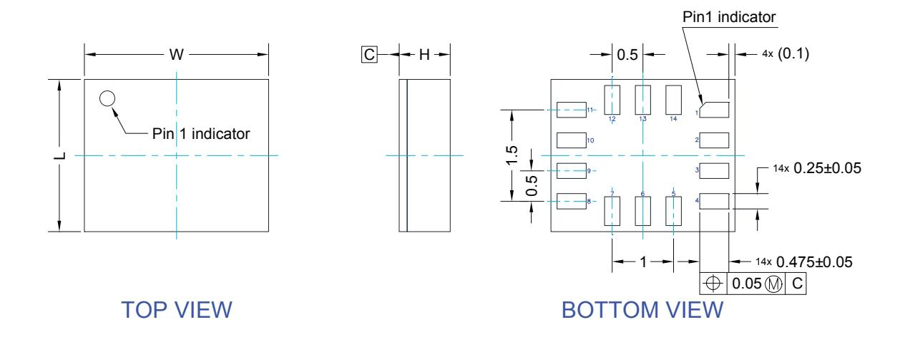

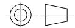

Dimensions are in millimeter unless otherwise specified General tolerance is +/-0.1mm unless otherwise specified

## **OUTER DIMENSIONS**

| ITEM       | DIMENSION [mm] | TOLERANCE [mm] |
|------------|----------------|----------------|
| Length [L] | 2.50           | ±0.1           |
| Width [W]  | 3.00           | ±0.1           |
| Height [H] | 0.86           | MAX            |

DM00249496\_5

DS13510 - Rev 4 page 175/198

<span id="page-175-0"></span>

# **19.2 LGA-14 packing information**

**Figure 34. Carrier tape information for LGA-14 package**


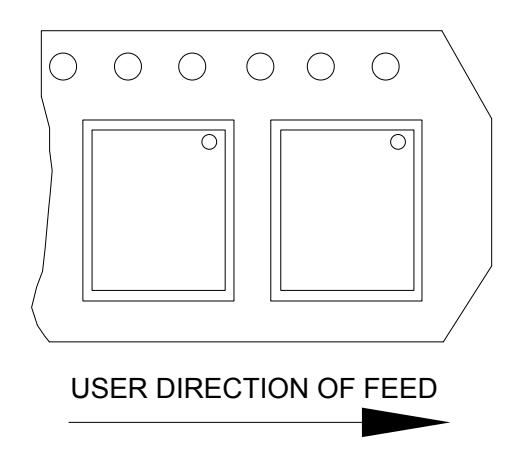

**DS13510** - **Rev 4 page 176/198**

<span id="page-176-0"></span>

A D B Full radius Tape slot in core for tape start 2.5mm min. width G measured at hub C N 40mm min. Access hole at slot location T

**Figure 36. Reel information for carrier tape of LGA-14 package**

**Table 506. Reel dimensions for carrier tape of LGA-14 package**

|         | Reel dimensions (mm) |  |  |
|---------|----------------------|--|--|
| A (max) | 330                  |  |  |
| B (min) | 1.5                  |  |  |
| C       | 13 ±0.25             |  |  |
| D (min) | 20.2                 |  |  |
| N (min) | 60                   |  |  |
| G       | 12.4 +2/-0           |  |  |
| T (max) | 18.4                 |  |  |

**DS13510** - **Rev 4 page 177/198**

<span id="page-177-0"></span>

# **Revision history**

**Table 507. Document revision history**

| Date        | Revision | Changes                                                                  |
|-------------|----------|--------------------------------------------------------------------------|
| 15-Jul-2022 | 1        | Initial release                                                          |
|             |          | Minor textual updates                                                    |
|             |          | Added Section 2.8 Sensor fusion low power                                |
| 18-Nov-2022 | 2        | Updated Section 6.5 High-accuracy ODR mode and added HAODR_CFG<br>(62h)  |
|             |          | Added Section 6.6 ODR-triggered mode and ODR_TRIG_CFG (06h)              |
|             |          | Minor update of registers in Section 9 Register description              |
| 01-Mar-2023 | 3        | Added Note to Section 3.1 Pin connections                                |
|             | 4        | Updated Section 2.1 Pedometer functions: step detector and step counters |
|             |          | Updated Note in Section 3.1 Pin connections                              |
| 25-May-2023 |          | Updated footnotes of Table 3. Mechanical characteristics                 |
|             |          | Updated Section 6 Functionality                                          |
|             |          | Updated Section 6.5 High-accuracy ODR mode                               |
|             |          | Updated registers in Section 9 Register description                      |

**DS13510** - **Rev 4 page 178/198**


# **Contents**

| 1 |     | Overview           | 3                                                        |    |
|---|-----|--------------------|----------------------------------------------------------|----|
| 2 |     |                    | Embedded low-power features<br>4                         |    |
|   | 2.1 |                    | Pedometer functions: step detector and step counters<br> | 4  |
|   | 2.2 |                    | Pedometer algorithm<br>                                  | 5  |
|   | 2.3 |                    | Tilt detection                                           | 5  |
|   | 2.4 |                    | Significant motion detection<br>                         | 5  |
|   | 2.5 |                    | Finite state machine<br>                                 | 6  |
|   | 2.6 |                    | Machine learning core<br>                                | 7  |
|   | 2.7 |                    | Adaptive self-configuration (ASC)                        | 7  |
|   | 2.8 |                    | Sensor fusion low power<br>                              | 8  |
| 3 |     | Pin description    | 9                                                        |    |
|   | 3.1 |                    | Pin connections<br>                                      | 10 |
| 4 |     |                    | Module specifications<br>12                              |    |
|   | 4.1 |                    | Mechanical characteristics<br>                           | 12 |
|   | 4.2 |                    | Electrical characteristics                               | 14 |
|   | 4.3 |                    | Temperature sensor characteristics<br>                   | 15 |
|   | 4.4 |                    | Communication interface characteristics<br>              | 16 |
|   |     | 4.4.1              | SPI - serial peripheral interface 16                     |    |
|   |     | 4.4.2              | I²C - inter-IC control interface 18                      |    |
|   | 4.5 |                    | Absolute maximum ratings                                 | 19 |
|   | 4.6 |                    | Terminology<br>                                          | 20 |
|   |     | 4.6.1              | Sensitivity 20                                           |    |
|   |     | 4.6.2              | Zero-g and zero-rate level 20                            |    |
| 5 |     | Digital interfaces | 21                                                       |    |
|   | 5.1 |                    | I²C/SPI interface<br>                                    | 21 |
|   |     | 5.1.1              | I²C serial interface 21                                  |    |
|   |     | 5.1.2              | I²C operation 22                                         |    |
|   |     | 5.1.3              | SPI bus interface 24                                     |    |
|   | 5.2 |                    | MIPI I3C® interface<br>                                  | 27 |
|   |     | 5.2.1              | MIPI I3C® slave interface<br>27                          |    |
|   |     | 5.2.2              | MIPI I3C® CCC supported commands<br>28                   |    |
|   |     | 5.2.3              | Overview of anti-spike filter management 29              |    |
|   | 5.3 |                    | Master I²C interface<br>                                 | 30 |
|   | 5.4 |                    | Auxiliary SPI interface                                  | 30 |


| 6.1  |                |                                                                                | 31                                                                                                                                                                                                                                                                                                                                                                                                                                                                                                                                                                                                                                                                                                                                                                                                                                                                                                                                                                   |
|------|----------------|--------------------------------------------------------------------------------|----------------------------------------------------------------------------------------------------------------------------------------------------------------------------------------------------------------------------------------------------------------------------------------------------------------------------------------------------------------------------------------------------------------------------------------------------------------------------------------------------------------------------------------------------------------------------------------------------------------------------------------------------------------------------------------------------------------------------------------------------------------------------------------------------------------------------------------------------------------------------------------------------------------------------------------------------------------------|
| 6.2  |                |                                                                                | 31                                                                                                                                                                                                                                                                                                                                                                                                                                                                                                                                                                                                                                                                                                                                                                                                                                                                                                                                                                   |
| 6.3  |                |                                                                                | 32                                                                                                                                                                                                                                                                                                                                                                                                                                                                                                                                                                                                                                                                                                                                                                                                                                                                                                                                                                   |
| 6.4  |                |                                                                                | 33                                                                                                                                                                                                                                                                                                                                                                                                                                                                                                                                                                                                                                                                                                                                                                                                                                                                                                                                                                   |
| 6.5  |                |                                                                                | 33                                                                                                                                                                                                                                                                                                                                                                                                                                                                                                                                                                                                                                                                                                                                                                                                                                                                                                                                                                   |
| 6.6  |                |                                                                                | 34                                                                                                                                                                                                                                                                                                                                                                                                                                                                                                                                                                                                                                                                                                                                                                                                                                                                                                                                                                   |
| 6.7  |                |                                                                                | 34                                                                                                                                                                                                                                                                                                                                                                                                                                                                                                                                                                                                                                                                                                                                                                                                                                                                                                                                                                   |
| 6.8  |                |                                                                                | 34                                                                                                                                                                                                                                                                                                                                                                                                                                                                                                                                                                                                                                                                                                                                                                                                                                                                                                                                                                   |
| 6.9  |                |                                                                                | 35                                                                                                                                                                                                                                                                                                                                                                                                                                                                                                                                                                                                                                                                                                                                                                                                                                                                                                                                                                   |
|      | 6.9.1          |                                                                                |                                                                                                                                                                                                                                                                                                                                                                                                                                                                                                                                                                                                                                                                                                                                                                                                                                                                                                                                                                      |
|      | 6.9.2          |                                                                                |                                                                                                                                                                                                                                                                                                                                                                                                                                                                                                                                                                                                                                                                                                                                                                                                                                                                                                                                                                      |
| 6.10 | Enhanced EIS   |                                                                                | 40                                                                                                                                                                                                                                                                                                                                                                                                                                                                                                                                                                                                                                                                                                                                                                                                                                                                                                                                                                   |
| 6.11 | OIS            |                                                                                | 41                                                                                                                                                                                                                                                                                                                                                                                                                                                                                                                                                                                                                                                                                                                                                                                                                                                                                                                                                                   |
|      | 6.11.1         |                                                                                |                                                                                                                                                                                                                                                                                                                                                                                                                                                                                                                                                                                                                                                                                                                                                                                                                                                                                                                                                                      |
| 6.12 | FIFO           |                                                                                | 44                                                                                                                                                                                                                                                                                                                                                                                                                                                                                                                                                                                                                                                                                                                                                                                                                                                                                                                                                                   |
|      | 6.12.1         |                                                                                |                                                                                                                                                                                                                                                                                                                                                                                                                                                                                                                                                                                                                                                                                                                                                                                                                                                                                                                                                                      |
|      | 6.12.2         |                                                                                |                                                                                                                                                                                                                                                                                                                                                                                                                                                                                                                                                                                                                                                                                                                                                                                                                                                                                                                                                                      |
|      | 6.12.3         |                                                                                |                                                                                                                                                                                                                                                                                                                                                                                                                                                                                                                                                                                                                                                                                                                                                                                                                                                                                                                                                                      |
|      | 6.12.4         |                                                                                |                                                                                                                                                                                                                                                                                                                                                                                                                                                                                                                                                                                                                                                                                                                                                                                                                                                                                                                                                                      |
|      | 6.12.5         |                                                                                |                                                                                                                                                                                                                                                                                                                                                                                                                                                                                                                                                                                                                                                                                                                                                                                                                                                                                                                                                                      |
|      | 6.12.6         |                                                                                |                                                                                                                                                                                                                                                                                                                                                                                                                                                                                                                                                                                                                                                                                                                                                                                                                                                                                                                                                                      |
|      |                |                                                                                |                                                                                                                                                                                                                                                                                                                                                                                                                                                                                                                                                                                                                                                                                                                                                                                                                                                                                                                                                                      |
|      |                |                                                                                |                                                                                                                                                                                                                                                                                                                                                                                                                                                                                                                                                                                                                                                                                                                                                                                                                                                                                                                                                                      |
|      |                |                                                                                |                                                                                                                                                                                                                                                                                                                                                                                                                                                                                                                                                                                                                                                                                                                                                                                                                                                                                                                                                                      |
|      |                |                                                                                | 47                                                                                                                                                                                                                                                                                                                                                                                                                                                                                                                                                                                                                                                                                                                                                                                                                                                                                                                                                                   |
| 7.2  |                |                                                                                | 48                                                                                                                                                                                                                                                                                                                                                                                                                                                                                                                                                                                                                                                                                                                                                                                                                                                                                                                                                                   |
| 7.3  |                |                                                                                | 49                                                                                                                                                                                                                                                                                                                                                                                                                                                                                                                                                                                                                                                                                                                                                                                                                                                                                                                                                                   |
|      |                |                                                                                |                                                                                                                                                                                                                                                                                                                                                                                                                                                                                                                                                                                                                                                                                                                                                                                                                                                                                                                                                                      |
|      |                |                                                                                |                                                                                                                                                                                                                                                                                                                                                                                                                                                                                                                                                                                                                                                                                                                                                                                                                                                                                                                                                                      |
| 9.1  |                |                                                                                | 56                                                                                                                                                                                                                                                                                                                                                                                                                                                                                                                                                                                                                                                                                                                                                                                                                                                                                                                                                                   |
| 9.2  | PIN_CTRL (02h) |                                                                                | 57                                                                                                                                                                                                                                                                                                                                                                                                                                                                                                                                                                                                                                                                                                                                                                                                                                                                                                                                                                   |
| 9.3  |                |                                                                                | 58                                                                                                                                                                                                                                                                                                                                                                                                                                                                                                                                                                                                                                                                                                                                                                                                                                                                                                                                                                   |
| 9.4  |                |                                                                                | 58                                                                                                                                                                                                                                                                                                                                                                                                                                                                                                                                                                                                                                                                                                                                                                                                                                                                                                                                                                   |
| 9.5  |                |                                                                                | 59                                                                                                                                                                                                                                                                                                                                                                                                                                                                                                                                                                                                                                                                                                                                                                                                                                                                                                                                                                   |
| 9.6  |                |                                                                                | 59                                                                                                                                                                                                                                                                                                                                                                                                                                                                                                                                                                                                                                                                                                                                                                                                                                                                                                                                                                   |
|      | 7.1            | Functionality<br>6.12.7<br>6.12.8<br>Application hints<br>Register description | 31<br>Operating modes<br>Accelerometer power modes<br><br>Accelerometer dual-channel mode<br><br>Gyroscope power modes<br><br>High-accuracy ODR mode<br><br>ODR-triggered mode<br><br>Analog hub functionality<br><br>Qvar functionality<br>Block diagram of filters<br><br>Block diagrams of the accelerometer filters 36<br>Block diagrams of the gyroscope filters 38<br><br><br>Enabling OIS functionality and connection schemes 41<br><br>Bypass mode 44<br>FIFO mode 45<br>Continuous mode 45<br>Continuous-to-FIFO mode 45<br>ContinuousWTM-to-full mode 45<br>Bypass-to-continuous mode 46<br>Bypass-to-FIFO mode 46<br>FIFO reading procedure 46<br>47<br>LSM6DSV16X electrical connections in mode 1<br><br>LSM6DSV16X electrical connections in mode 2<br><br>LSM6DSV16X electrical connections in mode 3<br><br>Register mapping52<br>56<br>FUNC_CFG_ACCESS (01h)<br><br>IF_CFG (03h)<br>ODR_TRIG_CFG (06h)<br><br>FIFO_CTRL1 (07h)<br>FIFO_CTRL2 (08h) |


| 9.7  | FIFO_CTRL3 (09h)                                                | 60 |
|------|-----------------------------------------------------------------|----|
| 9.8  | FIFO_CTRL4 (0Ah)                                                | 61 |
| 9.9  | COUNTER_BDR_REG1 (0Bh)<br>                                      | 62 |
| 9.10 | COUNTER_BDR_REG2 (0Ch)<br>                                      | 62 |
| 9.11 | INT1_CTRL (0Dh)                                                 | 63 |
| 9.12 | INT2_CTRL (0Eh)<br>                                             | 64 |
| 9.13 | WHO_AM_I (0Fh)<br>                                              | 64 |
| 9.14 | CTRL1 (10h)<br>                                                 | 65 |
| 9.15 | CTRL2 (11h)<br>                                                 | 66 |
| 9.16 | CTRL3 (12h)<br>                                                 | 67 |
| 9.17 | CTRL4 (13h)<br>                                                 | 68 |
| 9.18 | CTRL5 (14h)<br>                                                 | 69 |
| 9.19 | CTRL6 (15h)<br>                                                 | 69 |
| 9.20 | CTRL7 (16h)<br>                                                 | 70 |
| 9.21 | CTRL8 (17h)<br>                                                 | 71 |
| 9.22 | CTRL9 (18h)<br>                                                 | 72 |
| 9.23 | CTRL10 (19h)<br>                                                | 74 |
| 9.24 | CTRL_STATUS (1Ah)                                               | 74 |
| 9.25 | FIFO_STATUS1 (1Bh)<br>                                          | 75 |
| 9.26 | FIFO_STATUS2 (1Ch)<br>                                          | 75 |
| 9.27 | ALL_INT_SRC (1Dh)<br>                                           | 76 |
| 9.28 | STATUS_REG (1Eh)                                                | 77 |
| 9.29 | OUT_TEMP_L (20h), OUT_TEMP_H (21h)                              | 78 |
| 9.30 | OUTX_L_G (22h) and OUTX_H_G (23h)<br>                           | 78 |
| 9.31 | OUTY_L_G (24h) and OUTY_H_G (25h)<br>                           | 79 |
| 9.32 | OUTZ_L_G (26h) and OUTZ_H_G (27h)                               | 79 |
| 9.33 | OUTX_L_A (28h) and OUTX_H_A (29h)<br>                           | 80 |
| 9.34 | OUTY_L_A (2Ah) and OUTY_H_A (2Bh)<br>                           | 80 |
| 9.35 | OUTZ_L_A (2Ch) and OUTZ_H_A (2Dh)<br>                           | 81 |
| 9.36 | UI_OUTX_L_G_OIS_EIS (2Eh) and UI_OUTX_H_G_OIS_EIS (2Fh)<br>     | 81 |
| 9.37 | UI_OUTY_L_G_OIS_EIS (30h) and UI_OUTY_H_G_OIS_EIS (31h)<br>     | 82 |
| 9.38 | UI_OUTZ_L_G_OIS_EIS (32h) and UI_OUTZ_H_G_OIS_EIS (33h)<br>     | 82 |
| 9.39 | UI_OUTX_L_A_OIS_DualC (34h) and UI_OUTX_H_A_OIS_DualC (35h)<br> | 83 |
| 9.40 | UI_OUTY_L_A_OIS_DualC (36h) and UI_OUTY_H_A_OIS_DualC (37h)<br> | 83 |
| 9.41 | UI_OUTZ_L_A_OIS_DualC (38h) and UI_OUTZ_H_A_OIS_DualC (39h)<br> | 84 |
| 9.42 | AH_QVAR_OUT_L (3Ah) and AH_QVAR_OUT_H (3Bh)<br>                 | 84 |


| 9.43 | TIMESTAMPU (40n), TIMESTAMPT (41n), TIMESTAMPZ (42n), and TIMESTAMP3 (43 | sn) 85 |
|------|--------------------------------------------------------------------------|--------|
| 9.44 | UI_STATUS_REG_OIS (44h)                                                  | 85     |
| 9.45 | WAKE_UP_SRC (45h)                                                        | 86     |
| 9.46 | TAP_SRC (46h)                                                            | 87     |
| 9.47 | D6D_SRC (47h)                                                            | 88     |
| 9.48 | STATUS_MASTER_MAINPAGE (48h)                                             | 88     |
| 9.49 | EMB_FUNC_STATUS_MAINPAGE (49h)                                           | 89     |
| 9.50 | FSM_STATUS_MAINPAGE (4Ah)                                                | 89     |
| 9.51 | MLC_STATUS_MAINPAGE (4Bh)                                                | 90     |
| 9.52 | INTERNAL_FREQ_FINE (4Fh)                                                 | 90     |
| 9.53 | FUNCTIONS_ENABLE (50h)                                                   | 91     |
| 9.54 | DEN (51h)                                                                | 92     |
| 9.55 | INACTIVITY_DUR (54h)                                                     | 93     |
| 9.56 | INACTIVITY_THS (55h)                                                     | 93     |
| 9.57 | TAP_CFG0 (56h)                                                           |        |
| 9.58 | TAP_CFG1 (57h)                                                           | 95     |
| 9.59 | TAP_CFG2 (58h)                                                           | 95     |
| 9.60 | TAP_THS_6D (59h)                                                         | 96     |
| 9.61 | TAP_DUR (5Ah)                                                            | 97     |
| 9.62 | WAKE_UP_THS (5Bh)                                                        | 97     |
| 9.63 | WAKE_UP_DUR (5Ch)                                                        | 98     |
| 9.64 | FREE_FALL (5Dh)                                                          | 98     |
| 9.65 | MD1_CFG (5Eh)                                                            | 99     |
| 9.66 | MD2_CFG (5Fh)                                                            |        |
| 9.67 | HAODR_CFG (62h)                                                          | 100    |
| 9.68 | EMB_FUNC_CFG (63h)                                                       | 101    |
| 9.69 | UI_HANDSHAKE_CTRL (64h)                                                  | 101    |
| 9.70 | UI_SPI2_SHARED_0 (65h)                                                   | 102    |
| 9.71 | UI_SPI2_SHARED_1 (66h)                                                   | 102    |
| 9.72 | UI_SPI2_SHARED_2 (67h)                                                   | 102    |
| 9.73 | UI_SPI2_SHARED_3 (68h)                                                   | 103    |
| 9.74 | UI_SPI2_SHARED_4 (69h)                                                   | 103    |
| 9.75 | UI_SPI2_SHARED_5 (6Ah)                                                   | 103    |
| 9.76 | CTRL_EIS (6Bh)                                                           | 104    |
| 9.77 | UI_INT_OIS (6Fh)                                                         | 105    |
| 9.78 | UI_CTRL1_OIS (70h)                                                       | 106    |


| 9.80<br>UI_CTRL3_OIS (72h)<br>108<br>9.81<br>X_OFS_USR (73h)<br>109<br>9.82<br>Y_OFS_USR (74h)<br>109<br>9.83<br>Z_OFS_USR (75h)<br>109<br>9.84<br>FIFO_DATA_OUT_TAG (78h)<br><br>9.85<br>FIFO_DATA_OUT_X_L (79h) and FIFO_DATA_OUT_X_H (7Ah)<br><br>9.86<br>FIFO_DATA_OUT_Y_L (7Bh) and FIFO_DATA_OUT_Y_H (7Ch)<br><br>9.87<br>FIFO_DATA_OUT_Z_L (7Dh) and FIFO_DATA_OUT_Z_H (7Eh)<br><br>10<br>SPI2 register mapping<br><br>11<br>SPI2 register description<br>11.1<br>SPI2_WHO_AM_I (0Fh)<br>11.2<br>SPI2_STATUS_REG_OIS (1Eh)<br><br>11.3<br>SPI2_OUT_TEMP_L (20h) and SPI2_OUT_TEMP_H (21h)<br>11.4<br>SPI2_OUTX_L_G_OIS (22h) and SPI2_OUTX_H_G_OIS (23h)<br><br>11.5<br>SPI2_OUTY_L_G_OIS (24h) and SPI2_OUTY_H_G_OIS (25h)<br><br>11.6<br>SPI2_OUTZ_L_G_OIS (26h) and SPI2_OUTZ_H_G_OIS (27h)<br><br>11.7<br>SPI2_OUTX_L_A_OIS (28h) and SPI2_OUTX_H_A_OIS (29h)<br><br>11.8<br>SPI2_OUTY_L_A_OIS (2Ah) and SPI2_OUTY_H_A_OIS (2Bh)<br><br>11.9<br>SPI2_OUTZ_L_A_OIS (2Ch) and SPI2_OUTZ_H_A_OIS (2Dh)<br><br>11.10<br>SPI2_HANDSHAKE_CTRL (6Eh)<br>11.11<br>SPI2_INT_OIS (6Fh)<br><br>11.12<br>SPI2_CTRL1_OIS (70h)<br>11.13<br>SPI2_CTRL2_OIS (71h)<br>11.14<br>SPI2_CTRL3_OIS (72h)120<br>12<br>Embedded functions register mapping<br>13<br>Embedded functions register description<br><br>13.1<br>PAGE_SEL (02h)<br>123<br>13.2<br>EMB_FUNC_EN_A (04h)123<br>13.3<br>EMB_FUNC_EN_B (05h)124<br>13.4<br>EMB_FUNC_EXEC_STATUS (07h)<br>124<br>13.5<br>PAGE_ADDRESS (08h)125<br>13.6<br>PAGE_VALUE (09h)<br>125 | 9.79 | UI_CTRL2_OIS (71h)<br>107  |     |
|---------------------------------------------------------------------------------------------------------------------------------------------------------------------------------------------------------------------------------------------------------------------------------------------------------------------------------------------------------------------------------------------------------------------------------------------------------------------------------------------------------------------------------------------------------------------------------------------------------------------------------------------------------------------------------------------------------------------------------------------------------------------------------------------------------------------------------------------------------------------------------------------------------------------------------------------------------------------------------------------------------------------------------------------------------------------------------------------------------------------------------------------------------------------------------------------------------------------------------------------------------------------------------------------------------------------------------------------------------------------------------------------------------------------------------------------------------------------------------------------------------------------------|------|----------------------------|-----|
|                                                                                                                                                                                                                                                                                                                                                                                                                                                                                                                                                                                                                                                                                                                                                                                                                                                                                                                                                                                                                                                                                                                                                                                                                                                                                                                                                                                                                                                                                                                           |      |                            |     |
|                                                                                                                                                                                                                                                                                                                                                                                                                                                                                                                                                                                                                                                                                                                                                                                                                                                                                                                                                                                                                                                                                                                                                                                                                                                                                                                                                                                                                                                                                                                           |      |                            |     |
|                                                                                                                                                                                                                                                                                                                                                                                                                                                                                                                                                                                                                                                                                                                                                                                                                                                                                                                                                                                                                                                                                                                                                                                                                                                                                                                                                                                                                                                                                                                           |      |                            |     |
|                                                                                                                                                                                                                                                                                                                                                                                                                                                                                                                                                                                                                                                                                                                                                                                                                                                                                                                                                                                                                                                                                                                                                                                                                                                                                                                                                                                                                                                                                                                           |      |                            |     |
|                                                                                                                                                                                                                                                                                                                                                                                                                                                                                                                                                                                                                                                                                                                                                                                                                                                                                                                                                                                                                                                                                                                                                                                                                                                                                                                                                                                                                                                                                                                           |      |                            | 110 |
|                                                                                                                                                                                                                                                                                                                                                                                                                                                                                                                                                                                                                                                                                                                                                                                                                                                                                                                                                                                                                                                                                                                                                                                                                                                                                                                                                                                                                                                                                                                           |      |                            | 111 |
|                                                                                                                                                                                                                                                                                                                                                                                                                                                                                                                                                                                                                                                                                                                                                                                                                                                                                                                                                                                                                                                                                                                                                                                                                                                                                                                                                                                                                                                                                                                           |      |                            | 111 |
|                                                                                                                                                                                                                                                                                                                                                                                                                                                                                                                                                                                                                                                                                                                                                                                                                                                                                                                                                                                                                                                                                                                                                                                                                                                                                                                                                                                                                                                                                                                           |      |                            | 111 |
|                                                                                                                                                                                                                                                                                                                                                                                                                                                                                                                                                                                                                                                                                                                                                                                                                                                                                                                                                                                                                                                                                                                                                                                                                                                                                                                                                                                                                                                                                                                           |      |                            | 112 |
|                                                                                                                                                                                                                                                                                                                                                                                                                                                                                                                                                                                                                                                                                                                                                                                                                                                                                                                                                                                                                                                                                                                                                                                                                                                                                                                                                                                                                                                                                                                           |      |                            | 113 |
|                                                                                                                                                                                                                                                                                                                                                                                                                                                                                                                                                                                                                                                                                                                                                                                                                                                                                                                                                                                                                                                                                                                                                                                                                                                                                                                                                                                                                                                                                                                           |      |                            | 113 |
|                                                                                                                                                                                                                                                                                                                                                                                                                                                                                                                                                                                                                                                                                                                                                                                                                                                                                                                                                                                                                                                                                                                                                                                                                                                                                                                                                                                                                                                                                                                           |      |                            | 113 |
|                                                                                                                                                                                                                                                                                                                                                                                                                                                                                                                                                                                                                                                                                                                                                                                                                                                                                                                                                                                                                                                                                                                                                                                                                                                                                                                                                                                                                                                                                                                           |      |                            | 113 |
|                                                                                                                                                                                                                                                                                                                                                                                                                                                                                                                                                                                                                                                                                                                                                                                                                                                                                                                                                                                                                                                                                                                                                                                                                                                                                                                                                                                                                                                                                                                           |      |                            | 114 |
|                                                                                                                                                                                                                                                                                                                                                                                                                                                                                                                                                                                                                                                                                                                                                                                                                                                                                                                                                                                                                                                                                                                                                                                                                                                                                                                                                                                                                                                                                                                           |      |                            | 114 |
|                                                                                                                                                                                                                                                                                                                                                                                                                                                                                                                                                                                                                                                                                                                                                                                                                                                                                                                                                                                                                                                                                                                                                                                                                                                                                                                                                                                                                                                                                                                           |      |                            | 115 |
|                                                                                                                                                                                                                                                                                                                                                                                                                                                                                                                                                                                                                                                                                                                                                                                                                                                                                                                                                                                                                                                                                                                                                                                                                                                                                                                                                                                                                                                                                                                           |      |                            | 115 |
|                                                                                                                                                                                                                                                                                                                                                                                                                                                                                                                                                                                                                                                                                                                                                                                                                                                                                                                                                                                                                                                                                                                                                                                                                                                                                                                                                                                                                                                                                                                           |      |                            | 116 |
|                                                                                                                                                                                                                                                                                                                                                                                                                                                                                                                                                                                                                                                                                                                                                                                                                                                                                                                                                                                                                                                                                                                                                                                                                                                                                                                                                                                                                                                                                                                           |      |                            | 116 |
|                                                                                                                                                                                                                                                                                                                                                                                                                                                                                                                                                                                                                                                                                                                                                                                                                                                                                                                                                                                                                                                                                                                                                                                                                                                                                                                                                                                                                                                                                                                           |      |                            | 116 |
|                                                                                                                                                                                                                                                                                                                                                                                                                                                                                                                                                                                                                                                                                                                                                                                                                                                                                                                                                                                                                                                                                                                                                                                                                                                                                                                                                                                                                                                                                                                           |      |                            | 117 |
|                                                                                                                                                                                                                                                                                                                                                                                                                                                                                                                                                                                                                                                                                                                                                                                                                                                                                                                                                                                                                                                                                                                                                                                                                                                                                                                                                                                                                                                                                                                           |      |                            | 118 |
|                                                                                                                                                                                                                                                                                                                                                                                                                                                                                                                                                                                                                                                                                                                                                                                                                                                                                                                                                                                                                                                                                                                                                                                                                                                                                                                                                                                                                                                                                                                           |      |                            | 119 |
|                                                                                                                                                                                                                                                                                                                                                                                                                                                                                                                                                                                                                                                                                                                                                                                                                                                                                                                                                                                                                                                                                                                                                                                                                                                                                                                                                                                                                                                                                                                           |      |                            |     |
|                                                                                                                                                                                                                                                                                                                                                                                                                                                                                                                                                                                                                                                                                                                                                                                                                                                                                                                                                                                                                                                                                                                                                                                                                                                                                                                                                                                                                                                                                                                           |      |                            | 121 |
|                                                                                                                                                                                                                                                                                                                                                                                                                                                                                                                                                                                                                                                                                                                                                                                                                                                                                                                                                                                                                                                                                                                                                                                                                                                                                                                                                                                                                                                                                                                           |      |                            | 123 |
|                                                                                                                                                                                                                                                                                                                                                                                                                                                                                                                                                                                                                                                                                                                                                                                                                                                                                                                                                                                                                                                                                                                                                                                                                                                                                                                                                                                                                                                                                                                           |      |                            |     |
|                                                                                                                                                                                                                                                                                                                                                                                                                                                                                                                                                                                                                                                                                                                                                                                                                                                                                                                                                                                                                                                                                                                                                                                                                                                                                                                                                                                                                                                                                                                           |      |                            |     |
|                                                                                                                                                                                                                                                                                                                                                                                                                                                                                                                                                                                                                                                                                                                                                                                                                                                                                                                                                                                                                                                                                                                                                                                                                                                                                                                                                                                                                                                                                                                           |      |                            |     |
|                                                                                                                                                                                                                                                                                                                                                                                                                                                                                                                                                                                                                                                                                                                                                                                                                                                                                                                                                                                                                                                                                                                                                                                                                                                                                                                                                                                                                                                                                                                           |      |                            |     |
|                                                                                                                                                                                                                                                                                                                                                                                                                                                                                                                                                                                                                                                                                                                                                                                                                                                                                                                                                                                                                                                                                                                                                                                                                                                                                                                                                                                                                                                                                                                           |      |                            |     |
|                                                                                                                                                                                                                                                                                                                                                                                                                                                                                                                                                                                                                                                                                                                                                                                                                                                                                                                                                                                                                                                                                                                                                                                                                                                                                                                                                                                                                                                                                                                           |      |                            |     |
|                                                                                                                                                                                                                                                                                                                                                                                                                                                                                                                                                                                                                                                                                                                                                                                                                                                                                                                                                                                                                                                                                                                                                                                                                                                                                                                                                                                                                                                                                                                           | 13.7 | EMB_FUNC_INT1 (0Ah)<br>125 |     |
| 13.8<br>FSM_INT1 (0Bh)<br>126                                                                                                                                                                                                                                                                                                                                                                                                                                                                                                                                                                                                                                                                                                                                                                                                                                                                                                                                                                                                                                                                                                                                                                                                                                                                                                                                                                                                                                                                                             |      |                            |     |


| 13.9  | MLC_INT1 (0Dh)                                               | 127   |
|-------|--------------------------------------------------------------|-------|
| 13.10 | EMB_FUNC_INT2 (0Eh)                                          | 127   |
| 13.11 | FSM_INT2 (0Fh)                                               | 128   |
| 13.12 | MLC_INT2 (11h)                                               | 129   |
| 13.13 | EMB_FUNC_STATUS (12h)                                        | 129   |
| 13.14 | FSM_STATUS (13h)                                             | 130   |
| 13.15 | MLC_STATUS (15h)                                             | 130   |
| 13.16 | PAGE_RW (17h)                                                | 131   |
| 13.17 | EMB_FUNC_FIFO_EN_A (44h)                                     | 131   |
| 13.18 | EMB_FUNC_FIFO_EN_B (45h)                                     | 132   |
| 13.19 | FSM_ENABLE (46h)                                             | 132   |
| 13.20 | FSM_LONG_COUNTER_L (48h) and FSM_LONG_COUNTER_H (49h)        | 133   |
| 13.21 | INT_ACK_MASK (4Bh)                                           | 134   |
| 13.22 | FSM_OUTS1 (4Ch)                                              | 135   |
| 13.23 | FSM_OUTS2 (4Dh)                                              | 135   |
| 13.24 | FSM_OUTS3 (4Eh).                                             | 136   |
| 13.25 | FSM_OUTS4 (4Fh)                                              | 136   |
| 13.26 | FSM_OUTS5 (50h)                                              | 137   |
| 13.27 | FSM_OUTS6 (51h)                                              | 137   |
| 13.28 | FSM_OUTS7 (52h)                                              | 138   |
| 13.29 | FSM_OUTS8 (53h)                                              | 138   |
| 13.30 | SFLP_ODR (5Eh)                                               | 139   |
| 13.31 | FSM_ODR (5Fh)                                                | 139   |
| 13.32 | MLC_ODR (60h)                                                | 140   |
| 13.33 | STEP_COUNTER_L (62h) and STEP_COUNTER_H (63h)                | 140   |
| 13.34 | EMB_FUNC_SRC (64h)                                           | 141   |
| 13.35 | EMB_FUNC_INIT_A (66h)                                        | 142   |
|       | EMB_FUNC_INIT_B (67h)                                        |       |
|       | MLC1_SRC (70h)                                               |       |
| 13.38 | MLC2_SRC (71h)                                               | 143   |
| 13.39 | MLC3_SRC (72h)                                               | 143   |
| 13.40 | MLC4_SRC (73h)                                               | 143   |
|       | edded advanced features pages                                |       |
| Embe  | edded advanced features register description                 | . 147 |
| 15.1  | Page 0 - embedded advanced features registers                | 147   |
|       | 15.1.1 SFLP_GAME_GBIASX_L (6Eh) and SFLP_GAME_GBIASX_H (6Fh) | 147   |

14

15


|    |      | 15.1.2  | SFLP_GAME_GBIASY_L (70h) and SFLP_GAME_GBIASY_H (71h) 147                                           |     |
|----|------|---------|-----------------------------------------------------------------------------------------------------|-----|
|    |      | 15.1.3  | SFLP_GAME_GBIASZ_L (72h) and SFLP_GAME_GBIASZ_H (73h) 148                                           |     |
|    |      | 15.1.4  | FSM_EXT_SENSITIVITY_L (BAh) and FSM_EXT_SENSITIVITY_H (BBh) 148                                     |     |
|    |      | 15.1.5  | FSM_EXT_OFFX_L (C0h) and FSM_EXT_OFFX_H (C1h) 149                                                   |     |
|    |      | 15.1.6  | FSM_EXT_OFFY_L (C2h) and FSM_EXT_OFFY_H (C3h) 149                                                   |     |
|    |      | 15.1.7  | FSM_EXT_OFFZ_L (C4h) and FSM_EXT_OFFZ_H (C5h) 150                                                   |     |
|    |      | 15.1.8  | FSM_EXT_MATRIX_XX_L (C6h) and FSM_EXT_MATRIX_XX_H (C7h) 150                                         |     |
|    |      | 15.1.9  | FSM_EXT_MATRIX_XY_L (C8h) and FSM_EXT_MATRIX_XY_H (C9h) 151                                         |     |
|    |      | 15.1.10 | FSM_EXT_MATRIX_XZ_L (CAh) and FSM_EXT_MATRIX_XZ_H (CBh) 151                                         |     |
|    |      | 15.1.11 | FSM_EXT_MATRIX_YY_L (CCh) and FSM_EXT_MATRIX_YY_H (CDh) 152                                         |     |
|    |      | 15.1.12 | FSM_EXT_MATRIX_YZ_L (CEh) and FSM_EXT_MATRIX_YZ_H (CFh) 152                                         |     |
|    |      | 15.1.13 | FSM_EXT_MATRIX_ZZ_L (D0h) and FSM_EXT_MATRIX_ZZ_H (D1h) 153                                         |     |
|    |      | 15.1.14 | EXT_CFG_A (D4h) 154                                                                                 |     |
|    |      | 15.1.15 | EXT_CFG_B (D5h) 154                                                                                 |     |
|    | 15.2 |         | Page 1 - embedded advanced features registers<br>155                                                |     |
|    |      | 15.2.1  | FSM_LC_TIMEOUT_L (7Ah) and FSM_LC_TIMEOUT_H (7Bh) 155                                               |     |
|    |      | 15.2.2  | FSM_PROGRAMS (7Ch) 155                                                                              |     |
|    |      | 15.2.3  | FSM_START_ADD_L (7Eh) and FSM_START_ADD_H (7Fh) 156                                                 |     |
|    |      | 15.2.4  | PEDO_CMD_REG (83h) 156                                                                              |     |
|    |      | 15.2.5  | PEDO_DEB_STEPS_CONF (84h) 157                                                                       |     |
|    |      | 15.2.6  | PEDO_SC_DELTAT_L (D0h) and PEDO_SC_DELTAT_H (D1h) 157                                               |     |
|    |      | 15.2.7  | MLC_EXT_SENSITIVITY_L (E8h) and MLC_EXT_SENSITIVITY_H (E9h) 158                                     |     |
|    | 15.3 |         | Page 2 - embedded advanced features registers<br>159                                                |     |
|    |      | 15.3.1  | EXT_FORMAT (00h) 159                                                                                |     |
|    |      | 15.3.2  | EXT_3BYTE_SENSITIVITY_L (02h) and EXT_3BYTE_SENSITIVITY_H (03h) 159                                 |     |
|    |      | 15.3.3  | EXT_3BYTE_OFFSET_XL<br>(06h),<br>EXT_3BYTE_OFFSET_L<br>(07h)<br>and<br>EXT_3BYTE_OFFSET_H (08h) 160 |     |
| 16 |      |         | Sensor hub register mapping<br>                                                                     | 161 |
| 17 |      |         | Sensor hub register description                                                                     | 162 |
|    | 17.1 |         | SENSOR_HUB_1 (02h)<br>162                                                                           |     |
|    | 17.2 |         | SENSOR_HUB_2 (03h)<br>162                                                                           |     |
|    | 17.3 |         | SENSOR_HUB_3 (04h)<br>162                                                                           |     |
|    | 17.4 |         | SENSOR_HUB_4 (05h)<br>163                                                                           |     |
|    | 17.5 |         | SENSOR_HUB_5 (06h)<br>163                                                                           |     |
|    | 17.6 |         | SENSOR_HUB_6 (07h)<br>163                                                                           |     |
|    | 17.7 |         | SENSOR_HUB_7 (08h)<br>164                                                                           |     |
|    | 17.8 |         | SENSOR_HUB_8 (09h)<br>164                                                                           |     |
|    |      |         |                                                                                                     |     |

**DS13510** - **Rev 4 page 185/198**


|     | 17.9         | SENSOR_HUB_9 (0Ah)          | .164  |  |
|-----|--------------|-----------------------------|-------|--|
|     | 17.10        | SENSOR_HUB_10 (0Bh)         | .165  |  |
|     | 17.11        | SENSOR_HUB_11 (0Ch)         | . 165 |  |
|     | 17.12        | SENSOR_HUB_12 (0Dh)         | . 165 |  |
|     | 17.13        | SENSOR_HUB_13 (0Eh)         | .166  |  |
|     | 17.14        | SENSOR_HUB_14 (0Fh)         | .166  |  |
|     | 17.15        | SENSOR_HUB_15 (10h)         | .166  |  |
|     | 17.16        | SENSOR_HUB_16 (11h)         | .167  |  |
|     | 17.17        | SENSOR_HUB_17 (12h)         | .167  |  |
|     | 17.18        | SENSOR_HUB_18 (13h)         | .167  |  |
|     | 17.19        | MASTER_CONFIG (14h)         | .168  |  |
|     | 17.20        | SLV0_ADD (15h)              | .169  |  |
|     | 17.21        | SLV0_SUBADD (16h)           | . 169 |  |
|     | 17.22        | SLV0_CONFIG (17h)           | .169  |  |
|     | 17.23        | SLV1_ADD (18h)              | . 170 |  |
|     | 17.24        | SLV1_SUBADD (19h)           | . 170 |  |
|     | 17.25        | SLV1_CONFIG (1Ah)           | . 170 |  |
|     | 17.26        | SLV2_ADD (1Bh)              | .171  |  |
|     | 17.27        | SLV2_SUBADD (1Ch)           | .171  |  |
|     | 17.28        | SLV2_CONFIG (1Dh)           | .171  |  |
|     | 17.29        | SLV3_ADD (1Eh)              | .172  |  |
|     | 17.30        | SLV3_SUBADD (1Fh)           | .172  |  |
|     | 17.31        | SLV3_CONFIG (20h)           | .172  |  |
|     | 17.32        | DATAWRITE_SLV0 (21h)        | . 173 |  |
|     | 17.33        | STATUS_MASTER (22h)         | .173  |  |
| 18  | Solde        | ering information           | 174   |  |
| 19  | Pack         | age information             | 175   |  |
|     | 19.1         | LGA-14L package information | .175  |  |
|     | 19.2         | LGA-14 packing information  | . 176 |  |
| Rev | ision h      | nistory                     | 178   |  |
|     |              | les                         |       |  |
|     | t of figures |                             |       |  |


<span id="page-186-0"></span>

| Table 1.  | Sensor fusion performance 8                                                      |  |
|-----------|----------------------------------------------------------------------------------|--|
| Table 2.  | Pin description 11                                                               |  |
| Table 3.  | Mechanical characteristics 12                                                    |  |
| Table 4.  | Electrical characteristics 14                                                    |  |
| Table 5.  | Electrical parameters of Qvar (@Vdd = 1.8 V, T = 25 °C) 14                       |  |
| Table 6.  | Temperature sensor characteristics 15                                            |  |
| Table 7.  | SPI slave timing values 16                                                       |  |
| Table 8.  | I²C slave timing values 18                                                       |  |
| Table 9.  | Absolute maximum ratings 19                                                      |  |
| Table 10. | Serial interface pin description 21                                              |  |
| Table 11. | I²C terminology 21                                                               |  |
| Table 12. | SAD+read/write patterns 22                                                       |  |
| Table 13. | Transfer when master is writing one byte to slave 22                             |  |
| Table 14. | Transfer when master is writing multiple bytes to slave 22                       |  |
| Table 15. | Transfer when master is receiving (reading) one byte of data from slave 22       |  |
| Table 16. | Transfer when master is receiving (reading) multiple bytes of data from slave 22 |  |
|           |                                                                                  |  |
| Table 17. | MIPI I3C® CCC commands<br>28                                                     |  |
| Table 18. | Master I²C pin details 30                                                        |  |
| Table 19. | Auxiliary SPI pin details 30                                                     |  |
| Table 20. | Accelerometer and gyroscope ODR selection in high-accuracy ODR mode 33           |  |
| Table 21. | Gyroscope LPF2 bandwidth selection 38                                            |  |
| Table 22. | OIS configurations 41                                                            |  |
| Table 23. | Internal pin status 50                                                           |  |
| Table 24. | Registers address map 52                                                         |  |
| Table 25. | FUNC_CFG_ACCESS register 56                                                      |  |
| Table 26. | FUNC_CFG_ACCESS register description 56                                          |  |
| Table 27. | PIN_CTRL register 57                                                             |  |
| Table 28. | PIN_CTRL register description 57                                                 |  |
| Table 29. | IF_CFG register 58                                                               |  |
| Table 30. | IF_CFG register description 58                                                   |  |
| Table 31. | ODR_TRIG_CFG register 58                                                         |  |
| Table 32. | ODR_TRIG_CFG register description 58                                             |  |
| Table 33. | FIFO_CTRL1 register 59                                                           |  |
| Table 34. | FIFO_CTRL1 register description 59                                               |  |
| Table 35. | FIFO_CTRL2 register 59                                                           |  |
| Table 36. | FIFO_CTRL2 register description 59                                               |  |
| Table 37. | FIFO_CTRL3 register 60                                                           |  |
| Table 38. | FIFO_CTRL3 register description 60                                               |  |
| Table 39. | FIFO_CTRL4 register 61                                                           |  |
| Table 40. | FIFO_CTRL4 register description 61                                               |  |
| Table 41. | COUNTER_BDR_REG1 register 62                                                     |  |
| Table 42. | COUNTER_BDR_REG1 register description 62                                         |  |
| Table 43. | COUNTER_BDR_REG2 register 62                                                     |  |
| Table 44. | COUNTER_BDR_REG2 register description 62                                         |  |
| Table 45. | INT1_CTRL register 63                                                            |  |
| Table 46. | INT1_CTRL register description 63                                                |  |
| Table 47. | INT2_CTRL register 64                                                            |  |
| Table 48. | INT2_CTRL register description 64                                                |  |
| Table 49. | WhoAmI register 64                                                               |  |
| Table 50. | CTRL1 register 65                                                                |  |
| Table 51. | CTRL1 register description 65                                                    |  |
| Table 52. | Accelerometer ODR selection 65                                                   |  |
| Table 53. | CTRL2 register 66                                                                |  |
|           |                                                                                  |  |


| Table 54.              | CTRL2 register description 66                            |  |
|------------------------|----------------------------------------------------------|--|
| Table 55.              | Gyroscope ODR selection 66                               |  |
| Table 56.              | CTRL3 register 67                                        |  |
| Table 57.              | CTRL3 register description 67                            |  |
| Table 58.              | CTRL4 register 68                                        |  |
| Table 59.              | CTRL4 register description 68                            |  |
| Table 60.              | CTRL5 register 69                                        |  |
| Table 61.              | CTRL5 register description 69                            |  |
| Table 62.              | CTRL6 register 69                                        |  |
| Table 63.              | CTRL6 register description 69                            |  |
| Table 64.              | Gyroscope LPF1 + LPF2 bandwidth selection 70             |  |
| Table 65.              | CTRL7 register 70                                        |  |
| Table 66.              | CTRL7 register description 70                            |  |
| Table 67.              | CTRL8 register 71                                        |  |
| Table 68.              | CTRL8 register description 71                            |  |
| Table 69.              | Accelerometer bandwidth configurations 71                |  |
| Table 70.              | CTRL9 register 72                                        |  |
| Table 71.              | CTRL9 register description 72                            |  |
| Table 72.              | CTRL10 register 74                                       |  |
| Table 73.              | CTRL10 register description 74                           |  |
| Table 74.              | CTRL_STATUS register 74                                  |  |
| Table 75.              | CTRL_STATUS register description 74                      |  |
| Table 76.              | FIFO_STATUS1 register 75                                 |  |
| Table 77.              | FIFO_STATUS1 register description 75                     |  |
| Table 78.              | FIFO_STATUS2 register 75                                 |  |
| Table 79.              | FIFO_STATUS2 register description 75                     |  |
| Table 80.              | ALL_INT_SRC register 76                                  |  |
| Table 81.              | ALL_INT_SRC register description 76                      |  |
| Table 82.              | STATUS_REG register 77                                   |  |
| Table 83.              | STATUS_REG register description 77                       |  |
| Table 84.              | OUT_TEMP_L register 78                                   |  |
| Table 85.              | OUT_TEMP_H register 78                                   |  |
| Table 86.              | OUT_TEMP register description 78                         |  |
| Table 87.              | OUTX_L_G register 78                                     |  |
| Table 88.              | OUTX_H_G register 78                                     |  |
| Table 89.              | OUTX_G register description 78                           |  |
| Table 90.              | OUTY_L_G register 79                                     |  |
| Table 91.              | OUTY_H_G register 79                                     |  |
| Table 92.              | OUTY_G register description 79                           |  |
| Table 93.              | OUTZ_L_G register 79                                     |  |
| Table 94.<br>Table 95. | OUTZ_H_G register 79<br>OUTZ_H_G register description 79 |  |
| Table 96.              | OUTX_L_A register 80                                     |  |
| Table 97.              | OUTX_H_A register 80                                     |  |
| Table 98.              | OUTX_A register description 80                           |  |
| Table 99.              | OUTY_L_A register 80                                     |  |
|                        | Table 100. OUTY_H_A register 80                          |  |
|                        | Table 101. OUTY_A register description 80                |  |
|                        | Table 102. OUTZ_L_A register 81                          |  |
|                        | Table 103. OUTZ_H_A register 81                          |  |
|                        | Table 104. OUTZ_A register description 81                |  |
|                        | Table 105. UI_OUTX_L_G_OIS_EIS register 81               |  |
|                        | Table 106. UI_OUTX_H_G_OIS_EIS register 81               |  |
|                        | Table 107. UI_OUTX_G_OIS_EIS register description 81     |  |
|                        | Table 108. UI_OUTY_L_G_OIS_EIS register 82               |  |
|                        |                                                          |  |


| Table 109. UI_OUTY_H_G_OIS_EIS register 82                                                   |  |
|----------------------------------------------------------------------------------------------|--|
| Table 110. UI_OUTY_G_OIS_EIS register description 82                                         |  |
| Table 111. UI_OUTZ_L_G_OIS_EIS register 82                                                   |  |
| Table 112. UI_OUTZ_H_G_OIS_EIS register 82                                                   |  |
| Table 113. UI_OUTZ_G_OIS_EIS register description 82                                         |  |
| Table 114. UI_OUTX_L_A_OIS_DualC register 83                                                 |  |
| Table 115. UI_OUTX_H_A_OIS_DualC register 83                                                 |  |
| Table 116. UI_OUTX_A_OIS_DualC register description 83                                       |  |
| Table 117. UI_OUTY_L_A_OIS_DualC register 83                                                 |  |
| Table 118. UI_OUTY_H_A_OIS_DualC register 83                                                 |  |
| Table 119. UI_OUTY_A_OIS_DualC register description 83                                       |  |
| Table 120. UI_OUTZ_L_A_OIS_DualC register 84<br>Table 121. UI_OUTZ_H_A_OIS_DualC register 84 |  |
| Table 122. UI_OUTZ_A_OIS_DualC register description 84                                       |  |
| Table 123. AH_QVAR_OUT_L register 84                                                         |  |
| Table 124. AH_QVAR_OUT_H register 84                                                         |  |
| Table 125. AH_QVAR_OUT register description 84                                               |  |
| Table 126. TIMESTAMP output registers 85                                                     |  |
| Table 127. TIMESTAMP output register description 85                                          |  |
| Table 128. UI_STATUS_REG_OIS register 85                                                     |  |
| Table 129. UI_STATUS_REG_OIS register description 85                                         |  |
| Table 130. WAKE_UP_SRC register 86                                                           |  |
| Table 131. WAKE_UP_SRC register description 86                                               |  |
| Table 132. TAP_SRC register 87                                                               |  |
| Table 133. TAP_SRC register description 87                                                   |  |
| Table 134. D6D_SRC register 88                                                               |  |
| Table 135. D6D_SRC register description 88                                                   |  |
| Table 136. STATUS_MASTER_MAINPAGE register 88                                                |  |
| Table 137. STATUS_MASTER_MAINPAGE register description 88                                    |  |
| Table 138. EMB_FUNC_STATUS_MAINPAGE register 89                                              |  |
| Table 139. EMB_FUNC_STATUS_MAINPAGE register description 89                                  |  |
| Table 140. FSM_STATUS_MAINPAGE register 89                                                   |  |
| Table 141. FSM_STATUS_MAINPAGE register description 89                                       |  |
| Table 142. MLC_STATUS _MAINPAGE register 90                                                  |  |
| Table 143. MLC_STATUS_MAINPAGE register description 90                                       |  |
| Table 144. INTERNAL_FREQ_FINE register 90                                                    |  |
| Table 145. INTERNAL_FREQ_FINE register description 90                                        |  |
| Table 146. ODRcoeff values 90                                                                |  |
| Table 147. FUNCTIONS_ENABLE register 91                                                      |  |
| Table 148. FUNCTIONS_ENABLE register description 91                                          |  |
| Table 149. DEN register 92                                                                   |  |
| Table 150. DEN register description 92                                                       |  |
| Table 151. Trigger mode selection 92                                                         |  |
| Table 152. INACTIVITY_DUR register 93                                                        |  |
| Table 153. INACTIVITY_DUR register description 93                                            |  |
| Table 154. INACTIVITY_THS register 93                                                        |  |
| Table 155. INACTIVITY_THS register description 93                                            |  |
| Table 156. TAP_CFG0 register 94                                                              |  |
| Table 157. TAP_CFG0 register description 94                                                  |  |
| Table 158. TAP_CFG1 register 95                                                              |  |
| Table 159. TAP_CFG1 register description 95                                                  |  |
| Table 160. TAP priority decoding 95                                                          |  |
| Table 161. TAP_CFG2 register 95                                                              |  |
| Table 162. TAP_CFG2 register description 95                                                  |  |
| Table 163. TAP_THS_6D register 96                                                            |  |


| Table 164. TAP_THS_6D register description 96                                                     |  |
|---------------------------------------------------------------------------------------------------|--|
| Table 165. Threshold for D4D/D6D function 96                                                      |  |
| Table 166. TAP_DUR register 97                                                                    |  |
| Table 167. TAP_DUR register description 97                                                        |  |
| Table 168. WAKE_UP_THS register 97                                                                |  |
| Table 169. WAKE_UP_THS register description 97                                                    |  |
| Table 170. WAKE_UP_DUR register 98                                                                |  |
| Table 171. WAKE_UP_DUR register description 98                                                    |  |
| Table 172. FREE_FALL register 98                                                                  |  |
| Table 173. FREE_FALL register description 98                                                      |  |
| Table 174. Threshold for free-fall function 98                                                    |  |
| Table 175. MD1_CFG register 99                                                                    |  |
| Table 176. MD1_CFG register description 99                                                        |  |
| Table 177. MD2_CFG register 100                                                                   |  |
| Table 178. MD2_CFG register description 100                                                       |  |
| Table 179. HAODR_CFG register 100                                                                 |  |
| Table 180. HAODR_CFG register description 100                                                     |  |
| Table 181. EMB_FUNC_CFG register 101                                                              |  |
| Table 182. EMB_FUNC_CFG register description 101                                                  |  |
| Table 183. UI_HANDSHAKE_CTRL register 101                                                         |  |
| Table 184. UI_HANDSHAKE_CTRL register description 101<br>Table 185. UI_SPI2_SHARED_0 register 102 |  |
| Table 186. UI_SPI2_SHARED_0 register description 102                                              |  |
| Table 187. UI_SPI2_SHARED_1 register 102                                                          |  |
| Table 188. UI_SPI2_SHARED_1 register description 102                                              |  |
| Table 189. UI_SPI2_SHARED_2 register 102                                                          |  |
| Table 190. UI_SPI2_SHARED_2 register description 102                                              |  |
| Table 191. UI_SPI2_SHARED_3 register 103                                                          |  |
| Table 192. UI_SPI2_SHARED_3 register description 103                                              |  |
| Table 193. UI_SPI2_SHARED_4 register 103                                                          |  |
| Table 194. UI_SPI2_SHARED_4 register description 103                                              |  |
| Table 195. UI_SPI2_SHARED_5 register 103                                                          |  |
| Table 196. UI_SPI2_SHARED_5 register description 103                                              |  |
| Table 197. CTRL_EIS register 104                                                                  |  |
| Table 198. CTRL_EIS register description 104                                                      |  |
| Table 199. Gyroscope EIS chain digital LPF_EIS filter bandwidth selection 104                     |  |
| Table 200. UI_INT_OIS register 105                                                                |  |
| Table 201. UI_INT_OIS register description 105                                                    |  |
| Table 202. UI_CTRL1_OIS register 106                                                              |  |
| Table 203. UI_CTRL1_OIS register description 106                                                  |  |
| Table 204. UI_CTRL2_OIS register 107                                                              |  |
| Table 205. UI_CTRL2_OIS register description 107                                                  |  |
| Table 206. Gyroscope OIS chain digital LPF1 filter bandwidth selection 107                        |  |
| Table 207. UI_CTRL3_OIS register 108                                                              |  |
| Table 208. UI_CTRL3_OIS register description 108                                                  |  |
| Table 209. Accelerometer OIS channel bandwidth and phase 108                                      |  |
| Table 210. X_OFS_USR register 109                                                                 |  |
| Table 211. X_OFS_USR register description 109                                                     |  |
| Table 212. Y_OFS_USR register 109                                                                 |  |
| Table 213. Y_OFS_USR register description 109                                                     |  |
| Table 214. Z_OFS_USR register 109                                                                 |  |
| Table 215. Z_OFS_USR register description 109                                                     |  |
| Table 216. FIFO_DATA_OUT_TAG register110                                                          |  |
| Table 217. FIFO_DATA_OUT_TAG register description110                                              |  |
| Table 218. FIFO tag110                                                                            |  |


| Table 219. FIFO_DATA_OUT_X_H and FIFO_DATA_OUT_X_L registers111                                  |  |
|--------------------------------------------------------------------------------------------------|--|
| Table 220. FIFO_DATA_OUT_X_H and FIFO_DATA_OUT_X_L register description111                       |  |
| Table 221. FIFO_DATA_OUT_Y_H and FIFO_DATA_OUT_Y_L registers111                                  |  |
| Table 222. FIFO_DATA_OUT_Y_H and FIFO_DATA_OUT_Y_L register description111                       |  |
| Table 223. FIFO_DATA_OUT_Z_H and FIFO_DATA_OUT_Z_L registers111                                  |  |
| Table 224. FIFO_DATA_OUT_Z_H and FIFO_DATA_OUT_Z_L register description111                       |  |
| Table 225. SPI2 register address map112                                                          |  |
| Table 226. SPI2_WhoAmI register113                                                               |  |
| Table 227. SPI2_STATUS_REG_OIS register113                                                       |  |
| Table 228. SPI2_STATUS_REG_OIS description113                                                    |  |
| Table 229. SPI2_OUT_TEMP_L register113                                                           |  |
| Table 230. SPI2_OUT_TEMP_H register113                                                           |  |
| Table 231. SPI2_OUT_TEMP register description113                                                 |  |
| Table 232. SPI2_OUTX_L_G_OIS register114                                                         |  |
| Table 233. SPI2_OUTX_H_G_OIS register114                                                         |  |
| Table 234. SPI2_OUTX_H_G_OIS register description114                                             |  |
| Table 235. SPI2_OUTY_L_G_OIS register114                                                         |  |
| Table 236. SPI2_OUTY_H_G_OIS register114                                                         |  |
| Table 237. SPI2_OUTY_H_G_OIS register description114                                             |  |
| Table 238. SPI2_OUTZ_L_G_OIS register115                                                         |  |
| Table 239. SPI2_OUTZ_H_G_OIS register115                                                         |  |
| Table 240. SPI2_OUTZ_H_G_OIS register description115                                             |  |
| Table 241. SPI2_OUTX_L_A_OIS register115                                                         |  |
| Table 242. SPI2_OUTX_H_A_OIS register115                                                         |  |
| Table 243. SPI2_OUTX_H_A_OIS register description115                                             |  |
| Table 244. SPI2_OUTY_L_A_OIS register116                                                         |  |
| Table 245. SPI2_OUTY_H_A_OIS register116                                                         |  |
| Table 246. SPI2_OUTY_H_A_OIS register description116                                             |  |
| Table 247. SPI2_OUTZ_L_A_OIS register116                                                         |  |
| Table 248. SPI2_OUTZ_H_A_OIS register116<br>Table 249. SPI2_OUTZ_H_A_OIS register description116 |  |
| Table 250. SPI2_HANDSHAKE_CTRL register116                                                       |  |
| Table 251. SPI2_HANDSHAKE_CTRL register description116                                           |  |
| Table 252. SPI2_INT_OIS register117                                                              |  |
| Table 253. SPI2_INT_OIS register description117                                                  |  |
| Table 254. SPI2_CTRL1_OIS register118                                                            |  |
| Table 255. SPI2_CTRL1_OIS register description118                                                |  |
| Table 256. SPI2_CTRL2_OIS register119                                                            |  |
| Table 257. SPI2_CTRL2_OIS register description119                                                |  |
| Table 258. Gyroscope OIS chain digital LPF1 filter bandwidth selection119                        |  |
| Table 259. SPI2_CTRL3_OIS register 120                                                           |  |
| Table 260. SPI2_CTRL3_OIS register description 120                                               |  |
| Table 261. Accelerometer OIS channel bandwidth and phase 120                                     |  |
| Table 262. Register address map - embedded functions 121                                         |  |
| Table 263. PAGE_SEL register 123                                                                 |  |
| Table 264. PAGE_SEL register description 123                                                     |  |
| Table 265. EMB_FUNC_EN_A register 123                                                            |  |
| Table 266. EMB_FUNC_EN_A register description 123                                                |  |
| Table 267. EMB_FUNC_EN_B register 124                                                            |  |
| Table 268. EMB_FUNC_EN_B register description 124                                                |  |
| Table 269. EMB_FUNC_EXEC_STATUS register 124                                                     |  |
| Table 270. EMB_FUNC_EXEC_STATUS register description 124                                         |  |
| Table 271. PAGE_ADDRESS register 125                                                             |  |
| Table 272. PAGE_ADDRESS register description 125                                                 |  |
| Table 273. PAGE_VALUE register 125                                                               |  |


| Table 274. PAGE_VALUE register description 125                                     |  |
|------------------------------------------------------------------------------------|--|
| Table 275. EMB_FUNC_INT1 register 125                                              |  |
| Table 276. EMB_FUNC_INT1 register description 125                                  |  |
| Table 277. FSM_INT1 register 126                                                   |  |
| Table 278. FSM_INT1 register description 126                                       |  |
| Table 279. MLC_INT1 register 127                                                   |  |
| Table 280. MLC_INT1 register description 127                                       |  |
| Table 281. EMB_FUNC_INT2 register 127                                              |  |
| Table 282. EMB_FUNC_INT2 register description 127                                  |  |
| Table 283. FSM_INT2 register 128                                                   |  |
| Table 284. FSM_INT2 register description 128                                       |  |
| Table 285. MLC_INT2 register 129                                                   |  |
| Table 286. MLC_INT2 register description 129                                       |  |
| Table 287. EMB_FUNC_STATUS register 129                                            |  |
| Table 288. EMB_FUNC_STATUS register description 129                                |  |
| Table 289. FSM_STATUS register 130                                                 |  |
| Table 290. FSM_STATUS register description 130                                     |  |
| Table 291. MLC_STATUS register 130                                                 |  |
| Table 292. MLC_STATUS register description 130                                     |  |
| Table 293. PAGE_RW register 131                                                    |  |
| Table 294. PAGE_RW register description 131                                        |  |
| Table 295. EMB_FUNC_FIFO_EN_A register 131                                         |  |
| Table 296. EMB_FUNC_FIFO_EN_A register description 131                             |  |
| Table 297. EMB_FUNC_FIFO_EN_B register 132                                         |  |
| Table 298. EMB_FUNC_FIFO_EN_B register description 132                             |  |
| Table 299. FSM_ENABLE register 132                                                 |  |
| Table 300. FSM_ENABLE register description 132                                     |  |
| Table 301. FSM_LONG_COUNTER_L register 133                                         |  |
| Table 302. FSM_LONG_COUNTER_L register description 133                             |  |
| Table 303. FSM_LONG_COUNTER_H register 133                                         |  |
| Table 304. FSM_LONG_COUNTER_H register description 133                             |  |
| Table 305. INT_ACK_MASK register 134                                               |  |
| Table 306. INT_ACK_MASK register description 134                                   |  |
| Table 307. FSM_OUTS1 register 135                                                  |  |
| Table 308. FSM_OUTS1 register description 135                                      |  |
| Table 309. FSM_OUTS2 register 135                                                  |  |
| Table 310. FSM_OUTS2 register description 135<br>Table 311. FSM_OUTS3 register 136 |  |
| Table 312. FSM_OUTS3 register description 136                                      |  |
| Table 313. FSM_OUTS4 register 136                                                  |  |
| Table 314. FSM_OUTS4 register description 136                                      |  |
| Table 315. FSM_OUTS5 register 137                                                  |  |
| Table 316. FSM_OUTS5 register description 137                                      |  |
| Table 317. FSM_OUTS6 register 137                                                  |  |
| Table 318. FSM_OUTS6 register description 137                                      |  |
| Table 319. FSM_OUTS7 register 138                                                  |  |
| Table 320. FSM_OUTS7 register description 138                                      |  |
| Table 321. FSM_OUTS8 register 138                                                  |  |
| Table 322. FSM_OUTS8 register description 138                                      |  |
| Table 323. SFLP_ODR register 139                                                   |  |
| Table 324. SFLP_ODR register description 139                                       |  |
| Table 325. FSM_ODR register 139                                                    |  |
| Table 326. FSM_ODR register description 139                                        |  |
| Table 327. MLC_ODR register 140                                                    |  |
| Table 328. MLC_ODR register description 140                                        |  |
|                                                                                    |  |


| Table 329. STEP_COUNTER_L register 140                                                       |  |
|----------------------------------------------------------------------------------------------|--|
| Table 330. STEP_COUNTER_L register description 140                                           |  |
| Table 331. STEP_COUNTER_H register 140                                                       |  |
| Table 332. STEP_COUNTER_H register description 140                                           |  |
| Table 333. EMB_FUNC_SRC register 141                                                         |  |
| Table 334. EMB_FUNC_SRC register description 141                                             |  |
| Table 335. EMB_FUNC_INIT_A register 142                                                      |  |
| Table 336. EMB_FUNC_INIT_A register description 142                                          |  |
| Table 337. EMB_FUNC_INIT_B register 142                                                      |  |
| Table 338. EMB_FUNC_INIT_B register description 142                                          |  |
| Table 339. MLC1_SRC register 143                                                             |  |
| Table 340. MLC1_SRC register description 143                                                 |  |
| Table 341. MLC2_SRC register 143                                                             |  |
| Table 342. MLC2_SRC register description 143                                                 |  |
| Table 343. MLC3_SRC register 143                                                             |  |
| Table 344. MLC3_SRC register description 143                                                 |  |
| Table 345. MLC4_SRC register 143                                                             |  |
| Table 346. MLC4_SRC register description 143                                                 |  |
| Table 347. Register address map - embedded advanced features page 0 144                      |  |
| Table 348. Register address map - embedded advanced features page 1 145                      |  |
| Table 349. Register address map - embedded advanced features page 2 145                      |  |
| Table 350. SFLP_GAME_GBIASX_L register 147                                                   |  |
| Table 351. SFLP_GAME_GBIASX_L register description 147                                       |  |
| Table 352. SFLP_GAME_GBIASX_H register 147                                                   |  |
| Table 353. SFLP_GAME_GBIASX_H register description 147                                       |  |
| Table 354. SFLP_GAME_GBIASY_L register 147                                                   |  |
| Table 355. SFLP_GAME_GBIASY_L register description 147                                       |  |
| Table 356. SFLP_GAME_GBIASY_H register 147                                                   |  |
| Table 357. SFLP_GAME_GBIASY_H register description 147                                       |  |
| Table 358. SFLP_GAME_GBIASZ_L register 148                                                   |  |
| Table 359. SFLP_GAME_GBIASZ_L register description 148                                       |  |
| Table 360. SFLP_GAME_GBIASZ_H register 148                                                   |  |
| Table 361. SFLP_GAME_GBIASZ_H register description 148                                       |  |
| Table 362. FSM_EXT_SENSITIVITY_L register 148                                                |  |
| Table 363. FSM_EXT_SENSITIVITY_L register description 148                                    |  |
| Table 364. FSM_EXT_SENSITIVITY_H register 148                                                |  |
| Table 365. FSM_EXT_SENSITIVITY_H register description 148                                    |  |
| Table 366. FSM_EXT_OFFX_L register 149<br>Table 367. FSM_EXT_OFFX_L register description 149 |  |
| Table 368. FSM_EXT_OFFX_H register 149                                                       |  |
| Table 369. FSM_EXT_OFFX_H register description 149                                           |  |
| Table 370. FSM_EXT_OFFY_L register 149                                                       |  |
| Table 371. FSM_EXT_OFFY_L register description 149                                           |  |
| Table 372. FSM_EXT_OFFY_H register 149                                                       |  |
| Table 373. FSM_EXT_OFFY_H register description 149                                           |  |
| Table 374. FSM_EXT_OFFZ_L register 150                                                       |  |
| Table 375. FSM_EXT_OFFZ_L register description 150                                           |  |
| Table 376. FSM_EXT_OFFZ_H register 150                                                       |  |
| Table 377. FSM_EXT_OFFZ_H register description 150                                           |  |
| Table 378. FSM_EXT_MATRIX_XX_L register 150                                                  |  |
| Table 379. FSM_EXT_MATRIX_XX_L register description 150                                      |  |
| Table 380. FSM_EXT_MATRIX_XX_H register 150                                                  |  |
| Table 381. FSM_EXT_MATRIX_XX_H register description 150                                      |  |
| Table 382. FSM_EXT_MATRIX_XY_L register 151                                                  |  |
| Table 383. FSM_EXT_MATRIX_XY_L register description 151                                      |  |
|                                                                                              |  |


| Table 384. FSM_EXT_MATRIX_XY_H register 151                                                     |  |
|-------------------------------------------------------------------------------------------------|--|
| Table 385. FSM_EXT_MATRIX_XY_H register description 151                                         |  |
| Table 386. FSM_EXT_MATRIX_XZ_L register 151                                                     |  |
| Table 387. FSM_EXT_MATRIX_XZ_L register description 151                                         |  |
| Table 388. FSM_EXT_MATRIX_XZ_H register 151                                                     |  |
| Table 389. FSM_EXT_MATRIX_XZ_H register description 151                                         |  |
| Table 390. FSM_EXT_MATRIX_YY_L register 152                                                     |  |
| Table 391. FSM_EXT_MATRIX_YY_L register description 152                                         |  |
| Table 392. FSM_EXT_MATRIX_YY_H register 152                                                     |  |
| Table 393. FSM_EXT_MATRIX_YY_H register description 152                                         |  |
| Table 394. FSM_EXT_MATRIX_YZ_L register 152                                                     |  |
| Table 395. FSM_EXT_MATRIX_YZ_L register description 152                                         |  |
| Table 396. FSM_EXT_MATRIX_YZ_H register 152                                                     |  |
| Table 397. FSM_EXT_MATRIX_YZ_H register description 152                                         |  |
| Table 398. FSM_EXT_MATRIX_ZZ_L register 153                                                     |  |
| Table 399. FSM_EXT_MATRIX_ZZ_L register description 153                                         |  |
| Table 400. FSM_EXT_MATRIX_ZZ_H register 153                                                     |  |
| Table 401. FSM_EXT_MATRIX_ZZ_H register description 153                                         |  |
| Table 402. EXT_CFG_A register 154                                                               |  |
| Table 403. EXT_CFG_A description 154                                                            |  |
| Table 404. EXT_CFG_B register 154                                                               |  |
| Table 405. EXT_CFG_B description 154                                                            |  |
| Table 406. FSM_LC_TIMEOUT_L register 155                                                        |  |
| Table 407. FSM_LC_TIMEOUT_L register description 155                                            |  |
| Table 408. FSM_LC_TIMEOUT_H register 155                                                        |  |
| Table 409. FSM_LC_TIMEOUT_H register description 155                                            |  |
| Table 410. FSM_PROGRAMS register 155                                                            |  |
| Table 411. FSM_PROGRAMS register description 155                                                |  |
| Table 412. FSM_START_ADD_L register 156                                                         |  |
| Table 413. FSM_START_ADD_L register description 156                                             |  |
| Table 414. FSM_START_ADD_H register 156                                                         |  |
| Table 415. FSM_START_ADD_H register description 156                                             |  |
| Table 416. PEDO_CMD_REG register 156                                                            |  |
| Table 417. PEDO_CMD_REG register description 156<br>Table 418. PEDO_DEB_STEPS_CONF register 157 |  |
| Table 419. PEDO_DEB_STEPS_CONF register description 157                                         |  |
| Table 420. PEDO_SC_DELTAT_L register 157                                                        |  |
| Table 421. PEDO_SC_DELTAT_H register 157                                                        |  |
| Table 422. PEDO_SC_DELTAT_H/L register description 157                                          |  |
| Table 423. MLC_EXT_SENSITIVITY_L register 158                                                   |  |
| Table 424. MLC_ EXT_SENSITIVITY_L register description 158                                      |  |
| Table 425. MLC_EXT_SENSITIVITY_H register 158                                                   |  |
| Table 426. MLC_EXT_SENSITIVITY_H register description 158                                       |  |
| Table 427. EXT_FORMAT register 159                                                              |  |
| Table 428. EXT_FORMAT register description 159                                                  |  |
| Table 429. EXT_3BYTE_SENSITIVITY_L register 159                                                 |  |
| Table 430. EXT_3BYTE_SENSITIVITY_L register description 159                                     |  |
| Table 431. EXT_3BYTE_SENSITIVITY_H register 159                                                 |  |
| Table 432. EXT_3BYTE_SENSITIVITY_H register description 159                                     |  |
| Table 433. EXT_3BYTE_OFFSET_XL register 160                                                     |  |
| Table 434. EXT_3BYTE_OFFSET_XL register description 160                                         |  |
| Table 435. EXT_3BYTE_OFFSET_L register 160                                                      |  |
| Table 436. EXT_3BYTE_OFFSET_L register description 160                                          |  |
| Table 437. EXT_3BYTE_OFFSET_H register 160                                                      |  |
| Table 438. EXT_3BYTE_OFFSET_H register description 160                                          |  |
|                                                                                                 |  |


| Table 439. Register address map - sensor hub registers 161 |  |
|------------------------------------------------------------|--|
| Table 440. SENSOR_HUB_1 register 162                       |  |
| Table 441. SENSOR_HUB_1 register description 162           |  |
| Table 442. SENSOR_HUB_2 register 162                       |  |
| Table 443. SENSOR_HUB_2 register description 162           |  |
| Table 444. SENSOR_HUB_3 register 162                       |  |
| Table 445. SENSOR_HUB_3 register description 162           |  |
| Table 446. SENSOR_HUB_4 register 163                       |  |
| Table 447. SENSOR_HUB_4 register description 163           |  |
| Table 448. SENSOR_HUB_5 register 163                       |  |
| Table 449. SENSOR_HUB_5 register description 163           |  |
| Table 450. SENSOR_HUB_6 register 163                       |  |
| Table 451. SENSOR_HUB_6 register description 163           |  |
| Table 452. SENSOR_HUB_7 register 164                       |  |
| Table 453. SENSOR_HUB_7 register description 164           |  |
| Table 454. SENSOR_HUB_8 register 164                       |  |
| Table 455. SENSOR_HUB_8 register description 164           |  |
| Table 456. SENSOR_HUB_9 register 164                       |  |
| Table 457. SENSOR_HUB_9 register description 164           |  |
| Table 458. SENSOR_HUB_10 register 165                      |  |
| Table 459. SENSOR_HUB_10 register description 165          |  |
| Table 460. SENSOR_HUB_11 register 165                      |  |
| Table 461. SENSOR_HUB_11 register description 165          |  |
| Table 462. SENSOR_HUB_12 register 165                      |  |
| Table 463. SENSOR_HUB_12 register description 165          |  |
| Table 464. SENSOR_HUB_13 register 166                      |  |
| Table 465. SENSOR_HUB_13 register description 166          |  |
| Table 466. SENSOR_HUB_14 register 166                      |  |
| Table 467. SENSOR_HUB_14 register description 166          |  |
| Table 468. SENSOR_HUB_15 register 166                      |  |
| Table 469. SENSOR_HUB_15 register description 166          |  |
| Table 470. SENSOR_HUB_16 register 167                      |  |
| Table 471. SENSOR_HUB_16 register description 167          |  |
| Table 472. SENSOR_HUB_17 register 167                      |  |
| Table 473. SENSOR_HUB_17 register description 167          |  |
| Table 474. SENSOR_HUB_17 register 167                      |  |
| Table 475. SENSOR_HUB_17 register description 167          |  |
| Table 476. MASTER_CONFIG register 168                      |  |
| Table 477. MASTER_CONFIG register description 168          |  |
| Table 478. SLV0_ADD register 169                           |  |
| Table 479. SLV_ADD register description 169                |  |
| Table 480. SLV0_SUBADD register 169                        |  |
| Table 481. SLV0_SUBADD register description 169            |  |
| Table 482. SLV0_CONFIG register 169                        |  |
| Table 483. SLV0_CONFIG register description 169            |  |
| Table 484. SLV1_ADD register 170                           |  |
| Table 485. SLV1_ADD register description 170               |  |
| Table 486. SLV1_SUBADD register 170                        |  |
| Table 487. SLV1_SUBADD register description 170            |  |
| Table 488. SLV1_CONFIG register 170                        |  |
| Table 489. SLV1_CONFIG register description 170            |  |
| Table 490. SLV2_ADD register 171                           |  |
| Table 491. SLV2_ADD register description 171               |  |
| Table 492. SLV2_SUBADD register 171                        |  |
| Table 493. SLV2_SUBADD register description 171            |  |


| Table 494. SLV2_CONFIG register 171                               |  |
|-------------------------------------------------------------------|--|
| Table 495. SLV2_CONFIG register description 171                   |  |
| Table 496. SLV3_ADD register 172                                  |  |
| Table 497. SLV3_ADD register description 172                      |  |
| Table 498. SLV3_SUBADD register 172                               |  |
| Table 499. SLV3_SUBADD register description 172                   |  |
| Table 500. SLV3_CONFIG register 172                               |  |
| Table 501. SLV3_CONFIG register description 172                   |  |
| Table 502. DATAWRITE_SLV0 register 173                            |  |
| Table 503. DATAWRITE_SLV0 register description 173                |  |
| Table 504. STATUS_MASTER register 173                             |  |
| Table 505. STATUS_MASTER register description 173                 |  |
| Table 506. Reel dimensions for carrier tape of LGA-14 package 177 |  |
| Table 507. Document revision history 178                          |  |

**List of figures**

<span id="page-196-0"></span>

# **List of figures**

| Figure 1.  | Four-stage pedometer algorithm 5                                           |  |
|------------|----------------------------------------------------------------------------|--|
| Figure 2.  | Generic state machine 6                                                    |  |
| Figure 3.  | State machine in the LSM6DSV16X 6                                          |  |
| Figure 4.  | Machine learning core in the LSM6DSV16X 7                                  |  |
| Figure 5.  | Pin connections 9                                                          |  |
| Figure 6.  | LSM6DSV16X connection modes 10                                             |  |
| Figure 7.  | SPI slave timing in mode 0 16                                              |  |
| Figure 8.  | SPI slave timing in mode 3 17                                              |  |
| Figure 9.  | I²C slave timing diagram 18                                                |  |
| Figure 10. | Read and write protocol (in mode 3) 24                                     |  |
| Figure 11. | SPI read protocol (in mode 3) 25                                           |  |
| Figure 12. | Multiple byte SPI read protocol (2-byte example) (in mode 3) 25            |  |
| Figure 13. | SPI write protocol (in mode 3) 26                                          |  |
| Figure 14. | Multiple byte SPI write protocol (2-byte example) (in mode 3) 26           |  |
| Figure 15. | SPI read protocol in 3-wire mode (in mode 3) 26                            |  |
| Figure 16. | Single-channel mode (XL_DualC_EN = 0) 32                                   |  |
| Figure 17. | Dual-channel mode (XL_DualC_EN = 1) 32                                     |  |
| Figure 18. | Block diagram of filters 35                                                |  |
| Figure 19. | Accelerometer UI chain 36                                                  |  |
| Figure 20. | Accelerometer composite filter 36                                          |  |
| Figure 21. | Accelerometer chain with mode 3 enabled 37                                 |  |
| Figure 22. | Gyroscope digital chain - mode 1 (UI/EIS) and mode 2 38                    |  |
| Figure 23. | Gyroscope digital chain - mode 3 (OIS) 39                                  |  |
| Figure 24. | LSM6DSV16X supports UI, enhanced EIS, and OIS processing simultaneously 40 |  |
| Figure 25. | Gyroscope enhanced EIS and UI block diagram 40                             |  |
| Figure 26. | Auxiliary SPI full control 42                                              |  |
| Figure 27. | OIS Primary interface full control 43                                      |  |
| Figure 28. | LSM6DSV16X electrical connections in mode 1 47                             |  |
| Figure 29. | Qvar external connections to pin 2, 3 (Qvar input) 47                      |  |
| Figure 30. | LSM6DSV16X electrical connections in mode 2 48                             |  |
| Figure 31. | LSM6DSV16X electrical connections in mode 3 (auxiliary 3/4-wire SPI) 49    |  |
| Figure 32. | Accelerometer block diagram 73                                             |  |
| Figure 33. | LGA-14L 2.5 x 3.0 x 0.86 mm package outline and mechanical data 175        |  |
| Figure 34. | Carrier tape information for LGA-14 package 176                            |  |
| Figure 35. | LGA-14 package orientation in carrier tape 176                             |  |
| Figure 36. | Reel information for carrier tape of LGA-14 package 177                    |  |

**DS13510** - **Rev 4 page 197/198**


#### **IMPORTANT NOTICE – READ CAREFULLY**

STMicroelectronics NV and its subsidiaries ("ST") reserve the right to make changes, corrections, enhancements, modifications, and improvements to ST products and/or to this document at any time without notice. Purchasers should obtain the latest relevant information on ST products before placing orders. ST products are sold pursuant to ST's terms and conditions of sale in place at the time of order acknowledgment.

Purchasers are solely responsible for the choice, selection, and use of ST products and ST assumes no liability for application assistance or the design of purchasers' products.

No license, express or implied, to any intellectual property right is granted by ST herein.

Resale of ST products with provisions different from the information set forth herein shall void any warranty granted by ST for such product.

ST and the ST logo are trademarks of ST. For additional information about ST trademarks, refer to [www.st.com/trademarks.](http://www.st.com/trademarks) All other product or service names are the property of their respective owners.

Information in this document supersedes and replaces information previously supplied in any prior versions of this document.

© 2023 STMicroelectronics – All rights reserved

**DS13510** - **Rev 4 page 198/198**